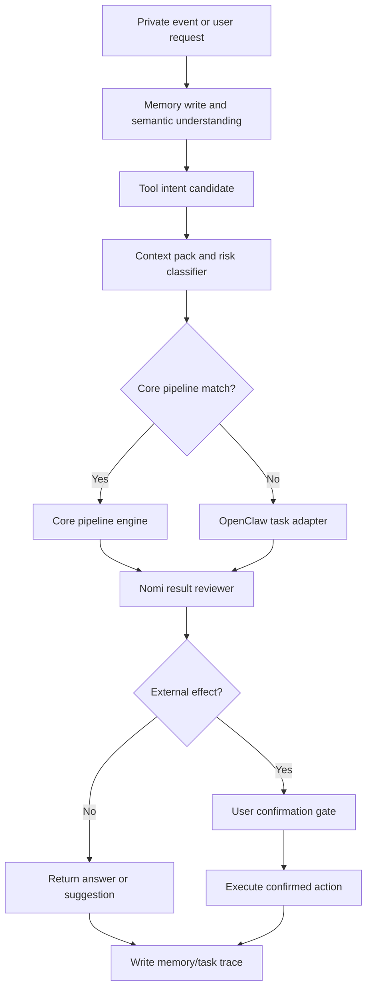

# Nomi Core Pipelines and OpenClaw Execution Design

**Status:** Review draft
**Date:** 2026-05-28
**Owner:** Nomi project

## Goal

Nomi needs a stable task-completion architecture where high-frequency personal-assistant jobs run through deterministic core pipelines, while rare or highly variable jobs are delegated to OpenClaw as a special long-tail execution tool.

This design extends the existing private event, memory, agenda, proactive suggestion, and tool-routing architecture. It does not replace the memory system, agenda system, Android floating-ball interaction, Composio/Zapier/MCP catalog, or existing confirmation policy.

The core product behavior is:

- Nomi owns understanding, memory, context, routing, risk checks, user confirmation, and result writeback.
- Core high-frequency tasks run through first-party deterministic pipelines.
- OpenClaw is used only outside core pipelines, as a controlled executor for long-tail browser/tool workflows.
- External-effect actions always pass through Nomi's confirmation gates before execution.
- Every task decision should leave a trace that explains why Nomi chose a core pipeline, OpenClaw, or a clarification question.

## Non-Goals

- This design does not implement code changes.
- This design does not give OpenClaw full access to the user's memory store.
- This design does not allow OpenClaw to autonomously send messages, make payments, purchase items, book rides, delete data, or change accounts without Nomi approval and user confirmation.
- This design does not require every tool provider to have a native MCP before it can be useful.

## Relationship To Existing Architecture

The existing private-event design already says every WhatsApp message, email, browser-visible account activity, and Nomi conversation turn is stored locally and processed into memory, agenda items, proactive suggestions, and possible tool intents.

This design adds the next layer:

1. A `ToolIntentCandidate` is produced by event processing or direct user chat.
2. `TaskRouter` checks whether the intent maps to a deterministic core pipeline.
3. If a core pipeline exists and required slots can be resolved, Nomi uses that pipeline.
4. If the task is long-tail, app-specific, or not yet modeled, Nomi delegates it to OpenClaw with a constrained task packet.
5. If the task is ambiguous in a way that changes recipient, payment, booking, writeback, or other external effects, Nomi asks the user before either core pipeline or OpenClaw execution.
6. Nomi reviews the result, applies risk and confirmation gates, and writes the final result back into memory, agenda, task history, and conversation history.



## Core Design Principle

OpenClaw should be treated as a powerful tool, not as the assistant's brain.

Nomi should keep ownership of:

- user identity and preferences
- scoped memory retrieval
- relationship and contact boundaries
- task routing
- policy and risk decisions
- proactive suggestion decisions
- user-facing explanation
- final confirmation
- audit trail and writeback

OpenClaw should own only:

- long-tail browser navigation
- unfamiliar website interaction
- repetitive multi-step UI execution
- tool workflows not yet promoted into core pipelines
- returning structured observations and proposed next actions

## Deterministic Core Pipelines

The following pipelines should be implemented as first-party deterministic pipelines. "Deterministic" means the sequence, state machine, confirmation gates, allowed effects, and writeback behavior are explicit and testable. Models may still be used for extraction, summarization, ranking, or drafting.

| Pipeline | Main job | Typical trigger | External tools | Confirmation policy |
| --- | --- | --- | --- | --- |
| `event_ingestion_pipeline` | Normalize private events and append local event ledger | New WhatsApp message, Gmail email, browser event, Nomi turn | No | No confirmation |
| `memory_write_pipeline` | Write KV memory, graph memory, RAG chunks, and source scope | Every private event and Nomi turn | No | No confirmation |
| `context_pack_pipeline` | Build bounded context for reasoning and task execution | Any semantic judgment, proactive decision, or tool request | No | No confirmation |
| `personal_search_pipeline` | Answer questions from local memory with scoped evidence | "之前谁说过...", "地址在哪", "帮我找..." | No by default | No confirmation |
| `chat_response_pipeline` | Stream Nomi's user-facing conversation response | User chats with Nomi | Model API | No external-effect confirmation unless action is attached |
| `reply_pipeline` | Draft and optionally send replies to WhatsApp, Slack, email, or SMS-like channels | "帮我回复 Alice..." or proactive reply suggestion | Messaging/email tools | User confirms before sending |
| `email_pipeline` | Summarize, classify, extract tasks, draft replies, prepare archive/label actions | Gmail or Outlook request/suggestion | Email tools | User confirms write/send/archive |
| `agenda_pipeline` | Create, update, cancel, reschedule, and clarify agenda items from private evidence | Appointment, deadline, fuzzy plan, cancellation, reschedule | Optional calendar tools | Internal agenda writes may be automatic; external calendar writes need confirmation |
| `task_todo_pipeline` | Create and manage to-dos, commitments, follow-ups, and deadlines | "记得...", commitment, due date, follow-up | Task tools | Internal todo may be automatic; external writes need confirmation |
| `proactive_suggestion_pipeline` | Decide when to notify the user and generate action cards | Important actionable event | WebSocket/Android push channel | Showing suggestion needs no confirmation; executing action follows its pipeline |
| `route_pipeline` | Find routes, ETA, locations, and nearby options | "查路线", detected trip/meeting location | Maps tools | Read-only route lookup needs no final confirmation |
| `ride_pipeline` | Prepare a ride request and optionally book after confirmation | "帮我打车", meeting requires travel | Maps, Uber, browser automation | Final confirmation before booking/payment |
| `shopping_pipeline` | Search products, compare options, prepare cart or purchase flow | "帮我买...", shopping intent, delivery issue | Amazon, Shopify, browser automation | Final confirmation before purchase/payment |
| `payment_bill_pipeline` | Detect bills, reimbursements, invoices, payment reminders, and payment status | Payment email/chat, invoice, "我欠/他欠" | Banking/payment/billing tools if configured | Final confirmation before transfer/payment |
| `contact_relationship_pipeline` | Update contact facts, preferences, relationship signals, and isolation scopes | Repeated conversations, relationship facts, sensitive social signals | No by default | No confirmation for local memory; user correction supported |
| `document_file_pipeline` | Search, summarize, draft, and update docs/sheets/files | "找文件", "总结这个文档", "写到表格" | Drive/Docs/Sheets/Office tools | User confirms writes or sharing |
| `account_login_pipeline` | Help the user connect or log into accounts in the controlled browser | User chooses login channel | Browser session, profile manager | User manually enters credentials; Nomi never fabricates credentials |
| `governance_audit_pipeline` | Record task decisions, risk reasons, confirmations, outputs, and user feedback | Every routed task and external action | No | No confirmation |

## Pipeline Interface

Every core pipeline should expose a common shape:

```json
{
  "pipeline_id": "ride_pipeline",
  "version": "2026-05-28",
  "input": {
    "user_request": "帮我打车去武康路",
    "source_event_ids": ["evt_123"],
    "context_pack_id": "ctx_456"
  },
  "required_slots": ["pickup", "destination", "time_window"],
  "resolved_slots": {
    "destination": "武康路",
    "time_window": "tonight"
  },
  "missing_slots": ["pickup"],
  "risk": {
    "permission": "payment_or_purchase",
    "requires_final_confirmation": true
  },
  "status": "needs_user_input"
}
```

Each pipeline should define:

- supported capabilities
- required and optional slots
- source scopes it is allowed to retrieve
- allowed tools
- forbidden tools
- risk level
- confirmation gates
- retry and fallback policy
- structured output schema
- writeback targets
- trace fields

## Routing Rules

The router should not choose tools directly first. It should choose the task path first.

Routing order:

1. Normalize the request or tool intent candidate.
2. Build a bounded context pack with scoped memory, active agenda, recent Nomi dialogue, current UI state, and source metadata.
3. Classify capability, action, risk, and required slots.
4. Match against `CorePipelineRegistry`.
5. If exactly one core pipeline is a high-confidence match, run that pipeline.
6. If multiple pipelines match, use deterministic priority and ask a clarifying question if ambiguity changes the external effect.
7. If no core pipeline matches, route to `openclaw_tool`.
8. If the request is too vague or too risky, return `ask_user` before either core pipeline or OpenClaw execution.

Routing output should be explicit:

```json
{
  "route_type": "core_pipeline",
  "pipeline_id": "reply_pipeline",
  "confidence": 0.91,
  "reason": "User asked to reply to a known contact in an active WhatsApp conversation.",
  "risk_permission": "external_message",
  "confirmation_required": true
}
```

For OpenClaw:

```json
{
  "route_type": "openclaw_tool",
  "reason": "No core pipeline supports this niche website workflow.",
  "risk_permission": "external_execution",
  "confirmation_required": true
}
```

## OpenClaw Task Packet

OpenClaw should receive a constrained packet, not raw full memory.

```json
{
  "task_id": "task_789",
  "goal": "在指定网站填写报名表，但不要提交",
  "minimal_context": {
    "name": "redacted_or_user_approved_value",
    "event_summary": "User wants to prepare an application draft."
  },
  "allowed_actions": ["open_page", "read_page", "fill_form", "download_file"],
  "forbidden_actions": ["submit", "send_message", "pay", "delete", "change_account_settings"],
  "max_steps": 20,
  "requires_stop_before": ["submission", "payment", "external_message"],
  "return_schema": {
    "status": "draft_ready | completed_read_only | blocked | needs_user_input | failed",
    "summary": "string",
    "evidence": ["string"],
    "proposed_next_action": "string",
    "needs_confirmation": true
  }
}
```

The adapter must minimize context:

- Prefer references, summaries, and scoped fields over raw chat/email dumps.
- Include raw sensitive values only when they are necessary for the selected action.
- Never include unrelated contacts, unrelated conversations, or broad memory search results.
- Preserve source IDs so Nomi can audit where values came from without exposing all source text to OpenClaw.

## Confirmation Gates

Nomi must keep the same external-effect boundary across core pipelines and OpenClaw.

External-effect actions requiring user confirmation:

- sending WhatsApp, Slack, email, SMS-like, or social messages
- booking rides, tickets, hotels, appointments, services, or deliveries
- purchasing items or adding payment methods
- making payments, transfers, refunds, or subscription changes
- writing to external calendars, task tools, CRMs, documents, sheets, or project systems
- changing account settings
- deleting, archiving, publishing, or sharing user data outside Nomi

Extra final confirmation is required for:

- money movement
- purchases
- bookings with cancellation cost
- messages to other people
- irreversible external writes
- actions involving sensitive relationship, health, legal, financial, or account-security information

## Promoting Long-Tail Tasks Into Core Pipelines

OpenClaw execution traces should become product learning data.

A long-tail workflow can be promoted into a deterministic pipeline when:

- the user repeats the task frequently
- the task has a stable slot schema
- the task has stable confirmation gates
- failures are costly enough to justify first-party handling
- the task is central to the assistant promise

Examples:

- If many users ask "帮我给客户补 CRM 备注", promote from OpenClaw/Composio route into `crm_update_pipeline`.
- If many users ask "帮我订常去路线的 Uber", promote into a stronger `ride_pipeline`.
- If users frequently update spreadsheets from emails, promote into `spreadsheet_update_pipeline`.

## Error Handling

Core pipeline errors should be typed:

- `missing_slot`: Nomi lacks a required field.
- `ambiguous_contact`: multiple people/accounts could match.
- `insufficient_evidence`: memory does not support the requested action.
- `tool_unavailable`: required provider is disconnected or offline.
- `confirmation_required`: execution is blocked until user confirms.
- `policy_blocked`: action is not allowed.
- `openclaw_blocked`: OpenClaw reached a forbidden action or needs user input.
- `verification_failed`: result does not match expected output.

When OpenClaw fails, Nomi should summarize what happened and offer the next safe step instead of exposing raw automation logs as the final user answer.

## Testing And Validation

The implementation should validate behavior, not only command success.

Required test categories:

- Core routing tests: high-frequency examples route to the expected pipeline.
- OpenClaw fallback tests: unknown websites and unsupported SaaS workflows route to `openclaw_tool`.
- Confirmation tests: sending, booking, purchasing, paying, deleting, and external writing are blocked until confirmation.
- Context minimization tests: OpenClaw packets include only scoped necessary context.
- Memory-boundary tests: WhatsApp contact A requests do not leak unrelated contact B memory.
- Result review tests: OpenClaw output is inspected by Nomi before user display or writeback.
- Trace tests: every task result explains route type, pipeline/tool choice, risk, confirmation, and source evidence.

Acceptance examples:

| User request | Expected route | Reason |
| --- | --- | --- |
| `帮我回复 Alice，说我周五八点可以` | `reply_pipeline` | High-frequency messaging task with external-message confirmation |
| `总结今天 Gmail 里需要我处理的事` | `email_pipeline` | High-frequency email processing |
| `周末和 Jack 见面，提醒我确认地点` | `agenda_pipeline` + `task_todo_pipeline` | Agenda plus clarification follow-up |
| `查一下去武康路要多久` | `route_pipeline` | Read-only route lookup |
| `帮我打车去武康路` | `ride_pipeline` | Known ride flow; booking requires final confirmation |
| `帮我在这个冷门网站上填报名表但别提交` | `openclaw_tool` | Long-tail browser workflow |
| `帮我把这个客户更新到 HubSpot` | `openclaw_tool` initially, later possible `crm_update_pipeline` | Useful but not yet first-party core unless promoted |

## Implementation Sequence

Recommended implementation order:

1. Expand `CorePipelineRegistry` with the pipeline list above.
2. Rename the conceptual long-tail route from `long_tail_tool` to `openclaw_tool` while preserving API compatibility during migration.
3. Add a `TaskRouteDecision` schema with route type, reason, confidence, risk, confirmation requirement, and trace IDs.
4. Add `OpenClawTaskPacket` construction with context minimization and forbidden-action gates.
5. Add core tests for routing, confirmation, and context boundaries.
6. Add a dry-run OpenClaw adapter before enabling live execution.
7. Add trace storage and UI display for route decisions.
8. Promote repeated OpenClaw workflows into new core pipelines based on observed traces.

## Open Questions

- Whether `crm_update_pipeline`, `project_issue_pipeline`, and `spreadsheet_update_pipeline` should be core in the first public release or remain OpenClaw/Composio long-tail routes until repeated usage proves demand.
- Whether OpenClaw should be invoked directly from the runtime API or through a worker queue for better isolation and retry control.
- Whether the first release should expose route traces to end users or only to the local governance/debug page.
