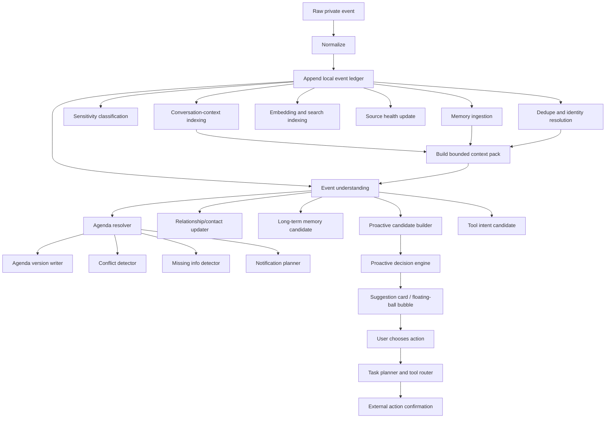

# Nomi Private Event Processing, Agenda, and Proactive Suggestions Design

**Status:** Review draft
**Date:** 2026-05-28
**Owner:** Nomi project

## Goal

Nomi must process every private user signal, such as WhatsApp messages, emails, browser-visible account activity, the user's direct conversations with Nomi, and future connected tools, into durable local memory while also deciding whether the signal should create or update an agenda item, produce a proactive suggestion, or wait silently.

The key product behavior is:

- Every private event is stored locally as memory.
- Every user-Nomi conversation turn is also stored locally as memory.
- Storage and semantic judgment happen in parallel after normalization.
- Semantic judgment uses a bounded conversation-context pack, not only the current message or email.
- Internal agenda creation and updates do not require user confirmation when the evidence is strong enough.
- External effects, such as sending messages, writing to third-party calendars, buying items, booking rides, or contacting people, require explicit user action and confirmation.
- Proactive suggestions should appear as actionable cards or Android floating-ball bubbles, with actions such as `查路线`, `帮我打车`, `稍后提醒`.

## Non-Goals

- This design does not implement the code changes.
- This design does not enable autonomous third-party actions without user confirmation.
- This design does not replace the existing memory system entirely; it extends it with stronger event classification, scoped retrieval, agenda resolution, and proactive decisioning.

## Core Architecture

Nomi should treat each incoming signal as a private event. A private event is first normalized and appended to a local event ledger. Direct user conversations with Nomi are private events too, including user messages, assistant responses, user corrections, suggestion clicks, dismissals, and task outcomes.

After ledger append, independent processors run in parallel:

- Memory ingestion writes the event into long-term memory.
- Event understanding classifies what the event means.
- Privacy and sensitivity classification marks what can be sent to a model, what must stay local, and what requires redaction.
- Deduplication and identity resolution link the event to a source account, conversation, contact, email thread, order, or calendar-like object.
- Embedding and retrieval indexes are updated for later semantic search.
- Conversation-context indexing updates active user intent, active tasks, recent Nomi dialogue, and user corrections.
- Source health and sync state are updated.

Before semantic judgment that needs reasoning, Nomi builds a bounded context pack. The context pack combines the current event with relevant recent Nomi conversation, active agenda items, active tasks, scoped memory, user preferences, recent corrections, and current UI/session state. The semantic result then flows into agenda, relationship, proactive suggestion, and future tool-intent systems.

## Event Types

Each event may receive multiple labels with confidence scores. The primary labels are:

- `ordinary_chat`: normal conversation with no durable action.
- `todo`: user or another person expects the user to do something.
- `commitment`: the user promised to do something.
- `appointment`: a meeting, call, meal, visit, pickup, delivery, or other scheduled activity.
- `reschedule`: a previous appointment or deadline changed.
- `cancel`: a previous appointment, task, or plan was canceled.
- `deadline`: a time-sensitive requirement.
- `payment`: payment due, paid, reimbursed, borrowed, owed, refunded, or invoiced.
- `travel`: route, ride, flight, hotel, train, commute, pickup, or location movement.
- `shopping`: item to buy, order status, delivery, return, price, or cart intent.
- `relationship_signal`: preference, conflict, trust signal, sentiment, birthday, sensitive interpersonal information.
- `important_fact`: durable user/contact/project fact that is not necessarily actionable now.
- `user_instruction`: direct instruction from the user to Nomi.
- `preference_update`: user preference, habit, threshold, or policy learned from conversation.
- `user_feedback`: correction, dismissal, approval, rating, or implicit signal from user action.
- `low_value`: noise, duplicate notification, spam-like content, or content not worth surfacing.

The event classifier is also hybrid model + rules. The model proposes labels and structured fields, while rules preserve high-confidence deterministic labels such as payment, cancellation, reschedule, deadline, and direct user instruction. If the model marks a payment-like email as ordinary chat, the rule label wins and the trace records that override.

The classifier must produce:

- `labels`: all relevant labels.
- `primary_label`: the best main label.
- `confidence`: numeric score.
- `evidence_event_ids`: source events supporting the judgment.
- `actors`: user, counterparty, sender, recipient, mentioned contacts.
- `time_expressions`: exact or fuzzy time expressions.
- `place_expressions`: exact or fuzzy location expressions.
- `required_actions`: possible actions the user may need.
- `risk_flags`: sensitive relationship, money, health, legal, account security, or external-effect risk.
- `classification_trace`: parser mode, rule labels, model labels, and validation warnings.

## Nomi Conversation Context

The user's direct conversation with Nomi is a first-class memory source. It is not just transient chat history.

Nomi must store:

- user messages to Nomi
- Nomi responses
- streamed response final content
- suggestion cards shown to the user
- suggestion actions clicked by the user
- suggestions dismissed or ignored
- user corrections, such as "不是这个人", "这件事不重要", or "以后别提醒这个"
- task plans proposed by Nomi
- tool calls requested, confirmed, canceled, and completed
- final task outcomes

This conversation context matters because later private events may only make sense when combined with what the user already told Nomi. For example:

- If the user told Nomi "帮我盯一下周末和 Alex 见面的事", and later WhatsApp only says "那就周日吧", Nomi should connect the message to the active fuzzy agenda item.
- If the user told Nomi "这件事不用提醒我", a later email about the same low-risk topic should not create a proactive interruption.
- If the user corrected "不是公司 Alex，是健身房 Alex", future entity resolution should use that correction.
- If the user clicked `帮我打车` but canceled at confirmation, Nomi should remember that the user considered the trip but did not book.

### Context Pack

The context pack is the bounded context used by event understanding, agenda resolution, proactive scoring, and tool routing.

It should include:

- current event
- recent direct Nomi conversation turns relevant to the same task, contact, topic, or account
- active agenda items with matching participants, time windows, locations, or topics
- active suggestions and their user responses
- user preferences and policies learned from prior Nomi conversations
- recent user corrections
- scoped memory from KV, knowledge graph, and RAG
- current UI/session state when available

The context pack must not become an unbounded chat transcript. It should be built by relevance and scope:

- prefer current task/session context
- include recent direct Nomi conversation only when it is relevant
- include global user preferences when they apply
- include contact-scoped or thread-scoped memories only when the current event is in that scope
- exclude unrelated third-party private information by default
- keep source ids so every inferred action can be traced

Context is allowed to influence judgment, but it should not override strong source evidence without recording a reason. If current private evidence and prior Nomi conversation conflict, the system should lower confidence or create a clarification suggestion instead of silently choosing one.

## Mandatory Memory Write

Memory write is mandatory for every normalized private event, including user-Nomi conversation turns. Classification does not decide whether memory is written; it only decides how the memory is indexed, scoped, summarized, and later retrieved.

Memory should keep three layers:

- `KV facts`: stable facts such as user preferences, contact metadata, account settings, addresses, names, recurring constraints.
- `Knowledge graph`: entities and relationships such as user, contact, project, place, account, event, payment, item, organization, and their edges.
- `RAG/event corpus`: source-grounded message and email snippets, summaries, and searchable event chunks.

The system chooses retrieval at query time:

- Use KV first for stable facts and settings.
- Use knowledge graph for relationships, entities, contacts, event chains, and scoped reasoning.
- Use RAG for source-grounded details, exact phrasing, long conversations, emails, or uncertain claims.

## Scoped Retrieval

The memory system must prevent embarrassing or unsafe cross-contact leakage.

Every memory item and event must carry scope metadata:

- `source_type`: WhatsApp, Gmail, browser, Nomi chat, manual, tool, system.
- `source_account_id`: local account identifier.
- `conversation_id`: chat, email thread, page session, or task session.
- `assistant_session_id`: direct Nomi conversation session when the source is Nomi chat.
- `active_task_id`: task or workflow being discussed when available.
- `suggestion_id`: proactive suggestion connected to the event when available.
- `counterparty_ids`: contacts involved.
- `topic_ids`: project, trip, household, finance, work, shopping, health, or custom topic.
- `visibility_scope`: `global_user`, `contact_scoped`, `thread_scoped`, `topic_scoped`, or `private_third_party`.
- `sensitivity_level`: low, medium, high, critical.

Default retrieval rules:

- In a conversation with contact A, retrieve contact A scope, the current thread, relevant topic scope, and global user facts.
- Do not retrieve contact B's private negative opinions about contact A unless the user explicitly asks for that history or the information was promoted into a neutral global fact.
- Relationship-signal memories are high-risk by default and require stricter relevance before surfacing.
- Proactive suggestions should cite neutral evidence, not reveal hidden third-party judgments.
- Direct Nomi conversation memories can be retrieved broadly only when they represent user preferences, policies, explicit instructions, or active tasks. Ordinary chat with Nomi remains session/task-scoped by default.

## Agenda System

The agenda system is Nomi's internal dynamic schedule and task layer. It is created from private information and continuously updated as new messages and emails arrive.

Agenda items include:

- appointments
- deadlines
- follow-ups
- reminders
- travel preparation
- payment obligations
- shopping or delivery commitments
- unresolved fuzzy plans

Internal agenda creation does not require user confirmation when evidence is strong enough. This is equivalent to Nomi remembering and organizing the user's life, not taking external action.

### Fuzzy Agenda Items

If a message says "周末见" or "下周找时间聊", the agenda resolver must create a fuzzy agenda item rather than inventing exact values.

A fuzzy item should include:

- `certainty`: `fuzzy`
- `time_window`: such as Saturday to Sunday, or next week.
- `missing_fields`: such as exact time, exact place, participants, purpose.
- `needs_clarification`: true when the missing field matters for action.
- `evidence_event_ids`: source messages or emails.
- `recommended_next_check`: when Nomi should re-evaluate or suggest clarification.

### Agenda Updates

Later private information can update an agenda item without user confirmation when evidence is clear.

Supported agenda operations:

- create
- update details
- reschedule
- cancel
- merge duplicates
- mark complete
- lower confidence
- request clarification

Every agenda change must write an `agenda_item_version` record with:

- previous value
- new value
- reason
- supporting event ids
- model or rule version
- confidence
- timestamp

This version history is required because private conversations often change plans gradually.

### Hybrid Model + Rule Parsing

Agenda resolution must use a hybrid parser, not a pure model parser and not a pure keyword parser.

The model is responsible for proposing a structured candidate:

- whether the event is agenda-worthy
- type, such as appointment, payment, todo, deadline, travel, or shopping
- operation, such as create, reschedule, cancel, or complete
- title, participants, place, time window, missing fields, confidence, and evidence reason

Rules are responsible for the final decision:

- reject malformed or low-confidence model output
- reject unsupported exact time, exact place, amount, participant, or action details
- preserve fuzzy plans as fuzzy instead of inventing exact values
- add required missing fields such as `exact_time` and `exact_place`
- force cancellation and reschedule operations when the source text clearly says so
- keep stable source/thread/contact-based dedupe keys
- keep source event ids and parser trace metadata

The final candidate must store:

- `metadata.parser_mode`: `hybrid_model_rules` or `rules_fallback`
- `metadata.model_candidate`: the raw model candidate when available
- `metadata.rule_candidate`: the rule candidate used for grounding
- `metadata.validation_warnings`: why any model field was rejected or downgraded

Example: if WhatsApp says "周末去武康路见吧" and the model proposes "周六晚上八点", the final agenda item must remain `fuzzy`, keep `exact_time` in `missing_fields`, and record `unsupported_exact_time` in validation warnings.

## Proactive Suggestions

The proactive system should not notify on every agenda item. It should create candidates, score them, and surface only useful suggestions.

Candidate examples:

- A friend agreed to meet the user at a street; Nomi suggests `查路线`, `帮我打车`, `稍后提醒`.
- An email contains a payment due date; Nomi suggests `加入待办`, `稍后提醒`, `查看原邮件`.
- A package is delayed; Nomi suggests `查看订单`, `提醒商家`, `稍后提醒`.
- A fuzzy weekend plan has no location; Nomi suggests `问对方地点`, `稍后提醒`.

### Decision Factors

The proactive decision engine scores candidates with:

- urgency
- importance
- actionability
- evidence confidence
- user attention cost
- sensitivity risk
- duplicate or recent-notification cooldown
- quiet hours
- user feedback history
- whether a one-tap action is available

Only candidates above the threshold should become visible suggestions.

### Suggestion Card Shape

A suggestion card should include:

- `title`: concise human-readable summary.
- `body`: why Nomi is surfacing it.
- `source_summary`: neutral evidence summary.
- `agenda_item_id`: linked agenda item when applicable.
- `actions`: clickable options.
- `expires_at`: optional expiration time.
- `sensitivity_level`: for UI and logging.

Action examples:

- `查路线`
- `帮我打车`
- `稍后提醒`
- `加入待办`
- `查看原邮件`
- `问对方时间`
- `问对方地点`
- `忽略`

## Tool Calling Boundary

Nomi may infer tool intent early, but it must not execute external-effect tools until the user chooses an action.

Example ride flow:

1. WhatsApp or email suggests the user may need to go somewhere.
2. Nomi writes the event to memory and updates agenda.
3. Nomi surfaces a suggestion with `查路线`, `帮我打车`, `稍后提醒`.
4. If the user taps `查路线`, Nomi may call map/route tools and show ETA.
5. If the user taps `帮我打车`, Nomi prepares a ride request.
6. Before booking, Nomi asks for final confirmation with pickup, destination, price estimate, and provider.
7. Only after confirmation does Nomi call the ride-booking tool or browser automation.
8. The result is written back to memory, agenda, and the conversation.

External-effect actions requiring confirmation:

- sending messages or emails
- booking rides, tickets, hotels, or appointments
- purchasing items
- writing to external calendars
- changing account settings
- deleting or archiving user data outside Nomi
- making payments or transfers

## Data Model

The following tables or equivalent persistent collections are required.

| Entity | Purpose | Key Fields |
| --- | --- | --- |
| `event_ledger` | Immutable local source event history | `id`, `source_type`, `source_account_id`, `conversation_id`, `raw_ref`, `normalized_text`, `occurred_at`, `ingested_at`, `hash`, `sensitivity_level` |
| `semantic_events` | Event understanding output | `id`, `event_id`, `labels`, `primary_label`, `confidence`, `actors`, `time_expressions`, `place_expressions`, `required_actions`, `risk_flags`, `evidence_event_ids` |
| `assistant_conversations` | User-Nomi conversation sessions | `id`, `client_type`, `started_at`, `last_active_at`, `active_task_id`, `scope`, `status` |
| `assistant_turns` | User and assistant turns stored as memory-backed events | `id`, `conversation_id`, `role`, `content`, `event_id`, `suggestion_id`, `tool_call_id`, `created_at`, `finalized_at` |
| `context_snapshots` | Bounded context used for a judgment | `id`, `event_id`, `context_type`, `included_event_ids`, `included_memory_ids`, `included_agenda_ids`, `reason`, `created_at` |
| `memory_items` | KV, graph, and RAG memory references | `id`, `memory_type`, `content`, `scope`, `source_event_ids`, `embedding_id`, `confidence`, `sensitivity_level` |
| `knowledge_entities` | People, places, accounts, projects, items, organizations | `id`, `entity_type`, `canonical_name`, `aliases`, `scope`, `confidence` |
| `knowledge_edges` | Entity relationships | `id`, `from_entity_id`, `to_entity_id`, `edge_type`, `source_event_ids`, `confidence`, `valid_from`, `valid_to` |
| `agenda_items` | Internal schedule/task items | `id`, `type`, `title`, `status`, `certainty`, `time_window`, `place`, `participants`, `missing_fields`, `needs_clarification`, `confidence`, `source_event_ids` |
| `agenda_item_versions` | Audit trail for agenda changes | `id`, `agenda_item_id`, `operation`, `previous_value`, `new_value`, `reason`, `source_event_ids`, `confidence`, `created_at` |
| `proactive_candidates` | Scored but not necessarily shown suggestions | `id`, `candidate_type`, `agenda_item_id`, `event_ids`, `scores`, `decision`, `cooldown_key`, `created_at` |
| `proactive_suggestions` | Suggestions shown to user | `id`, `candidate_id`, `title`, `body`, `actions`, `status`, `shown_at`, `expires_at`, `user_response` |
| `user_feedback` | Learning signals | `id`, `suggestion_id`, `action`, `rating`, `reason`, `created_at` |

## APIs

The UI and Android client should use these API surfaces or equivalent routes:

- `GET /api/agenda`: list agenda items with filters for status, time range, certainty, and source.
- `PATCH /api/agenda/{id}`: let the user correct an agenda item.
- `POST /api/agenda/{id}/snooze`: defer reminder or clarification.
- `GET /api/proactive/suggestions`: list active suggestions.
- `POST /api/proactive/suggestions/{id}/action`: record user action and trigger the next task flow.
- `POST /api/events/ingest`: ingest normalized events from collectors.
- `GET /api/events/{id}/trace`: inspect why a memory, agenda item, or suggestion exists.
- `POST /api/chat/messages`: store user-Nomi turns and trigger context-aware response generation.
- `GET /api/chat/conversations/{id}/trace`: inspect which memories, agenda items, suggestions, and tool decisions influenced a Nomi response.
- `POST /api/tools/route`: route user-approved tool requests.

The Android floating-ball channel should receive real-time suggestion events over the existing WebSocket path, not high-frequency polling.

## Parallelization Rules

The following work can run in parallel after the event ledger append:

- memory ingestion
- sensitivity classification
- dedupe and identity resolution
- embedding/search indexing
- event understanding
- conversation-context indexing
- source health update

Context-pack building can run in parallel with lightweight local scoring, but any model-backed event understanding must wait for the relevant context pack when the event is ambiguous, task-related, or connected to active agenda items.

The following work can run in parallel after event understanding:

- agenda resolver
- relationship/contact updater
- long-term memory candidate writer
- proactive candidate builder
- tool intent candidate builder

The following work can run in parallel after agenda resolution:

- agenda version writer
- conflict detector
- missing info detector
- notification planner
- external calendar candidate builder

The following work can run in parallel before a proactive decision:

- urgency score
- importance score
- actionability score
- confidence score
- interruption-cost score
- cooldown and dedupe check
- quiet-hours check
- user feedback score

The following work can run in parallel after the user chooses an action:

- retrieve scoped memory
- retrieve agenda item and version history
- retrieve contact/profile context
- retrieve current screen/session context
- retrieve recent relevant Nomi conversation context
- retrieve tool candidates
- run risk classifier

Serial gates:

- The raw event ledger append must happen before derived processing.
- User-Nomi conversation turns must be written before they are used as context for later judgments.
- Agenda resolution waits for semantic event output.
- Ambiguous semantic judgments wait for a bounded context pack.
- Proactive decision waits for candidate scores.
- External tool execution waits for user action.
- High-risk external execution waits for final confirmation.
- Result writeback happens after tool execution or user dismissal.

## Model Request Policy

Sensitive information remains stored locally because Nomi needs it to help the user. Model requests should still follow minimum necessary disclosure:

- Prefer local rules and local classifiers for deterministic checks.
- Send only the relevant scoped context for model reasoning.
- Redact credentials, tokens, full account identifiers, and unrelated third-party private details.
- Keep source ids locally so the model can reason from summarized evidence without receiving unnecessary raw text.
- For high-sensitivity records, use local model execution when available or ask for explicit user approval before sending raw content to an external model.

## Open Source Reference and Evaluation Policy

Before adding a new major capability, the implementation should first check mature open-source projects on GitHub and use them as references when they fit Nomi's architecture.

Useful current references:

- Mem0: production memory patterns such as add-only extraction, entity linking, multi-signal retrieval, and temporal reasoning.
- Graphiti/Zep: temporal knowledge graph memory with provenance, validity windows, incremental graph construction, and hybrid retrieval.
- LangMem: hot-path memory tools plus background memory managers for agent conversations.
- MailEx / Email-Event-Extraction: email event extraction examples and evaluation data.
- MultiWOZ, Schema-Guided Dialogue, LoCoMo, LongMemEval: dialogue and long-memory evaluation data.

Before accepting a new capability as complete, evaluation should also look for usable public datasets or fixtures on GitHub. If a public dataset cannot be used directly, the project should create a local fixture set that mirrors the same task shape and record why that fallback was used.

## Correctness Requirements

The system is not correct merely because a task finishes. It must produce reasonable outputs at each step.

Validation must inspect:

- whether every source event appears in the local ledger
- whether memory scope is correct
- whether labels match the actual content
- whether user-Nomi conversation turns are stored as memory
- whether ambiguous judgments use relevant dialogue context
- whether unrelated dialogue context is excluded from the judgment
- whether agenda items do not invent missing exact time or location
- whether reschedules and cancellations update the right item
- whether proactive suggestions are useful and not noisy
- whether action buttons match the user's likely next decision
- whether external tool calls only occur after explicit user choice and confirmation
- whether sensitive third-party information is not surfaced into the wrong conversation

## Implementation Phases

### Phase 1: Event and Dialogue Pipeline Split

Separate raw event ingestion, direct Nomi dialogue ingestion, ledger append, normalization, memory write, semantic classification, context indexing, and search indexing into clear processing stages.

Acceptance criteria:

- A sample WhatsApp message writes to the event ledger.
- A sample direct user-Nomi message writes to the event ledger.
- Both samples write to memory.
- A semantic event is created with labels and evidence ids.
- The pipeline can show a trace from source event to memory, context, and semantic output.

### Phase 2: Context Pack and Scoped Memory Retrieval

Add scope metadata, retrieval filters, and bounded context-pack construction for contact, thread, topic, direct Nomi conversation, and global facts.

Acceptance criteria:

- A query in contact A context does not retrieve private contact B relationship signals by default.
- Global user preferences remain available across contexts.
- Source evidence is still available when explicitly requested by the user.
- A WhatsApp message like "那就周日吧" can connect to an active Nomi-discussed fuzzy agenda item when the context supports it.
- A user correction in Nomi chat changes later entity resolution.

### Phase 3: Agenda Resolver

Build agenda creation and update logic for appointments, deadlines, commitments, payments, travel, shopping, and fuzzy plans.

Acceptance criteria:

- Exact meetings create exact agenda items.
- Fuzzy plans create fuzzy agenda items with missing fields.
- Reschedule messages update existing agenda items.
- Cancellation messages mark the right agenda item canceled.
- Every agenda change writes a version record with evidence.

### Phase 4: Proactive Suggestion Engine

Create candidates from semantic events and agenda changes, score them, and surface useful suggestions.

Acceptance criteria:

- A travel-like meeting produces actions such as `查路线`, `帮我打车`, `稍后提醒`.
- A payment deadline produces reminder and source-review actions.
- Duplicate suggestions are suppressed by cooldown.
- Android receives real-time suggestion events through WebSocket.

### Phase 5: User Action and Tool Router Handoff

Connect suggestion actions to task planning and tool routing while keeping external-effect confirmation gates.

Acceptance criteria:

- Clicking `查路线` retrieves scoped context and routes to a map/route capability.
- Clicking `帮我打车` prepares a booking request but does not book before final confirmation.
- Dismissed or ignored suggestions update feedback records.

### Phase 6: Regression Evaluation

Create an end-to-end fixture set that includes WhatsApp-like chats, Gmail-like emails, reschedules, cancellations, fuzzy plans, payments, shopping, travel, and relationship signals.

Acceptance criteria:

- The evaluation report includes the output of each stage, not only pass/fail status.
- Incorrect or unreasonable labels, agenda updates, retrieval results, or suggestions are flagged.
- At least one test proves contact-scoped retrieval prevents cross-contact leakage.
- At least one test proves direct Nomi conversation context improves a later ambiguous event judgment.
- At least one test proves unrelated Nomi dialogue is not included in the context pack.

## Product Behavior Summary

Nomi should feel like a private assistant who quietly keeps track of the user's life, but asks before acting in the outside world.

For every message, email, browser-visible event, or direct Nomi conversation turn:

1. Remember it locally.
2. Build a bounded context pack when judgment needs context.
3. Understand what kind of event it is.
4. Update agenda and relationships when warranted.
5. Decide whether the user should be interrupted.
6. Show a concise suggestion with direct actions when useful.
7. Execute tools only after the user chooses an action and confirms high-risk effects.
