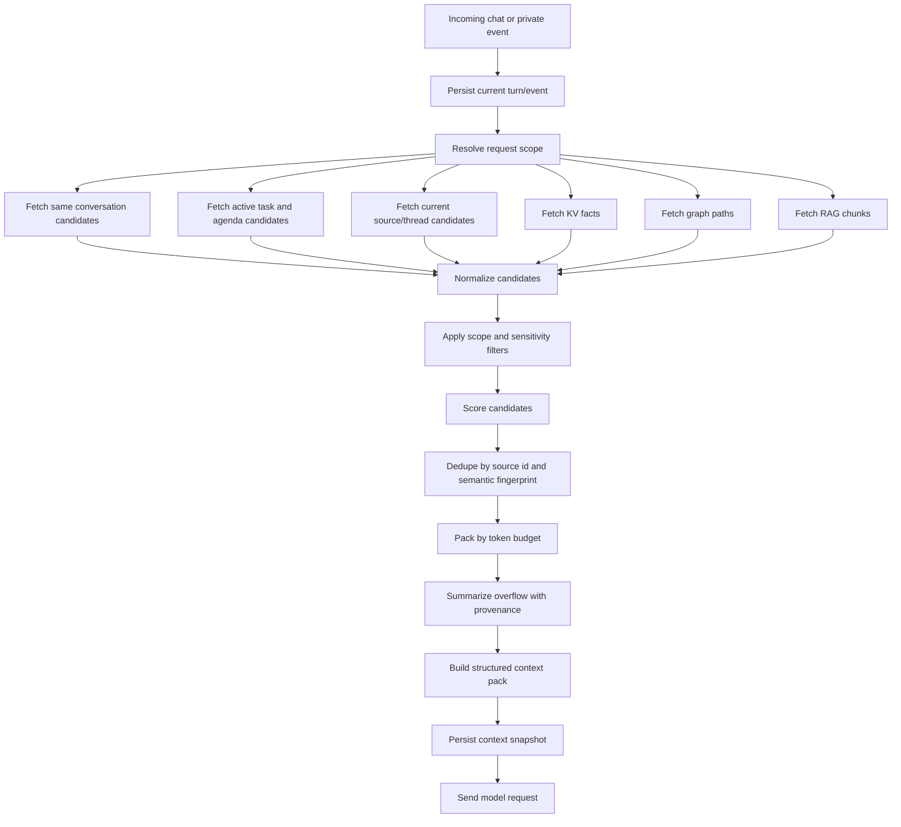

# Nomi 256K Context Budget Design

**Status:** Implemented in runtime API with known residuals
**Date:** 2026-05-29
**Owner:** Nomi project

## Goal

Nomi should use a large-model context window intelligently instead of relying on fixed-count chat history such as "last 8 turns". The system may plan around a 256K total context window, but it must still build a bounded, scoped, token-aware context pack for every model request.

The core product behavior is:

- Nomi can preserve long conversational continuity across Android floating-window chat, full workbench chat, private events, agenda items, and tool workflows.
- Short user replies such as "需要", "可以", "好的", or "继续" must resolve against the immediately relevant prior Nomi message.
- Long user messages, long emails, and long WhatsApp threads must not overflow the model context or crowd out higher-priority evidence.
- Contact, thread, task, and source scopes must prevent unrelated private information from leaking into the current answer.
- Every context pack must be explainable: the system records what was included, what was summarized, what was excluded, and why.
- Verification must inspect whether intermediate outputs and final answers are reasonable, not only whether requests return successfully.

## Non-Goals

- This design does not implement code changes.
- This design does not require every request to fill the 256K window.
- This design does not replace KV memory, knowledge graph memory, RAG memory, agenda processing, core pipelines, OpenClaw, or Composio integration.
- This design does not allow unrelated private messages to be retrieved just because the model window is large.
- This design does not remove external-action confirmation gates.

## Why Fixed-Turn Context Is Wrong

Fixed-turn history has three problems:

1. It is too short for real assistant work. A task may span dozens of turns, multiple proactive suggestions, one email thread, and several WhatsApp messages.
2. It is token-blind. One pasted document can be larger than many normal turns and can crowd out the actual active task state.
3. It is scope-blind. Recent messages are not always the most relevant or safest messages to include.

The replacement is a server-side `ContextBudgetAssembler` that uses token budgets, source scopes, relevance scoring, and loss-aware summarization.

## Model Window Contract

Nomi should plan for a 256K total context window. The request builder must reserve output and safety margin before allocating input context.

| Area | Budget |
| --- | ---: |
| Total model window | 256K tokens |
| Output reserve | 24K-32K tokens |
| Safety margin | 8K-16K tokens |
| Usable input context target | 200K-216K tokens |
| Hard request ceiling | Configurable; default 224K input tokens |

The assembler should normally stay under the target input budget. It may approach the hard ceiling only for requests that genuinely need broad context, such as summarizing a long thread, comparing multiple source documents, or resolving a complex task history.

## Context Ownership

The server is the source of truth for model context.

Android and other clients should send:

- `message`: the current user message.
- `conversation_id`: stable conversation identifier.
- `client_type`: Android, web, browser, or other client.
- `client_context_delta`: small unsynced local turns or UI events, capped by token budget.
- `ui_state`: optional active screen, selected suggestion, current app, or visible source scope.

Clients should not send a large full transcript as the primary context. They may send only a small patch when local state has not yet been persisted on the server.

The server should:

- persist the current user turn exactly once;
- merge any unsynced client delta without duplicating the current message;
- retrieve candidate context from durable stores;
- assemble the final context pack by token budget;
- persist a context snapshot for later debugging and regression tests.

## Context Layers

The context pack is built from multiple candidate pools.

| Layer | Purpose | Typical Inclusion Rule |
| --- | --- | --- |
| Current request | The user's active question or command | Always included, exact text unless extremely long |
| Recent same conversation | Conversational continuity and short replies | High priority; token-budgeted exact turns |
| Unsynced client delta | Local Android/web turns not yet persisted | Include only when not duplicated |
| Active task state | Current workflow, pending confirmation, tool status | Include when conversation or task id matches |
| Agenda state | Upcoming/fuzzy/cancelled/rescheduled items | Include matching participants, times, topics, or source event ids |
| Current source/thread | Active WhatsApp chat, Gmail thread, browser page | Include within scope before global retrieval |
| KV memory | Stable facts, preferences, user policies | Include compact facts relevant to task |
| Knowledge graph | Entities, relationships, contact boundaries | Include scoped paths and edge summaries |
| RAG/event memory | Source-grounded long text and prior events | Include ranked chunks with source ids |
| Proactive suggestions | Shown/clicked/dismissed suggestions | Include when related to active task or current reply |
| Tool/pipeline traces | Prior routing and execution outcomes | Include when task continuation or audit is needed |

## Default Token Budget

The initial budget should be configurable, but the first implementation can use the following target distribution.

| Section | Target | Max | Notes |
| --- | ---: | ---: | --- |
| System prompt, routing rules, safety instructions | 8K | 12K | Stable and compact |
| Current user request and attachment metadata | 12K | 20K | Long text may be summarized with source reference |
| Same conversation exact turns | 32K | 48K | Replaces fixed last-8 logic |
| Conversation rolling summary and open threads | 10K | 16K | Useful when exact turns overflow |
| Active task, agenda, suggestions, tool state | 18K | 28K | Must preserve pending confirmations |
| Current source/thread context | 44K | 64K | WhatsApp/Gmail/browser scope before global memory |
| KV and user profile facts | 8K | 12K | Compact, stable facts |
| Knowledge graph context | 16K | 24K | Scoped entities, edges, relationship constraints |
| RAG/event memory chunks | 44K | 56K | Ranked, deduped, source-grounded |
| Evidence index and provenance | 6K | 8K | Source ids, inclusion reasons, truncation flags |

The default target table totals about 198K input tokens, leaving room for request-specific expansion inside the 200K-216K target. The `Max` column is a per-section cap, not a simultaneous allowance; the packer must still respect the global hard request ceiling.

Unused budget may be reassigned, but only within scope rules. For example, if the current request is a simple short reply, the assembler should spend more on the immediate prior conversation and active task state, not on broad RAG retrieval.

## Single-Item Caps

Large context does not remove the need for item-level limits.

Default caps:

- Current user message exact text: 16K tokens, then summarize overflow and preserve source reference.
- Single assistant/user conversation turn: 8K tokens exact, then summarize overflow.
- Single email: 12K tokens exact, then structured summary plus important quoted snippets.
- Single WhatsApp thread slice: 24K tokens exact per contact/thread, then rolling summary.
- Single RAG chunk: 1K-2K tokens.
- Single knowledge graph neighborhood: 8K-12K tokens after graph expansion and supernode filtering.

If the user's explicit task is to inspect a specific long artifact, that artifact can receive a larger temporary budget, but the context snapshot must record the reason.

## Scope Isolation

The assembler must apply scope filters before relevance ranking.

Default scope rules:

- In a WhatsApp conversation with contact A, retrieve contact A, the current thread, matching active tasks, matching topic scopes, and global user facts.
- Do not retrieve contact B's private opinions, complaints, or sensitive relationship signals unless the user explicitly asks a cross-contact question and the risk classifier allows it.
- Direct Nomi conversation memories can be broad only when they represent user preferences, policies, corrections, active tasks, or prior task outcomes.
- Relationship-signal memories are high-risk and require stronger evidence and narrower scope than ordinary facts.
- Proactive suggestions should cite neutral evidence, not hidden third-party private judgments.

Each candidate must carry:

```json
{
  "source_id": "evt_123",
  "source_type": "whatsapp",
  "source_account_id": "local_account_1",
  "conversation_id": "wa_thread_a",
  "counterparty_ids": ["contact_a"],
  "topic_ids": ["quote_phone_1"],
  "visibility_scope": "contact_scoped",
  "sensitivity_level": "medium"
}
```

## Context Assembly Flow



## Candidate Scoring

Candidate ranking should combine deterministic features and model-assisted relevance when needed.

Suggested scoring fields:

```json
{
  "scope_score": 0.0,
  "semantic_score": 0.0,
  "recency_score": 0.0,
  "importance_score": 0.0,
  "active_task_score": 0.0,
  "user_correction_score": 0.0,
  "risk_penalty": 0.0,
  "final_score": 0.0,
  "reason": "Matches current conversation and pending assistant question."
}
```

The short-reply rule is deterministic. If the current user message is a short confirmation, rejection, or continuation phrase, the immediately preceding relevant Nomi question and active task state must receive top priority.

Examples:

- User says "需要" after Nomi asks whether to check cost and margin. The prior Nomi question and related agenda/task item must be included.
- User says "可以" after a proposed draft reply. The draft, recipient, and confirmation state must be included.
- User says "不用了" after a ride suggestion. The suggestion, trip context, and cancellation/dismissal event must be included.

## Knowledge Graph Expansion And Supernodes

Knowledge graph retrieval should expand from scoped seed entities:

- current user
- current counterparty
- current conversation/thread
- active task or agenda item
- mentioned project, place, item, or organization

Supernodes such as the user, Gmail account, WhatsApp account, "work", or "friends" can connect to too many edges. The graph retriever must handle them by:

- expanding only along edge types allowed by the current intent;
- applying per-edge-type caps;
- preferring recent, high-confidence, and task-linked edges;
- summarizing large neighborhoods instead of dumping all edges;
- recording omitted edge counts in the context snapshot.

For example, a route request may expand `person -> meeting -> place`, while a relationship-sensitive chat reply should not expand broad negative opinions from other contacts.

## RAG Retrieval

RAG should retrieve source-grounded details that cannot be safely represented as compact KV facts or graph edges.

RAG retrieval should:

- run after scope filtering;
- use hybrid search when available: semantic embedding plus keyword/source filters;
- retrieve small chunks with source ids;
- dedupe chunks from the same original event or email;
- group chunks by source before packing;
- preserve enough nearby text for the model to understand the evidence;
- summarize low-ranked overflow instead of silently dropping important active-task evidence.

The embedding implementation must be treated as a configurable service. If local embedding is unavailable, the system can use deterministic text matching and summaries as a fallback, but the context snapshot must record the fallback mode.

## Context Pack Schema

The model should receive a structured pack, not an unlabelled transcript.

```json
{
  "context_pack_id": "ctx_20260529_001",
  "conversation_id": "android_float_123",
  "request_scope": {
    "primary_scope": "assistant_conversation",
    "source_type": "android",
    "active_task_ids": ["task_quote_phone_1"],
    "counterparty_ids": []
  },
  "token_budget": {
    "model_window": 256000,
    "input_target": 208000,
    "input_used": 42150,
    "output_reserved": 32000,
    "safety_reserved": 12000
  },
  "sections": [
    {
      "name": "same_conversation",
      "tokens_used": 3120,
      "items": [
        {
          "source_id": "dialogue_42",
          "role": "assistant",
          "content": "需要我帮你核对成本与利润率数据，或处理其他事项吗？",
          "inclusion_reason": "Immediate prior Nomi question for short user reply.",
          "truncated": false
        }
      ]
    }
  ],
  "excluded": [
    {
      "source_id": "evt_unrelated_contact_b",
      "reason": "Different contact scope and relationship-sensitive content."
    }
  ],
  "warnings": []
}
```

## Model Prompt Layout

The prompt should keep stable instructions separate from dynamic context.

Recommended order:

1. System prompt: Nomi identity, output style, privacy/scope rules, external-action confirmation rules.
2. Tool/pipeline instructions when task execution is allowed.
3. Context pack metadata and warnings.
4. Current request.
5. Highest-priority exact context sections.
6. Summaries and lower-priority evidence.
7. Required output format if the caller expects structured output.

For direct chat, the model should be told:

- Use the current request and the context pack together.
- For short replies, resolve the user's intent from the latest relevant Nomi question.
- Do not claim missing context when the relevant prior question is present.
- Do not reveal unrelated private information.

## Persistence And Traceability

Every model request should persist a `context_snapshot`.

Minimum fields:

- `context_pack_id`
- `conversation_id`
- `request_message_id`
- `input_token_target`
- `input_token_used`
- included source ids with section names and reasons
- excluded source ids with reasons
- truncated source ids and summaries
- retrieval modes used: KV, graph, RAG, direct conversation, agenda, client delta
- scope filters applied
- warnings and fallback modes
- final model answer id

This snapshot is required for debugging problems such as "Nomi forgot what it just asked" or "Nomi leaked another contact's information".

## Reasonable-Output Verification

Verification must inspect intermediate content, not only status codes.

Each major step should have explicit checks:

| Step | Output To Inspect | Reasonable Result |
| --- | --- | --- |
| Scope resolution | `request_scope` | Correct conversation/contact/task selected |
| Candidate retrieval | candidate list | Relevant sources present; unrelated sensitive sources absent |
| Scoring | top candidates and reasons | Short replies prioritize prior Nomi question and active task |
| Packing | section budgets and token counts | No duplicate current message; high-value evidence not crowded out |
| Summarization | summaries and source ids | Summaries preserve actionable facts and uncertainty |
| Model answer | final response | Answer follows prior context and does not pretend context is missing |
| Snapshot | included/excluded/truncated trace | Human can explain why context was used or omitted |

Regression cases should include:

1. Short confirmation: Nomi asks "需要我帮你核对成本与利润率数据吗？"; user replies "需要"; answer asks for or proceeds with relevant cost/margin data instead of asking what "需要" means.
2. Long single message: user pastes a long document; current request remains available and context does not overflow.
3. Cross-contact protection: contact B said something sensitive about contact A; while chatting with A, the context pack excludes B's private message.
4. Fuzzy agenda continuation: WhatsApp says "那就周日吧"; active fuzzy weekend plan is included.
5. Dismissed suggestion: user dismissed a reminder; later similar low-priority event does not immediately interrupt.
6. Tool continuation: user confirms "可以"; pending pipeline/tool action and confirmation state are included.

## Error Handling

If token counting fails:

- fall back to conservative character-based estimation;
- lower input target;
- record `tokenizer_fallback` in snapshot.

If embedding retrieval fails:

- use lexical search and scoped recent events;
- record `rag_fallback` in snapshot.

If scope is ambiguous:

- avoid broad private retrieval;
- include only direct conversation and neutral global facts;
- ask a clarification question if the ambiguity affects external action or sensitive disclosure.

If summarization fails:

- include a smaller exact slice;
- record omitted token estimate and affected source ids.

## Implementation Plan Summary

After this design is approved, implementation should proceed in focused steps:

1. Add token accounting utilities and configurable 256K budget settings.
2. Replace fixed-count Android client context with server-side token-aware context assembly.
3. Add `client_context_delta` handling and current-message dedupe.
4. Add context candidate normalization and sectioned packing.
5. Add scope-first filters for contact, thread, task, and sensitivity.
6. Add context snapshots and debug endpoints/tests.
7. Add regression tests that assert intermediate context contents and final answer reasonableness.
8. Re-run Android, runtime API, and online server smoke tests.

## Acceptance Criteria

The design is implemented only when all of the following are true:

- No production path depends on a fixed "last N turns" context limit.
- Context is selected by token budget, scope, relevance, and task state.
- Android can send short replies without losing the prior Nomi question.
- Long messages cannot overflow or dominate the full context.
- Cross-contact private leakage is prevented by default.
- Context snapshots are persisted and human-readable.
- Tests assert actual context contents and final answer quality for representative cases.
- Online server validation confirms behavior with the deployed model endpoint.

## Implementation Status

**Runtime status on 2026-05-29:** Implemented locally with deployment configuration notes.

Implemented:

- `/api/chat` and WebSocket chat now infer a `request_scope` from the current message plus `ui_state`.
- Android/web clients can send active source state through `ui_state.current_source` and `ui_state.source_context`; the server packs it as `source_context`.
- Chat context retrieval now asks for a wider candidate set and then packs by token budget instead of relying on a fixed last-8-turn client window.
- Context packs now include `current_request`, `same_conversation`, `source_context`, `task_context`, `agenda_context`, `kv_profile`, `knowledge_graph_context`, `rag_event_memory`, and fallback `memory_context` sections.
- Active suggestions, route traces, and pipeline execution results are retrieved into `task_context` when relevant to the active conversation or query.
- Context snapshots now persist after the assistant turn so the payload can include `final_model_answer_event_id` and `final_model_answer_turn_id`.
- Context pack metadata now includes `context_pack_id`, `retrieval_modes`, `scope_filters_applied`, and `fallback_modes`.
- Cross-contact filtering uses explicit `counterparty_ids` plus inferred metadata/raw-source entities before ranking, so contact-scoped sensitive memories from another person are excluded by default.
- Token counting can use a Hugging Face/Qwen tokenizer when `CONTEXT_TOKENIZER_MODEL` is configured; otherwise it records the conservative estimator fallback.
- Oversized context items now use an extractive provenance summary that preserves the beginning, ending, source id, omitted-token estimate, and summary method.
- Packed context items now expose a scoring vector with `scope_score`, `semantic_score`, `recency_score`, `importance_score`, `active_task_score`, `user_correction_score`, `risk_penalty`, `final_score`, and `reason`.
- If a client does not provide visible source context, the runtime can retrieve durable current-source/thread evidence from local `events` plus `semantic_events`.

Verified behavior:

- A short reply such as `可以` can retain the immediately prior Nomi question and pending task context.
- A WhatsApp-scoped Alice request includes the current Alice thread and excludes Bob's sensitive contact-scoped memory with an explicit exclusion reason.
- The section budget caps now follow the 256K design distribution more closely: current request, same conversation, source context, task context, agenda, KV, graph, and RAG each have separate token caps.
- A PHONE_1 margin example ranks the directly relevant margin memory above a generic reply-style memory, and the scoring vector explains why.
- A long Alice email example is summarized with the actionable opening and final "do not commit shipment below 18% margin" conclusion preserved.

Deployment/configuration notes:

- Exact deployed-model token accounting requires setting `CONTEXT_TOKENIZER_MODEL` to the tokenizer that matches the Qwen-compatible model endpoint. `runtime_api` now includes `transformers` for this path; if the model name is not configured or cannot be loaded, the runtime intentionally falls back and records the fallback.
- Summarization is currently deterministic extractive summarization rather than an extra model call. This is intentional for latency and privacy; model-assisted summaries can be layered later if quality measurements justify it.
- Online deployed-server validation should be rerun after these local changes are deployed.

## Open Questions

- Exact tokenizer should match the deployed Qwen model as closely as practical. If the model endpoint does not expose tokenizer utilities, use a conservative local estimator until a tokenizer is available.
- The first implementation can keep summarization rule-based or model-assisted depending on latency and cost, but every summary must keep source ids and uncertainty.
- The default budget table should be tuned after measuring real latency, cost, and answer quality on the private-event regression suite.
