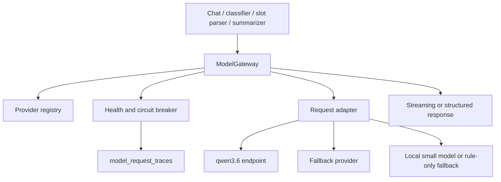
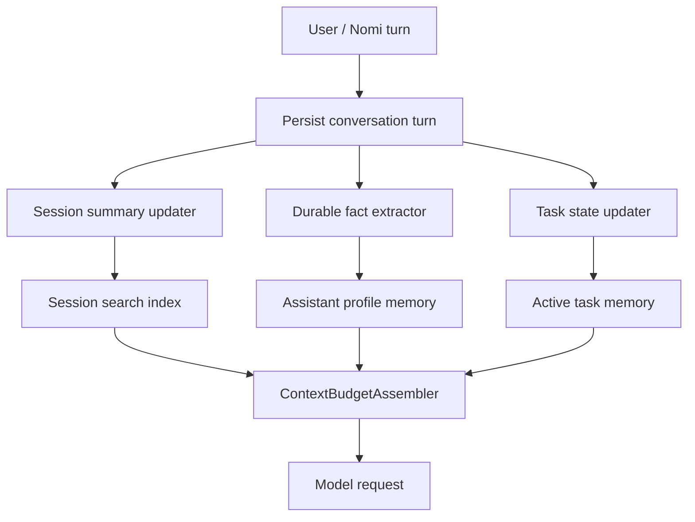
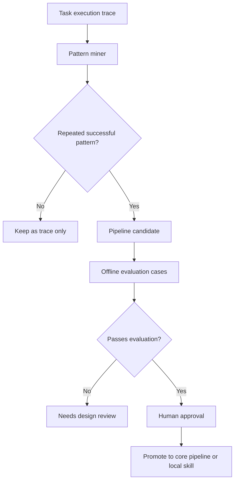
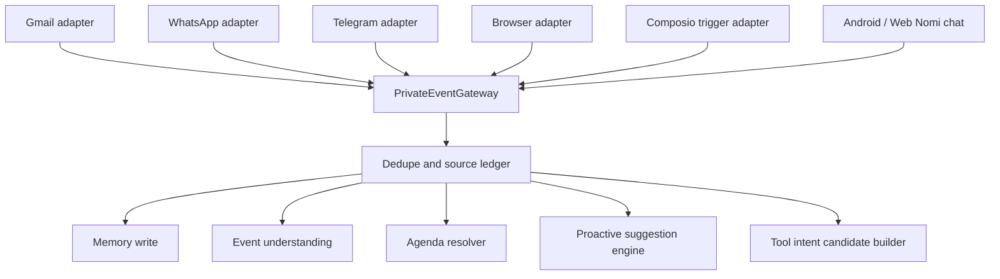
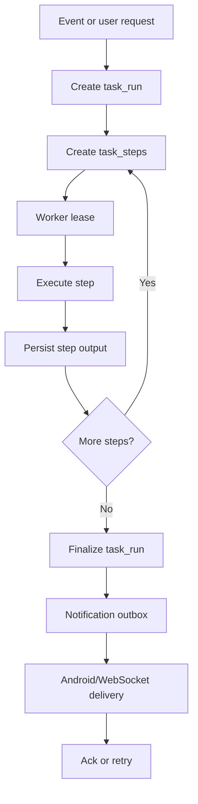
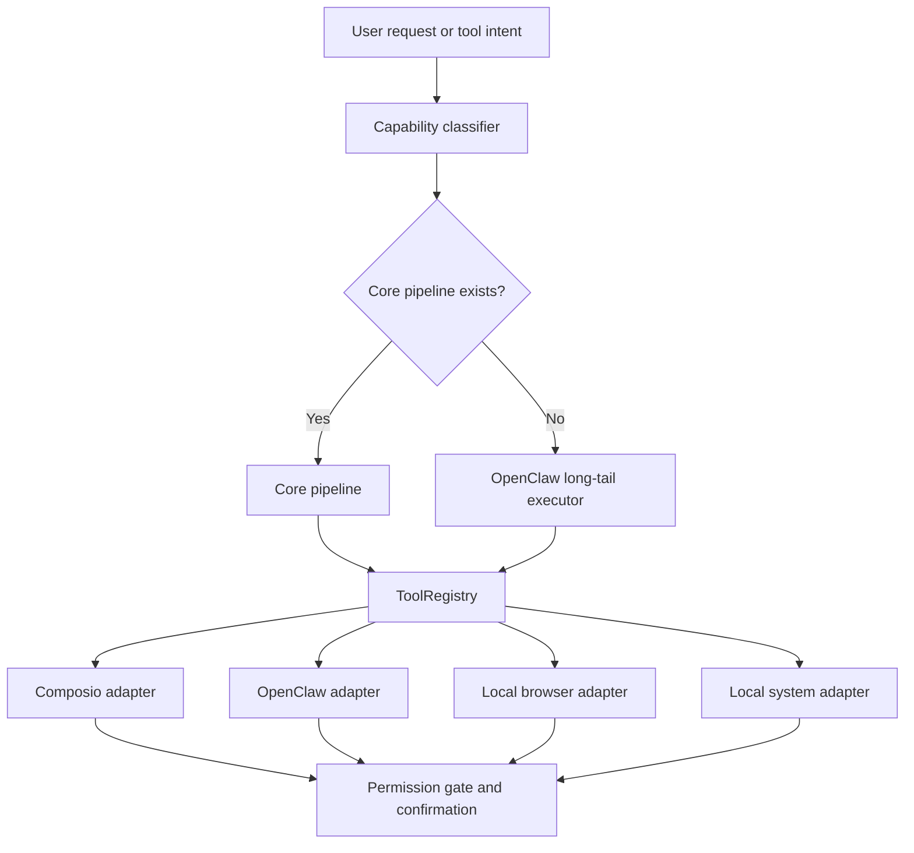

# Hermes-Inspired Nomi Enhancements Technical Design

**Status:** Review draft
**Date:** 2026-06-02
**Owner:** Nomi project

## Goal

This document turns the six useful ideas from the Hermes-style open-source agent architecture into concrete Nomi technical plans:

1. model provider routing and fallback
2. curated memory and session search
3. skill and pipeline distillation
4. multi-channel private event gateway
5. background task orchestration and recovery
6. MCP, Composio, and OpenClaw tool plugin architecture

These are enhancements to the existing Nomi architecture. They do not replace the current private-event processing, KV + knowledge graph + RAG memory, 256K context budget, core pipelines, OpenClaw routing, Composio authorization, Android floating-ball UI, or confirmation policy.

## Non-Goals

- This document does not implement code changes.
- This document does not give third-party tools unrestricted access to local private memory.
- This document does not allow Nomi to send messages, buy items, book rides, make payments, delete data, or modify third-party accounts without the existing confirmation gates.
- This document does not make Hermes itself a runtime dependency. Hermes is used as architectural inspiration only.
- This document does not assume qwen3.6 is always available. Provider health is a first-class runtime state.

## Product Principle

Nomi should feel like a private human assistant, but technically it must remain a controlled local system:

- Nomi owns memory, scope, context, risk, routing, confirmation, and user-facing explanation.
- Models provide reasoning and generation, but the model provider can fail and must be replaceable.
- Composio, OpenClaw, browser automation, and future MCP servers are execution adapters, not the assistant's brain.
- Every important decision must leave a trace that explains what evidence was used and why the output was reasonable.

## Relationship To Existing Specs

This design connects to existing project documents:

- `2026-05-28-private-event-processing-agenda-design.md`: source events, memory write, event classification, agenda, proactive suggestions.
- `2026-05-28-core-pipelines-openclaw-design.md`: deterministic pipelines for high-frequency work and OpenClaw for long-tail execution.
- `2026-05-28-pipeline-management-design.md`: pipeline registry and implementation tracking.
- `2026-05-29-256k-context-budget-design.md`: token-aware context assembly and scoped retrieval.
- `2026-05-28-composio-connect-link-integration.md`: Composio sessions, toolkits, authorization, and local connection records.

## Summary Table

| No. | Enhancement | Main Problem Solved | First Concrete Output |
| --- | --- | --- | --- |
| 1 | Model provider routing and fallback | qwen3.6 or any single model endpoint can fail, causing blank assistant responses | `ModelGateway` with health status, circuit breaker, and streaming fallback |
| 2 | Curated memory and session search | Raw event memory is not enough for long assistant continuity and short replies like "需要" | `AssistantContextMemory` plus token-aware session search |
| 3 | Skill and pipeline distillation | Successful long-tail workflows are not promoted into deterministic pipelines | Audited workflow candidate store and promotion process |
| 4 | Multi-channel private event gateway | Gmail, WhatsApp, Telegram, browser, and Nomi chat need one normalized event flow | Unified `source_events` gateway with source cursors and dedupe |
| 5 | Background task orchestration and recovery | Long jobs and proactive notifications can be lost or duplicated after restart | Durable `task_runs`, `task_steps`, retry, resume, and notification outbox |
| 6 | MCP, Composio, and OpenClaw tool plugin architecture | Tool selection can become ad hoc and unsafe across many providers | Capability-first `ToolRegistry` with adapters and permission gates |

---

# 1. Model Provider Routing And Fallback

## Objective

Nomi must not depend on a single model endpoint. qwen3.6 remains the preferred private-cloud model endpoint when healthy, but runtime behavior should degrade gracefully when it is unavailable.

The current observed failure mode is:

- `http://81.70.177.246:9161/v1/models` returns gateway or connection errors.
- Streaming chat can create an empty assistant bubble.
- The Android UI then appears broken even though the root cause is model unavailability.

## Architecture

Add a server-side `ModelGateway` between all Nomi reasoning calls and model providers.



## Components

### `ModelProviderRegistry`

Each provider record should include:

```json
{
  "provider_id": "qwen36_primary",
  "display_name": "Qwen 3.6 private endpoint",
  "base_url": "http://81.70.177.246:9161",
  "model": "qwen3.6",
  "priority": 10,
  "enabled": true,
  "supports_streaming": true,
  "supports_tool_calling": false,
  "context_window_tokens": 256000,
  "default_max_output_tokens": 8192,
  "privacy_tier": "private_cloud",
  "task_classes": ["chat", "classification", "slot_extraction", "summarization"]
}
```

The registry can be configured through environment variables first, then moved into local database rows.

### `ProviderHealthChecker`

Health checks should use both a cheap endpoint probe and a minimal completion probe:

- `GET /v1/models` checks API availability.
- `POST /v1/chat/completions` with a tiny prompt checks actual inference.
- Streaming providers must be checked with a short streaming request at least once per interval.

The health result should classify failures:

- `healthy`
- `unreachable`
- `http_error`
- `invalid_response`
- `stream_stalled`
- `timeout`
- `rate_limited`
- `auth_failed`

### `CircuitBreaker`

Provider state:

- `closed`: provider is healthy and eligible.
- `open`: provider is temporarily blocked after repeated failures.
- `half_open`: one trial request is allowed after cooldown.

Suggested thresholds:

- Open breaker after 3 consecutive hard failures or 5 failures in 10 minutes.
- Cooldown for 60 seconds for local transient failures, 5 minutes for repeated upstream 5xx.
- Never silently drop the model response. If no fallback exists, return a user-visible degraded status.

### `ModelRequestTrace`

Each request should persist:

- `request_id`
- `task_class`
- `selected_provider_id`
- `fallback_provider_id`
- `health_snapshot`
- `context_snapshot_id`
- `input_token_estimate`
- `output_token_estimate`
- `stream_first_token_ms`
- `latency_ms`
- `error_type`
- `user_visible_message`

## API Surface

- `GET /api/model/status`: returns provider health, breaker state, active provider, and last failure reason.
- `POST /api/model/health-check`: manually triggers a health check for admin/debug use.
- Internal `ModelGateway.chat_stream(...)`: streams chunks and emits explicit error events when all providers fail.
- Internal `ModelGateway.structured_json(...)`: used by classifier, slot parser, agenda resolver, and context relevance scorer.

## Runtime Routing Rules

1. Select providers that support the required task class.
2. Exclude disabled, open-circuit, or unhealthy providers.
3. Prefer private/local providers for sensitive content.
4. Prefer providers with sufficient context window for the assembled context pack.
5. Use fallback only when it satisfies privacy and task requirements.
6. If no provider is eligible, return a structured failure:

```json
{
  "status": "model_unavailable",
  "message": "模型服务暂时不可用，请稍后重试。",
  "reason": "qwen36_primary connection refused; no fallback provider configured"
}
```

## Verification

The implementation is only acceptable when these outputs are correct and reasonable:

- If qwen3.6 returns 502 or connection refused, `/api/model/status` must show the exact provider as unhealthy.
- A chat request must either stream assistant text or show a clear model-unavailable message. It must not leave a blank assistant bubble.
- A classifier request must record whether it used model output or rule-only fallback.
- A fallback response must be marked in trace so later debugging can explain why a different model answered.

---

# 2. Curated Memory And Session Search

## Objective

KV + knowledge graph + RAG stores are necessary, but they are not sufficient for a personal assistant. Nomi also needs a curated assistant memory layer for stable user facts, active preferences, direct instructions, and long-running conversational continuity.

This directly supports cases such as:

- Nomi asks "需要我帮你核对成本与利润率吗？" and the user replies "需要".
- The reply must resolve to the previous Nomi question, the related quote task, and the correct customer scope.
- The system must not depend on "last 8 turns"; it must use token-aware session search under the 256K context plan.

## Architecture



## Memory Layers

### `AssistantProfileMemory`

Stable facts and policies learned from direct Nomi interaction:

- preferred name and assistant name
- user communication preferences
- notification thresholds
- recurring constraints
- corrections, such as "不是公司 Alex，是健身房 Alex"
- explicit policies, such as "以后这类报价都提醒我核算利润率"

Fields:

- `memory_id`
- `user_id`
- `fact_type`
- `fact_text`
- `structured_value`
- `confidence`
- `source_turn_ids`
- `valid_from`
- `valid_until`
- `supersedes_memory_id`
- `sensitivity_level`
- `scope`

### `ConversationSessionMemory`

Direct Nomi conversation continuity:

- exact recent turns, token-capped
- rolling summaries
- unresolved questions Nomi asked
- pending confirmations
- user acknowledgements, approvals, dismissals
- active tool or pipeline state

### `SessionSearchIndex`

Searchable session index:

- embeddings for user turns, assistant turns, and summaries
- deterministic tags for task ids, agenda ids, suggestion ids, contact ids
- source references for replay and audit

## Context Assembly Rules

When building a context pack:

1. Always include the current user message.
2. If the current message is short or referential, boost the previous assistant question and active task state.
3. Include same-conversation exact turns until the token budget for exact turns is full.
4. Include rolling summary for older turns.
5. Include active task, agenda, suggestion, and pending confirmation state.
6. Include scoped KV, graph, and RAG evidence only after source scope filtering.
7. Persist the context snapshot with inclusion and exclusion reasons.

## Write Flow

Every direct Nomi turn is treated as a private event and written to memory. After the turn is stored:

- session summary is updated if exact turns exceed a configured threshold;
- durable facts are extracted by model + rules;
- user corrections update entity resolution and memory supersession;
- active task state is updated;
- proactive suggestion outcomes are logged.

## Verification

The implementation is only acceptable when:

- A short reply like "需要" includes the prior Nomi question and task state in the context snapshot.
- The final answer references the correct active task and does not ask what "需要" means.
- A long user message does not crowd out active task state.
- Contact-scoped memories do not leak unrelated contact opinions into the answer.
- The context snapshot records exact turns, summaries, included memories, excluded candidates, and token estimates.

---

# 3. Skill And Pipeline Distillation

## Objective

Nomi should learn from repeated successful workflows, but it must not silently rewrite itself or promote unsafe behavior. Long-tail OpenClaw or tool runs should be reviewed and distilled into deterministic pipeline candidates when they become common and stable.

## Architecture



## Candidate Sources

Candidates can come from:

- repeated OpenClaw tasks with similar goals and steps;
- repeated Composio tool sequences;
- repeated Nomi direct tasks;
- repeated proactive suggestions that users accept;
- repeated user corrections that imply a stable policy.

## Local Tables

### `workflow_patterns`

- `pattern_id`
- `source`
- `normalized_goal`
- `trigger_features`
- `required_slots`
- `observed_steps`
- `allowed_tools`
- `forbidden_tools`
- `risk_permission`
- `success_count`
- `failure_count`
- `last_seen_at`

### `pipeline_candidates`

- `candidate_id`
- `pattern_id`
- `proposed_pipeline_id`
- `proposed_steps`
- `input_schema`
- `output_schema`
- `confirmation_policy`
- `writeback_targets`
- `evaluation_status`
- `approval_status`

### `skill_evaluation_runs`

- `run_id`
- `candidate_id`
- `test_case_id`
- `input_event_ids`
- `expected_route`
- `expected_slots`
- `expected_user_message`
- `actual_result`
- `reasonableness_review`

## Promotion Rules

A candidate can be promoted only when:

- it has enough successful examples;
- failures are understood and bounded;
- required slots are explicit;
- risk and confirmation policy are clear;
- test cases cover positive, ambiguous, and unsafe examples;
- a human reviews the proposed behavior before enabling it.

## First Candidate Families

High-value candidates for Nomi:

- quote follow-up and margin check
- meeting-to-route-to-ride preparation
- email summarization and draft reply
- invoice/payment reminder extraction
- shopping comparison and cart preparation
- contact-specific relationship and preference update

## Verification

The implementation is only acceptable when:

- A successful repeated workflow creates a candidate, not an automatically enabled pipeline.
- Candidate evaluation includes output reasonableness, not only pass/fail status.
- Unsafe workflows never become auto-executing external actions.
- Promotion produces a trace showing why the workflow became deterministic.

---

# 4. Multi-Channel Private Event Gateway

## Objective

Gmail, WhatsApp, Telegram, browser activity, Android actions, Composio triggers, and direct Nomi chat should all enter one normalized local event gateway. This prevents separate channel-specific logic from drifting and makes memory, agenda, and proactive suggestions consistent.

## Architecture



## Event Envelope

Every source event should normalize to:

```json
{
  "event_id": "evt_...",
  "source_type": "gmail | whatsapp | telegram | browser | composio | nomi_chat",
  "source_account_id": "local_account_1",
  "source_event_id": "provider-native-id-or-hash",
  "conversation_id": "thread-or-chat-id",
  "sender_id": "contact-or-user-id",
  "recipient_ids": ["contact-or-user-id"],
  "occurred_at": "2026-06-02T10:00:00+08:00",
  "observed_at": "2026-06-02T10:00:05+08:00",
  "text": "normalized visible text",
  "attachments": [],
  "raw_payload_ref": "local-only-reference",
  "visibility_scope": "thread_scoped",
  "sensitivity_level": "medium",
  "dedupe_hash": "sha256..."
}
```

## Channel Adapters

### Gmail

Preferred sources:

- Composio read-only tools when account is connected;
- browser DOM/session capture when the user is logged in locally;
- future protocol or trigger integration when available.

### WhatsApp

Preferred sources:

- local browser session DOM/protocol capture;
- WebSocket/protocol-level observation if implemented safely;
- no credential extraction.

### Telegram

Preferred sources:

- local browser or desktop session capture;
- Composio or MCP integration if available and connected;
- no unsupported account impersonation.

### Browser

Browser events should capture:

- visible page title and URL;
- selected text or visible message area;
- current source account/session identity;
- user-driven login state changes;
- no unnecessary raw credential logging.

## Dedupe And Ordering

The gateway must prevent duplicate memory and duplicate proactive suggestions:

- Use `source_event_id` when available.
- Use `dedupe_hash` from source type, account, conversation, sender, timestamp bucket, and text.
- Preserve source order with per-channel cursors.
- Treat edited, deleted, or updated source messages as event versions, not brand-new unrelated events.

## Verification

The implementation is only acceptable when:

- A Gmail message, WhatsApp message, Telegram message, and Nomi chat turn all produce the same normalized event envelope shape.
- Every normalized event writes to memory regardless of later classification.
- Agenda and proactive processors receive source ids and scopes.
- Duplicate source events do not create duplicate agenda cards or repeated floating-ball alerts.
- Cross-contact retrieval remains scoped even when multiple channels mention the same person or project.

---

# 5. Background Task Orchestration And Recovery

## Objective

Nomi runs on a private server and should keep working across browser restarts, worker restarts, Docker restarts, WebSocket reconnects, and temporary model or tool failures. Proactive suggestions and user-facing task state must not disappear or duplicate.

## Architecture



## Task Run Model

### `task_runs`

- `task_run_id`
- `task_type`
- `source_event_ids`
- `pipeline_id`
- `route_type`
- `status`
- `created_at`
- `updated_at`
- `idempotency_key`
- `risk_permission`
- `requires_user_confirmation`
- `final_user_visible_summary`

Statuses:

- `queued`
- `running`
- `waiting_for_user`
- `waiting_for_tool`
- `blocked`
- `succeeded`
- `failed`
- `cancelled`

### `task_steps`

- `task_step_id`
- `task_run_id`
- `step_name`
- `status`
- `input_json`
- `output_json`
- `reasoning_summary`
- `error_type`
- `attempt_count`
- `lease_owner`
- `lease_expires_at`

### `notification_outbox`

- `notification_id`
- `task_run_id`
- `suggestion_id`
- `channel`
- `payload_json`
- `delivery_status`
- `created_at`
- `delivered_at`
- `acked_at`
- `retry_count`

## Recovery Rules

1. Every step persists its input before execution and output after execution.
2. A worker can resume only expired leases.
3. Read-only steps may retry automatically.
4. External-effect steps must never retry blindly after partial success.
5. Idempotency keys must be used for agenda writes, suggestion creation, and tool invocation records.
6. WebSocket reconnect must replay undelivered outbox messages.
7. Android dismiss/click actions must ack the specific suggestion or notification id.

## Proactive Suggestion Recovery

When an important event creates a suggestion:

- suggestion is written to local DB;
- notification is added to outbox;
- Android/WebSocket receives the bubble payload;
- user click opens the related conversation or action card;
- user dismiss records feedback and suppresses duplicate resurfacing;
- reconnect replays only unacked active notifications.

## Verification

The implementation is only acceptable when:

- Killing the worker mid-task does not lose the task.
- Restarting runtime API does not duplicate an agenda item or proactive message.
- WebSocket reconnect replays active unacked suggestions, not old dismissed ones.
- Failed model/tool steps produce user-visible error or degraded state.
- Task traces show inputs, outputs, retries, and reasonableness review for each step.

---

# 6. MCP, Composio, And OpenClaw Tool Plugin Architecture

## Objective

Nomi needs many tools, but raw tool selection should not be ad hoc. The assistant should route from user intent to capability, then to a deterministic pipeline or long-tail executor, then to a specific adapter such as Composio, OpenClaw, browser automation, or a local tool.

## Architecture



## Capability-First Registry

`CapabilityCatalog` should represent user-level capabilities, not provider-specific tool names:

```json
{
  "capability_id": "email.send_draft",
  "description": "Draft or send an email after user confirmation",
  "risk_permission": "external_message",
  "required_slots": ["recipient", "subject", "body"],
  "preferred_pipelines": ["email_pipeline", "reply_pipeline"],
  "allowed_adapters": ["composio", "browser"],
  "confirmation_required": true
}
```

## Tool Registry

`ToolRegistry` maps capabilities to concrete adapters:

- Composio toolkit and tool slugs
- OpenClaw task templates
- local browser commands
- local runtime API tools
- future native MCP servers

It should track:

- connection status
- allowed scopes
- read/write/destructive tags
- latency and reliability
- last successful invocation
- last failure reason

## Composio Adapter

Composio should be the first-version implementation for many external services.

Session policy:

- read-only sessions use read-only and idempotent tools where possible;
- write sessions disable destructive tools by default;
- payment, purchase, irreversible booking, and account-destructive tools require an additional explicit confirmation gate before execution.

Nomi should not expose raw Composio MCP headers or API keys to clients.

## OpenClaw Adapter

OpenClaw is a special long-tail executor:

- receives a minimal task packet;
- gets only necessary context;
- cannot submit, pay, send, delete, or change account settings without stop-before-confirmation;
- returns structured observations, evidence, and proposed next action;
- Nomi reviews and decides what to show the user.

## Permission Gates

Permission levels:

- `read_only`: may run without final confirmation if connected and scoped.
- `internal_write`: may write local Nomi memory, agenda, task state, or trace automatically.
- `external_draft`: may prepare a draft, route, cart, or form but not submit.
- `external_message`: requires user confirmation before sending.
- `purchase_or_payment`: requires explicit final confirmation and amount/recipient display.
- `destructive_or_account`: blocked by default unless the user explicitly enables that class.

## Tool Selection Flow

1. User request or event classifier creates a capability candidate.
2. Router checks core pipeline registry.
3. Pipeline resolves required slots using model + rules.
4. ToolRegistry lists eligible adapters.
5. If no adapter is connected, Nomi asks the user to connect the needed account.
6. If read-only, run and show result.
7. If external effect, prepare action and ask for final confirmation.
8. Persist invocation, result, and user feedback.

## Verification

The implementation is only acceptable when:

- "帮我打车" routes to route/ride capability, prepares a ride option, and does not book without confirmation.
- "帮我发邮件给 Alice" prepares a draft and requires confirmation before sending.
- If Gmail is not connected in Composio, Nomi shows a connect-account action instead of failing silently.
- A long-tail website workflow goes through OpenClaw with minimized context and stop-before-submit rules.
- Every tool invocation has a trace with capability, adapter, input, output, risk, confirmation, and result review.

---

# Cross-Cutting Data Model

The six enhancements should share traceable records rather than isolated logs.

Suggested tables or equivalent local stores:

- `model_providers`
- `model_health_checks`
- `model_request_traces`
- `assistant_profile_memories`
- `conversation_sessions`
- `conversation_turns`
- `conversation_summaries`
- `workflow_patterns`
- `pipeline_candidates`
- `skill_evaluation_runs`
- `source_events`
- `source_cursors`
- `task_runs`
- `task_steps`
- `notification_outbox`
- `capability_catalog`
- `tool_registry_entries`
- `tool_invocation_traces`

Existing tables can be reused when they already provide these responsibilities. The important requirement is not table naming; it is durable source ids, explicit scopes, typed status, and inspectable intermediate outputs.

# Implementation Order

## Phase 1: Model Gateway

Build this first because model unavailability is already affecting chat behavior and regression testing.

Deliverables:

- provider registry config
- health check endpoint
- circuit breaker
- model request traces
- chat streaming fallback/error events
- UI status for degraded model state

## Phase 2: Curated Memory And Session Search

Build this next because it fixes direct user conversation quality.

Deliverables:

- assistant profile memory
- conversation session summaries
- token-aware session search
- short-reply context boosting
- context snapshot evidence review

## Phase 3: Event Gateway And Recovery

Build this before broad proactive behavior.

Deliverables:

- normalized event envelope
- source cursors and dedupe
- durable task runs and steps
- notification outbox
- WebSocket replay and ack

## Phase 4: Tool Registry And Distillation

Build this after core ingestion and recovery are stable.

Deliverables:

- capability catalog
- Composio/OpenClaw/local adapter registry
- permission gate integration
- workflow pattern mining
- audited pipeline candidate promotion

# Acceptance Criteria

The design is implemented correctly only if the following are true:

- Nomi can explain which model provider was selected and why.
- Nomi does not produce blank assistant responses when a model endpoint fails.
- Nomi answers short contextual replies using the correct prior Nomi question and active task.
- Every private event from Gmail, WhatsApp, Telegram, browser, and Nomi chat enters the same normalized flow.
- Every event is stored in memory before downstream classification decisions.
- Proactive suggestions are durable, deduped, replayable after reconnect, and dismissible.
- Core pipelines choose capabilities before provider-specific tools.
- OpenClaw receives minimized context and cannot perform external-effect actions without stop-before-confirmation.
- Composio is used through controlled sessions, with connection status and permission gates visible to Nomi.
- Regression tests inspect the reasonableness of intermediate outputs, not only HTTP status or process success.

# Spec Self-Review

This spec intentionally keeps the six enhancements inside the current Nomi architecture:

- No section replaces existing KV + knowledge graph + RAG memory.
- No section gives Composio, OpenClaw, or MCP tools unrestricted memory access.
- No section allows external actions without confirmation.
- The model gateway explicitly handles qwen3.6 failure rather than assuming it is healthy.
- The context and memory design follows the existing 256K context budget and scoped retrieval rules.
- The event gateway follows the existing private-event agenda/proactive design.
- The tool architecture follows the existing core-pipeline-first, OpenClaw-for-long-tail direction.
