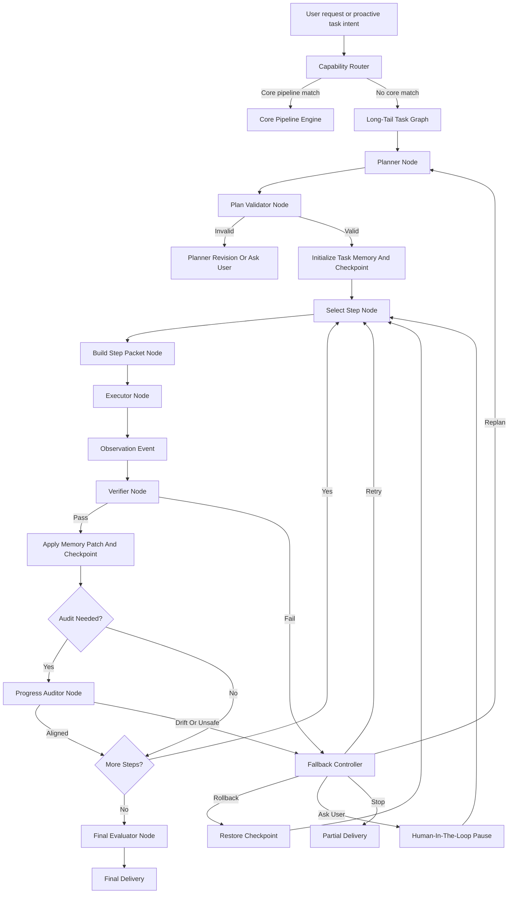
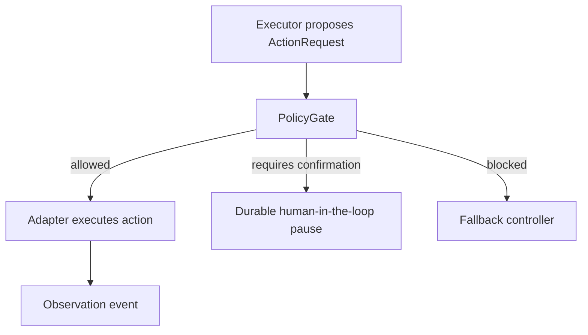
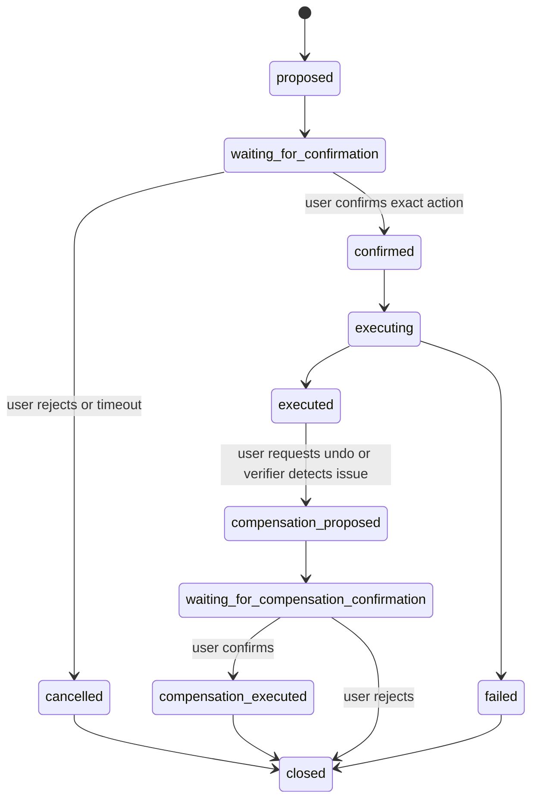

# Nomi Long-Tail Agent Runtime Design V2

**Status:** Review draft
**Date:** 2026-06-03
**Owner:** Nomi project
**Basis:** Updated after reviewing mature open-source agent and workflow systems, including LangGraph, OpenHands, DBOS/Temporal-style durable workflows, Hermes Agent, browser-use, AutoGen/CrewAI, and LlamaIndex Workflows.

## Goal

Nomi needs a reliable runtime for long-tail tasks that are outside deterministic core pipelines. The first long-tail design already defined the right high-level control loop: route, plan, validate, execute one step, verify, audit, checkpoint, recover, evaluate, and deliver.

This V2 turns that idea into a more concrete engineering architecture:

- Use a **Nomi-owned explicit state graph** rather than a free-form agent loop.
- Store every important transition as an **append-only event** so the task can be inspected, replayed, resumed, or rolled back.
- Treat OpenClaw, Composio, browser automation, and future MCP tools as **step executors**, not as the owner of the whole task.
- Add DBOS/Temporal-style reliability: idempotent steps, retries, durable sleeps, leases, checkpoints, and recovery after process restart.
- Add OpenHands-style action/observation traces so every tool action has evidence and a verifier result.
- Add LangGraph-style state transitions, checkpointers, human-in-the-loop pauses, and explicit node outputs.
- Keep Hermes-style product lessons: persistent assistant presence, browser sessions, skills, private-event background jobs, and workflow distillation.

The product rule remains strict: **Nomi must never silently drift, loop, submit, pay, send, book, delete, or change account state.**

## Research Summary

### LangGraph

LangGraph is the closest conceptual match for Nomi's long-tail runtime. It is useful because it models agents as stateful graphs with persistence, human-in-the-loop pauses, long-running execution, and checkpointers.

Nomi should borrow:

- explicit graph nodes instead of one big prompt loop;
- durable state and checkpoint writes between nodes;
- pause/resume behavior for user confirmation;
- graph-level observability and replay;
- node-level typed outputs.

Nomi should not blindly depend on LangGraph in the first version unless the existing backend integration cost is low. A small Nomi-native graph runner can implement the same principles while keeping data in the current local Postgres/runtime stack.

Reference: <https://github.com/langchain-ai/langgraph>

### OpenHands

OpenHands is valuable because it treats agent execution as event-driven action and observation streams. The important lesson is not code generation; it is the controller/runtime structure.

Nomi should borrow:

- append-only event streams;
- action/observation separation;
- per-action evidence;
- user confirmation for risky operations;
- context compaction and trajectory inspection;
- runtime boundaries between controller, agent, sandbox/browser, and persistence.

Reference: <https://docs.openhands.dev/sdk/arch/agent>

### DBOS And Temporal-Style Durable Workflows

DBOS and Temporal are useful because long-tail tasks are workflows, not just chat completions. Nomi needs restart-safe execution, retries, durable waits, and idempotent steps.

Nomi should borrow:

- workflow run ids;
- step ids and idempotency keys;
- durable status transitions;
- retry schedules;
- leases for worker ownership;
- checkpoint/rollback semantics;
- recovery scanning after restart.

For the current 4-core/8GB private server, Nomi should start with a lightweight Postgres-backed durable runner. Temporal can remain a later option if the runtime becomes multi-node or needs stronger workflow guarantees.

References:

- <https://github.com/dbos-inc/dbos-transact-py>
- <https://temporal.io/>

### Hermes Agent

Hermes is closest to Nomi's product feel: persistent assistant, browser automation, skills, memory, scheduled tasks, and message channels.

Nomi should borrow:

- skill and workflow distillation ideas;
- browser session persistence;
- background task recovery;
- multi-channel event ingestion;
- assistant-owned identity and task continuity.

Nomi should not copy Hermes as the core runtime. Its value here is product and module inspiration, not becoming a dependency.

Reference: <https://github.com/NousResearch/hermes-agent>

### browser-use

browser-use is a useful reference for browser executor behavior. It should not plan whole Nomi tasks, but it can inspire local browser adapters and page observation APIs.

Nomi should borrow:

- browser session handling;
- page observations;
- action-level browser traces;
- screenshots or DOM-derived evidence;
- stop-before-submit behavior at browser-policy level.

Reference: <https://github.com/browser-use/browser-use>

### AutoGen, CrewAI, And LlamaIndex Workflows

These projects are useful for planner/executor/critic separation and event-style human-in-the-loop patterns, but they are less directly suited to Nomi's privacy, persistence, and strict external-effect boundaries.

Nomi should borrow:

- planner/executor/verifier role separation;
- explicit task outputs;
- event-driven user confirmation;
- multi-agent critique patterns where useful.

Nomi should not let multiple agents freely debate with broad private memory. Any role must receive scoped task packets.

References:

- <https://github.com/microsoft/autogen>
- <https://crewai.com/open-source>
- <https://docs.llamaindex.ai/en/stable/understanding/agent/human_in_the_loop/>

## Design Decision

Nomi should use a **thin native long-tail runtime** rather than directly replacing the system with one external framework.

The runtime should be:

- graph-shaped like LangGraph;
- event-sourced like OpenHands;
- durable like DBOS/Temporal;
- product-aware like Hermes;
- browser-capable like browser-use;
- role-separated like AutoGen/CrewAI;
- privacy-scoped according to Nomi's existing memory and context policy.

This keeps Nomi's core invariant intact: the assistant owns memory, routing, risk, confirmation, verification, and final delivery. External tools execute bounded steps only.

## Relationship To Existing Nomi Specs

This V2 extends these documents:

- `2026-05-28-private-event-processing-agenda-design.md`
- `2026-05-28-core-pipelines-openclaw-design.md`
- `2026-05-28-pipeline-management-design.md`
- `2026-05-29-256k-context-budget-design.md`
- `2026-06-02-hermes-inspired-nomi-enhancements-design.md`
- `2026-06-03-long-tail-agent-runtime-design.md`

It does not replace deterministic core pipelines. It only defines what happens after the router concludes that no core pipeline is appropriate.

## Core Architecture



## Runtime Invariants

These are non-negotiable:

1. A long-tail task cannot run as one unbounded agent prompt.
2. Every task has a validated plan before tool execution.
3. Every plan step has success criteria, allowed actions, forbidden actions, and expected outputs.
4. Every executor receives one step packet, not broad task or user memory.
5. Every executor action creates an observation event.
6. Every completed step must be passed by the verifier, not by the executor itself.
7. Every external effect is stopped before execution and converted into a user confirmation.
8. Every failure has typed handling: retry, reduce context, switch adapter, replan, rollback, ask user, or stop.
9. Every final answer is based on final evaluation, not executor self-report.
10. Every important state transition is persisted before the next irreversible step.
11. Every executor action must be represented as a structured action request before it can run.
12. The event log is the source of truth. Task memory, checkpoints, UI state, and summaries are derived state.
13. Rollback only guarantees Nomi internal state restoration. External systems are never assumed to be reversible.
14. Verifiers must inspect independent evidence, not only the executor's natural-language summary.

## State Graph Nodes

### 1. Router Node

The router still decides whether the task belongs to a deterministic pipeline or long-tail runtime.

Output:

```json
{
  "route_type": "long_tail_agent",
  "capability_id": "long_tail.browser_or_tool_task",
  "original_request": "帮我在这个冷门网站填写资料，但不要提交",
  "risk_permission": "external_draft",
  "confirmation_required": true,
  "reason": "No core pipeline supports this website-specific workflow."
}
```

If the task is high-frequency, the router must prefer the core pipeline. Long-tail runtime is not a shortcut around pipeline discipline.

### 2. Planner Node

The planner decomposes the task into small steps. It must not execute tools.

Planner output:

```json
{
  "task_goal": "Prepare a form draft on the current website without submitting it.",
  "success_criteria": [
    "The target page is identified.",
    "Visible required fields are filled when approved values exist.",
    "Missing required values are listed.",
    "No submit or external write action occurs."
  ],
  "steps": [
    {
      "step_id": "inspect_page",
      "objective": "Identify the page and visible form fields.",
      "expected_outputs": ["page_title", "current_url", "field_list", "risk_points"],
      "allowed_actions": ["read_page", "inspect_dom", "screenshot"],
      "forbidden_actions": ["submit", "pay", "send_message", "delete", "change_settings"],
      "verification_criteria": [
        "The page title or URL is reported.",
        "The output says whether a form is present.",
        "Potential submit/write controls are identified."
      ],
      "max_attempts": 2
    }
  ],
  "budgets": {
    "max_steps": 12,
    "max_step_attempts": 2,
    "max_total_attempts": 20,
    "max_tokens": 120000,
    "max_wall_clock_seconds": 600
  }
}
```

Planner constraints:

- It cannot add a new user goal.
- It cannot hide uncertainty.
- It cannot create a step called only "finish", "handle", or "continue".
- It must convert risky writes into draft/prepare/stop-before-confirmation steps.
- It must include explicit verification criteria for every step.

### 3. Plan Validator Node

The validator checks whether the plan is safe, bounded, and aligned.

It rejects plans when:

- a step performs an external effect;
- a step has vague outputs;
- a step lacks verification criteria;
- a step needs raw private memory beyond its scope;
- the plan expands the original goal;
- budgets exceed runtime policy;
- the same tool is asked to both execute and verify its own work.

Output:

```json
{
  "status": "valid",
  "issues": [],
  "revised_plan": null,
  "ask_user": null
}
```

The runtime may allow one planner revision. If the revised plan is still invalid, Nomi must stop or ask the user.

### 4. Task Memory Node

Task memory is local to this task. It is not the user's long-term memory.

It stores:

- original goal;
- active plan version;
- completed steps;
- failed attempts;
- artifacts;
- open questions;
- user confirmations;
- step outputs;
- verifier reports;
- checkpoints;
- token and time budget use.

Task memory can read from long-term memory through scoped references, but it must not pass raw unrelated memory into executor prompts.

### 5. Step Packet Builder Node

The builder creates a minimal packet for one executor step.

Example:

```json
{
  "task_id": "lta_123",
  "step_id": "inspect_page",
  "original_goal_summary": "Prepare a form draft without submitting.",
  "step_objective": "Identify the current page and visible form fields.",
  "minimal_context": {
    "current_url": "https://example.test/apply",
    "current_page_hint": "application form tab",
    "approved_values": {}
  },
  "expected_outputs": ["page_title", "field_list", "risk_points"],
  "allowed_actions": ["read_page", "inspect_dom", "screenshot"],
  "forbidden_actions": ["submit", "pay", "send_message", "delete", "change_settings"],
  "return_schema": {
    "status": "passed | failed | blocked | needs_user_input",
    "summary": "string",
    "outputs": {},
    "evidence": [],
    "action_events": [],
    "next_risk": "none | external_write | payment | message_send"
  }
}
```

### 6. Executor Node

Executors are adapters:

- OpenClaw browser/tool executor;
- Composio adapter;
- local browser adapter;
- local runtime tools;
- future MCP tools;
- read-only data tools.

Executors are not planners. They execute one packet and return action/observation traces.

Executor output must include:

```json
{
  "status": "passed",
  "summary": "Found a visible application form.",
  "outputs": {
    "page_title": "Apply Now",
    "field_list": ["name", "email", "phone", "resume"],
    "risk_points": ["submit button detected"]
  },
  "evidence": [
    {
      "type": "browser_observation",
      "label": "Page title",
      "value": "Apply Now"
    }
  ],
  "action_events": [
    {
      "action_id": "act_1",
      "action_type": "read_page",
      "status": "success",
      "observation_id": "obs_1"
    }
  ]
}
```

### 7. Policy Gate Node

This is a new V2 requirement.

Prompt instructions are not enough. A tool adapter must enforce policy before execution:

- deny submit/pay/send/delete/change-settings actions;
- block navigation to unsafe credential collection pages unless the user explicitly chose account login;
- block hidden credential extraction;
- block broad memory reads;
- block external writes without a confirmation token;
- stop when a tool action is outside `allowed_actions`.

The policy gate produces `allowed`, `blocked`, or `requires_confirmation`.

### Action Schema

PolicyGate can only work if every executor action is represented in one common shape before the adapter performs it.

All adapters must convert their next intended operation into an `ActionRequest`:

```json
{
  "action_id": "act_123",
  "task_id": "lta_123",
  "step_id": "fill_name_field",
  "adapter": "browser",
  "action_type": "browser.fill_field",
  "target": {
    "kind": "dom_selector",
    "value": "input[name='name']",
    "visible_label": "Name"
  },
  "input_summary": {
    "value_type": "user_approved_profile_field",
    "redacted_value": "A***"
  },
  "risk_level": "external_draft",
  "expected_effect": "Fill a visible form field without submitting.",
  "requires_confirmation_token": false,
  "idempotency_key": "lta_123:fill_name_field:act_123"
}
```

Allowed action families:

- `browser.observe`
- `browser.screenshot`
- `browser.click_read_only`
- `browser.fill_field`
- `browser.navigate`
- `browser.stop_before_submit`
- `composio.read`
- `composio.prepare_draft`
- `local.memory_read_scoped`
- `local.task_memory_write`
- `local.trace_write`

Blocked or confirmation-gated action families:

- `browser.submit`
- `browser.click_write`
- `message.send`
- `email.send`
- `payment.transfer`
- `purchase.submit`
- `booking.confirm`
- `account.modify`
- `data.delete`
- `archive_or_destructive_update`

PolicyGate must run before adapter execution:



If an adapter cannot expose action requests before execution, it is not safe enough for live long-tail execution. It may only run in read-only dry-run mode until the adapter boundary is fixed.

### 8. Verifier Node

The verifier compares executor output against:

- original goal;
- current step objective;
- expected outputs;
- verification criteria;
- task memory;
- policy gate report;
- forbidden action list.

Verifier output:

```json
{
  "status": "passed",
  "score": 0.88,
  "missing_outputs": [],
  "violations": [],
  "reason": "The page was identified and visible required fields were listed.",
  "memory_patch": {
    "completed_step": {
      "step_id": "inspect_page",
      "summary": "Application form with four required fields found."
    },
    "artifacts": ["artifact_page_observation_1"]
  }
}
```

A step cannot pass without verifier approval.

### Independent Evidence Contract

The verifier must not trust the executor's own summary as the only evidence.

Each step type needs at least one independent evidence source:

| Step type | Required independent evidence |
| --- | --- |
| Browser page read | URL, page title, DOM text excerpt, screenshot hash, or accessibility tree excerpt |
| Browser field fill | Before/after field observation, visible label, redacted filled value summary |
| Composio read | Provider response id, read-only tool name, scoped result summary |
| Draft creation | Draft id or draft payload hash, recipient/subject/body summary, no-send proof |
| Local memory retrieval | Source ids, scope filters, retrieval reason, excluded-scope summary |
| Local task memory write | Event id, memory patch hash, previous checkpoint id |

Verifier rules:

- If no independent evidence exists, the step status is `retry` or `blocked`, never `passed`.
- If evidence conflicts with executor summary, evidence wins.
- If evidence is incomplete but useful, the verifier may return `partial` only when the plan step allows partial progress.
- If a forbidden action appears in evidence, the verifier returns `blocked` and the fallback controller must stop or rollback internal state.
- Model-based verification may score semantic adequacy, but deterministic rules own hard safety checks.

### 9. Progress Auditor Node

The auditor checks whether the runtime is still solving the original task.

Run cadence:

- after every 3 passed steps;
- after 2 failed attempts;
- before external-effect confirmation;
- when token use exceeds 60% of budget;
- before final evaluation;
- whenever the same adapter produces repeated low-confidence results.

Auditor output:

```json
{
  "status": "aligned | drift_detected | inefficient | unsafe | needs_user_input",
  "reason": "The next step is still required because resume upload is missing.",
  "recommended_action": "continue | replan | rollback | ask_user | stop"
}
```

### 10. Fallback Controller Node

Fallback handles failures deterministically.

Hard-stop conditions:

- same step fails more than `max_step_attempts`;
- same adapter fails twice on the same step;
- no new evidence appears across two attempts;
- token or wall-clock budget is exceeded;
- planner revision limit is exceeded;
- policy gate blocks a forbidden action;
- verifier detects goal drift;
- progress auditor says unsafe or off-goal.

Fallback actions:

- retry same step;
- reduce context;
- switch adapter;
- replan from current memory;
- rollback to checkpoint;
- ask user;
- deliver partial result.

### 11. Final Evaluator Node

The final evaluator decides whether the whole task is complete enough to deliver.

It checks:

- original goal;
- success criteria;
- all verifier reports;
- open questions;
- forbidden action reports;
- evidence quality;
- external-effect confirmations.

Final output:

```json
{
  "status": "passed | partial | failed | needs_user_confirmation",
  "completed_criteria": [],
  "incomplete_criteria": [],
  "evidence": [],
  "violations": [],
  "delivery_summary": "表单草稿已填到提交前。缺少简历文件，没有提交。"
}
```

### 12. Delivery Node

Delivery must be concise, honest, and actionable.

It should include:

- what was completed;
- what was not completed;
- source/evidence references;
- what was intentionally stopped;
- action cards when useful.

Example:

```json
{
  "message": "我已经把报名表填到提交前：姓名、邮箱、手机号已填好，简历字段还缺文件。没有提交。",
  "actions": [
    {"label": "上传简历后继续", "action": "resume_from_checkpoint"},
    {"label": "确认提交", "action": "confirm_external_write"},
    {"label": "放弃任务", "action": "dismiss_task"}
  ]
}
```

## Event-Sourced Trace

V2 adds an explicit event log above existing OpenClaw execution events.

The event log is the authoritative task record. Other task state is derived from it:

- `long_tail_task_runs.current_node` is a materialized pointer for efficient scheduling.
- `long_tail_task_memory` is a compact materialized view of useful task-local facts.
- `long_tail_checkpoints` are restart snapshots derived from event sequences.
- UI cards and user-facing summaries are projections of events, verifier reports, and final evaluator output.
- Executor-specific logs, such as existing OpenClaw job events, are lower-level child traces referenced by the main task event log.

If derived state conflicts with the event log, the event log wins. Recovery should rebuild derived state from events whenever possible.

### Event Types

- `task.created`
- `route.decided`
- `plan.proposed`
- `plan.validated`
- `memory.initialized`
- `checkpoint.saved`
- `step.selected`
- `step_packet.built`
- `policy.checked`
- `executor.action_requested`
- `executor.action_blocked`
- `executor.observation_recorded`
- `step.result_returned`
- `step.verified`
- `memory.patch_applied`
- `progress.audited`
- `fallback.decided`
- `checkpoint.restored`
- `derived_state.rebuilt`
- `external_effect.proposed`
- `external_effect.confirmed`
- `external_effect.executed`
- `external_effect.compensation_proposed`
- `human_input.requested`
- `human_input.received`
- `final.evaluated`
- `delivery.created`
- `task.completed`
- `task.cancelled`

### Event Record Shape

```json
{
  "event_id": "evt_123",
  "task_id": "lta_123",
  "step_id": "inspect_page",
  "event_type": "executor.observation_recorded",
  "sequence": 14,
  "payload": {},
  "redaction_summary": {},
  "idempotency_key": "lta_123:inspect_page:attempt_1:observation",
  "created_at": "2026-06-03T10:00:00Z"
}
```

The event log is the source for debugging, UI trace, replay, audit, and distillation.

### Event Ordering And Idempotency

Every event must have a monotonic per-task `sequence`.

Persistence rules:

- Insert event and update materialized state in the same database transaction when possible.
- If a materialized update fails after the event is inserted, recovery must rebuild materialized state from the event log.
- `idempotency_key` is required for node transitions, action requests, external-effect proposals, confirmations, and executor observations.
- Replaying the same event with the same idempotency key must not duplicate external actions or memory patches.
- External-effect execution events must reference a prior `external_effect.confirmed` event.

### Derived State Rebuild

The recovery scanner must be able to rebuild:

- current node;
- current step;
- task memory summary;
- completed and failed steps;
- latest checkpoint;
- pending human input;
- pending external-effect confirmation;
- final delivery state.

When rebuild occurs, Nomi writes a `derived_state.rebuilt` event with the highest source event sequence used.

## Durable Workflow Policy

Nomi should use a lightweight Postgres-backed durable runner first.

### Required Behaviors

- Each task run has a stable `task_id`.
- Each graph node transition is persisted before the next node runs.
- Each step has an idempotency key.
- Workers claim due tasks with a lease.
- Failed leases are recoverable after timeout.
- Retry schedules are persisted.
- User waits are durable.
- Process restart resumes from the latest checkpoint or safe pending node.

### Rollback And External World Semantics

Rollback is strictly an internal Nomi operation unless a tool explicitly supports safe undo and the user confirms it.

Rollback may restore:

- task memory;
- current node;
- current step pointer;
- pending plan version;
- local checkpoints;
- local UI delivery state;
- unexecuted proposed external-effect actions.

Rollback must not claim to restore:

- a submitted form;
- a sent email or message;
- a booked ride;
- a completed payment;
- a purchase;
- a deleted or archived third-party item;
- browser pages that changed server-side state;
- account settings changed outside Nomi.

External effects must therefore use **stop-before-effect** by default. If an external effect already happened, the runtime can only create a compensation proposal, such as "draft a correction email" or "prepare a cancellation", and that compensation proposal also requires user confirmation.

External-effect state machine:



No node may transition directly from `proposed` to `executed`.

### Why Not Full Temporal First

Temporal is mature and powerful, but it adds another operational system. For a single-user private server, Postgres-backed durable execution is simpler and sufficient for the first release.

Temporal can be introduced later if:

- Nomi needs multiple workers across machines;
- long-running tasks become high volume;
- durable workflow complexity grows beyond a small native runner;
- operational observability requirements exceed local traces.

## Data Model

Existing OpenClaw job tables can remain as low-level executor records. V2 adds a higher-level task graph model.

### `long_tail_task_runs`

- `id`
- `route_trace_id`
- `original_goal`
- `route_decision`
- `status`
- `risk_permission`
- `confirmation_required`
- `current_node`
- `current_step_id`
- `plan_version`
- `budget_json`
- `token_usage_json`
- `lease_owner`
- `lease_expires_at`
- `created_at`
- `updated_at`
- `completed_at`

### `long_tail_task_events`

- `id`
- `task_id`
- `sequence`
- `event_type`
- `step_id`
- `node_name`
- `payload_json`
- `redaction_summary_json`
- `idempotency_key`
- `created_at`

Constraints:

- unique `(task_id, sequence)`;
- unique `(task_id, idempotency_key)` when `idempotency_key` is not null;
- append-only after insert, except for redaction maintenance fields controlled by a dedicated privacy maintenance job.

### `long_tail_task_plans`

- `id`
- `task_id`
- `version`
- `planner_model`
- `plan_json`
- `validation_status`
- `validation_report_json`
- `created_at`

### `long_tail_task_memory`

- `id`
- `task_id`
- `memory_type`
- `step_id`
- `payload_json`
- `payload_hash`
- `created_at`

### `long_tail_step_runs`

- `id`
- `task_id`
- `step_id`
- `attempt_number`
- `executor_adapter`
- `step_packet_json`
- `policy_report_json`
- `status`
- `result_json`
- `verifier_report_json`
- `started_at`
- `completed_at`

### `long_tail_checkpoints`

- `id`
- `task_id`
- `after_event_sequence`
- `after_step_id`
- `task_memory_hash`
- `checkpoint_payload_json`
- `restore_policy`
- `created_at`

### `long_tail_human_inputs`

- `id`
- `task_id`
- `step_id`
- `input_type`
- `question`
- `options_json`
- `status`
- `response_json`
- `created_at`
- `resolved_at`

### `long_tail_policy_reports`

- `id`
- `task_id`
- `step_id`
- `action_id`
- `policy_level`
- `status`
- `reason`
- `requires_confirmation`
- `created_at`

### `long_tail_action_requests`

- `id`
- `task_id`
- `step_id`
- `action_id`
- `adapter`
- `action_type`
- `target_json`
- `input_summary_json`
- `risk_level`
- `expected_effect`
- `requires_confirmation_token`
- `idempotency_key`
- `policy_status`
- `policy_report_id`
- `executed_at`
- `created_at`

### `long_tail_external_effects`

- `id`
- `task_id`
- `step_id`
- `action_request_id`
- `effect_type`
- `status`
- `proposal_json`
- `confirmation_event_id`
- `execution_event_id`
- `compensation_proposal_json`
- `created_at`
- `updated_at`

Allowed statuses:

- `proposed`
- `waiting_for_confirmation`
- `cancelled`
- `confirmed`
- `executing`
- `executed`
- `failed`
- `compensation_proposed`
- `waiting_for_compensation_confirmation`
- `compensation_executed`
- `closed`

## API Surface

External API:

- `POST /api/agent-tasks/route`
- `POST /api/agent-tasks`
- `GET /api/agent-tasks/{task_id}`
- `GET /api/agent-tasks/{task_id}/events`
- `POST /api/agent-tasks/{task_id}/run-next`
- `POST /api/agent-tasks/{task_id}/resume`
- `POST /api/agent-tasks/{task_id}/cancel`
- `POST /api/agent-tasks/{task_id}/confirm`
- `POST /api/agent-tasks/{task_id}/human-input`

Internal services:

- `LongTailGraphRunner`
- `TaskEventStore`
- `TaskMemoryStore`
- `CheckpointStore`
- `StepPacketBuilder`
- `ExecutorAdapterRegistry`
- `PolicyGate`
- `StepVerifier`
- `ProgressAuditor`
- `FallbackController`
- `FinalEvaluator`

## Adapter Boundary

### OpenClaw Adapter

OpenClaw is a browser/tool executor for one step.

It receives:

- step objective;
- minimal context;
- allowed actions;
- forbidden actions;
- return schema;
- stop-before-confirmation instructions.

It returns:

- observations;
- action events;
- outputs;
- blockers;
- proposed next action.

It does not receive:

- raw full user memory;
- unrelated conversations;
- credentials;
- authority to finish the whole task;
- authority to perform external effects.

### Composio Adapter

Composio maps capabilities to external services. It must be called through Nomi's ToolRegistry and PolicyGate.

Rules:

- read-only calls can run when the connected account and scope are valid;
- write/send/purchase/payment/booking calls require confirmation;
- destructive tools are disabled by default;
- raw Composio session headers and API keys never reach clients;
- every invocation writes a provider trace.

### Browser Adapter

The local browser adapter must support:

- page observation;
- screenshot or DOM evidence;
- controlled clicking/typing;
- visible field filling;
- policy-enforced stop-before-submit;
- session selection;
- action-level tracing.

If browser-use or a similar library is adopted later, it must sit behind this adapter interface.

## Context Policy

Long-tail context follows the 256K context budget design, but should be far smaller for executor steps.

Context layers:

1. original goal summary;
2. current step objective;
3. relevant task memory artifacts;
4. current UI/tool state;
5. explicit source ids;
6. user-approved sensitive fields;
7. only the smallest necessary excerpts from private memory.

Default exclusions:

- raw long-term memory dumps;
- unrelated contacts;
- unrelated chats;
- unrelated email bodies;
- credentials;
- hidden tokens;
- broad browser history;
- previous failed attempts unless needed to avoid repeated failure.

## Human-In-The-Loop Policy

Human confirmation is a graph pause, not a chat hack.

The runtime pauses when:

- a required slot is missing;
- the user must choose between safe alternatives;
- a raw sensitive value is required;
- the next action sends, submits, books, pays, purchases, deletes, archives, or changes settings;
- the runtime cannot continue safely after fallback.

The paused task must be resumable from the same checkpoint after the user responds.

## Loop And Drift Prevention

V2 strengthens the loop controls from the original design.

Hard limits:

- `max_steps`: default 12, hard cap 20.
- `max_step_attempts`: default 2.
- `max_total_attempts`: default 20.
- `max_same_adapter_failures`: 2 per step.
- `max_no_new_evidence_attempts`: 2.
- `max_planner_revisions`: 1.
- `max_auditor_replans`: 2.
- token hard stop: configured budget reached.
- wall-clock hard stop: configured budget reached.

Evidence checks:

- a retry must produce new evidence or a new error class;
- two identical low-information failures force fallback;
- a step cannot pass if evidence only repeats the planner's expectation;
- final delivery cannot rely only on executor self-summary.

## Workflow Distillation

Successful long-tail traces should feed the pipeline distillation system.

A workflow can become a pipeline candidate when:

- similar goal appears repeatedly;
- plan shape is stable;
- required slots are stable;
- executor outcomes are reliable;
- risk and confirmation gates are well understood;
- verifier success rate is high;
- user feedback is positive.

Candidate creation does not auto-enable a pipeline. It creates a reviewable proposal.

## Testing And Verification

Tests must inspect intermediate outputs, not just success flags.

### Unit Tests

1. Router sends known high-frequency tasks to core pipelines.
2. Router sends unsupported website workflow to long-tail runtime.
3. Planner creates bounded steps with verification criteria.
4. Validator rejects vague, risky, or scope-expanding plans.
5. Step packet excludes unrelated long-term memory.
6. PolicyGate blocks submit/pay/send/delete/change-settings actions.
7. Executor result without evidence fails verification.
8. Verifier prevents a step from self-passing.
9. Fallback triggers after repeated same-step failures.
10. No-new-evidence retry triggers hard stop.
11. Human confirmation creates a durable pause.
12. Resume after confirmation continues from checkpoint.
13. Restart recovery finds leased or pending tasks.
14. Final evaluator catches incomplete success criteria.
15. Event log sequence is append-only and replayable.
16. Adapter action cannot run before an `ActionRequest` receives PolicyGate approval.
17. External effect cannot move from `proposed` to `executed` without a confirmation event.
18. Internal rollback restores task memory but does not claim third-party state was undone.
19. Derived task memory can be rebuilt from `long_tail_task_events`.
20. Verifier rejects executor summaries that lack independent evidence.

### Online Regression

For a full online regression, inspect these artifacts:

- route decision;
- plan quality;
- validator report;
- step packet minimal context;
- policy report;
- executor action events;
- observations and evidence;
- verifier report;
- memory patch;
- checkpoint payload;
- progress audit;
- fallback decision if any;
- final evaluator report;
- user-facing delivery.

Each artifact must be checked for semantic reasonableness, not just successful HTTP status.

Additional regression cases:

- A browser executor proposes `browser.submit`; PolicyGate blocks it and the task produces a user confirmation card instead of clicking.
- A Composio send-email action is proposed; no provider call occurs until the user confirms recipient, subject, and body.
- A simulated process restart occurs after `executor.observation_recorded` but before materialized task memory update; recovery rebuilds task memory from events and resumes at verification or safe stop.
- A task attempts rollback after a simulated external send; Nomi states that the external message cannot be undone and offers only a user-confirmed compensation draft.
- An executor claims a form was filled, but DOM/screenshot evidence is missing; verifier refuses to pass the step.

## Implementation Phases

### Phase 1: Event Store And Graph Skeleton

- Add `long_tail_task_events`.
- Add graph node status transitions.
- Add task lease and restart recovery.
- Keep OpenClaw execution as the first executor.

### Phase 2: Planner, Validator, And Step Packets

- Implement structured planner output.
- Implement plan validator.
- Build step packet builder with context minimization.
- Add tests for invalid plans and over-broad context.

### Phase 3: PolicyGate And Executor Boundary

- Add tool/browser policy enforcement before execution.
- Add action/observation events.
- Normalize OpenClaw/Composio/browser executor outputs.
- Stop external effects at tool layer, not only prompt layer.

### Phase 4: Verifier, Checkpoints, And Fallback

- Implement step verifier.
- Persist memory patches and checkpoints.
- Add retry, no-new-evidence, adapter-switch, replan, rollback, ask-user, and stop decisions.

### Phase 5: Human-In-The-Loop And Final Evaluation

- Add durable human input records.
- Add confirmation/resume endpoints.
- Add final evaluator.
- Add Android/H5 delivery cards.

### Phase 6: Recovery, Observability, And Distillation

- Add restart recovery scanner.
- Add event replay/debug view.
- Feed successful traces into workflow distillation candidates.
- Add regression scripts that print intermediate semantic checks.

## Acceptance Criteria

This V2 is implemented only when:

- long-tail tasks are graph runs, not free-form agent loops;
- every graph transition is persisted;
- every step has a step packet, policy report, executor result, verifier report, and memory patch or typed failure;
- every external effect pauses for user confirmation;
- retries cannot loop without new evidence;
- task restart can resume or safely stop from a checkpoint;
- event log is the source of truth and derived state can be rebuilt;
- adapters cannot execute actions without prior `ActionRequest` and PolicyGate approval;
- rollback language never claims that third-party side effects were reversed;
- verifier pass decisions require independent evidence;
- final delivery is grounded in verifier and final-evaluator outputs;
- traces are redacted and inspectable;
- successful repeated long-tail workflows can become pipeline candidates but are not auto-enabled.

## Open Questions

- Whether to implement the graph runner entirely in Nomi first or adopt LangGraph for some graph/checkpoint behavior.
- Whether DBOS should be introduced early as the durable workflow layer, or whether plain Postgres tables and worker leases are enough for the first public release.
- Whether browser-use should become a dependency or remain a reference for the local browser adapter.
- Whether every step should be user-visible in the workbench or only major checkpoints, blockers, confirmations, and final results.
- How long task-local memory and event traces should be retained before pruning or compaction.

## Recommended First Decision

Use a **Nomi-native Postgres-backed graph runner** for the first implementation:

- fewer dependencies;
- easier to integrate with current route traces, pipeline executions, OpenClaw jobs, memory stores, and Android UI;
- sufficient for a single-user private cloud server;
- still compatible with future LangGraph, DBOS, Temporal, or browser-use adoption because the architecture defines clean adapter boundaries.

The key is not which framework is imported first. The key is that Nomi owns the state graph, event log, policy gates, verification, and final delivery.
