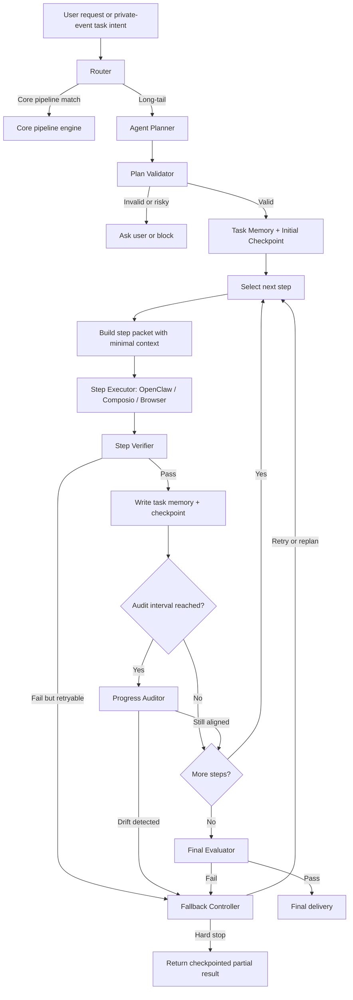
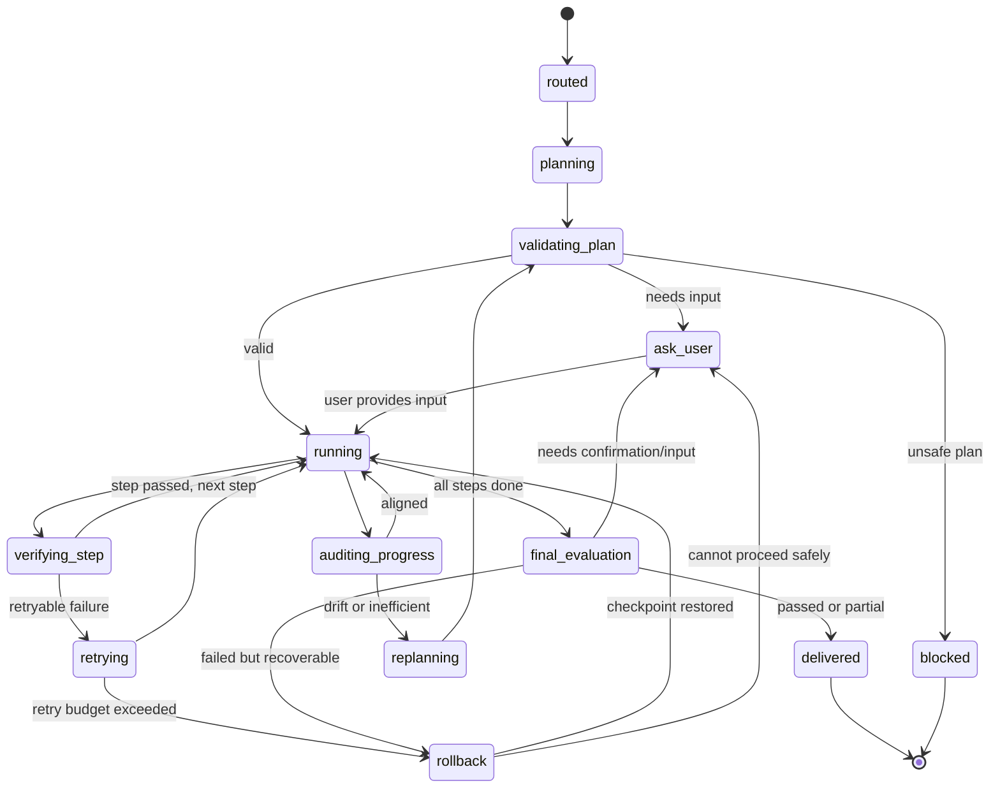

# Nomi Long-Tail Agent Runtime Design

**Status:** Draft for review
**Date:** 2026-06-03
**Owner:** Nomi project

## Goal

Nomi needs a safer and more reliable runtime for long-tail tasks that cannot be handled by deterministic core pipelines. The current OpenClaw path already creates constrained task packets, minimizes context, records execution events, and limits retries. That is useful, but it is still too close to "give a goal to an agent and trust it to finish."

This design changes the long-tail path into an orchestrated agent runtime:

- Nomi first decides whether the request should use a core pipeline or the long-tail agent runtime.
- Core pipelines continue to run through the existing deterministic pipeline engine.
- Long-tail tasks run through a planner, validator, task memory, step executor, step verifier, progress auditor, fallback controller, final evaluator, and final delivery layer.
- OpenClaw or any future browser/tool agent becomes a step executor, not the owner of the whole task.
- Every step has explicit outputs, evidence, verification, retry limits, checkpoint behavior, and user-visible failure paths.

The product goal is simple: **the agent must not silently cross a boundary, drift away from the original goal, loop forever, or pretend a step is complete when the output does not meet the criteria.**

## Non-Goals

- This design does not replace core pipelines.
- This design does not give OpenClaw direct access to the user's full long-term memory.
- This design does not allow autonomous submission, payment, purchase, booking, sending messages, deletion, or account setting changes.
- This design does not require all long-tail tasks to succeed. When safe completion is not possible, Nomi should stop cleanly and explain why.
- This design does not implement code changes yet.

## Current Baseline

The current runtime already has these pieces:

- `route_tool_request` chooses `core_pipeline`, `ask_user`, or `openclaw_tool`.
- `build_openclaw_task_packet` creates a constrained packet with `goal`, `minimal_context`, `allowed_actions`, `forbidden_actions`, `max_steps`, `requires_stop_before`, and `return_schema`.
- `assess_openclaw_context_necessity` minimizes context and excludes unrelated memory.
- `execute_openclaw_task_packet` calls the OpenClaw-compatible gateway when enabled, or returns a dry-run blocked result.
- `openclaw_execution_jobs` and `openclaw_execution_events` record job status, attempts, tool events, and retry/failure transitions.
- retry classification only retries transient failures and stops after `max_attempts`.

The missing layer is a **task-level control loop** around the agent. The current packet constrains a single delegated run, but it does not yet decompose, verify, self-correct, checkpoint, or evaluate the whole task as a multi-step workflow.

## Core Principle

Long-tail agent execution should be **Nomi-controlled, step-scoped, and verification-gated**.

Nomi owns:

- route decision;
- task plan;
- task memory;
- checkpointing;
- minimal context selection;
- step-level verification;
- progress auditing;
- retry/fallback policy;
- final evaluation;
- user-facing delivery;
- external-effect confirmation.

Agent executors own:

- executing one bounded step;
- returning structured output and evidence;
- reporting blockers or missing inputs;
- never deciding that the whole task is complete unless Nomi's verifier agrees.

## High-Level Flow



## Routing Contract

The first decision remains:

1. Normalize the request and current context.
2. Check whether the task matches a deterministic pipeline.
3. If it matches, run the pipeline.
4. If it does not match, create a long-tail task run.
5. If the request is too vague, too risky, or externally impactful without enough slots, ask the user before planning.

Routing output should include:

```json
{
  "route_type": "long_tail_agent",
  "original_request": "帮我在这个冷门网站填报名表，但不要提交",
  "capability_id": "long_tail.browser_task",
  "risk_permission": "external_execution",
  "confirmation_required": true,
  "reason": "No deterministic core pipeline supports this niche website workflow."
}
```

The existing `openclaw_tool` route type can remain for compatibility, but internally it should be handled by the new `long_tail_agent` runtime.

## Runtime Components

### 1. Agent Planner

The planner turns the user's original goal into a structured plan. It must not execute tools.

Planner input:

- original goal;
- route decision;
- risk permission;
- minimal task context;
- current UI state;
- available adapters;
- known forbidden actions;
- user-provided constraints.

Planner output:

```json
{
  "task_goal": "Fill the application form draft on the current website without submitting it.",
  "success_criteria": [
    "Required visible form fields are filled or a missing-field list is returned.",
    "No submit/payment/send/external-write action is performed.",
    "Evidence includes page title, field names, and filled draft values."
  ],
  "constraints": [
    "Do not submit the form.",
    "Do not expose unrelated private memory.",
    "Stop before external write."
  ],
  "steps": [
    {
      "step_id": "step_1",
      "title": "Inspect current page",
      "objective": "Identify whether the current page is the target application form.",
      "required_inputs": ["current_url", "page_title"],
      "expected_outputs": ["page_summary", "form_presence"],
      "verification_criteria": [
        "The output names the page or explains why it cannot identify it.",
        "The output states whether a form exists."
      ],
      "allowed_actions": ["open_page", "read_page"],
      "forbidden_actions": ["submit", "pay", "send_message", "delete"],
      "max_attempts": 2
    }
  ],
  "budgets": {
    "max_steps": 12,
    "max_step_attempts": 2,
    "max_total_attempts": 20,
    "max_tokens": 120000,
    "max_wall_clock_seconds": 600
  }
}
```

Planner rules:

- Every step must have an objective and verification criteria.
- Every step must state allowed and forbidden actions.
- External-effect steps must be rewritten into draft/prepare/stop-before-confirmation steps.
- The planner cannot add a new goal that was not implied by the user's request.
- The planner must include a final evaluation step implicitly, but it does not mark final success itself.

### 2. Plan Validator

The validator checks the plan before any tool execution.

It rejects or rewrites plans when:

- a step performs submission, payment, purchase, booking, message send, deletion, or account setting change;
- a step lacks verification criteria;
- the plan has vague steps such as "handle it" or "finish the rest";
- the plan expands the scope beyond the original goal;
- the plan requires raw private context that has not been explicitly approved;
- the plan's budget exceeds runtime limits.

Validation output:

```json
{
  "status": "valid | needs_revision | ask_user | blocked",
  "issues": [],
  "revised_plan": {},
  "user_question": null
}
```

The runtime may allow one planner revision. If the second plan is still invalid, Nomi should stop and ask the user or return a safe blocked result.

### 3. Task Memory

This is task-local memory, not long-term user memory.

Task memory stores only what is needed to complete the current task:

```json
{
  "task_id": "lta_123",
  "original_goal": "帮我在这个冷门网站填报名表，但不要提交",
  "current_status": "running",
  "plan_version": 1,
  "current_step_id": "step_2",
  "completed_steps": [
    {
      "step_id": "step_1",
      "status": "passed",
      "summary": "Found application form with name, phone, email, and resume fields.",
      "artifact_ids": ["artifact_page_scan_1"],
      "evidence": ["Page title: Apply Now", "4 required fields detected"]
    }
  ],
  "artifacts": [
    {
      "artifact_id": "artifact_page_scan_1",
      "type": "page_observation",
      "summary": "Application form detected.",
      "payload_ref": "local encrypted payload or redacted JSON"
    }
  ],
  "open_questions": [],
  "failed_attempts": [],
  "checkpoints": [
    {
      "checkpoint_id": "chk_1",
      "after_step_id": "step_1",
      "task_memory_hash": "sha256...",
      "restore_policy": "resume_from_next_step"
    }
  ],
  "token_usage": {
    "planned": 120000,
    "used": 16000
  }
}
```

Task memory rules:

- Long-term memory may provide scoped input references, but task memory is not automatically written back into long-term memory.
- Only final useful results, user-approved facts, or task traces may be written back to long-term memory.
- Agent executors receive a minimal step context derived from task memory, not the full task memory dump.
- Every step completion writes a task memory patch.

### 4. Step Packet

Each executor receives only one step:

```json
{
  "task_id": "lta_123",
  "step_id": "step_2",
  "original_goal_summary": "Prepare an application form draft without submitting.",
  "step_objective": "Fill visible draft fields with user-approved values.",
  "minimal_context": {
    "current_url": "https://example.test/apply",
    "form_fields": ["name", "email", "phone"],
    "user_approved_fields": {
      "name": "Alice",
      "email": "alice@example.test"
    }
  },
  "expected_outputs": ["filled_fields", "missing_fields", "evidence"],
  "verification_criteria": [
    "No submit action is performed.",
    "All filled fields are named.",
    "Missing required fields are listed."
  ],
  "allowed_actions": ["read_page", "fill_form"],
  "forbidden_actions": ["submit", "pay", "send_message", "delete"],
  "max_attempts": 2,
  "return_schema": {
    "status": "passed | failed | blocked | needs_user_input",
    "summary": "string",
    "outputs": {},
    "evidence": [],
    "tool_events": [],
    "next_risk": "none | external_write | payment | message_send"
  }
}
```

The executor cannot see the whole plan unless the current step needs limited plan context.

### 5. Step Executor

OpenClaw, Composio, browser automation, or another adapter may execute a step.

Executor responsibilities:

- perform only allowed actions;
- return structured outputs;
- return evidence;
- report tool failures;
- stop before forbidden actions;
- report `needs_user_input` when required data is missing.

Executor non-responsibilities:

- deciding that the whole task is complete;
- changing the original goal;
- widening context;
- skipping verification;
- doing external effects without Nomi/user confirmation.

### 6. Step Verifier

The verifier compares step output against:

- original goal;
- plan step objective;
- expected outputs;
- verification criteria;
- forbidden actions;
- current task memory.

Verifier output:

```json
{
  "status": "passed | retry | replan | blocked | needs_user_input",
  "score": 0.86,
  "missing_outputs": [],
  "violations": [],
  "reason": "The page was inspected and required fields were identified.",
  "memory_patch": {
    "completed_step": {},
    "artifacts": []
  }
}
```

Important rule: **a step cannot mark itself complete. Only the verifier can pass a step.**

### 7. Progress Auditor

Every few steps, and after any risky or repeated-failure step, Nomi runs a self-correction check.

The auditor reads:

- original goal;
- success criteria;
- completed steps;
- failed attempts;
- latest artifacts;
- current next step.

It answers:

- Are we still solving the original task?
- Did the runtime expand the scope?
- Is the next step necessary?
- Is there a shorter or safer path?
- Should the task stop and ask the user?

Auditor output:

```json
{
  "status": "aligned | drift_detected | inefficient | unsafe | needs_user_input",
  "reason": "The next step is still required because the resume field is missing.",
  "recommended_action": "continue | replan | rollback | ask_user | stop"
}
```

Default cadence:

- after every 3 passed steps;
- after 2 failed attempts total;
- before any step involving external write;
- when token usage exceeds 60% of budget;
- before final evaluation.

### 8. Fallback Controller

The fallback controller hard-stops loops and unsafe execution.

Hard-stop conditions:

- same step fails more than `max_step_attempts`;
- same tool fails twice on the same step;
- no new evidence is produced in two consecutive attempts;
- token usage exceeds budget;
- wall-clock time exceeds budget;
- planner repeatedly produces invalid plans;
- verifier detects forbidden action attempt;
- progress auditor detects task drift;
- executor requests an external effect that needs confirmation.

Fallback actions:

- retry step with the same plan;
- retry with reduced context;
- switch adapter;
- replan from last checkpoint;
- rollback to previous checkpoint;
- ask user for missing input;
- stop and deliver partial result.

Fallback output:

```json
{
  "action": "retry | replan | rollback | ask_user | stop",
  "checkpoint_id": "chk_2",
  "reason": "Same tool failed twice without new evidence.",
  "user_message": "我已经定位到表单，但上传简历字段连续失败。我先停在提交前，等你确认是否换一种方式。"
}
```

### 9. Final Evaluator

The final evaluator checks the whole task before delivery.

It verifies:

- original goal was addressed;
- each success criterion is passed or clearly marked incomplete;
- no forbidden action occurred;
- evidence is sufficient;
- unresolved questions are explicit;
- final output is useful and honest;
- external-effect next actions require user confirmation.

Final evaluator output:

```json
{
  "status": "passed | partial | failed | needs_user_confirmation",
  "completed_criteria": [],
  "incomplete_criteria": [],
  "evidence": [],
  "violations": [],
  "requires_user_action": true,
  "delivery_summary": "表单草稿已填到提交前，还缺简历文件。没有提交。"
}
```

### 10. Final Delivery

Final delivery should be user-facing, concise, and actionable.

It should include:

- what was completed;
- what was not completed;
- evidence or source references;
- whether anything was intentionally stopped;
- action buttons when useful.

Example:

```json
{
  "message": "我已经把报名表填到提交前：姓名、邮箱、手机号已填好，简历字段还缺文件。没有提交。",
  "actions": [
    {"label": "上传简历后继续", "action": "resume_from_checkpoint"},
    {"label": "确认提交", "action": "confirm_external_write"},
    {"label": "放弃任务", "action": "dismiss_task"}
  ]
}
```

## State Machine



## Data Model

Existing tables can be reused where practical, but the runtime should expose these responsibilities.

### `long_tail_task_runs`

- `id`
- `route_trace_id`
- `original_goal`
- `route_decision`
- `status`
- `risk_permission`
- `confirmation_required`
- `plan_version`
- `current_step_id`
- `budget`
- `token_usage`
- `created_at`
- `updated_at`
- `completed_at`

### `long_tail_task_plans`

- `id`
- `task_id`
- `version`
- `planner_model`
- `plan`
- `validation_status`
- `validation_report`
- `created_at`

### `long_tail_task_memory`

- `id`
- `task_id`
- `memory_type`
- `step_id`
- `payload`
- `payload_hash`
- `created_at`

### `long_tail_step_runs`

- `id`
- `task_id`
- `step_id`
- `attempt_number`
- `executor_adapter`
- `step_packet`
- `status`
- `result`
- `verifier_report`
- `started_at`
- `completed_at`

### `long_tail_checkpoints`

- `id`
- `task_id`
- `after_step_id`
- `task_memory_hash`
- `checkpoint_payload`
- `restore_policy`
- `created_at`

### `long_tail_audits`

- `id`
- `task_id`
- `audit_type`
- `status`
- `report`
- `created_at`

The existing `openclaw_execution_jobs` and `openclaw_execution_events` can remain as lower-level executor traces. The new long-tail tables sit above them.

## Runtime Loop

Pseudo flow:

```text
route = route_request(user_goal)
if route.type == core_pipeline:
    return run_pipeline(route)

task = create_long_tail_task(route)
plan = planner.create(task)
validation = validator.validate(plan)
if validation is not valid:
    return ask_user_or_block(validation)

memory.initialize(task, plan)
while not task.done:
    step = select_next_step(plan, memory)
    packet = build_step_packet(step, memory)
    result = executor.run(packet)
    verification = verifier.verify(step, result, memory)

    if verification.passed:
        memory.apply_patch(verification.memory_patch)
        checkpoint.save(task, memory)
    else:
        fallback = fallback_controller.decide(task, step, result, verification)
        if fallback.stop:
            return deliver_partial(fallback)
        if fallback.rollback:
            memory.restore(fallback.checkpoint)
        if fallback.replan:
            plan = planner.replan(task, memory)
            validator.validate(plan)

    if should_audit(task, memory):
        audit = progress_auditor.run(task, memory)
        if audit.requires_intervention:
            handle_audit_intervention(audit)

final = final_evaluator.evaluate(task, memory)
return final_delivery(final)
```

## Context Policy

Long-tail runtime context is selected in layers:

1. Original goal summary.
2. Current step objective.
3. Required task memory artifacts.
4. Current UI state.
5. Explicit source ids.
6. User-approved sensitive fields.

It should exclude by default:

- raw long-term memory dumps;
- unrelated conversations;
- unrelated contacts;
- hidden credentials;
- full email/chat bodies unless a specific step requires a scoped excerpt;
- previous failed attempts unless relevant to avoiding a repeated failure.

## External Effects Policy

External effects are blocked by default.

| Effect | Runtime behavior |
| --- | --- |
| submit form | stop before submit and ask user |
| send email/message | draft only, ask user |
| payment/purchase | prepare options only, ask user |
| booking | prepare booking card only, ask user |
| delete/archive/change settings | block unless explicitly enabled and confirmed |
| local task memory write | allowed |
| local trace/audit write | allowed |
| local long-term memory write | only after final evaluator or explicit memory pipeline |

## Loop And Drift Prevention

The runtime avoids endless loops through hard counters and evidence checks:

- `max_steps`: default 12 for long-tail tasks, hard cap 20.
- `max_step_attempts`: default 2.
- `max_total_attempts`: default 20.
- `max_same_tool_failures`: default 2 per step.
- `max_no_new_evidence_attempts`: default 2.
- `max_planner_revisions`: default 1.
- token budget: hard stop when used tokens reach configured limit.
- wall-clock budget: hard stop when runtime exceeds configured limit.

The runtime avoids drifting through:

- step verifier after every step;
- progress auditor after every 3 passed steps;
- progress auditor after repeated failure;
- progress auditor before external-effect steps;
- final evaluator before delivery.

## User Interaction Points

Nomi may ask the user when:

- the original request is too ambiguous;
- required fields are missing;
- a step needs raw sensitive data;
- external effect confirmation is required;
- the task is blocked after retries;
- final delivery needs the user to choose next action.

Nomi should not ask the user for every small step. It should only interrupt when the runtime cannot safely proceed.

## Relationship To Core Pipelines

This runtime does not compete with core pipelines.

- High-frequency tasks should still become deterministic pipelines.
- Long-tail tasks can generate workflow traces.
- Repeated successful long-tail workflows may become pipeline candidates through the workflow distillation system.
- A candidate still needs evaluation and human approval before it becomes a deterministic pipeline.

## API Surface

Proposed endpoints:

- `POST /api/agent-tasks/route`
  - returns pipeline route or long-tail task route.
- `POST /api/agent-tasks`
  - creates a long-tail task from a route decision.
- `GET /api/agent-tasks/{task_id}`
  - returns task state, memory summary, current step, checkpoints, and final result.
- `POST /api/agent-tasks/{task_id}/run-next`
  - runs one bounded step.
- `POST /api/agent-tasks/{task_id}/resume`
  - resumes from current state or checkpoint.
- `POST /api/agent-tasks/{task_id}/cancel`
  - cancels safely.
- `POST /api/agent-tasks/{task_id}/confirm`
  - confirms an external-effect next action.

The existing `/api/tools/openclaw/jobs` may continue to run lower-level executor jobs.

## Testing And Verification

Minimum test cases:

1. Core pipeline request still routes to the deterministic pipeline.
2. Unsupported website form request creates a long-tail task plan.
3. Planner output with missing verification criteria is rejected.
4. Plan containing submit/payment/send is rewritten or blocked.
5. Step executor receives only current step context, not full task memory.
6. Step verifier prevents an incomplete step from passing.
7. Same step failing twice triggers fallback.
8. No new evidence across attempts triggers hard stop.
9. Progress auditor detects scope drift and requests replan or rollback.
10. Token budget overflow stops and returns checkpoint.
11. Final evaluator returns partial result when a field is missing.
12. Final evaluator refuses delivery if forbidden action occurred.
13. User confirmation is required before any external effect.
14. Long-tail task traces are inspectable and redacted.
15. Repeated successful long-tail task can create a pipeline candidate but not auto-enable it.

Online regression should inspect intermediate outputs, not only HTTP status:

- planner plan quality;
- validator issues;
- step packet minimal context;
- executor event trace;
- verifier decision;
- task memory patches;
- checkpoint payload;
- progress audit report;
- final evaluator report;
- user-facing delivery text.

## Implementation Phases

### Phase 1: Runtime Skeleton

- Add data tables or equivalent stores for task runs, plans, task memory, step runs, checkpoints, and audits.
- Add long-tail task service module.
- Keep OpenClaw as the first executor adapter.

### Phase 2: Planner And Validator

- Implement model + rule planner.
- Implement plan validator.
- Add tests for invalid plans and forbidden actions.

### Phase 3: Step Execution And Verification

- Convert OpenClaw packet generation into step-scoped packet generation.
- Add step verifier.
- Add memory patch and checkpoint writing.

### Phase 4: Fallback And Progress Auditing

- Add retry budgets, no-new-evidence detection, rollback, and audit cadence.
- Add progress auditor.

### Phase 5: Final Evaluation And Delivery

- Add final evaluator.
- Add final result cards/actions for Android/H5.
- Add regression tests.

### Phase 6: Workflow Distillation Integration

- Feed successful long-tail traces into workflow distillation.
- Keep generated pipeline candidates disabled until evaluation and approval.

## Acceptance Criteria

The implementation is acceptable when:

- long-tail tasks are never executed as one unbounded agent prompt;
- every long-tail task has a validated plan;
- every step has explicit verification criteria;
- every completed step has a verifier report;
- task memory records completed steps, artifacts, failures, and checkpoints;
- repeated failure, loop behavior, token budget, and drift cause hard stop or rollback;
- final delivery is based on final evaluation;
- external effects require confirmation;
- raw private memory is not sent to the agent unless explicitly approved and scoped;
- all intermediate outputs are inspectable and reasonable in tests.

## Open Questions

- Whether long-tail runtime should expose every step to the user in the UI, or only show major checkpoints and blockers.
- Whether planner should be allowed to ask one clarifying question before planning, or only after validator rejects the plan.
- Whether task memory should be persisted forever as audit trace or pruned after a retention window.
- Whether OpenClaw gateway can enforce hard action blocking at tool-call level; if not, Nomi must add a local browser/tool policy layer before live execution.
