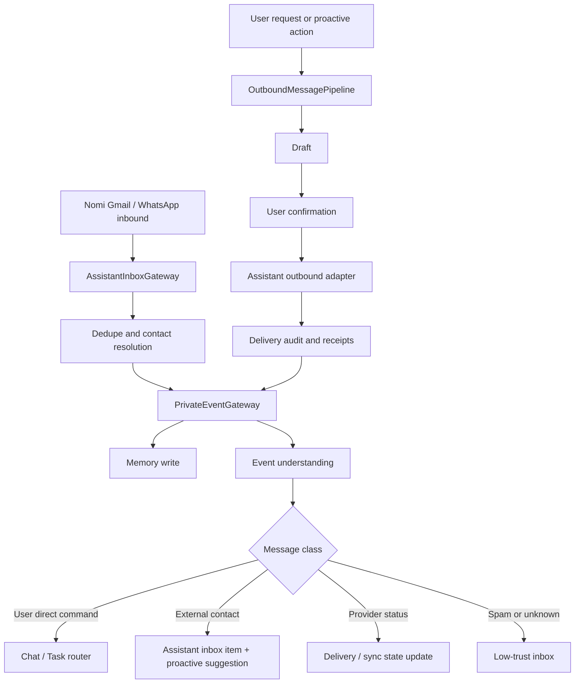
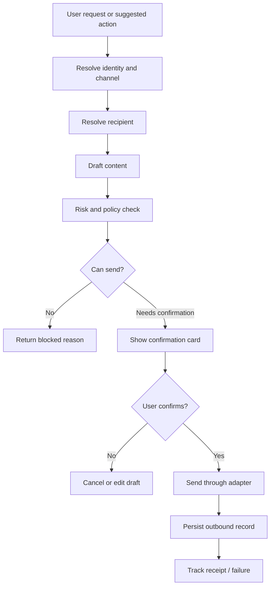

# Nomi Owned Communication Identities Design

**Status:** Review draft
**Date:** 2026-06-04
**Owner:** Nomi project

## Goal

Give Nomi its own communication identities, starting with a Nomi Gmail account and a Nomi WhatsApp Business account. These identities let external people contact Nomi directly, let the user contact Nomi through email or WhatsApp, and let Nomi send confirmed messages or emails as "Nomi, the user's assistant" instead of impersonating the user's personal account.

This feature extends the existing private event, memory, proactive suggestion, deterministic pipeline, Composio, and Android floating-ball architecture. It does not replace the user's own Gmail or WhatsApp collectors.

## Product Principle

Nomi is a personal assistant with its own identity. It can receive and send messages as Nomi, but it must not silently pretend to be the user.

The default outbound signature should make the assistant identity clear:

```text
我是 Nomi，张子长的个人助理。
```

Short casual messages may omit the full sentence only after the user configures a trusted style policy for the recipient or channel.

## Non-Goals

- Do not make Nomi impersonate the user's personal Gmail or WhatsApp account.
- Do not auto-send messages to third parties without a user confirmation gate in v1.
- Do not use WhatsApp Web automation as the primary Nomi-owned WhatsApp backend in v1.
- Do not support attachments, voice notes, images, group management, broadcast lists, payments, or account setting changes in v1.
- Do not expose Nomi-owned inbox contents to the model without the existing redaction and scoped-context rules.

## Terminology

| Term | Meaning |
| --- | --- |
| User account | The user's own Gmail, WhatsApp, browser, shopping, or other private accounts used for local collection and context. |
| Nomi-owned identity | A communication account owned by Nomi, such as `assistant_gmail` or `assistant_whatsapp`. |
| Assistant inbox | Messages or emails sent to Nomi-owned identities. |
| Assistant outbound | Emails or messages sent by Nomi-owned identities. |
| External contact | A person other than the user who contacts Nomi or receives a Nomi outbound message. |
| User direct command | A message from the user to Nomi through Android, web chat, Gmail, or WhatsApp. |

## Identity Model

Nomi can have multiple identities. V1 supports two:

```json
{
  "identity_id": "nomi_gmail_primary",
  "kind": "assistant_gmail",
  "display_name": "Nomi",
  "address": "nomi@example.com",
  "provider": "gmail_api_or_composio",
  "capabilities": ["receive", "draft", "send", "thread_reply"],
  "status": "connected"
}
```

```json
{
  "identity_id": "nomi_whatsapp_primary",
  "kind": "assistant_whatsapp",
  "display_name": "Nomi",
  "address": "+1234567890",
  "provider": "whatsapp_cloud_api",
  "capabilities": ["receive", "send_text", "delivery_receipt"],
  "status": "connected"
}
```

Identity credentials are stored locally as encrypted provider references. OAuth tokens, WhatsApp access tokens, webhook secrets, and API keys are never sent to the model and never shown in normal UI.

## Architecture



The design has two independent gateways:

- `AssistantInboxGateway`: normalizes inbound messages addressed to Nomi.
- `OutboundMessagePipeline`: prepares, confirms, sends, and audits messages sent by Nomi.

Both gateways write normalized events into the same private event system so memory, agenda, suggestions, tool routing, and audit traces remain consistent.

## Gmail Channel

### Recommended V1 Backend

Use a Gmail API-compatible adapter with a Composio adapter option:

- Primary adapter path: `assistant_gmail_api`.
- Optional shortcut: `assistant_composio_gmail` when Composio can provide the needed Gmail tools and connected account state.

Gmail sending uses Gmail API `messages.send` or `drafts.send`. Gmail requires MIME messages encoded as base64url strings in the message `raw` property. Threaded replies must preserve subject, `References`, and `In-Reply-To` headers when replying inside a thread.

Gmail receiving should use Gmail API `watch` with Google Cloud Pub/Sub when production infrastructure is configured. The watch call publishes mailbox changes to a configured Pub/Sub topic. Because watches expire, Nomi must renew the Gmail watch before expiration. V1 can include a fallback pull sync, but the production path should be push-first.

### Gmail Inbound Normalization

Inbound Gmail events normalize into:

```json
{
  "source_type": "assistant_gmail",
  "source_account_id": "nomi_gmail_primary",
  "event_type": "assistant_email_received",
  "conversation_id": "gmail_thread_id",
  "external_message_id": "gmail_message_id",
  "sender": {"email": "alice@example.com", "contact_id": "contact_alice"},
  "recipients": [{"email": "nomi@example.com", "identity_id": "nomi_gmail_primary"}],
  "subject": "报价资料",
  "body_text": "邮件正文文本",
  "occurred_at": "2026-06-04T12:00:00Z"
}
```

### Gmail Outbound

Outbound Gmail messages support:

- new email
- reply in thread
- draft only
- send confirmed draft

All third-party sends require a confirmation gate in v1.

## WhatsApp Channel

### Recommended V1 Backend

Use Meta WhatsApp Cloud API as the default Nomi-owned WhatsApp backend.

WhatsApp Cloud API depends on:

- Meta app
- WhatsApp Business Account
- business phone number or test number
- phone number id
- access token
- webhook verify token
- subscribed webhook fields for inbound messages and delivery statuses

The Cloud API sends inbound messages and outgoing message delivery statuses through webhooks. It is a better fit than WhatsApp Web automation for a Nomi-owned assistant identity because it has explicit webhook and send APIs.

### WhatsApp Inbound Normalization

Inbound WhatsApp messages normalize into:

```json
{
  "source_type": "assistant_whatsapp",
  "source_account_id": "nomi_whatsapp_primary",
  "event_type": "assistant_whatsapp_message_received",
  "conversation_id": "whatsapp:contact_phone_hash",
  "external_message_id": "wamid...",
  "sender": {"phone_hash": "sha256...", "contact_id": "contact_maya"},
  "recipient_identity_id": "nomi_whatsapp_primary",
  "body_text": "帮我问一下明天几点见",
  "occurred_at": "2026-06-04T12:00:00Z"
}
```

### WhatsApp Outbound

Outbound WhatsApp supports text messages in v1.

The pipeline must account for WhatsApp policy constraints:

- free-form replies generally depend on the active customer service window;
- messages outside the allowed window may require approved templates;
- provider errors must be returned to the user as a clear failed-send state;
- delivery status webhooks update `sent`, `delivered`, `read`, or `failed`.

## Inbound Classification

Assistant inbox events are classified into one of five classes:

| Class | Meaning | Default action |
| --- | --- | --- |
| `user_direct_command` | The user contacted Nomi through Gmail or WhatsApp. | Enter normal Nomi chat/task routing. |
| `external_contact_message` | A third party contacted Nomi. | Store, summarize, and notify user if relevant. |
| `provider_status` | Delivery receipt, watch renewal, webhook verification, or sync event. | Update state only. |
| `unknown_sender` | Sender cannot be mapped to user or known contact. | Store in low-trust inbox; no proactive action unless clearly important. |
| `noise_or_spam` | Spam, duplicate, marketing, or low-value content. | Store with low priority; do not interrupt user. |

The classification must use:

- sender identity mapping
- channel metadata
- current active tasks
- recent Nomi conversation context
- existing contact graph
- deterministic rules for provider receipts and webhook verification
- model judgment only after normalization and local guardrails

## Trigger And Routing Policy

Every request or suggestion that may cause Nomi to send an email or WhatsApp message must pass through `AssistantCommunicationTriggerRouter` before any outbound provider adapter is called. This router decides whether the work goes to a deterministic pipeline, a bounded long-tail agent, or no outbound path.

The router has one product rule above all others: a third-party outbound message may be drafted automatically, but it must not be sent without an explicit user confirmation action in v1.

| Trigger source | Example | Route | Allowed output |
| --- | --- | --- | --- |
| `user_explicit_send_request` | User says "用 Nomi 邮箱给 Alice 发一封邮件" or "让 Nomi WhatsApp 告诉 Maya 我晚点到". | Deterministic core pipeline. Use `assistant.email.send` or `assistant.whatsapp.send`, then `OutboundMessagePipeline`. | Confirmation draft card only. |
| `user_reply_or_confirmation_action` | User taps `send`, `edit`, or `cancel` on a draft card. | `OutboundMessagePipeline` continuation. | Send, edit, or cancel according to the action. |
| `proactive_suggestion_action` | Nomi suggests "要不要我帮你回复客户？" and the user taps "帮我回复". | Deterministic core pipeline if the requested action matches a known communication capability. | Confirmation draft card only. |
| `external_contact_message` | A third party emails or messages Nomi directly. | No outbound route by default. Store, summarize, and notify the user if relevant. | Assistant inbox item and proactive suggestion. |
| `user_direct_command` | The user contacts Nomi through Nomi-owned Gmail or WhatsApp. | Normal chat/task router first. If intent is known communication, route to core pipeline. If intent is long-tail, route to agent with outbound restrictions. | Chat answer, task plan, or confirmation draft card. |
| `agent_outbound_request` | A long-tail agent decides a message is needed after planning. | Agent must call only `assistant.outbound.create_draft`; it cannot call Gmail or WhatsApp adapters directly. | Confirmation draft card only. |
| `agenda_or_memory_signal` | Schedule, payment, trip, or relationship signal from private information suggests contacting someone. | `proactive_suggestion_pipeline`; no outbound message until user chooses an action. | Bubble suggestion or inbox card. |
| `provider_status` | Gmail watch renewal, WhatsApp delivery receipt, webhook verification. | State update only. | No user-facing send action unless an error needs attention. |
| `unknown_sender` or `noise_or_spam` | Unknown sender, marketing, duplicate, spam. | Low-trust storage only. | No proactive outbound action. |

### Pipeline Versus Agent

Known communication actions must prefer deterministic pipelines over agents. A request is "known" when the router can resolve all of these fields without open-ended planning:

```json
{
  "capability_id": "assistant.email.send | assistant.whatsapp.send | assistant.inbox.read",
  "assistant_identity_id": "nomi_gmail_primary",
  "recipient_hint": "alice@example.com or contact_id",
  "channel": "gmail | whatsapp",
  "requested_action": "draft | reply | send_after_confirmation",
  "source_evidence_ids": ["private_event_id"]
}
```

The agent path is allowed only when the user's goal requires open-ended decomposition before a communication draft can be prepared. Examples include negotiating a multi-step plan, gathering missing facts from memory, comparing several possible recipients, or handling a request that is not covered by a core pipeline. Even in those cases, the agent is not a sender. It can return a structured `assistant_outbound_intent`, and the deterministic `OutboundMessagePipeline` converts that intent into a draft card.

The agent must not have direct access to:

- Gmail `messages.send`
- Gmail `drafts.send`
- WhatsApp Cloud API send endpoints
- Composio send tools for Nomi-owned identities

The only outbound-capable tool exposed to the agent is:

```json
{
  "tool": "assistant.outbound.create_draft",
  "effect": "creates a local draft that still requires user confirmation",
  "forbidden_effects": ["send", "archive", "delete", "block", "purchase", "payment"]
}
```

### Trigger Router Output Contract

Every routing decision must be persisted in the audit trace:

```json
{
  "trigger_id": "uuid",
  "trigger_source": "user_explicit_send_request",
  "route_type": "core_pipeline",
  "pipeline_id": "reply_pipeline",
  "capability_id": "assistant.email.send",
  "agent_allowed": false,
  "confirmation_required": true,
  "reason": "Known Nomi-owned Gmail send request; create draft before send."
}
```

If the router chooses the agent path, the decision must include the reason the deterministic pipeline was insufficient. If the router chooses no outbound path, the decision must include the storage or notification behavior that still happens.

## Outbound Message Pipeline

The outbound pipeline is deterministic. Models may draft text, but they do not decide whether sending is allowed.



The confirmation card must show:

- sending identity
- channel
- recipient
- subject for email
- body preview
- source evidence used to prepare the message
- risk notes when present
- actions: `send`, `edit`, `cancel`

## Confirmation Policy

| Action | V1 policy |
| --- | --- |
| Read Nomi-owned inbox | Automatic |
| Store inbound message as memory | Automatic |
| Notify user about inbound external contact | Automatic if relevance threshold passes |
| Reply to the user through the same channel | May be automatic only for low-risk acknowledgements |
| Send to a third party | User confirmation required |
| Send money, purchase, book, or commit contract terms | Not supported by this feature; route to relevant pipeline with stricter confirmation |
| Delete, archive, block, or change account settings | Not supported in v1 |

## Memory and Scope

Nomi-owned communication events enter long-term memory but use separate scopes from user-owned account collectors.

Required scope fields:

```json
{
  "source_type": "assistant_gmail | assistant_whatsapp",
  "source_account_id": "nomi_identity_id",
  "conversation_id": "email_thread_or_whatsapp_thread",
  "assistant_identity_id": "nomi_gmail_primary",
  "counterparty_ids": ["contact_alice"],
  "visibility_scope": "assistant_channel_user_direct | assistant_channel_external_contact | provider_status",
  "sensitivity_level": "low | medium | high | critical"
}
```

Retrieval rules:

- User direct commands can join the current Nomi conversation context.
- External contact messages remain contact-scoped by default.
- Nomi outbound records are globally retrievable as audit facts but their body text remains scoped to recipient, task, and source thread.
- Provider status events do not enter semantic answer context unless debugging integrations.
- Relationship-sensitive external messages require high relevance before surfacing in unrelated contexts.

## Data Model

### `assistant_identities`

Stores Nomi-owned account metadata.

| Column | Type | Notes |
| --- | --- | --- |
| `id` | UUID | Primary key |
| `kind` | TEXT | `assistant_gmail`, `assistant_whatsapp` |
| `display_name` | TEXT | e.g. `Nomi` |
| `address` | TEXT | Email address or phone display |
| `provider` | TEXT | `gmail_api`, `composio`, `whatsapp_cloud_api` |
| `status` | TEXT | `connected`, `expired`, `failed`, `disabled` |
| `capabilities` | JSONB | receive/send/draft/receipt flags |
| `metadata` | JSONB | non-secret provider identifiers |
| `created_at` | TIMESTAMPTZ | |
| `updated_at` | TIMESTAMPTZ | |

### `assistant_identity_credentials`

Stores encrypted credential references.

| Column | Type | Notes |
| --- | --- | --- |
| `identity_id` | UUID | References `assistant_identities` |
| `credential_ref` | TEXT | Local encrypted secret reference |
| `provider_subject` | TEXT | Provider account id, not a secret |
| `expires_at` | TIMESTAMPTZ | Nullable |
| `last_rotated_at` | TIMESTAMPTZ | |

### `assistant_inbox_events`

Stores normalized inbound messages.

| Column | Type | Notes |
| --- | --- | --- |
| `id` | UUID | Primary key |
| `identity_id` | UUID | Nomi-owned identity |
| `channel` | TEXT | `gmail`, `whatsapp` |
| `conversation_id` | TEXT | Thread/contact thread |
| `external_message_id` | TEXT | Provider id |
| `sender_key` | TEXT | Hash or normalized email |
| `classification` | TEXT | inbound class |
| `normalized_payload` | JSONB | message data |
| `private_event_id` | UUID | Linked private event |
| `occurred_at` | TIMESTAMPTZ | Provider timestamp |
| `created_at` | TIMESTAMPTZ | |

### `assistant_message_drafts`

Stores outbound drafts before send.

| Column | Type | Notes |
| --- | --- | --- |
| `id` | UUID | Primary key |
| `identity_id` | UUID | Sending identity |
| `channel` | TEXT | `gmail`, `whatsapp` |
| `recipient` | JSONB | Email/phone/contact id |
| `subject` | TEXT | Gmail only |
| `body_text` | TEXT | Draft body |
| `risk` | JSONB | Risk and policy reasons |
| `status` | TEXT | `draft`, `confirmed`, `cancelled`, `sent` |
| `source_event_ids` | UUID[] | Evidence |
| `created_by_task_id` | TEXT | Optional |
| `created_at` | TIMESTAMPTZ | |

### `assistant_outbound_messages`

Stores send attempts and provider results.

| Column | Type | Notes |
| --- | --- | --- |
| `id` | UUID | Primary key |
| `draft_id` | UUID | References draft |
| `identity_id` | UUID | Sending identity |
| `provider_message_id` | TEXT | Gmail message id or WhatsApp wamid |
| `status` | TEXT | `sending`, `sent`, `delivered`, `read`, `failed` |
| `provider_response` | JSONB | Redacted response |
| `confirmed_by` | TEXT | `user`, `policy_auto_ack` |
| `confirmed_at` | TIMESTAMPTZ | |
| `sent_at` | TIMESTAMPTZ | |

### `assistant_delivery_receipts`

Stores delivery/read/failure webhooks.

| Column | Type | Notes |
| --- | --- | --- |
| `id` | UUID | Primary key |
| `outbound_message_id` | UUID | Nullable until matched |
| `identity_id` | UUID | |
| `channel` | TEXT | |
| `provider_message_id` | TEXT | |
| `receipt_type` | TEXT | `sent`, `delivered`, `read`, `failed` |
| `payload` | JSONB | Redacted webhook payload |
| `occurred_at` | TIMESTAMPTZ | |

### `assistant_contact_bindings`

Maps Nomi-channel senders/recipients to local contacts.

| Column | Type | Notes |
| --- | --- | --- |
| `id` | UUID | Primary key |
| `channel` | TEXT | `gmail`, `whatsapp` |
| `external_key_hash` | TEXT | Hash for phone/email when needed |
| `contact_id` | TEXT | Local contact/entity id |
| `trust_level` | TEXT | `user`, `known_contact`, `unknown`, `blocked` |
| `metadata` | JSONB | non-secret details |

### `assistant_channel_policies`

Stores per-channel and per-recipient behavior.

| Column | Type | Notes |
| --- | --- | --- |
| `id` | UUID | Primary key |
| `identity_id` | UUID | |
| `scope_type` | TEXT | `global`, `contact`, `channel` |
| `scope_key` | TEXT | contact id or channel |
| `auto_ack_allowed` | BOOLEAN | low-risk acknowledgement only |
| `third_party_send_requires_confirmation` | BOOLEAN | default true |
| `style_policy` | JSONB | signature and tone settings |

## API Surface

### Identity Management

- `GET /api/assistant-identities`
- `POST /api/assistant-identities/{kind}/connect`
- `PATCH /api/assistant-identities/{identity_id}`
- `GET /api/assistant-identities/{identity_id}/health`

### Inbound Webhooks

- `GET /api/assistant-inbox/whatsapp/webhook` for Meta verification.
- `POST /api/assistant-inbox/whatsapp/webhook` for inbound messages and delivery statuses.
- `POST /api/assistant-inbox/gmail/pubsub` for Gmail Pub/Sub push payloads.
- `POST /api/assistant-inbox/gmail/sync` for fallback sync or manual refresh.

### Inbox and Drafts

- `GET /api/assistant-inbox`
- `GET /api/assistant-inbox/{event_id}`
- `POST /api/assistant-outbound/drafts`
- `PATCH /api/assistant-outbound/drafts/{draft_id}`
- `POST /api/assistant-outbound/drafts/{draft_id}/send`
- `POST /api/assistant-outbound/drafts/{draft_id}/cancel`
- `GET /api/assistant-outbound/messages`

## UI Requirements

### Android Floating Panel

Add a settings subpage named `Nomi 身份`:

- Gmail identity row: address, connected state, connect/reconnect.
- WhatsApp identity row: phone number, webhook status, connect instructions.
- Inbox shortcut: unread external-contact messages.
- Outbound shortcut: drafts waiting for confirmation.

Add outbound confirmation cards in the chat view:

```text
Nomi 准备使用 Nomi Gmail 发送：
收件人：Alice
主题：明天会议资料
正文：
...
[发送] [修改] [取消]
```

### Web Workbench

Add a `身份` or `收件箱` view:

- connected identities
- inbound assistant inbox
- outbound drafts
- delivery status history
- policy settings

## Integration With Existing Pipelines

| Existing pipeline | New behavior |
| --- | --- |
| `event_ingestion_pipeline` | Accepts `assistant_gmail` and `assistant_whatsapp` source types. |
| `memory_write_pipeline` | Stores Nomi-owned inbox/outbound events with assistant identity scope. |
| `reply_pipeline` | Can choose Nomi-owned channel as sending identity. |
| `email_pipeline` | Can draft/send through Nomi Gmail after confirmation. |
| `proactive_suggestion_pipeline` | Can notify user when an external contact messages Nomi. |
| `governance_audit_pipeline` | Records inbound classification, draft creation, confirmation, send, and receipt. |
| `tool_registry` | Adds capabilities for `assistant.email.send`, `assistant.whatsapp.send`, and `assistant.inbox.read`. |

## Error Handling

| Failure | User-visible behavior | Internal behavior |
| --- | --- | --- |
| Gmail OAuth expired | Show reconnect action. | Mark identity `expired`; stop send attempts. |
| Gmail watch expired | Continue fallback sync if enabled; show degraded state. | Renew watch; record health event. |
| WhatsApp webhook verification fails | Show setup failure. | Reject verification; do not accept inbound payloads. |
| WhatsApp send outside allowed window | Show provider policy failure or template requirement. | Store failed outbound record. |
| Unknown sender | Place in low-trust inbox. | No proactive interruption unless high urgency. |
| Duplicate webhook | No duplicate user notification. | Dedupe by provider id and payload hash. |
| Provider sends malformed payload | Store redacted diagnostic event. | Return 400 for invalid external payload. |

## Security And Privacy

- All provider tokens stay local and encrypted.
- Webhook verification tokens and app secrets are environment variables, not repo values.
- Inbound webhook payloads are verified before processing.
- Phone numbers may be stored as hashes unless display is necessary.
- Outbound messages expose final body to the provider only after confirmation.
- Model context receives redacted snippets and scoped evidence, not raw credentials or unrelated inbox content.
- All sends are auditable with identity, recipient, body hash, confirmation actor, and provider result.

## Acceptance Criteria

1. Nomi Gmail identity can be connected and appears as connected in UI.
2. Nomi WhatsApp identity can be configured with webhook verification and appears healthy in UI.
3. Inbound Gmail from the user becomes a normal Nomi command event.
4. Inbound WhatsApp from the user becomes a normal Nomi command event.
5. Inbound third-party message creates assistant inbox item and relevant proactive suggestion.
6. A user request to send email creates a draft card, not an immediate send.
7. Confirming a draft sends through the Nomi identity and records delivery audit.
8. Cancelling a draft records cancellation and does not call the provider.
9. Unknown sender does not trigger high-priority proactive interruption.
10. Provider delivery receipt updates outbound status.
11. Memory retrieval keeps Nomi-owned external contact messages contact-scoped.
12. Regression tests prove user-owned Gmail/WhatsApp collectors still behave independently.
13. Explicit user send requests route to deterministic core pipelines, not the long-tail agent.
14. Long-tail agents can create local outbound drafts but cannot call provider send adapters directly.
15. External-contact inbound messages never auto-send replies; they create inbox items or proactive suggestions until the user chooses an action.

## Rollout Plan

### Phase 1

- Schema and identity registry.
- Assistant inbox normalization.
- Gmail send/draft adapter using Composio or Gmail API abstraction.
- WhatsApp webhook and send adapter abstraction with fake provider tests.
- Draft confirmation and audit.

### Phase 2

- Gmail Pub/Sub watch renewal.
- WhatsApp real Cloud API send/receipt integration.
- Android and workbench identity/inbox UI.
- End-to-end online regression with synthetic inbound payloads.

### Phase 3

- Templates for WhatsApp messages outside the service window.
- Optional low-risk auto-ack policy.
- Attachments and richer message types after text-only v1 is stable.

## References

- Gmail API sending guide: https://developers.google.com/gmail/api/guides/sending
- Gmail API push notifications guide: https://developers.google.com/workspace/gmail/api/guides/push
- Gmail users.watch reference: https://developers.google.com/workspace/gmail/api/reference/rest/v1/users/watch
- WhatsApp Cloud API overview: https://meta-preview.mintlify.io/docs/whatsapp/cloud-api/overview
- Existing Nomi Composio integration spec: `docs/superpowers/specs/2026-05-28-composio-connect-link-integration.md`
- Existing Nomi pipeline design: `docs/superpowers/specs/2026-05-28-core-pipelines-openclaw-design.md`
- Existing private event design: `docs/superpowers/specs/2026-05-28-private-event-processing-agenda-design.md`

## Spec Self-Review

- No placeholder requirements remain.
- V1 scope is text-only Gmail and WhatsApp, with no attachments or automatic third-party sends.
- Identity boundaries between user accounts and Nomi-owned accounts are explicit.
- Every outbound external message has a confirmation and audit path.
- The implementation plan must include schema, gateway, adapters, UI, pipeline integration, and regression coverage.
