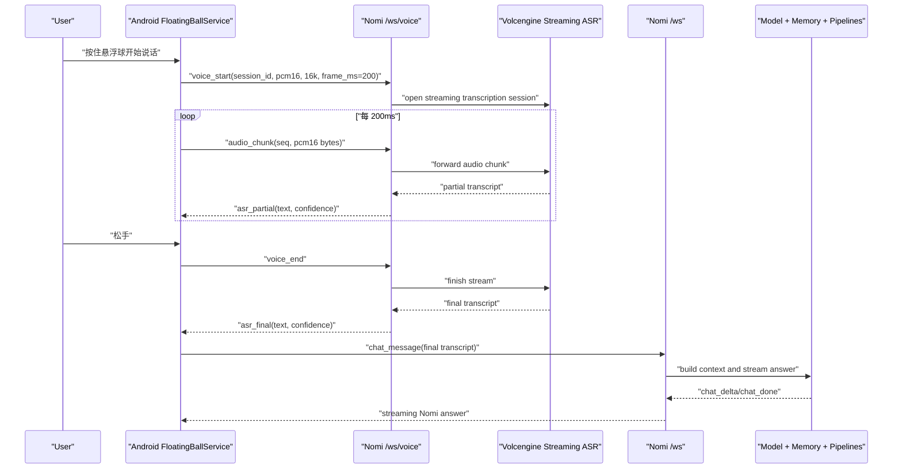

# Nomi Android Streaming Voice Input Design

## Goal

在 Android 端实现“按住悬浮球直接语音输入”：用户按住 Nomi 悬浮球开始说话，音频实时流向 Nomi 服务端，服务端通过火山引擎流式 ASR 返回实时识别文本；用户松手后，最终识别结果进入现有对话通道，并继续使用 Nomi 已有的流式回答、长期记忆、上下文和 pipeline/agent 调度能力。

第一版必须直接按火山引擎 `bigmodel_async` 真流式 ASR 设计，不做“录完后一次性上传”的中间方案。火山引擎的二进制协议通过服务端 provider 适配，Android 和 Nomi 内部协议不直接感知火山私有 frame。

## Current Integration Points

### Android

当前 Android 悬浮球入口在 `android_app/app/src/main/java/com/par/assistant/android/FloatingBallService.java`：

- `showBall()` 创建 `NomiAvatarView`。
- 当前 `DragController` 负责拖动和短按打开/关闭浮窗。
- 当前 `setOnLongClickListener` 会打开 `MainActivity`，后续要替换成语音输入入口。
- 聊天消息通过 `RealtimeClient.sendChatMessage(...)` 发送到服务端 `/ws`。
- 服务端返回 `chat_delta` 和 `chat_done` 后，浮窗内展示流式回答。

当前 `android_app/app/src/main/AndroidManifest.xml` 已有悬浮窗和前台服务权限，但还没有麦克风相关权限：

- 已有：`INTERNET`、`SYSTEM_ALERT_WINDOW`、`FOREGROUND_SERVICE`、`FOREGROUND_SERVICE_SPECIAL_USE`、`POST_NOTIFICATIONS`
- 需要新增：`RECORD_AUDIO`
- Android 14+ 需要新增：`FOREGROUND_SERVICE_MICROPHONE`
- `FloatingBallService` 的 `foregroundServiceType` 需要从 `specialUse` 扩展为 `specialUse|microphone`

### Server

当前服务端入口在 `runtime_api/app/main.py`：

- `/ws` 已支持 `chat_message`、`ping`。
- `stream_chat_to_websocket(...)` 已能持久化用户对话、构建上下文、调用模型并通过 `chat_delta` 流式返回。
- 当前没有 ASR WebSocket、ASR provider、音频 chunk 协议和识别 trace。

## Recommended Architecture

采用单独的语音 WebSocket 会话：

- 现有 `/ws` 继续处理 Nomi 主动消息、文本对话和模型流式回答。
- 新增 `/ws/voice` 专门处理音频流和 ASR 流式事件。
- Android 端长按悬浮球时建立 `/ws/voice`，开始推送音频 chunk。
- 服务端将音频 chunk 转发给火山引擎 ASR provider。
- 服务端把 partial transcript / final transcript 实时发回 Android。
- Android 收到 final transcript 后，调用现有 `RealtimeClient.sendChatMessage(...)`，让文本进入完整的 Nomi 对话链路。

这样做的好处是语音生命周期和聊天生命周期边界清楚：ASR 负责“听清用户说了什么”，现有聊天通道负责“理解并完成任务”。后续如果 ASR 服务支持更低延迟的双向流，只需要替换服务端 provider，不需要改浮窗交互和聊天 pipeline。



## User Experience

### Gesture Rules

悬浮球需要同时支持短按、拖动和长按语音，规则必须明确，避免误触：

1. `ACTION_DOWN` 后记录起点、时间和 pointer id。
2. 如果 450ms 内移动距离超过 `touchSlop * 1.5`，进入拖动模式。
3. 如果 450ms 内没有明显移动，进入语音模式。
4. 语音模式中继续按住即持续录音。
5. 松手发送最终识别结果。
6. 语音模式中向上或向左滑动超过 96dp，取消本次语音输入。
7. 短按仍打开/关闭浮窗。

原有 `setOnLongClickListener` 不再打开 `MainActivity`。完整工作台继续保留在浮窗 header 的图标入口中。

### Voice States

Android 端需要一个明确的语音状态机：

| State | 触发 | UI | 下一步 |
| --- | --- | --- | --- |
| `IDLE` | 默认 | 普通 Nomi 悬浮球 | 短按打开面板；长按准备录音 |
| `ARMING` | `ACTION_DOWN` 后未过阈值 | 不改变 UI，避免闪烁 | 进入 `DRAGGING` 或 `LISTENING` |
| `DRAGGING` | 移动超过阈值 | 悬浮球跟随手指 | 松手停在新位置 |
| `LISTENING` | 长按超过 450ms | Nomi 发光/轻微脉冲，显示“正在听...”气泡和计时 | 持续上行音频 |
| `CANCEL_ARMED` | 语音中滑动取消 | 气泡变成“松手取消” | 松手进入 `CANCELLED` |
| `RECOGNIZING` | 松手但 final 未返回 | 显示“正在识别...”和 partial 文本 | 收到 final |
| `CONFIRMING` | final 低置信度 | 打开小面板，展示“我听到的是...” | 用户点发送/重说/取消 |
| `SENDING` | final 高置信度或用户确认 | 展示用户消息气泡 | 进入现有聊天流 |
| `ERROR` | 权限、网络、ASR 异常 | 显示简短错误，可重试 | 回到 `IDLE` |

### Confidence Policy

识别结果是否自动发送由置信度和内容质量共同决定：

- `confidence >= 0.78` 且文本长度不少于 2 个中文字符或 2 个英文单词：自动发送。
- `0.55 <= confidence < 0.78`：展示确认卡片，用户确认后发送。
- `confidence < 0.55` 或文本为空：不发送，提示“没听清，再说一次”。
- ASR provider 没有提供 confidence 时，用服务端规则估算：
  - final 文本为空：`0.0`
  - 文本包含大量占位符、重复标点、明显乱码：`0.45`
  - final 文本稳定覆盖最近 partial 文本：`0.75`

## Android Implementation Design

### New Classes

#### `VoicePressController`

职责：统一处理悬浮球触摸手势，替代当前“DragController + OnLongClickListener”的组合。

接口建议：

```java
final class VoicePressController implements View.OnTouchListener {
    interface Callback {
        void onTap();
        void onDragMove(int x, int y);
        void onDragEnd(int x, int y);
        void onVoiceStart();
        void onVoiceCancelArmed(boolean armed);
        void onVoiceEnd();
        void onVoiceCancelled();
    }
}
```

行为要求：

- 只能有一个模式处于 active。
- 进入语音模式后不再触发拖动。
- 进入拖动模式后不再触发语音。
- `ACTION_CANCEL` 必须停止录音或取消 pending long press，避免系统打断后悬浮球卡在 listening 状态。

#### `StreamingVoiceRecorder`

职责：用 `AudioRecord` 采集麦克风 PCM，并按固定帧长回调音频数据。

第一版建议参数：

- sample rate：`16000`
- channel：mono
- encoding：PCM 16-bit little-endian
- frame duration：`200ms`，按火山 `bigmodel_async` 官方建议取双向流式最优分包。
- chunk bytes：`16000 * 0.2 * 2 = 6400 bytes`
- max duration：`60s`
- silence timeout：不在 Android 第一版做自动截断，避免错误打断用户；后续可加 VAD。

接口建议：

```java
final class StreamingVoiceRecorder {
    interface Callback {
        void onAudioChunk(byte[] pcm, int seq, long capturedAtMs);
        void onLevel(float rms);
        void onRecorderError(String userVisibleMessage, Throwable error);
    }

    boolean start(Callback callback);
    void stop();
    boolean isRecording();
}
```

#### `StreamingAsrClient`

职责：维护 `/ws/voice` WebSocket，把录音 chunk 传给服务端，并解析服务端 ASR 事件。

接口建议：

```java
final class StreamingAsrClient {
    interface Callback {
        void onReady(String sessionId);
        void onPartial(String text, double confidence, boolean stable);
        void onFinal(String text, double confidence, String transcriptId);
        void onError(String userVisibleMessage);
        void onClosed();
    }

    void start(String languageHint, Callback callback);
    boolean sendAudioChunk(byte[] pcm, int seq, long capturedAtMs);
    boolean finish();
    void cancel();
}
```

#### `VoiceInputCoordinator`

职责：串起手势、权限、录音、ASR 和现有聊天发送。

关键策略：

- 如果没有麦克风权限，第一次长按时打开 `MainActivity` 请求权限，并显示“授权麦克风后，再按住 Nomi 说话”。
- 如果 `/ws/voice` 未 ready，不开始 `AudioRecord`，避免录到本地但无法发送。
- 如果 ASR 中断，停止录音并展示错误。
- 收到 final 后根据 confidence policy 决定自动发送还是弹确认卡。
- 发送文本时复用 `FloatingBallService.sendMessage(text)`，保证进入现有聊天历史、上下文和模型流式输出。

### Floating Panel Changes

需要在当前浮窗中增加语音反馈区域：

- 未打开面板时：悬浮球旁边展示小气泡，显示 partial 文本前 1-2 行。
- 已打开面板时：聊天区域底部展示一个临时“语音识别中”消息，partial 文本实时更新。
- final 自动发送后，该临时消息替换为正式用户消息。
- 低置信度时，该临时消息变成确认卡片：
  - “我听到的是：xxx”
  - `发送`
  - `重说`
  - `取消`

为了避免用户前面反馈过的“输入框闪烁/浮窗重复”，语音 UI 更新必须只更新已有 view，不反复 remove/add 整个 panel。

## Volcengine Streaming ASR Provider

用户已确定第一版通过火山引擎接入流式 ASR。根据火山引擎官方文档《大模型流式语音识别 API》，第一版 provider 使用双向流式优化版本：

```text
wss://openspeech.bytedance.com/api/v3/sauc/bigmodel_async
```

选择 `bigmodel_async` 的原因：

- 官方说明该模式不是“每输入一包就固定返回一包”，而是结果变化时才返回新数据包，首字、尾字时延和 RTF 更优。
- 它比旧的双向流式接口 `bigmodel` 更适合作为悬浮球实时语音输入。
- 它支持流式实时上屏，和 Nomi 悬浮球 partial transcript 的交互目标一致。

### Volcengine Required Credentials

服务端需要通过环境变量配置火山引擎鉴权，不把密钥写进 Android 或前端。

新版控制台优先使用：

```text
VOLC_ASR_API_KEY=replace-with-volcengine-api-key
VOLC_ASR_RESOURCE_ID=volc.bigasr.sauc.duration
VOLC_ASR_ENDPOINT=wss://openspeech.bytedance.com/api/v3/sauc/bigmodel_async
```

旧版控制台兼容配置：

```text
VOLC_ASR_APP_KEY=replace-with-volcengine-app-id
VOLC_ASR_ACCESS_KEY=replace-with-volcengine-access-token
VOLC_ASR_RESOURCE_ID=volc.bigasr.sauc.duration
VOLC_ASR_ENDPOINT=wss://openspeech.bytedance.com/api/v3/sauc/bigmodel_async
```

资源 ID 按购买方式选择：

- ASR 1.0 小时版：`volc.bigasr.sauc.duration`
- ASR 1.0 并发版：`volc.bigasr.sauc.concurrent`
- ASR 2.0 小时版：`volc.seedasr.sauc.duration`
- ASR 2.0 并发版：`volc.seedasr.sauc.concurrent`

如果用户没有特别说明，第一版默认使用 `volc.bigasr.sauc.duration`，后续可通过环境变量切到 ASR 2.0。

### Volcengine WebSocket Headers

Nomi 服务端连接火山引擎时需要设置请求头。

新版控制台：

```text
X-Api-Key: ${VOLC_ASR_API_KEY}
X-Api-Resource-Id: ${VOLC_ASR_RESOURCE_ID}
X-Api-Request-Id: <uuid>
X-Api-Sequence: -1
```

旧版控制台：

```text
X-Api-App-Key: ${VOLC_ASR_APP_KEY}
X-Api-Access-Key: ${VOLC_ASR_ACCESS_KEY}
X-Api-Resource-Id: ${VOLC_ASR_RESOURCE_ID}
X-Api-Request-Id: <uuid>
X-Api-Sequence: -1
```

握手返回 header 中的 `X-Tt-Logid` 必须记录到 `voice_transcripts.payload.provider_log_id`，用于排查火山侧问题。

### Volcengine Binary Protocol

火山 ASR 不是普通 JSON WebSocket。Nomi 的 `VolcengineStreamingAsrSession` 必须实现火山的二进制 frame。

客户端请求 frame：

```text
Header(4 bytes) + Payload size(4 bytes, big-endian) + Payload
```

服务端响应 frame：

```text
Header(4 bytes) + Sequence(4 bytes, big-endian) + Payload size(4 bytes, big-endian) + Payload
```

错误响应 frame：

```text
Header(4 bytes) + Error code(4 bytes, big-endian) + Error message size(4 bytes, big-endian) + Error message
```

整数统一使用 big-endian。

第一版 Nomi provider 使用：

| Frame | Message type | Serialization | Compression | Payload |
| --- | --- | --- | --- | --- |
| Full client request | `0b0001` | JSON | Gzip | 请求 metadata JSON |
| Audio only request | `0b0010` | none/raw bytes | Gzip | PCM 音频 bytes |
| Full server response | `0b1001` | JSON | Gzip | ASR result JSON |
| Error response | `0b1111` | JSON or text | none/Gzip by header | error payload |

最后一包音频必须在 audio-only request 的 message type specific flags 中标记为 last package。Nomi 内部 `/ws/voice` 的 `voice_end` 到达后，provider 发送最后一包空音频或最后缓存音频并设置 last flag，具体以实现时的 buffer 状态为准。

### Volcengine Full Client Request Payload

Nomi 连接火山后先发送 full client request。第一版 payload：

```json
{
  "user": {
    "uid": "nomi-local-user",
    "platform": "Android",
    "app_version": "nomi-android-debug"
  },
  "audio": {
    "format": "pcm",
    "codec": "raw",
    "rate": 16000,
    "bits": 16,
    "channel": 1
  },
  "request": {
    "model_name": "bigmodel",
    "enable_itn": true,
    "enable_punc": true,
    "enable_ddc": true,
    "enable_nonstream": true,
    "show_utterances": true
  }
}
```

设计取舍：

- `format=pcm`、`codec=raw` 与 Android `AudioRecord` 输出一致，避免 Android 端额外编码复杂度。
- `enable_itn=true` 方便把“明天下午四点”转成更可读的文本，但最终具体日期仍由 Nomi 的日程解析层结合消息创建时间判断。
- `enable_punc=true` 提高长句可读性。
- `enable_ddc=true` 开启语义顺滑，减少口语停顿词。
- `enable_nonstream=true` 用火山的二遍识别提升 final 稳定性。
- `show_utterances=true` 方便根据 `definite` 判断 stable partial/final 片段。

`language` 字段不在 `bigmodel_async` 第一版强制传入。火山文档说明 `language` 主要适用于 `bigmodel_nostream`，因此 Nomi 内部的 `language_hint` 只保留在 trace 中，不强行塞给 provider。

### Chunk Size Correction

原通用方案中的 Android 帧长是 40ms。接入火山后第一版必须改为：

```text
sample_rate=16000
bits=16
channels=1
frame_ms=200
raw_chunk_bytes=16000 * 0.2 * 2 = 6400 bytes
```

原因是火山官方建议单包音频大小 100-200ms，双向流式模式下 200ms 性能最优。Nomi 内部 `/ws/voice` 每条 `audio_chunk` 的 base64 文本约 8.6KB，因此服务端单 chunk 上限需要从 8192 bytes 调整为：

```text
VOICE_MAX_DECODED_AUDIO_CHUNK_BYTES=16384
VOICE_MAX_AUDIO_CHUNK_BASE64_CHARS=24576
```

### Volcengine Result Mapping

火山 full server response payload 中主要使用：

- `result.text`：当前整段识别文本。
- `result.utterances[].text`：分句文本。
- `result.utterances[].definite`：确定分句，可映射为 Nomi 的 `stable=true`。
- `audio_info.duration`：音频时长。

映射到 Nomi 内部事件：

```json
{
  "type": "asr_partial",
  "text": "帮我看一下明天下午",
  "confidence": 0.75,
  "stable": false
}
```

如果火山 payload 包含 `definite=true` 的 utterance，Nomi 标记：

```json
{
  "type": "asr_partial",
  "text": "帮我看一下明天下午去人民广场的路线。",
  "confidence": 0.82,
  "stable": true
}
```

当 Nomi 收到 provider 最后一包响应时，发送：

```json
{
  "type": "asr_final",
  "text": "帮我看一下明天下午去人民广场的路线。",
  "confidence": 0.86,
  "provider": "volcengine_bigmodel_async"
}
```

火山文档未把 confidence 作为稳定必有字段，因此第一版 confidence 由 Nomi 估算：

- 文本为空：`0.0`
- 文本与上一条 partial 相比大幅回退：`0.55`
- 存在 `definite=true` utterance：`0.82`
- final 文本非空且 provider 正常结束：`0.86`

### Provider Failure Mapping

火山错误码映射到 Nomi `voice_error`：

| 火山错误码 | 含义 | Nomi code | 用户提示 |
| --- | --- | --- | --- |
| `45000001` | 请求参数无效 | `volc_invalid_request` | “语音识别参数配置不正确。” |
| `45000002` | 空音频 | `empty_audio` | “没听清，再说一次。” |
| `45000081` | 等包超时 | `asr_stream_timeout` | “语音识别等待超时，请重试。” |
| `45000151` | 音频格式不正确 | `invalid_audio_format` | “语音音频格式不正确。” |
| `55000031` | 服务器繁忙 | `asr_provider_busy` | “语音识别服务繁忙，请稍后再试。” |
| `550xxxxx` | 服务内部错误 | `asr_provider_error` | “语音识别服务暂时不可用。” |

## Server Implementation Design

### New WebSocket Endpoint

新增：

```text
GET /ws/voice?password=<password>
```

认证沿用现有 `is_authorized(password)`。

### Client -> Server Events

#### `voice_start`

```json
{
  "type": "voice_start",
  "session_id": "android-generated-uuid",
  "conversation_id": "optional-current-conversation-id",
  "client_type": "android_floating_ball_voice",
  "language_hint": "zh-CN",
  "audio": {
    "codec": "pcm_s16le",
    "sample_rate": 16000,
    "channels": 1,
    "frame_ms": 200
  }
}
```

服务端返回：

```json
{
  "type": "voice_ready",
  "session_id": "same-id",
  "provider": "configured-provider-id",
  "max_duration_ms": 60000
}
```

#### `audio_chunk`

```json
{
  "type": "audio_chunk",
  "session_id": "same-id",
  "seq": 12,
  "captured_at_ms": 1780001112223,
  "audio_base64": "base64-encoded-pcm"
}
```

第一版用 base64 JSON chunk，理由是当前 Android `RealtimeClient` 和服务端 WebSocket 都已经以 JSON 为主，最容易测试和排查。后续如延迟或带宽不满足，再升级为二进制 WebSocket frame，并保留 JSON control frame。

#### `voice_end`

```json
{
  "type": "voice_end",
  "session_id": "same-id",
  "last_seq": 88
}
```

#### `voice_cancel`

```json
{
  "type": "voice_cancel",
  "session_id": "same-id",
  "reason": "user_swiped_cancel"
}
```

### Server -> Client Events

#### `asr_partial`

```json
{
  "type": "asr_partial",
  "session_id": "same-id",
  "text": "帮我查一下明天",
  "confidence": 0.72,
  "stable": false,
  "seq": 35
}
```

#### `asr_final`

```json
{
  "type": "asr_final",
  "session_id": "same-id",
  "transcript_id": "voice_tr_20260604_000001",
  "text": "帮我查一下明天下午去人民广场的路线",
  "confidence": 0.86,
  "duration_ms": 4200,
  "provider": "configured-provider-id"
}
```

#### `voice_error`

```json
{
  "type": "voice_error",
  "session_id": "same-id",
  "code": "asr_provider_unavailable",
  "message": "语音识别服务暂时不可用，请稍后再试。"
}
```

### ASR Provider Abstraction

新增服务端模块：

```text
runtime_api/app/voice/
  __init__.py
  asr_provider.py
  streaming_asr_session.py
  voice_ws.py
```

核心接口：

```python
@dataclass
class AsrPartial:
    text: str
    confidence: float | None
    stable: bool
    provider_seq: int | None = None

@dataclass
class AsrFinal:
    text: str
    confidence: float | None
    duration_ms: int
    provider_trace: dict[str, Any]

class StreamingAsrSession(Protocol):
    async def start(self, metadata: dict[str, Any]) -> None:
        raise NotImplementedError

    async def send_audio(self, pcm: bytes, seq: int) -> list[AsrPartial]:
        raise NotImplementedError

    async def finish(self) -> AsrFinal:
        raise NotImplementedError

    async def cancel(self) -> None:
        raise NotImplementedError
```

火山引擎真实接入只实现 provider：

```python
class ConfiguredStreamingAsrProvider:
    async def open_session(self, metadata: dict[str, Any]) -> StreamingAsrSession:
        raise NotImplementedError
```

环境变量：

```text
ASR_PROVIDER=volcengine
ASR_BASE_URL=wss://openspeech.bytedance.com/api/v3/sauc/bigmodel_async
ASR_API_KEY=replace-with-volcengine-api-key
ASR_MODEL=bigmodel
ASR_LANGUAGE_HINT=zh-CN
ASR_CONNECT_TIMEOUT_SECONDS=5
ASR_STREAM_TIMEOUT_SECONDS=90
ASR_MAX_AUDIO_SECONDS=60
```

火山引擎 provider 负责把 Nomi 内部 JSON 音频 chunk 转成火山二进制 frame。Nomi 内部协议保持不变。

### Persistence and Trace

音频隐私策略：

- 默认不持久化原始音频。
- 服务端只保存 transcript、duration、provider、confidence、错误码和 trace 摘要。
- 如果排查需要保存音频，必须通过 `ASR_DEBUG_STORE_AUDIO=true` 显式打开，且默认保留时间不超过 24 小时。

新增表建议：

```sql
CREATE TABLE IF NOT EXISTS voice_transcripts (
    id TEXT PRIMARY KEY,
    conversation_id TEXT,
    client_type TEXT NOT NULL,
    transcript TEXT NOT NULL,
    confidence REAL,
    duration_ms INTEGER,
    provider TEXT,
    status TEXT NOT NULL,
    error_code TEXT,
    created_at TIMESTAMPTZ NOT NULL DEFAULT now(),
    payload JSONB NOT NULL DEFAULT '{}'::jsonb
);
```

写入时机：

- `asr_final` 产生后写入 `voice_transcripts`。
- Android 自动或确认发送后，最终 transcript 还会通过现有 `persist_assistant_turn(role="user")` 进入对话历史和长期记忆。
- 如果 ASR final 产生但用户取消发送，`voice_transcripts.status="cancelled_by_user"`，不写入长期记忆。

## Error Handling

### Android User-Facing Errors

| 场景 | 用户提示 | 行为 |
| --- | --- | --- |
| 无麦克风权限 | “需要麦克风权限才能语音输入。” | 打开权限请求 |
| 悬浮窗服务未在前台 | “Nomi 正在重新启动语音服务。” | 尝试重启 service |
| `/ws/voice` 连接失败 | “语音识别连接失败，请稍后再试。” | 回到 `IDLE` |
| ASR provider 不可用 | “语音识别服务暂时不可用。” | 回到 `IDLE` |
| 录音太短 | “没听清，再说一次。” | 不发送 |
| 识别低置信度 | “我听到的是：...” | 用户确认 |
| 超过 60 秒 | “单次语音最长 60 秒，已自动发送识别结果。” | finish 并处理 final |

### Server Protections

- 单个 voice session 最长 70 秒，超过后强制 finish 或 cancel。
- 单条 `audio_chunk` base64 解码后不得超过 16384 bytes，适配火山推荐的 200ms PCM16 mono 分包。
- `seq` 必须单调递增；乱序 chunk 记录 trace，但第一版不做重排。
- 同一 WebSocket 同时只能有一个 active voice session。
- provider 连续 3 次错误后返回 `voice_error` 并关闭 session。

## Testing Plan

### Android Unit Tests

新增测试文件：

- `android_app/app/src/test/java/com/par/assistant/android/VoicePressControllerTest.java`
- `android_app/app/src/test/java/com/par/assistant/android/StreamingAsrClientTest.java`
- `android_app/app/src/test/java/com/par/assistant/android/VoiceInputCoordinatorTest.java`

重点用例：

1. 短按触发 `onTap`，不触发语音。
2. 450ms 内移动超过阈值触发拖动，之后不进入语音。
3. 长按超过阈值触发 `onVoiceStart`。
4. 语音中滑动超过取消阈值触发 `onVoiceCancelArmed(true)`。
5. 语音中松手触发 `onVoiceEnd`。
6. `/ws/voice` partial 事件正确解析。
7. `/ws/voice` final 事件低置信度进入确认，不自动发送。
8. final 高置信度调用现有 `sendMessage`。
9. ASR error 会清理录音状态，不留下 listening UI。

### Server Unit Tests

新增测试文件：

- `runtime_api/tests/test_voice_ws.py`
- `runtime_api/tests/test_streaming_asr_provider.py`

使用 fake provider，不依赖真实 ASR：

1. 未授权 `/ws/voice` 被拒绝。
2. `voice_start` 返回 `voice_ready`。
3. 多个 `audio_chunk` 返回合理 partial。
4. `voice_end` 返回 final，并写入 `voice_transcripts`。
5. 空 final 返回 `voice_error` 或低置信度 final。
6. chunk 过大返回 `voice_error(code="audio_chunk_too_large")`。
7. provider 超时返回 `voice_error(code="asr_timeout")`。
8. `voice_cancel` 调用 provider cancel，不写入长期记忆。

### Device Regression

必须在 Android 模拟器和 Redmi 真机各跑一次：

1. 安装后首次长按悬浮球，系统弹出麦克风权限请求。
2. 授权后再次长按，Nomi 悬浮球进入 listening 状态。
3. 按住说“帮我看一下明天下午去人民广场的路线”，Android 每约 200ms 上行一次音频 chunk，partial 文本实时变化。
4. 松手后 final 文本进入对话输入链路。
5. Nomi 对 final 文本返回流式回答。
6. 语音中滑动取消后，不发送任何消息。
7. 断网时显示错误并恢复普通悬浮球。
8. 打开浮窗后语音输入，不出现重复面板、不闪烁、不遮挡输入框。

## Rollout Order

1. 先实现 server fake ASR provider 和 `/ws/voice` 协议测试。
2. 再实现 Android `StreamingAsrClient` 的协议解析和发送测试。
3. 实现 `VoicePressController`，替换当前悬浮球长按逻辑。
4. 实现 `StreamingVoiceRecorder` 和权限流程。
5. 实现 `VoiceInputCoordinator` 串联录音、ASR、确认和现有聊天发送。
6. 用 fake provider 做端到端测试。
7. 配置火山引擎 `VOLC_ASR_API_KEY` 或旧版 `VOLC_ASR_APP_KEY`/`VOLC_ASR_ACCESS_KEY` 后，运行真实 provider smoke test。
8. 在模拟器和 Redmi 真机做完整回归。

## Acceptance Criteria

功能验收必须满足：

- 按住悬浮球 450ms 后开始语音输入。
- 说话时 Android 能看到 ASR partial 文本实时更新。
- 松手后能拿到 final transcript。
- final 高置信度时自动作为用户消息发送。
- final 低置信度时让用户确认，不擅自发送。
- Nomi 的回答仍然使用现有流式输出。
- 语音消息进入与文本消息同一套对话历史、上下文、长期记忆和 pipeline/agent 判断链路。
- 原始音频默认不落盘。
- 网络、权限、ASR 失败都有用户可理解的反馈。
- 不引入悬浮窗闪烁、重复面板、键盘遮挡等 UI 回归。

## Open External Dependency

用户后续需要提供火山引擎控制台的以下信息：

- 新版控制台：`X-Api-Key`。
- 或旧版控制台：`X-Api-App-Key` 与 `X-Api-Access-Key`。
- 资源版本和计费方式：ASR 1.0/2.0、小时版/并发版。
- 服务是否已经在火山控制台开通并可用。

当前方案已经按火山 `bigmodel_async` 真流式协议设计，不需要降级到批量上传。

## References

- [火山引擎：大模型流式语音识别 API](https://www.volcengine.com/docs/6561/1354869?lang=zh)
