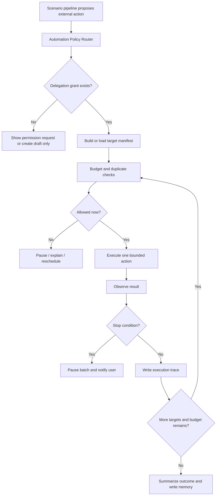

# Nomi Delegated Automation Permission Foundation Design

**Status:** Review draft  
**Date:** 2026-06-05  
**Owner:** Nomi project  

## Goal

Nomi needs a foundation-level permission system that lets the user explicitly delegate bounded automatic execution to Nomi. This is required by the Job Agent first, and will later be reused by Dating, Sales, and other goal agents.

The key product decision is:

> Nomi can perform high-impact browser or platform actions automatically after the user grants scoped, quota-limited, auditable authorization.

This foundation should support actions such as:

- adding contacts/connections;
- sending messages;
- clicking `Apply`, `Submit`, or equivalent application controls;
- batch job applications;
- batch outreach;
- batch follow-ups.

The system must not be a single "auto mode" switch. It is a platform/action/scenario permission center with limits, traces, and stop conditions.

## Scope Boundary

V1 should not generalize this automation foundation to the user's own Gmail or WhatsApp accounts.

Current scope:

- `job_agent` browser and ATS actions;
- LinkedIn cloud browser workspace actions after explicit user authorization;
- other career/job-board/browser actions through Playwright or approved adapters;
- future support for Nomi-owned Gmail/WhatsApp/phone identities as assistant-owned channels.

Out of current scope:

- automatic sending through the user's own Gmail account;
- automatic sending through the user's own WhatsApp account;
- treating a user's personal inbox as a bulk outbound automation surface.

The user may configure Nomi's own Gmail or WhatsApp identity. Those Nomi-owned identities are assistant-owned channels and can later use this foundation with their own action policies, quotas, and audit logs.

## Product Principle

User authorization is necessary but not enough. Nomi must also know:

- which scenario is allowed;
- which platform is allowed;
- which action is allowed;
- which targets are allowed;
- how many actions are allowed;
- when to stop;
- how to report what happened.

Nomi should not silently escalate from "analyze this page" to "send messages to people" or "submit applications." Every escalation requires an explicit permission level.

## Terminology

| Term | Meaning |
| --- | --- |
| Scenario | A goal domain such as `job_agent`, `dating_agent`, or `sales_agent`. |
| Platform | The external surface, such as `linkedin`, `greenhouse`, `lever`, `ashby`, `workable`, or `smartrecruiters`. |
| Surface | The execution mechanism, such as `cloud_playwright_browser`, `official_api`, `composio_tool`, or `nomi_owned_identity`. |
| Action | A specific operation such as `add_connection`, `send_message`, `click_apply`, `submit_application`, or `batch_apply`. |
| Delegation Grant | The user's saved permission for a scenario/platform/action. |
| Target Manifest | A concrete list of people, jobs, applications, or messages that Nomi is allowed to act on. |
| Automation Budget | Per-day and per-batch limits for a delegated action. |
| Stop Condition | A condition that immediately pauses automation. |
| Execution Trace | Append-only record of planned, attempted, completed, skipped, and failed actions. |

## Automation Levels

```text
L0 Observe
Read current page, JD, email, document, or visible context. No external write.

L1 Draft
Generate resumes, messages, application answers, or plans. No external write.

L2 Prepare
Fill forms, fill message boxes, upload selected files, or stage actions. Stop before send/submit.

L3 Single-Action Execute
Execute one specific user-approved action, such as send one message or submit one application.

L4 Bounded Batch Execute
Execute a user-approved target manifest up to a per-batch and per-day quota.

L5 Standing Delegation
Repeated automatic execution for a scenario/platform/action under saved quotas and stop conditions.
```

For the current product, L4 and L5 are allowed only when a `DelegationGrant`, `AutomationBudget`, and `TargetManifest` exist.

## Delegation Grant Model

```json
{
  "grant_id": "grant_job_linkedin_batch_outreach",
  "user_id": "local_user",
  "scenario": "job_agent",
  "platform": "linkedin",
  "surface": "cloud_playwright_browser",
  "action": "send_message",
  "automation_level": "L4",
  "status": "active",
  "daily_limit": 10,
  "batch_limit": 5,
  "cooldown_minutes": 20,
  "valid_until": "2026-06-30T23:59:59+08:00",
  "requires_target_manifest": true,
  "requires_grounded_content": true,
  "requires_audit_log": true,
  "stop_on_challenge": true,
  "stop_on_user_pause": true,
  "created_at": "2026-06-05T12:00:00+08:00"
}
```

Rules:

- A grant is scoped to one scenario, platform, surface, and action.
- A grant cannot authorize every action on every platform.
- A grant must define daily and batch limits for L4/L5.
- A grant can expire.
- A grant can be paused or revoked by the user at any time.
- A grant must be visible in the workbench.

## Target Manifest Model

Nomi cannot run batch actions against an implicit, hidden, or unbounded target set. It must create a target manifest first.

```json
{
  "manifest_id": "manifest_linkedin_outreach_20260605",
  "scenario": "job_agent",
  "platform": "linkedin",
  "action": "send_message",
  "targets": [
    {
      "target_id": "target_1",
      "target_type": "person",
      "name": "Maya",
      "role": "Recruiter",
      "company": "Example AI",
      "profile_url": "https://www.linkedin.com/in/example",
      "reason": "Appears to recruit for the target AI Product Manager role.",
      "related_job_id": "job_123",
      "draft_id": "draft_456",
      "risk": "medium",
      "status": "pending"
    }
  ],
  "max_actions": 5,
  "created_from_evidence_ids": ["job_123", "linkedin_page_evt_99"]
}
```

Rules:

- Every target must have a reason.
- Every target must be tied to a scenario objective.
- Batch execution cannot exceed `max_actions`, `batch_limit`, or `daily_limit`.
- Targets can be skipped, failed, completed, or paused.
- The manifest is shown to the user before L4 batch execution unless the user has an active L5 standing delegation for the exact same policy.

## Automation Budget

Budget is enforced before every action.

```json
{
  "budget_id": "budget_job_linkedin_send_message_20260605",
  "grant_id": "grant_job_linkedin_batch_outreach",
  "day": "2026-06-05",
  "daily_limit": 10,
  "used_today": 3,
  "remaining_today": 7,
  "batch_limit": 5,
  "cooldown_minutes": 20,
  "last_action_at": "2026-06-05T14:10:00+08:00"
}
```

Budget checks:

- daily quota;
- per-batch quota;
- cooldown interval;
- duplicate target;
- duplicate message;
- already-contacted window;
- user pause;
- active platform challenge;
- missing evidence;
- missing content approval where required.

## Supported Initial Actions

### Job Agent Actions

| Action | Platform examples | Surface | Minimum level | Required controls |
| --- | --- | --- | --- | --- |
| `add_connection` | LinkedIn | Cloud Playwright | L4 | target manifest, quota, stop on challenge |
| `send_message` | LinkedIn | Cloud Playwright | L4 | target manifest, grounded draft, quota, audit |
| `click_apply` | LinkedIn / ATS pages | Cloud Playwright | L3 | exact job, exact page, stop if changed |
| `submit_application` | ATS pages | API or Playwright | L3 | final material review, trace |
| `batch_apply` | ATS pages | API or Playwright | L4 | target manifest, per-batch review, quota |
| `follow_up` | LinkedIn / Nomi-owned email | Playwright or assistant identity | L4 | relationship dedupe, draft grounding |

### Future Scenario Actions

Dating and Sales should reuse the same foundation, but with scenario-specific policies.

Examples:

- Dating: add/contact people from dating/social platforms, send opening messages, follow up, schedule date suggestions.
- Sales: add leads, send intro messages, follow up, update CRM, schedule calls.

Each future scenario must define its own target manifest schema, risk rules, dedupe rules, and budget defaults.

## Nomi-Owned Identity Relationship

Nomi-owned Gmail, WhatsApp, and phone identities are not the same as the user's own personal accounts.

When Nomi sends from a Nomi-owned identity:

- the sender is Nomi or the user's assistant;
- the channel is configured specifically for assistant operations;
- the action can be governed by this automation foundation;
- the outbound content still requires scenario policy, budget, target manifest, and audit.

When Nomi sends from the user's own account:

- V1 should keep the existing confirmation-first behavior;
- this automation foundation should not automatically generalize to those personal accounts.

This keeps the product architecture clean:

- personal accounts are primarily private context and user-controlled communication;
- Nomi-owned identities are delegated assistant channels;
- Playwright/browser surfaces are delegated execution surfaces.

## Execution Flow



## Stop Conditions

Automation must pause immediately when:

- user pauses or revokes the grant;
- daily or batch quota is reached;
- page shows captcha, 2FA, account security check, suspicious activity prompt, or login challenge;
- Playwright cannot verify the target identity;
- page URL or job/person target changes unexpectedly;
- message draft is missing or not grounded;
- resume/application material is missing or unapproved;
- duplicate target or duplicate message is detected;
- platform returns an error or blocks interaction;
- model output contains unsupported claims;
- action outcome cannot be observed.

Nomi must not attempt to bypass captcha, 2FA, account security checks, or platform challenges.

## Audit And User Controls

Every delegated action must be append-only logged:

```json
{
  "trace_id": "auto_trace_123",
  "grant_id": "grant_job_linkedin_batch_outreach",
  "manifest_id": "manifest_linkedin_outreach_20260605",
  "target_id": "target_1",
  "action": "send_message",
  "status": "completed | skipped | failed | paused",
  "started_at": "2026-06-05T14:10:00+08:00",
  "finished_at": "2026-06-05T14:10:08+08:00",
  "result_summary": "Message sent to Maya.",
  "evidence_ids": ["screenshot_1", "dom_evt_1", "draft_456"],
  "budget_after": {
    "used_today": 4,
    "remaining_today": 6
  }
}
```

The workbench must expose:

- current active grants;
- today's budget usage;
- recent action traces;
- pause all automation;
- pause by scenario;
- pause by platform;
- revoke grant;
- edit limits;
- replay/read logs.

## UI Requirements

The permission center should show plain-language controls:

```text
Job Agent / LinkedIn

自动加人
状态：开启
今日上限：5
每批上限：3
遇到验证/风控：立即暂停

批量私信
状态：开启
今日上限：10
每批上限：5
要求：每条消息必须绑定岗位 JD 和简历证据

自动 Apply / Submit
状态：开启
今日上限：8
每批上限：4
要求：简历版本已确认，申请材料已确认
```

Each batch should show:

- targets;
- reason for each target;
- draft content or application packet;
- expected action;
- quota impact;
- stop rules;
- `开始执行`, `编辑目标`, `降低上限`, `取消`.

## Platform Policy

The system must store platform policies separately from user permissions.

```json
{
  "platform": "linkedin",
  "action": "send_message",
  "default_allowed_levels": ["L0", "L1", "L2", "L3", "L4"],
  "requires_high_risk_notice": true,
  "requires_target_manifest": true,
  "requires_quota": true,
  "stop_on_challenge": true
}
```

This allows Nomi to implement the user's desired automatic execution while still being explicit about risk and stop conditions.

## Testing Strategy

Tests must cover output quality and behavior, not only function success.

Required fixtures:

- delegated grant fixtures;
- target manifest fixtures;
- budget exhaustion fixtures;
- duplicate target/message fixtures;
- challenge page fixtures;
- missing evidence fixtures;
- batch execution fixtures.

Semantic assertions:

- batch does not start without a grant;
- batch does not start without target manifest;
- quota is consumed exactly once per completed action;
- duplicate targets are skipped;
- captcha/security pages pause the batch;
- unsupported message claims block sending;
- execution trace includes action, target, evidence, status, and budget result;
- user pause stops the next action before it starts.

## Relationship To Job Agent

The Job Agent should use this foundation for:

- LinkedIn cloud Playwright add-connection actions;
- LinkedIn cloud Playwright message actions;
- LinkedIn or ATS Apply/Submit actions;
- ATS API or browser-based batch applications;
- recruiter follow-up batches.

The Job Agent still owns:

- target selection;
- JD parsing;
- fit scoring;
- resume tailoring;
- message drafting;
- application packet creation;
- interview and offer reasoning.

The automation foundation only owns:

- permission;
- quota;
- execution gating;
- stop conditions;
- audit;
- pause/revoke controls.

## Open Questions And Known Gaps

- Default quota values should be tuned by scenario. The spec defines the mechanism, not the final product defaults.
- LinkedIn-specific selectors and Playwright behavior belong in the implementation plan, not this foundation spec.
- Dating and Sales scenario policies should be separate specs that reuse this foundation.
- Nomi-owned Gmail/WhatsApp automation should be added as assistant-owned channel policies after the corresponding identity adapters are stable.

## Design Self-Review

- This spec enables automatic high-risk actions under user authorization instead of prohibiting them.
- The feature is a foundation capability, not a Job Agent-only feature.
- User-owned Gmail and WhatsApp are explicitly out of current automation scope.
- Nomi-owned Gmail and WhatsApp are included as future assistant-owned channels.
- Every L4/L5 action requires grant, target manifest, budget, stop conditions, and audit.
- The design avoids building platform challenge bypass or hidden evasion into the product.
