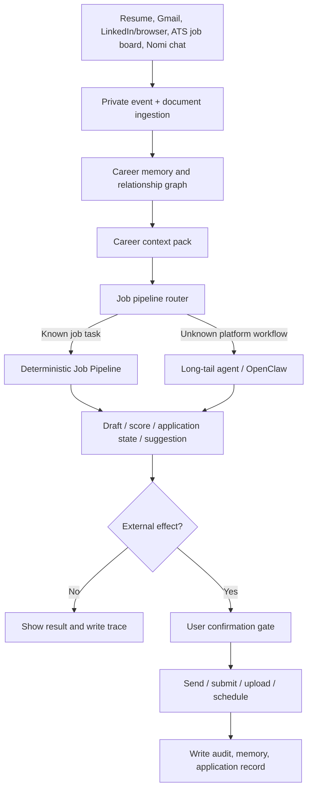

# Nomi Job Agent Pipeline Design

**Status:** Review draft  
**Date:** 2026-06-05  
**Owner:** Nomi project  

## Goal

Build Nomi's first vertical product wedge as a **Job Agent**: a goal-driven assistant that helps the user find, evaluate, apply for, and follow up on jobs by combining the user's private data, resume, relationship graph, job descriptions, emails, chats, calendar events, and controlled external tools.

The user-facing promise is not "career advice." It is:

> Nomi keeps track of the jobs, people, materials, interviews, and follow-ups that matter, then prepares the next best action for the user.

For V1, Nomi should help the user:

- discover and track relevant jobs;
- parse and score JDs against the user's resume and career profile;
- tailor resume versions without fabricating experience;
- draft cover letters, application answers, recruiter messages, interviewer messages, and self-introductions;
- prepare applications and stop before submission;
- manage interview preparation and follow-up;
- proactively surface high-value next actions.

## Non-Goals

- Do not build a generic "AI job coach" that only answers career questions.
- Do not mass-apply, add connections, or send outreach without an explicit delegated automation grant, target manifest, quota, stop conditions, and audit trace.
- Do not fabricate experience, projects, education, compensation history, certificates, immigration status, or references.
- Do not rely on hidden LinkedIn scraping, fake accounts, challenge bypass, platform security evasion, or implicit-target automation.
- Do not promise universal direct API access to every job platform. Many job boards and ATS products expose different levels of API support.
- Do not submit applications, send messages, upload resumes, or change external systems unless the action is covered by either a final user confirmation gate or a saved delegated automation grant.

## Research Summary

The platform research changes the design in an important way: **not every recruiting surface can be treated as an automation target**.

### LinkedIn

LinkedIn is strategically important for job discovery, recruiters, referrals, profile context, and warm relationship paths, but it is also high-restriction. LinkedIn's help page says it does not permit third-party software such as crawlers, bots, browser plug-ins, or extensions that scrape, modify the appearance of, or automate activity on LinkedIn's website. It also calls out unauthorized automated access and automated messaging-like behavior as violations.

Design implication:

- Use LinkedIn as a user-controlled browser surface and context source only when the user is actively operating it.
- Nomi may help draft messages, summarize visible pages, compare JDs, and guide the user.
- Nomi must not make V1 depend on hidden LinkedIn scraping, implicit-target sending, or platform challenge bypass.
- LinkedIn outreach in V1 can be draft/manual/browser-assisted by default, or quota-limited cloud Playwright execution when the user grants delegated automation for a concrete target manifest.

References:

- <https://www.linkedin.com/legal/user-agreement>
- <https://www.linkedin.com/help/linkedin/answer/a1341387/prohibited-software-and-extensions>

### ATS And Job Board APIs

Many company career pages are backed by ATS systems that expose useful public or authenticated APIs.

Greenhouse has a Job Board API that exposes company offices, departments, and published jobs. Its public GET endpoints do not require authentication, while application submission requires auth. This makes it suitable for V1 job discovery and read-only JD ingestion.

Lever exposes developer documentation for postings, applications, contacts, opportunities, files, interviews, offers, and webhooks. This is useful as a source adapter when the target company uses Lever.

Ashby documents public job posting APIs and application submission APIs, including application form submission and job posting APIs. This is useful for company career page ingestion and controlled application preparation.

Workable exposes public jobs for accounts and broader candidate/job APIs with scopes. SmartRecruiters documents job board, application, candidate status, posting, and webhook APIs, including partner flows.

Design implication:

- Build `JobSourceAdapter` interfaces for Greenhouse, Lever, Ashby, Workable, SmartRecruiters, and generic HTML/browser pages.
- Prefer read-only APIs for discovery and JD ingestion.
- Treat application submission APIs as external-effect paths that require user confirmation.
- Treat unavailable, partner-only, blocked, or unsupported APIs as long-tail/browser-assisted flows.

References:

- <https://developers.greenhouse.io/job-board.html>
- <https://hire.lever.co/developer/documentation>
- <https://developers.ashbyhq.com/docs/public-job-posting-api.md>
- <https://workable.readme.io/reference/jobs-1.md>
- <https://developers.smartrecruiters.com/docs/partners-job-board-api.md>

### Indeed And Aggregators

Indeed access is commonly partner-mediated and the public docs surface may block generic automated access. Nomi should not assume open scraping or universal direct application APIs.

Design implication:

- Treat aggregators as read-only/manual/browser-assisted unless the project has a valid partner integration or allowed API.
- If a job is found on an aggregator, prefer following it to the employer/ATS canonical application URL when possible.

Reference:

- <https://docs.indeed.com/>

## Product Positioning

The first concrete Nomi vertical should be:

> Job Agent: Nomi helps you turn your private career context into interviews and offers.

The MVP should target active job seekers who already have at least one resume and are applying to roles through LinkedIn, Gmail, company career pages, Greenhouse, Lever, Ashby, Workable, SmartRecruiters, or similar ATS pages.

Nomi should not start by saying "I can do everything." It should show a small number of high-trust outputs:

- "这个岗位匹配度 82%，我准备好了简历修改建议和 HR 招呼语。"
- "这封 recruiter 邮件需要今天回复，我已经结合 JD 和你的简历起草了回复。"
- "明天 10:00 面试，我准备好了 90 秒自我介绍、JD 对齐卖点、可能问题和 STAR 故事。"
- "这个岗位要求 B2B SaaS 增长经验，你简历里最能支撑的是 X 项目和 Y 指标，但缺少 Z 证据。"

## Relationship To Existing Nomi Architecture

This design extends, not replaces, the existing Nomi architecture:

- Private events are still written into memory first.
- Retrieval remains scoped by account, contact, thread, topic, and task.
- Core high-frequency work runs through deterministic pipelines.
- Long-tail platform workflows use OpenClaw as a bounded executor, not as Nomi's brain.
- External effects require confirmation.
- Nomi-owned Gmail/WhatsApp/phone identities can be used for assistant-style outreach after confirmation, and later through delegated automation once assistant-owned channel policies are explicitly enabled.
- High-automation job-search actions use `2026-06-05-delegated-automation-permission-foundation-design.md` for action grants, target manifests, quotas, stop conditions, and audit.
- Long-tail agent runtime remains planner + state memory + verifier + checkpoint + final evaluator.

The Job Agent introduces a new career domain on top of the same primitives.



## Core Principle: JD + Resume Grounding

Every output that could affect a job opportunity must be grounded in:

1. the current JD or recruiter/interviewer message;
2. the user's active resume or career profile;
3. the user's constraints and preferences;
4. relationship or conversation context when relevant;
5. source evidence IDs.

This applies to:

- resume edits;
- cover letters;
- application answers;
- recruiter introductions;
- LinkedIn connection messages;
- Gmail/WhatsApp outreach;
- interview self-introductions;
- interview question answers;
- follow-up emails;
- offer negotiation drafts.

Nomi must not generate a claim like "我主导过千万级营收增长" unless that claim is supported by the resume, career profile, private memory, or explicit user-provided evidence.

When evidence is weak, Nomi should label the output:

```json
{
  "claim": "Managed enterprise SaaS growth",
  "support": "weak",
  "reason": "Resume mentions SaaS project but does not state ownership or enterprise customer segment.",
  "required_user_confirmation": true
}
```

## Career Memory Model

### `career_profile`

Stable facts about the user as a candidate:

```json
{
  "career_profile_id": "career_profile_default",
  "target_roles": ["Product Manager", "AI Product Manager"],
  "target_levels": ["Senior", "Lead"],
  "target_locations": ["Shanghai", "Remote", "Singapore"],
  "industries": ["AI", "SaaS", "Consumer"],
  "work_history": [],
  "education": [],
  "skills": [],
  "projects": [],
  "achievements": [],
  "constraints": {
    "visa": "unknown",
    "salary_expectation": "unknown",
    "relocation": "unknown",
    "notice_period": "unknown"
  },
  "evidence_ids": ["resume_doc_1", "gmail_thread_2"]
}
```

### `resume_versions`

Each resume version is a durable artifact:

```json
{
  "resume_version_id": "resume_v_ai_pm_openai_20260605",
  "base_resume_id": "resume_v_base_20260601",
  "target_job_id": "job_123",
  "status": "draft | user_approved | archived",
  "diff_summary": [],
  "unsupported_claims": [],
  "file_refs": [],
  "evidence_ids": ["job_123", "resume_v_base_20260601"]
}
```

### `job_opportunities`

The canonical opportunity table:

```json
{
  "job_id": "job_123",
  "source": "greenhouse | lever | ashby | workable | smartrecruiters | linkedin_browser | indeed_browser | manual | gmail",
  "source_url": "https://...",
  "company": "Example AI",
  "title": "AI Product Manager",
  "location": "Remote",
  "jd_text_hash": "sha256...",
  "jd_summary": {},
  "requirements": [],
  "nice_to_have": [],
  "status": "discovered | shortlisted | materials_ready | user_confirmed | submitted | follow_up_due | interview | offer | rejected | archived",
  "fit_score": 0.82,
  "risk_flags": [],
  "source_event_ids": ["evt_1"]
}
```

### `application_records`

The task state for each application:

```json
{
  "application_id": "app_123",
  "job_id": "job_123",
  "resume_version_id": "resume_v_ai_pm_openai_20260605",
  "cover_letter_id": "draft_cover_123",
  "application_answers_id": "draft_answers_123",
  "current_stage": "materials_ready",
  "next_action": "confirm_application_submission",
  "deadline_at": null,
  "last_external_action_at": null,
  "trace_ids": ["trace_1"]
}
```

### `career_contacts`

Contacts involved in the job search:

```json
{
  "contact_id": "contact_recruiter_1",
  "name": "Maya",
  "roles": ["recruiter"],
  "company": "Example AI",
  "channels": ["gmail", "linkedin_browser", "whatsapp"],
  "relationship_stage": "new | warm | active | interview | dormant",
  "last_contact_at": "2026-06-05T08:00:00+08:00",
  "source_event_ids": ["gmail_msg_1"]
}
```

## Career Context Pack

Before any Job Agent pipeline runs, Nomi builds a career-specific context pack:

```json
{
  "context_pack_id": "career_ctx_123",
  "job": {
    "job_id": "job_123",
    "jd_summary": {},
    "jd_relevant_excerpts": []
  },
  "candidate": {
    "career_profile_id": "career_profile_default",
    "resume_version_id": "resume_v_base_20260601",
    "relevant_resume_bullets": [],
    "constraints": {}
  },
  "relationship": {
    "contact_ids": [],
    "recent_threads": [],
    "warm_paths": []
  },
  "application_state": {},
  "missing_info": [],
  "source_evidence_ids": []
}
```

Rules:

- Include JD raw excerpts when the output must quote or answer application questions.
- Include only resume bullets relevant to the JD unless the task is broad resume repair.
- Include contact context only for the current recruiter/interviewer/referrer/company.
- Include recent Nomi conversation only when related to the same job, target role, resume version, or career goal.
- Exclude unrelated third-party messages by default.

## Deterministic Job Pipelines

### 1. `career_profile_pipeline`

**Purpose:** Build and update the user's career profile from resume files, user chat, emails, documents, LinkedIn-visible profile content, and manual corrections.

**Triggers:**

- User uploads or connects a resume.
- User says "我想找 AI PM 工作".
- New career-relevant Gmail/WhatsApp/Nomi message arrives.
- User corrects a profile fact.

**Inputs:**

- resume document text;
- career-related private events;
- user target role statements;
- current career profile.

**Outputs:**

- structured `career_profile`;
- missing fields such as salary, visa, relocation, target title, notice period;
- confidence and evidence per field.

**Model use:** extraction and summarization.  
**Rule use:** schema validation, date validation, unsupported field detection.  
**External effect:** none.  
**Confirmation:** no confirmation for local profile draft; user confirmation required to mark uncertain facts as verified.

### 2. `job_discovery_pipeline`

**Purpose:** Discover candidate jobs from user preferences, company career pages, ATS APIs, Gmail/recruiter messages, and user-provided URLs.

**Source adapters:**

- `greenhouse_job_board_adapter`;
- `lever_postings_adapter`;
- `ashby_job_postings_adapter`;
- `workable_public_jobs_adapter`;
- `smartrecruiters_job_board_adapter`;
- `gmail_recruiter_message_adapter`;
- `linkedin_browser_observation_adapter`;
- `generic_career_page_browser_adapter`.

**Outputs:**

- normalized `job_opportunities`;
- source URL and source evidence;
- canonical employer application URL when available;
- initial status `discovered`.

**External effect:** read-only.  
**Confirmation:** not required for local discovery.  
**Fallback:** if API is unavailable, route read-only page inspection to long-tail browser executor.

### 3. `jd_parse_pipeline`

**Purpose:** Convert a JD into structured requirements.

**Outputs:**

```json
{
  "required_skills": [],
  "nice_to_have_skills": [],
  "responsibilities": [],
  "seniority_signals": [],
  "domain_signals": [],
  "location_constraints": [],
  "compensation_signals": [],
  "application_questions": [],
  "risk_flags": ["visa_unclear", "salary_missing"]
}
```

**Rule checks:**

- detect language;
- preserve exact source excerpts;
- separate must-have from nice-to-have;
- flag vague or conflicting requirements.

**External effect:** none.

### 4. `job_fit_scoring_pipeline`

**Purpose:** Score fit between JD and user profile/resume.

**Inputs:**

- parsed JD;
- active resume version;
- career profile;
- user constraints.

**Outputs:**

- fit score;
- matched requirements;
- missing or weak requirements;
- strongest resume evidence;
- recommended positioning;
- "do not apply" reasons when hard constraints fail.

**Scoring dimensions:**

- role/title match;
- required skills;
- seniority;
- domain;
- location/visa;
- compensation preference;
- evidence strength;
- relationship advantage.

**Important rule:** high score is not allowed if the candidate fails a hard constraint, such as location or work authorization, unless the system marks that uncertainty clearly.

### 5. `resume_tailoring_pipeline`

**Purpose:** Create a job-specific resume version from a base resume and JD.

**Inputs:**

- base resume;
- parsed JD;
- fit scoring output;
- career profile evidence.

**Outputs:**

- resume diff;
- generated resume draft;
- unsupported or risky claims;
- evidence map from each edited bullet to resume/profile/private source;
- user approval card.

**Rules:**

- Reorder and reframe true experience.
- Prefer quantified evidence already present.
- Do not invent new companies, titles, dates, degrees, certifications, metrics, or technologies.
- If a desirable claim is unsupported, create a "missing evidence question" instead of writing it into the resume.

**External effect:** local document draft only.  
**Confirmation:** required before setting it as active, uploading it, or sending it.

### 6. `application_material_pipeline`

**Purpose:** Generate application-specific materials.

**Materials:**

- cover letter;
- short bio;
- application question answers;
- portfolio summary;
- "why this company";
- "why this role";
- salary/notice/visa responses when verified.

**Grounding requirement:** every substantive claim must be backed by JD evidence, resume evidence, or verified career profile evidence.

**Output example:**

```json
{
  "draft_id": "application_answers_123",
  "job_id": "job_123",
  "answers": [
    {
      "question": "Why are you interested in this role?",
      "answer": "...",
      "jd_evidence_ids": ["jd_req_1", "jd_resp_3"],
      "resume_evidence_ids": ["resume_bullet_7"],
      "risk_flags": []
    }
  ],
  "missing_user_inputs": []
}
```

**External effect:** none until submission.

### 7. `networking_path_pipeline`

**Purpose:** Find relationship paths and people worth contacting.

**Inputs:**

- company;
- role;
- relationship graph;
- Gmail/WhatsApp/Nomi conversations;
- LinkedIn-visible user-controlled observations;
- known contacts.

**Outputs:**

- recruiter/hiring manager/referrer/interviewer candidates;
- warm path reason;
- relationship risk;
- recommended contact action.

**Safety rule:** do not reveal third-party private negative comments or unrelated conversations. Relationship context must stay scoped to the company, role, or current contact.

### 8. `outreach_message_pipeline`

**Purpose:** Draft messages to recruiters, hiring managers, employees, referrers, and interviewers.

**Channels:**

- Nomi-owned Gmail;
- Nomi-owned WhatsApp where appropriate;
- user Gmail draft;
- LinkedIn draft/manual browser-assisted message;
- SMS/phone assistant identity in later extension.

**Inputs:**

- recipient contact;
- JD;
- active resume version;
- career context pack;
- relationship context;
- user's preferred tone.

**Outputs:**

- message draft;
- channel recommendation;
- claim evidence;
- risk flags;
- confirmation card.

**Examples:**

- recruiter intro;
- hiring manager intro;
- referral request;
- post-application follow-up;
- post-interview thank-you;
- rescheduling or availability reply.

**Confirmation or delegated grant:** sending requires either one-off user confirmation or an active delegated automation grant with a target manifest, quota, and audit trace.  
**LinkedIn rule:** V1 can support cloud Playwright LinkedIn sending only through the delegated automation foundation. It must not run unbounded background messaging or send to implicit targets.

### 9. `application_submission_pipeline`

**Purpose:** Prepare an application and stop before final submission.

**Supported paths:**

- official ATS application API when valid and configured;
- browser-assisted filling through OpenClaw for long-tail portals;
- manual checklist when automation is unsafe or blocked.

**Steps:**

1. choose job;
2. choose resume version;
3. prepare answers and attachments;
4. fill or prepare the form;
5. show final review;
6. require explicit user confirmation or a matching delegated automation grant;
7. submit only after confirmation/grant validation;
8. write application record and trace.

**Hard stop:** if the platform has a visible `Submit`, `Send`, `Apply`, `Upload`, or irreversible control, the browser executor must stop before triggering it unless confirmation was already captured for that exact action or the action is covered by a valid delegated automation grant.

### 10. `interview_prep_pipeline`

**Purpose:** Prepare the user for an interview using JD, resume, application record, recruiter messages, interviewers, and company context.

**Outputs:**

- 90-second self-introduction;
- JD-to-resume selling points;
- likely questions;
- STAR stories;
- company-specific questions to ask;
- risk gaps and how to address them honestly;
- interview agenda reminders.

**Self-introduction rule:** it must combine:

- at least two JD requirements or responsibilities;
- at least two resume/career evidence points;
- role/company-specific motivation;
- no unsupported claims.

Example output trace:

```json
{
  "intro_id": "intro_123",
  "uses_jd_evidence": ["jd_req_ai_workflow", "jd_resp_cross_function"],
  "uses_resume_evidence": ["resume_project_nomi", "resume_metric_growth"],
  "unsupported_claims": []
}
```

### 11. `interview_response_pipeline`

**Purpose:** Help draft replies to interviewer or recruiter messages.

**Triggers:**

- recruiter asks availability;
- interviewer sends prep material;
- user asks "怎么回复这个面试官";
- Gmail/WhatsApp/LinkedIn-visible message arrives.

**Inputs:**

- message thread;
- JD;
- resume version;
- application record;
- calendar availability when connected.

**Outputs:**

- reply draft;
- availability options;
- next agenda update;
- confirmation card.

**Rule:** replies must reflect the current application state and cannot contradict prior messages.

### 12. `interview_followup_pipeline`

**Purpose:** Draft follow-up messages and reminders after interviews or recruiter touchpoints.

**Outputs:**

- thank-you note;
- follow-up schedule;
- "haven't heard back" nudge;
- relationship graph update;
- application record update.

**Confirmation:** required before sending.

### 13. `offer_negotiation_pipeline`

**Purpose:** Help the user evaluate and respond to offers.

**Inputs:**

- offer email/document;
- target compensation constraints;
- market/user preferences when available;
- application and interview history.

**Outputs:**

- offer summary;
- risk and missing terms;
- negotiation strategy;
- draft email/message;
- agenda tasks.

**Safety:** treat compensation, visa, legal, tax, and contract terms as high-sensitivity. Nomi can summarize and draft, but should not present legal/financial advice as authoritative.

### 14. `job_proactive_suggestion_pipeline`

**Purpose:** Decide when to interrupt the user with job-search actions.

**Suggestion types:**

- new high-fit job found;
- application deadline approaching;
- recruiter email needs reply;
- interview tomorrow;
- follow-up overdue;
- resume version ready for review;
- referral candidate found;
- stale opportunity should be archived.

**Bubble examples:**

```text
这个 AI PM 岗位匹配度 82%。我已准备好简历修改建议和给 recruiter 的招呼语，要看吗？
```

```text
明天 10:00 面试。Nomi 已结合 JD 和你的简历准备好 90 秒自我介绍。
```

**Actions:**

- `查看匹配`;
- `改简历`;
- `准备招呼语`;
- `投递前检查`;
- `面试准备`;
- `稍后提醒`;
- `忽略`.

## Pipeline Routing

The router should prefer deterministic Job pipelines over long-tail agent execution when the user's intent matches a known career task.

Routing output:

```json
{
  "route_type": "core_pipeline",
  "pipeline_id": "resume_tailoring_pipeline",
  "confidence": 0.9,
  "reason": "User asked to modify resume for a known JD and active resume exists.",
  "risk_permission": "local_document_draft",
  "confirmation_required": false
}
```

Long-tail agent is allowed when:

- a job portal has an unfamiliar UI;
- a source cannot be handled by known adapters;
- the user asks for a multi-step platform-specific workflow not covered by a Job pipeline;
- the system needs controlled browser observation.

Long-tail agent is not allowed to bypass Job pipeline rules. For example, if the agent finds that a message needs to be sent, it must return an outbound intent to `outreach_message_pipeline`; it cannot directly send unless the automation foundation validates an explicit grant, target manifest, budget, and stop policy for the exact action.

## External Tool Strategy

### V1 Adapter Priority

1. Local/private sources: resume, Gmail, Nomi chat, agenda, existing memory.
2. Official or documented read APIs: Greenhouse, Lever, Ashby, Workable, SmartRecruiters.
3. Browser-assisted read-only observation for user-visible pages.
4. Composio tools for Gmail, Google Calendar, Google Drive, Notion/Docs, and approved communication channels when connected.
5. Cloud Playwright/OpenClaw for unfamiliar application portals and LinkedIn workspace execution, with stop-before-submit unless delegated automation grants allow the exact action.

### LinkedIn Handling

LinkedIn is handled through a strict `linkedin_browser_observation_adapter`:

- observe only user-opened pages or user-provided URLs;
- extract visible JD/contact/profile facts with source evidence;
- draft messages for manual/user-confirmed sending;
- execute add-connection, send-message, Apply/Submit, and batch application actions only when a delegated grant, target manifest, quota, and audit trace exist;
- never run unbounded hidden crawling, implicit-target batch messaging, fake engagement, challenge bypass, or platform security evasion.

### Nomi-Owned Identity Handling

When Nomi sends as Nomi:

- use Nomi-owned Gmail/WhatsApp/phone identity adapters;
- make the assistant identity clear where appropriate;
- require confirmation before sending;
- write the outbound event and delivery status into memory and application record.

When Nomi drafts as the user:

- create a draft or suggested text;
- user confirms or manually sends;
- Nomi records the confirmed outcome.

## UI Design Requirements

Job Agent should add a career-focused surface to the existing web/Android workbench.

Recommended tabs:

- `今日行动`: top next actions ranked by impact.
- `岗位`: opportunities, fit scores, statuses.
- `简历`: base resume and job-specific versions.
- `消息`: recruiter/referrer/interviewer drafts and threads.
- `面试`: upcoming interviews, prep packets, follow-ups.
- `申请记录`: pipeline status per job.

Every action card should show:

- what Nomi suggests;
- why this matters;
- JD evidence;
- resume evidence;
- current risk/confirmation state;
- one-tap actions.

Example card:

```text
Example AI - AI Product Manager
匹配度 82% · 缺口 2 项 · 建议今天投递

为什么：
- JD 要求 AI workflow / cross-functional delivery
- 你的 Nomi 项目和产品架构经历可支撑
- 缺少英文版量化指标，建议补充

操作：
[查看 JD 匹配] [改简历] [准备招呼语] [稍后]
```

## Confirmation Policy

No confirmation needed:

- local job discovery;
- local JD parsing;
- local fit scoring;
- local resume draft creation;
- local message draft creation;
- internal application status updates from private evidence.

Confirmation required:

- sending any email/WhatsApp/SMS/LinkedIn message;
- uploading or submitting any resume;
- submitting applications;
- scheduling or rescheduling external calendar events;
- contacting referrals or recruiters;
- using Nomi-owned identity to speak to third parties;
- writing to external CRMs/docs/calendar/job platforms.

Delegated automation exception:

- For selected actions, the user may replace repeated one-off confirmations with an active delegated automation grant defined by `2026-06-05-delegated-automation-permission-foundation-design.md`.
- The grant must be scoped to scenario, platform, surface, and action.
- The grant must have daily and batch quotas.
- Batch actions must use a concrete target manifest.
- Every executed action must write an audit trace.
- User-owned Gmail and WhatsApp are not part of this delegated automation scope in V1; Nomi-owned identities can be added as assistant-owned channel policies later.

Extra confirmation required:

- offer acceptance/rejection;
- compensation negotiation;
- visa/legal-sensitive replies;
- bulk applications or repeated outreach.

## Quality And Safety Rules

1. **No unsupported claims.** Any career claim must have evidence or be marked as a question for the user.
2. **No blind automation.** Browser automation must stop before external writes.
3. **No relationship leakage.** Messages to recruiters should not reveal unrelated private conversations.
4. **No spam.** Outreach rate limits and deduping should prevent repetitive messaging.
5. **No fake identity.** Nomi can send as Nomi or draft as the user; it should not silently impersonate the user.
6. **No hidden platform bypass.** Platform-specific restrictions must be captured in adapter policies.
7. **Trace everything.** Every score, draft, submission, and suggestion should record evidence and pipeline trace.

## MVP Scope

V1 should implement:

- career profile extraction from one or more resumes;
- manual/user-provided JD ingestion;
- Greenhouse/Lever/Ashby/Workable/SmartRecruiters source adapters where feasible;
- JD parsing;
- fit scoring;
- resume tailoring draft and diff;
- cover letter/application answer draft;
- recruiter intro draft;
- interview prep packet with JD + resume grounded self-introduction;
- application tracker;
- proactive "today's next action" cards;
- final confirmation gates;
- delegated automation hooks for LinkedIn/ATS add-connection, message, Apply/Submit, and batch application actions.

V1 should not implement:

- unbounded automatic LinkedIn scraping or implicit-target sending;
- mass application without target manifests and quotas;
- universal ATS form submission;
- autonomous offer acceptance or negotiation send;
- unverified resume claims.

## Acceptance Criteria

### JD + Resume Grounding

Given a JD and a resume, Nomi's self-introduction must include:

- at least two JD-grounded points;
- at least two resume-grounded points;
- evidence IDs for each substantive claim;
- no unsupported claims.

### Fit Scoring

Given a JD with must-have and nice-to-have requirements, Nomi must output:

- matched requirements;
- missing requirements;
- hard-constraint failures;
- a fit score with explanation;
- source evidence.

### Resume Tailoring

Given a base resume and JD, Nomi must:

- produce a diff;
- preserve factual dates, companies, titles, education, and metrics unless evidence supports a change;
- flag unsupported claims instead of writing them;
- require user approval before upload/send.

### Outreach Draft

Given a recruiter and JD, Nomi must:

- draft a concise intro;
- mention why the user fits using resume evidence;
- mention why the role/company is relevant using JD evidence;
- require confirmation or delegated automation grant before sending;
- use LinkedIn automation only through a target-manifest, quota-limited delegated grant.

### Application Submission

Given an application form, Nomi must:

- fill or prepare fields when evidence exists;
- list missing fields;
- stop before final submission unless a valid delegated grant covers the exact action;
- ask for explicit confirmation or validate delegated grant;
- write an application record after submission or cancellation.

### Proactive Suggestion

Given a high-fit job or recruiter email, Nomi must:

- show a specific reason;
- include action buttons;
- avoid vague reminders;
- write user actions back into memory and application records.

## Testing Strategy

Use realistic fixtures:

- sample resumes with known facts and missing facts;
- public Greenhouse/Lever/Ashby/Workable/SmartRecruiters job postings;
- recruiter email fixtures;
- interviewer scheduling emails;
- LinkedIn-visible mock pages or user-controlled browser fixtures;
- application form fixtures.

Test each pipeline with semantic assertions, not only success flags:

- the JD parser separates must-have from nice-to-have correctly;
- fit score explanation matches the actual evidence;
- resume diff does not invent facts;
- outreach draft cites both JD and resume;
- interview intro is role-specific, not generic;
- final submission stops before external effect;
- delegated batch execution stops at quota, duplicate target, missing evidence, or platform challenge;
- proactive suggestion is actionable and not noisy.

## Implementation Phasing

### Phase 1: Local Career Core

- career profile;
- resume parsing;
- manual JD ingestion;
- JD parser;
- fit scoring;
- resume tailoring draft;
- application material draft.

### Phase 2: Source Adapters And Tracker

- Greenhouse/Lever/Ashby/Workable/SmartRecruiters adapters;
- application records;
- daily next-action ranking;
- Gmail recruiter message ingestion.

### Phase 3: Outreach And Interview

- recruiter/referrer/interviewer message drafts;
- Nomi-owned Gmail/WhatsApp sending after confirmation;
- interview prep;
- follow-up reminders.

### Phase 4: Controlled Application Execution

- browser-assisted application preparation;
- stop-before-submit;
- final confirmation;
- delegated automation permission checks;
- quota-limited batch execution;
- upload/submit trace.

### Phase 5: Offer And Negotiation

- offer parsing;
- negotiation strategy drafts;
- legal/financial sensitivity guardrails;
- confirmed outbound replies.

## Open Questions And Known Gaps

- LinkedIn official API access for this use case is not assumed. V1 must use draft/manual/browser-assisted flows.
- LinkedIn cloud Playwright high-automation actions are allowed only through the delegated automation foundation.
- Indeed and some aggregators may require partner access. V1 should use employer/ATS canonical URLs where possible.
- Some ATS application APIs require employer-specific credentials, API keys, or partner status. V1 should support read-only discovery broadly and submission only where valid configuration exists.
- Resume file generation format is not specified here; implementation can start with Markdown/PDF/DOCX depending on existing document tooling.
- The exact Composio toolkit list for career workflows should be configured during implementation, but likely includes Gmail, Google Calendar, Google Drive/Docs, LinkedIn only if officially supported, and relevant ATS/job-board tools if available.

## Design Self-Review

- No section assumes hidden LinkedIn automation as a default capability.
- Every outbound or external write path has a confirmation gate.
- JD + resume grounding is required for all high-impact artifacts.
- Long-tail agent is bounded to unfamiliar platform execution and cannot send or submit directly.
- The design is a single coherent implementation area: Job Agent pipelines and their career memory model.
- Remaining gaps are explicit platform/configuration dependencies rather than vague product holes.
