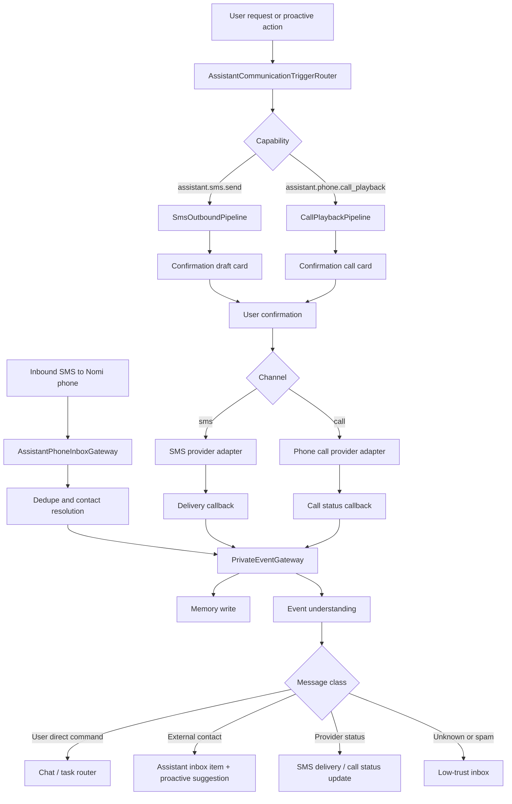

# Nomi Owned Phone Identity V1 Design

**Status:** Review draft
**Date:** 2026-06-05
**Owner:** Nomi project

## Goal

Give Nomi its own phone number. In V1, this phone identity lets Nomi receive SMS, send confirmed SMS, and place outbound phone calls that play a prepared voice message. Calls are one-way playback only in V1; real-time duplex conversation, speech recognition, interruption, and call negotiation are reserved for V2.

This feature extends the existing Nomi-owned identity system used by Nomi Gmail and Nomi WhatsApp. It must reuse the same identity registry, assistant inbox, outbound confirmation, private-event memory, trigger routing, and audit model.

## Product Principle

Nomi can communicate as a real assistant with its own phone number, but it must not pretend to be the user and must not silently contact third parties.

Default outbound phone and SMS wording should identify Nomi clearly:

```text
我是 Nomi，张子长的个人助理。
```

V1 third-party SMS and phone calls require explicit user confirmation before provider execution. External people may contact Nomi's phone number, but Nomi must not auto-reply or auto-call them without the user's action.

## Non-Goals

- Do not implement duplex phone conversations in V1.
- Do not stream callee audio back into ASR in V1.
- Do not let Nomi interrupt, negotiate, or answer callee questions in V1.
- Do not auto-call or auto-text third parties without user confirmation.
- Do not support MMS, voicemail transcription, call recording, conference calls, call transfer, emergency calling, or payments in V1.
- Do not expose provider access tokens, webhook secrets, phone verification codes, or call recordings to the model.

## Identity Model

Add a third Nomi-owned identity:

```json
{
  "identity_id": "nomi_phone_primary",
  "kind": "assistant_phone",
  "display_name": "Nomi",
  "address": "+1234567890",
  "provider": "twilio_or_telnyx",
  "capabilities": [
    "receive_sms",
    "send_sms",
    "outbound_call_playback",
    "inbound_call_greeting",
    "delivery_receipt",
    "call_status"
  ],
  "status": "connected"
}
```

Credentials are stored locally as encrypted provider references. The model sees only safe identity metadata, capability names, redacted status, and user-approved message or call content.

## Provider Strategy

V1 should define a provider-neutral adapter contract and start with one concrete production adapter when credentials are available. Twilio and Telnyx are both suitable because they support SMS APIs, outbound call APIs, webhook callbacks, and programmatic call audio playback or TTS.

The internal interfaces should be provider-neutral:

```python
from typing import Optional, Protocol


class AssistantSmsAdapter(Protocol):
    def send_sms(self, *, from_number: str, to_number: str, body_text: str) -> dict: ...


class AssistantPhoneCallAdapter(Protocol):
    def create_playback_call(
        self,
        *,
        from_number: str,
        to_number: str,
        script_text: str,
        audio_url: Optional[str] = None,
        voice: str = "default",
    ) -> dict: ...
```

Provider implementations may choose TTS playback, hosted audio playback, or generated audio. V1 should prefer TTS playback first because it avoids audio hosting complexity. If the provider requires a publicly reachable callback URL for call instructions, the server must expose a signed, short-lived call instruction endpoint.

## Architecture



## Inbound SMS

Inbound SMS webhooks normalize into:

```json
{
  "source_type": "assistant_phone",
  "source_account_id": "nomi_phone_primary",
  "event_type": "assistant_sms_received",
  "conversation_id": "sms:contact_phone_hash",
  "external_message_id": "provider_sms_id",
  "sender": {
    "phone_hash": "sha256...",
    "contact_id": "contact_maya",
    "sender_class": "known_contact"
  },
  "recipient_identity_id": "nomi_phone_primary",
  "body_text": "请让张子长今天回我电话。",
  "occurred_at": "2026-06-05T12:00:00Z"
}
```

Classification uses the same assistant inbox classes:

| Class | Meaning | Default action |
| --- | --- | --- |
| `user_direct_command` | The user texted Nomi's phone number. | Enter normal chat/task routing. |
| `external_contact_message` | A known third party texted Nomi. | Store, summarize, and notify user if relevant. |
| `provider_status` | SMS delivery, call status, webhook verification, or provider sync event. | Update state only. |
| `unknown_sender` | Sender cannot be mapped. | Store in low-trust inbox. |
| `noise_or_spam` | Duplicate, marketing, spam, or low-value message. | Store low priority; do not interrupt user. |

External contact SMS must not trigger auto-reply. It may create a proactive suggestion such as:

- "要不要我用短信回复 Maya？"
- "要不要我给 Maya 打电话播放一段说明？"
- "稍后提醒你回电话？"

## Inbound Calls

V1 inbound calls are not duplex conversations. If someone calls Nomi's number, the provider should play a short greeting and optionally ask the caller to send an SMS:

```text
我是 Nomi，张子长的个人助理。当前电话暂不支持实时对话，请发送短信说明事项。
```

Inbound call webhook events normalize as provider status or low-priority assistant phone events:

```json
{
  "source_type": "assistant_phone",
  "source_account_id": "nomi_phone_primary",
  "event_type": "assistant_inbound_call_received",
  "conversation_id": "phone:contact_phone_hash",
  "external_message_id": "provider_call_id",
  "call_direction": "inbound",
  "from_phone_hash": "sha256...",
  "status": "answered_with_greeting",
  "occurred_at": "2026-06-05T12:00:00Z"
}
```

If the caller is a known contact, Nomi may notify the user that the contact called. It must not call back automatically.

## Outbound SMS Pipeline

Capability: `assistant.sms.send`

Input:

```json
{
  "assistant_identity_id": "nomi_phone_primary",
  "recipient_hint": "Maya or +15551234567",
  "body_text": "我是 Nomi，张子长的个人助理。他十分钟后到。",
  "source_evidence_ids": ["private_event_id"],
  "requested_action": "draft"
}
```

Pipeline behavior:

1. Resolve recipient from contact graph or explicit phone number.
2. Validate message length and split policy. V1 should warn if text exceeds one SMS segment, but it may still send if provider supports concatenated SMS.
3. Apply identity disclosure policy.
4. Create a confirmation draft card.
5. Block provider send until user confirms.
6. On confirmation, call `AssistantSmsAdapter.send_sms`.
7. Persist provider response and delivery status.
8. Write the sent message back into private events and memory with assistant phone scope.

Confirmation card:

```json
{
  "type": "assistant_sms_confirmation",
  "identity_id": "nomi_phone_primary",
  "recipient": "+15551234567",
  "body_preview": "我是 Nomi，张子长的个人助理。他十分钟后到。",
  "risk_notes": [],
  "actions": ["send", "edit", "cancel"]
}
```

## Outbound Call Playback Pipeline

Capability: `assistant.phone.call_playback`

Input:

```json
{
  "assistant_identity_id": "nomi_phone_primary",
  "recipient_hint": "Alice or +15551234567",
  "script_text": "我是 Nomi，张子长的个人助理。他十分钟后到，请在门口等一下。",
  "voice": "default",
  "source_evidence_ids": ["private_event_id"],
  "requested_action": "draft"
}
```

Pipeline behavior:

1. Resolve recipient from contact graph or explicit phone number.
2. Generate or accept `script_text`.
3. Enforce one-way playback wording. The script must not ask open-ended questions that require real-time response in V1.
4. Estimate playback duration.
5. Apply identity disclosure policy.
6. Create a confirmation call card.
7. Block provider call until user confirms.
8. On confirmation, call `AssistantPhoneCallAdapter.create_playback_call`.
9. Store provider call ID, initial status, script hash, recipient, and source evidence.
10. Update status from provider callbacks.
11. Write final call outcome into private events and memory.

Confirmation card:

```json
{
  "type": "assistant_call_playback_confirmation",
  "identity_id": "nomi_phone_primary",
  "recipient": "+15551234567",
  "script_preview": "我是 Nomi，张子长的个人助理。他十分钟后到，请在门口等一下。",
  "estimated_duration_seconds": 12,
  "v1_limitation": "电话只会播放这段语音，不会实时对话。",
  "risk_notes": [],
  "actions": ["call", "edit", "cancel"]
}
```

V1 script guardrails:

- Must clearly say Nomi is the assistant.
- Must be short enough for a normal automated call.
- Must not ask the callee to verbally answer a question unless the script tells them to reply by SMS or call the user directly.
- Must not include payment credentials, verification codes, or private secrets.
- Must include a user-visible warning if the user asks Nomi to "talk with" someone, because V1 cannot do duplex conversation.

## Trigger And Routing Policy

Extend `AssistantCommunicationTriggerRouter`:

| Trigger source | Example | Route | Allowed output |
| --- | --- | --- | --- |
| `user_explicit_send_request` | "让 Nomi 发短信告诉 Maya 我晚点到。" | Deterministic `assistant.sms.send` pipeline. | Confirmation SMS draft only. |
| `user_explicit_call_request` | "让 Nomi 给 Alice 打电话说我十分钟后到。" | Deterministic `assistant.phone.call_playback` pipeline. | Confirmation call card only. |
| `proactive_suggestion_action` | User taps "短信回复" or "电话通知". | Matching deterministic phone pipeline. | Confirmation card only. |
| `external_contact_message` | Third party texts Nomi. | No outbound route by default. | Inbox item + suggestion. |
| `user_direct_command` | User texts Nomi's phone number. | Normal chat/task router first. | Chat answer, task plan, or confirmation card. |
| `agent_outbound_request` | Long-tail agent decides a phone/SMS contact is needed. | Agent can only call `assistant.outbound.create_draft`. | Confirmation card only. |
| `provider_status` | SMS delivery receipt or call status callback. | State update only. | No send/call action. |

Agent restrictions:

- The agent must not receive direct SMS or call provider tools.
- The only outbound-capable tool exposed to the agent remains `assistant.outbound.create_draft`.
- Deterministic pipelines convert agent-produced outbound intent into SMS or call confirmation cards.

## API Surface

Identity endpoints should include `assistant_phone` in existing identity APIs:

- `GET /api/assistant-identities`
- `POST /api/assistant-identities/assistant_phone/connect`
- `PATCH /api/assistant-identities/nomi_phone_primary`
- `GET /api/assistant-identities/nomi_phone_primary/health`

Inbound/provider callbacks:

- `POST /api/assistant-inbox/phone/sms/webhook`
- `POST /api/assistant-inbox/phone/sms/status`
- `POST /api/assistant-inbox/phone/calls/inbound`
- `POST /api/assistant-inbox/phone/calls/status`
- `GET /api/assistant-inbox/phone/calls/{call_instruction_id}` for provider call playback instructions when required by the selected provider

Outbound:

- `POST /api/assistant-outbound/drafts` with `channel="sms"` or `channel="phone_call"`
- `PATCH /api/assistant-outbound/drafts/{draft_id}`
- `POST /api/assistant-outbound/drafts/{draft_id}/send` for SMS confirmation
- `POST /api/assistant-outbound/drafts/{draft_id}/call` for call confirmation
- `POST /api/assistant-outbound/drafts/{draft_id}/cancel`

The existing endpoint may also keep a generic `send` continuation if its payload includes the desired action. The API must never call provider send/call if confirmation is missing.

## Data Model Additions

The existing assistant identity tables should support phone identity with no new top-level identity table. Add or reuse records in:

- `assistant_identities`
- `assistant_identity_credentials`
- `assistant_inbox_events`
- `assistant_message_drafts`
- `assistant_outbound_messages`
- `assistant_delivery_receipts`
- `assistant_contact_bindings`
- `assistant_channel_policies`

Recommended draft fields for phone call playback:

```json
{
  "channel": "phone_call",
  "recipient": {"phone_hash": "sha256...", "display": "+1555******67"},
  "body_text": "script text",
  "risk": {
    "estimated_duration_seconds": 12,
    "v1_one_way_playback": true,
    "contains_open_question": false
  },
  "source_event_ids": ["private_event_id"]
}
```

Provider callback payloads must keep raw provider IDs locally but expose only redacted phone numbers and safe status to model context.

## Memory And Privacy

All SMS and call status events are stored locally. Model context may include:

- sender/contact label
- redacted phone display
- normalized SMS text
- confirmed outbound SMS text
- confirmed call script text
- call status and timestamp
- source evidence IDs

Model context must not include:

- provider tokens
- webhook signatures or secrets
- verification codes unless the user explicitly asks to use a code in a local browser flow
- full unknown phone numbers unless user has explicitly allowed it
- call recordings, because V1 does not record calls

Assistant phone events use `assistant_identity_thread` or `low_trust_assistant_inbox` visibility scopes, matching other Nomi-owned identities.

## Android And Web UI

Settings / identity management should show:

- Nomi Gmail
- Nomi WhatsApp
- Nomi Phone

The Nomi Phone row shows:

- phone number or setup-needed state
- SMS receive/send status
- call playback status
- provider health

Conversation cards:

- SMS draft card: recipient, body, source evidence, `发送 / 编辑 / 取消`
- Call playback card: recipient, script, estimated duration, V1 limitation notice, `拨打 / 编辑 / 取消`

Proactive suggestions may expose quick actions:

- "短信回复"
- "电话通知"
- "稍后提醒"

## Error Handling

Provider errors must be user-visible and auditable:

| Error | User-facing behavior |
| --- | --- |
| Missing provider credentials | Show "需要先连接 Nomi 手机号服务". |
| Invalid recipient number | Ask user to confirm or edit contact number. |
| SMS send failed | Mark draft/send result failed and allow retry/edit. |
| Call busy/no answer | Record status and offer "稍后再打" or "改发短信". |
| Call provider callback expired | Mark status unknown and offer manual refresh. |
| Script contains unsupported duplex request | Tell user V1 can only play a message and offer to rewrite into one-way playback. |

## Provider Callback Security

Webhook endpoints must validate provider signatures or configured webhook tokens. Unsigned or invalid callbacks are rejected. Valid callbacks are deduped by provider event ID. Provider callback payloads are stored locally for audit, then normalized into assistant phone events.

## V1 Acceptance Criteria

The spec is V1-complete only if all of the following are implemented and verified:

1. `assistant_phone` identity is listed, connectable, updateable, and health-checkable.
2. Inbound SMS normalizes into `assistant_phone` events with correct sender classification.
3. Inbound calls play a static greeting or produce an auditable provider instruction response.
4. External inbound SMS does not auto-reply and may create a proactive suggestion.
5. User direct SMS enters normal Nomi chat/task routing.
6. User-requested SMS creates a confirmation draft and does not call provider before confirmation.
7. Confirmed SMS calls the configured provider adapter and stores provider response.
8. User-requested phone call creates a one-way playback confirmation card and does not dial before confirmation.
9. Confirmed phone call calls the configured provider adapter and stores provider call ID.
10. SMS delivery callbacks update delivery state.
11. Call status callbacks update call state.
12. Long-tail agent can only request `assistant.outbound.create_draft`; it cannot directly send SMS or place calls.
13. Private-event/memory payloads preserve assistant identity boundaries and do not mix with user-owned phone/contact data.
14. Android/Web UI can display Nomi Phone status and SMS/call confirmation cards.
15. Regression tests inspect semantic output, not only success status.

## V2 Extension Points

V2 can add:

- duplex voice calls
- streaming ASR from callee audio
- streaming TTS response generation
- barge-in / interruption handling
- live transcript memory
- user handoff during a call
- voicemail handling
- call summaries

These must be added behind new capabilities, such as `assistant.phone.duplex_call`, rather than silently changing V1 call playback semantics.
