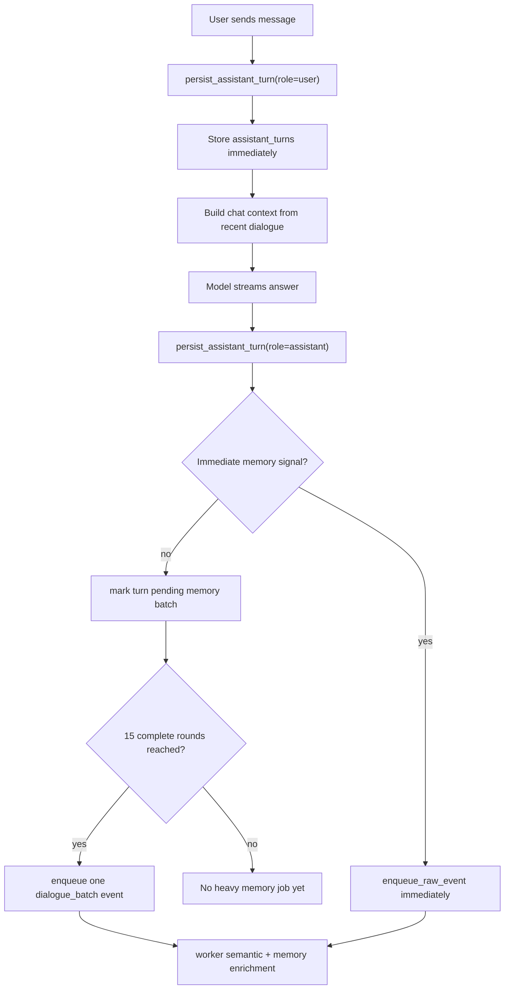

# Chat Context and Dialogue Memory Batch Technical Design

Date: 2026-06-16

## Goal

Nomi must keep enough recent conversation context for natural multi-turn chat while preventing every user/assistant message from immediately entering the heavy long-term memory pipeline.

This design implements two related but separate behaviors:

1. Chat answering context includes at least 15 recent conversation rounds, bounded by token budget.
2. Nomi chat turns are written to long-term memory in batches every 15 complete rounds, while high-signal items such as explicit memory requests, schedules, todos, deadlines, payments, travel, shopping, and relationship signals still go through immediate private-event processing.

## Design Fit Confirmation

This方案可以满足用户确认的设计：

- It restores rich dialogue continuity by using a 15-round server-side dialogue window rather than the current 4-turn simple-chat window.
- It avoids returning to the previous slow path because the 15-round window is still token-budgeted and scoped to the active conversation.
- It separates durable chat history from long-term memory enrichment. Every turn remains stored locally in `assistant_turns`; only heavy memory enrichment is deferred.
- It preserves immediate proactive behavior for important private signals by using an immediate-processing gate before the 15-round batch rule.
- It supports both Android WebSocket chat and Web `/api/chat` because both routes share `route_chat_context`, `context_fetch_limits`, `retrieve_assistant_dialogue_context`, `build_context_pack`, and `persist_assistant_turn`.

No part of the design requires changing Gmail / WhatsApp / Telegram ingestion semantics. Those channels continue using their existing event pipeline and worker batching.

## Current Implementation Summary

Relevant existing files:

- `runtime_api/app/chat_router.py`
  - Routes user chat into `simple_chat`, `agenda_query`, `memory_query`, and `task_request`.
  - Current simple-chat limits are too small for the new requirement.

- `runtime_api/app/main.py`
  - `persist_assistant_turn(...)` writes every Nomi chat turn into:
    - `events`
    - `assistant_turns`
    - Redis private event stream through `enqueue_raw_event(...)`
  - `/api/chat` and WebSocket chat both call `persist_assistant_turn(...)`.
  - `retrieve_assistant_dialogue_context(...)` fetches recent dialogue by conversation and query tokens.
  - `build_context_pack(...)` packs dialogue, source, agenda, tasks, and memory into a token-bounded context.

- `runtime_api/app/assistant_memory.py`
  - `build_session_search_context(...)` already selects same-conversation turns and resolves short replies.

- `worker/app/event_batcher.py`
  - Provides a thread-safe `MemoryBatcher` for event memory enrichment.

- `worker/app/worker.py`
  - Processes Redis private events.
  - `persist_semantics(...)` stores semantic events immediately, then either persists memory enrichment immediately or queues it into `MemoryBatcher`.

- `android_app/app/src/main/java/com/par/assistant/android/FloatingChatContext.java`
  - Keeps local floating-window context and sends client-side recent context to server.

## Core Definitions

### Conversation Round

A round is one user turn plus the following assistant turn in the same `conversation_id`.

For counting:

- `user` turn counts as half a round.
- `assistant` turn completes the round.
- A batch threshold of 15 rounds therefore means 30 stored turns.
- If a conversation has unpaired user turns due to failed model responses, those turns remain in history but do not complete a round until an assistant answer is stored.

### Chat History

Chat history means raw user/assistant turns stored in:

- `assistant_conversations`
- `assistant_turns`
- underlying `events` rows for auditability

Chat history must be persisted immediately for restart recovery and conversation continuity.

### Long-Term Dialogue Memory

Long-term dialogue memory means heavy processing that can create:

- `semantic_events`
- `semantic_memory`
- `memory_vectors`
- graph facts
- timeline rows
- relationship updates

This is the part that must be batched every 15 rounds for ordinary Nomi chat.

## Architecture



## Server Chat Context Policy

### Dialogue Limits

`context_fetch_limits(route, requested_limit)` will use these limits:

| Route | Dialogue Limit | Input Target |
|---|---:|---:|
| `simple_chat`, `reason=default_simple` | 30 turns | 16000 tokens |
| `simple_chat`, `reason=short_reply` | 30 turns | 16000 tokens |
| `simple_chat`, `reason=answer_format` | 10 turns | 4000 tokens |
| `agenda_query` | 30 turns | 24000 tokens |
| `memory_query` | 30 turns | 48000 tokens |
| `task_request` | 40 turns | 64000 tokens |

Rationale:

- 15 rounds equals 30 turns, matching the requirement.
- `answer_format` keeps a smaller window because a formatting-only request should not carry a full 15-round prompt unless it also matches agenda/memory/task intent.
- Agenda, memory, and task routes continue to retrieve their dedicated data sections.

### Token Budgeting

The 15-round limit is a maximum, not a guarantee to include unlimited text.

Rules:

1. Always include the current user request.
2. Prefer same-conversation turns over cross-conversation relevance.
3. Include newest turns first.
4. Preserve the most recent assistant question for short replies such as “需要”.
5. If a single turn is too long, truncate that turn with source metadata preserved.
6. If total dialogue exceeds the section budget, drop oldest dialogue first.
7. Record dropped or truncated dialogue in `context_pack.excluded` / `context_pack.warnings`.

### Client Context

Android can keep sending `client_context_delta`, but the server remains authoritative.

Android should update `FloatingChatContext.snapshotDelta(...)` to target 15 rounds within a character budget:

- Keep up to 30 turns.
- Use a character budget as a client-side safety cap.
- Server still deduplicates against persisted `assistant_turns`.

## Dialogue Memory Batch Policy

### New Persist Mode

Add a parameter to `persist_assistant_turn(...)`:

```python
memory_enqueue_policy: Literal["auto", "immediate", "defer"] = "auto"
```

Behavior:

- `immediate`: enqueue the turn as a private event immediately.
- `defer`: store turn but do not enqueue the raw turn event.
- `auto`: use signal classification to choose immediate or defer.

Default should be `auto` for API safety.

### Immediate Signal Classification

Nomi chat should bypass the 15-round batch and enqueue immediately if the text or metadata indicates:

- Explicit memory command: “记住”, “以后提醒我”, “保存一下”, “remember this”
- Agenda: meeting, appointment, interview, schedule, deadline, reminder
- Task: todo, follow-up, send, reply, apply, submit, buy, book, call
- Payment or bill
- Travel or navigation
- Shopping intent
- Relationship signal with high emotional or trust relevance
- User correction: “不是”, “纠正一下”, “刚才说错了”
- Tool execution result or user approval/rejection of an action

Implementation should use deterministic rules first, not a model call.

### Deferred Ordinary Dialogue

Ordinary chat turns:

- Are inserted into `assistant_turns`.
- Are inserted into `events` for audit, but not enqueued into the worker stream individually.
- Are marked as pending for dialogue memory batch.

### Batch Trigger

When an assistant turn is persisted, compute complete rounds since last successful dialogue memory batch.

If complete rounds >= 15:

1. Select exactly the unbatched turn range for that conversation.
2. Create a single synthetic private event:
   - `source = "nomi_chat"`
   - `event_type = "dialogue_batch"`
   - `raw_data = {conversation_id, batch_start_turn_id, batch_end_turn_id, turns, round_count, created_at}`
3. Enqueue that synthetic event to Redis.
4. Mark included turns as assigned to that batch.

If the worker fails, the event remains recoverable through the existing stream/deadletter behavior.

### Why Batch on Assistant Turn

Batching on assistant turn avoids flushing after a lone user message that has not yet received an answer. It also ensures the batch contains complete context: user request, assistant response, and any immediate follow-up semantics.

## Data Model Changes

### `assistant_turns`

Add columns:

```sql
ALTER TABLE assistant_turns
ADD COLUMN IF NOT EXISTS memory_batch_id UUID,
ADD COLUMN IF NOT EXISTS memory_enqueue_policy TEXT NOT NULL DEFAULT 'auto',
ADD COLUMN IF NOT EXISTS memory_enqueued_at TIMESTAMPTZ,
ADD COLUMN IF NOT EXISTS memory_pending BOOLEAN NOT NULL DEFAULT TRUE;

CREATE INDEX IF NOT EXISTS assistant_turns_memory_pending_idx
ON assistant_turns(conversation_id, created_at ASC)
WHERE memory_pending = TRUE;
```

Meaning:

- `memory_pending=true`: the turn still needs either immediate or batch memory processing.
- `memory_batch_id`: populated when the turn is included in a dialogue batch.
- `memory_enqueued_at`: populated when an immediate event or batch event is enqueued.
- `memory_enqueue_policy`: records why the turn was immediate or deferred.

### `conversation_memory_batches`

Create table:

```sql
CREATE TABLE IF NOT EXISTS conversation_memory_batches (
  id UUID PRIMARY KEY,
  conversation_id UUID NOT NULL REFERENCES assistant_conversations(id) ON DELETE CASCADE,
  start_turn_id UUID NOT NULL,
  end_turn_id UUID NOT NULL,
  round_count INTEGER NOT NULL,
  turn_count INTEGER NOT NULL,
  event_id UUID NOT NULL,
  status TEXT NOT NULL DEFAULT 'queued',
  created_at TIMESTAMPTZ NOT NULL DEFAULT now(),
  enqueued_at TIMESTAMPTZ,
  processed_at TIMESTAMPTZ,
  payload JSONB NOT NULL DEFAULT '{}'::jsonb
);

CREATE INDEX IF NOT EXISTS conversation_memory_batches_conversation_idx
ON conversation_memory_batches(conversation_id, created_at DESC);

CREATE UNIQUE INDEX IF NOT EXISTS conversation_memory_batches_event_idx
ON conversation_memory_batches(event_id);
```

## Worker Semantics for `dialogue_batch`

The worker should treat `nomi_chat/dialogue_batch` as a first-class event.

Expected semantic extraction:

- Produce one batch-level summary.
- Extract user preferences, durable facts, commitments, goals, relationship signals, and decisions.
- Avoid storing low-value chit-chat as facts.
- Keep `conversation_id`, `batch_id`, `start_turn_id`, and `end_turn_id` in entities.

The worker must not create duplicate memory facts for each turn in the batch unless the semantic result specifically supports them.

## API and WebSocket Behavior

### `/api/chat`

- Persists user turn immediately.
- Builds context from up to 15 rounds.
- Gets model answer.
- Persists assistant turn.
- Runs immediate/deferred memory gate.
- Response includes:
  - `context_pack.chat_route.fetch_limits.dialogue`
  - `context_pack.assistant_dialogue_count`
  - `context_pack.dialogue_memory_enqueue`

Example:

```json
{
  "dialogue_memory_enqueue": {
    "policy": "defer",
    "pending_turn_count": 18,
    "pending_round_count": 9,
    "batch_created": false
  }
}
```

### WebSocket Chat

Same behavior as `/api/chat`, but:

- First delta still streams as soon as model returns it.
- Memory batch computation happens after full assistant answer is persisted.
- `chat_done.context_pack.dialogue_memory_enqueue` reports the outcome.

## Performance Expectations

### Chat Latency

Expected impact:

- First token latency may rise compared with the current 4-turn window.
- The increase should be bounded because:
  - only same-conversation dialogue is fetched;
  - heavy memory retrieval is still disabled for simple chat;
  - token packing drops oldest/oversized turns;
  - long-term memory writeback is deferred.

Acceptance:

- Simple chat context retrieval p95 < 300ms on cloud.
- Simple chat first delta p50 < 5s and p95 < 10s with Qwen endpoint.
- `context_pack.token_budget.input_used` should remain below `input_target_tokens`.

### Worker Load

Expected improvement:

- Ordinary Nomi chat no longer creates one semantic/memory enrichment job per turn.
- Every 15 rounds creates one batch job instead of up to 30 individual turn jobs.
- High-signal messages still create immediate jobs.

Acceptance:

- A 14-round ordinary chat creates no `dialogue_batch`.
- The 15th complete round creates exactly one `dialogue_batch`.
- Explicit “记住这个” creates an immediate event even before 15 rounds.

## Failure Handling

### Model Failure

If model response fails:

- User turn remains in `assistant_turns`.
- It does not count as a complete round.
- If the user message was an immediate signal, it can still be enqueued immediately.
- No dialogue batch is created until an assistant turn completes enough rounds.

### Redis Enqueue Failure

If Redis enqueue fails:

- The turn remains `memory_pending=true`.
- The batch row remains `status='queued'` or `status='enqueue_failed'`.
- A retry function can scan pending rows and re-enqueue.

### Worker Failure

Existing worker deadletter behavior applies.

The batch event payload contains enough turn ids to replay the batch without needing the original Android client context.

## Testing Strategy

### Runtime Unit Tests

Files:

- `runtime_api/tests/test_chat_router.py`
- `runtime_api/tests/test_context_pack_and_chat.py`
- New: `runtime_api/tests/test_dialogue_memory_batching.py`

Required cases:

1. `simple_chat` default route has `dialogue == 30`.
2. `short_reply` route has `dialogue == 30`.
3. `answer_format` route has `dialogue == 10`, not 0.
4. `retrieve_assistant_dialogue_context` returns same-conversation turns only when `conversation_id` is provided.
5. A 15-round same-conversation context packs recent turns and excludes oldest overflow first.
6. Persisting 14 ordinary rounds does not enqueue `dialogue_batch`.
7. Persisting the 15th assistant turn creates exactly one `conversation_memory_batches` row and one queued `dialogue_batch` event.
8. Explicit “记住这个” enqueues immediately and does not wait for batch threshold.
9. Duplicate `client_request_id` does not create duplicate batch rows.
10. WebSocket `chat_done` reports `dialogue_memory_enqueue`.

### Worker Tests

Files:

- `worker/tests/test_worker_semantics.py`
- `worker/tests/test_event_batcher.py`

Required cases:

1. `nomi_chat/dialogue_batch` produces a batch-level summary.
2. Low-value chit-chat batch does not create unnecessary graph facts.
3. A batch containing a durable preference creates semantic memory with source ids pointing to the batch event.
4. Batch memory enrichment remains compatible with existing `MemoryBatcher`.

### Android Tests

Files:

- `android_app/app/src/test/java/com/par/assistant/android/FloatingChatContextTest.java`
- `android_app/app/src/test/java/com/par/assistant/android/RealtimeClientTest.java`

Required cases:

1. `FloatingChatContext` can snapshot 30 recent turns.
2. Long turn content is bounded by character budget.
3. WebSocket parsing ignores new `dialogue_memory_enqueue` safely.

### Online Regression

Use the private cloud server after implementation:

1. Send 14 rounds through `/ws`.
   - Expected: no `dialogue_batch`.
   - Expected: `assistant_dialogue_count` grows up to 30-turn cap.
2. Send 15th round.
   - Expected: one `dialogue_batch`.
   - Expected: worker processes it into semantic summary.
3. Send “请记住我喜欢上午面试”.
   - Expected: immediate memory event without waiting for 15 rounds.
4. Send “需要”.
   - Expected: model understands prior assistant question using recent dialogue.
5. Check latency trace.
   - Expected: context retrieval remains low; first delta remains streamed.

## Observability

Add to context pack and model trace payloads:

```json
{
  "dialogue_memory_enqueue": {
    "policy": "defer|immediate|batch_created|skipped_duplicate",
    "reason": "ordinary_dialogue|explicit_memory|agenda_signal|threshold_reached",
    "pending_turn_count": 0,
    "pending_round_count": 0,
    "batch_id": null,
    "batch_event_id": null
  }
}
```

Add logs:

- `dialogue memory deferred conversation_id=... pending_rounds=...`
- `dialogue memory immediate conversation_id=... reason=... event_id=...`
- `dialogue memory batch queued conversation_id=... batch_id=... rounds=15`

## Rollout Plan

1. Add schema columns and table with `IF NOT EXISTS`.
2. Add deterministic signal classifier tests.
3. Add persist helper tests.
4. Change `persist_assistant_turn` to support `auto/immediate/defer`.
5. Update `/api/chat` and WebSocket paths to expose batch outcome.
6. Update chat router limits to 15-round behavior.
7. Update Android local context snapshot tests.
8. Add worker support for `dialogue_batch`.
9. Run local regression.
10. Deploy to cloud and run online regression.

## Non-Goals

- Do not delay Gmail / WhatsApp / Telegram event processing.
- Do not remove raw audit events.
- Do not replace KV + graph + RAG memory architecture.
- Do not use a model call to decide whether a chat turn is immediate or deferred in V1.
- Do not summarize dialogue before sending to Qwen unless token budget requires truncation; this avoids hiding recent user wording.

## Risks and Mitigations

| Risk | Mitigation |
|---|---|
| 15 rounds increase prompt size and first-token latency | Keep simple chat memory/agenda/task retrieval disabled unless routed; use token budget and newest-first packing. |
| Important user preference waits too long | Deterministic immediate-signal classifier bypasses the 15-round gate. |
| Batch duplicates after retry | Unique batch event id, `memory_batch_id`, and idempotent batch creation per unbatched turn range. |
| Worker stores noisy chit-chat | Batch semantic extraction must suppress low-value chit-chat facts. |
| Android sends stale client context | Server deduplicates and treats persisted same-conversation turns as authoritative. |

## Acceptance Checklist

- [ ] Default simple chat includes up to 15 rounds.
- [ ] Short replies include enough context to resolve references.
- [ ] Format-only short answers still keep a smaller context and do not pull memory/agenda/tasks.
- [ ] Every chat turn is still immediately recoverable from `assistant_turns`.
- [ ] Ordinary chat does not enter long-term memory until 15 complete rounds.
- [ ] Strong signals enter private-event processing immediately.
- [ ] The 15th complete round creates one and only one dialogue batch.
- [ ] Online trace exposes dialogue count, token use, first delta latency, and memory batch outcome.
- [ ] Tests inspect semantic correctness, not just success status.

## Self-Review

- Placeholder scan: no TBD/TODO placeholders remain.
- Scope check: this is one coherent change to chat context and dialogue memory batching; external channel ingestion is explicitly out of scope.
- Consistency check: the plan uses 15 rounds = 30 turns consistently, with a smaller 10-turn exception only for format-only answers.
- Requirement check: the design satisfies “至少 15 轮上下文” and “对话落记忆每 15 轮落一次”, while preserving immediate handling for high-signal messages.
