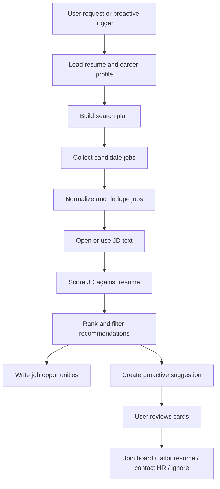

# 2026-06-23 Job Recommendation Pipeline Design

## 背景

现有求职链路已经包含：

- `job_discovery_pipeline`：从 LinkedIn / ATS / 邮件等来源规范化岗位机会。
- `job_fit_scoring_pipeline`：对单个 JD 和用户简历做匹配评分。
- `linkedin_contact_search_pipeline`：按公司 / 岗位搜索 recruiter / hiring manager。
- `resume_tailoring_pipeline`、`outreach_message_pipeline`、`job_application_pipeline`：围绕已选岗位生成材料、外联草稿和申请动作。

缺口是：Nomi 还没有把“主动找 JD”和“匹配用户简历”串成用户能直接筛选的推荐结果。用户不应该先手动找一堆岗位再让 Nomi 一个个判断；Nomi 应主动找到适合用户的招聘信息，按匹配度排序，发给用户筛选。

## 目标

新增 `job_recommendation_pipeline`：

1. 基于用户简历、职业画像、目标城市、目标岗位和已有求职上下文生成岗位搜索计划。
2. 从云端 LinkedIn、公开 ATS 列表、Gmail 招聘邮件和已采集 JD 中汇总候选岗位。
3. 对候选 JD 批量运行匹配评分，筛掉低质量、重复、证据不足和明显不匹配岗位。
4. 将高匹配 JD 作为主动建议发给用户筛选。
5. 用户选择岗位后再进入改简历、联系 HR、加入看板、申请投递等后续 pipeline。

## 非目标

- V1 不自动真实投递岗位。
- V1 不自动给 recruiter / hiring manager 发消息。
- V1 不绕过 LinkedIn / ATS 登录、验证码、付费墙或权限限制。
- V1 不编造用户经历，不补写简历里没有证据的能力。
- V1 不把低证据岗位伪装成高置信推荐。

## 用户体验

### 主动建议

当 Nomi 找到足够好的岗位时，主动发消息：

> 发现 5 个和你简历匹配度较高的后端架构岗位，最高匹配 0.86。要不要看一下？

用户点开后看到岗位卡片：

- 公司：Example AI
- 岗位：Senior Backend Architect
- 地点：Singapore / Remote
- 匹配度：0.86
- 为什么推荐：Java / 分布式 / 高并发 / Redis / Kafka 与 JD 高度匹配
- 主要缺口：英文客户沟通经验未在简历中明确出现
- JD 摘要：该岗位负责高可用交易系统、服务治理和性能优化
- 来源：LinkedIn / Greenhouse / Gmail recruiter signal

每张卡片动作：

- `查看JD`
- `加入求职看板`
- `改简历`
- `联系HR`
- `忽略`

### 用户主动请求

用户也可以直接说：

- “帮我找适合我的 Java 后端架构岗位”
- “根据我的简历找几个 Singapore remote 的后端岗位”
- “帮我筛一下最近 LinkedIn 上适合我的 JD”

Nomi 返回同样的岗位推荐卡片，而不是泛泛建议“你可以去 LinkedIn 搜索”。

## Pipeline 定义

### ID

`job_recommendation_pipeline`

### 能力 ID

`career.job.recommend`

### 权限

`read_only`

### 风险等级

低风险。V1 只读搜索、采集、评分和推荐，不执行外部副作用。

### 触发条件

显式触发：

- 用户要求找工作、推荐岗位、筛选 JD、找适合自己的岗位。
- 用户在求职看板点击“推荐岗位”。

主动触发：

- 用户导入或更新简历后。
- 用户设置求职目标后。
- LinkedIn / Gmail / ATS collector 捕获到新的岗位或招聘邮件后。
- 每日低频扫描任务发现新的高匹配岗位后。

主动触发必须满足冷却条件：

- 同一岗位不重复推荐。
- 同一公司同类岗位在 24 小时内最多推荐一次。
- 推荐列表必须至少包含 1 个 `fit_score >= 0.70` 的岗位，或包含 3 个 `fit_score >= 0.60` 的岗位。

## 输入与 Slots

必需 slots：

- `resume_id` 或可用 `resume`
- `career_profile_id` 或可用 `career_profile`

可选 slots：

- `query`
- `target_roles`
- `target_locations`
- `work_modes`
- `seniority`
- `salary_expectation`
- `excluded_companies`
- `preferred_companies`
- `max_candidates`
- `min_fit_score`
- `source_event_ids`

默认值：

- `max_candidates=20`
- `recommendation_limit=5`
- `min_fit_score=0.60`
- `strong_recommendation_score=0.70`

缺少简历和职业画像时，pipeline 返回 `needs_user_input`，问题必须明确：

> 我需要先读取你的简历或职业画像，才能判断哪些 JD 真正适合你。

## 数据来源

### 本地已采集数据

- `job_opportunities`
- `events` 中的 `linkedin_job_search_results`
- `events` 中的 `linkedin_job_description_snapshot`
- Gmail 招聘邮件
- 用户主动粘贴的 JD

### 云端浏览器采集

- LinkedIn jobs search
- LinkedIn job detail
- 公司官网公开招聘页

### 公开 ATS

复用已有只读预览能力：

- Greenhouse
- Lever
- Ashby
- Workable
- SmartRecruiters

## 数据流



## 搜索计划

搜索计划必须由证据驱动：

- 从简历 headline、skills、experience 中提取候选 role 关键词。
- 从 career profile 中读取目标岗位和地点。
- 从用户请求中覆盖目标岗位、地点和工作模式。
- 将用户明确排除的公司加入 deny list。

示例搜索计划：

```json
{
  "query": "Senior Backend Architect Java distributed systems",
  "target_roles": ["Senior Backend Engineer", "Backend Architect"],
  "target_locations": ["Singapore", "Remote"],
  "required_keywords": ["Java", "distributed systems", "Redis", "Kafka"],
  "negative_keywords": ["intern", "frontend only"],
  "sources": ["linkedin_browser_observation", "greenhouse_public", "lever_public"]
}
```

## 候选规范化

每个候选岗位统一为：

```json
{
  "job_id": "job_backend_architect_example_ai",
  "source": "linkedin_browser_observation",
  "title": "Senior Backend Architect",
  "company": "Example AI",
  "location": "Singapore",
  "url": "https://www.linkedin.com/jobs/view/...",
  "jd_text": "full or partial JD text",
  "requirements": ["Java", "distributed systems", "Redis"],
  "source_event_ids": ["linkedin_evt_1"]
}
```

去重规则：

- 优先使用真实 URL。
- URL 不可用时，用 `title + company + location` 生成稳定 key。
- 同一岗位多来源出现时合并 source_event_ids，并保留最长、最完整 JD。

## 匹配评分

V1 采用规则 + 现有匹配函数，不依赖模型判断分数。

评分组成：

- 角色匹配：25%
- 技能匹配：35%
- 行业 / 业务经验匹配：15%
- 地点 / 工作模式匹配：10%
- JD 证据质量：10%
- 负向信号：最多扣 20%

必须输出：

- `fit_score`
- `recommendation_tier`
- `matched_requirements`
- `gaps`
- `why_recommended`
- `why_not_top_match`
- `evidence_ids`
- `unsupported_claims`

推荐等级：

- `strong_fit`：`fit_score >= 0.75`
- `good_fit`：`0.65 <= fit_score < 0.75`
- `possible_fit`：`0.55 <= fit_score < 0.65`
- `low_fit`：`fit_score < 0.55`

默认只向用户展示 `strong_fit` 和 `good_fit`。`possible_fit` 只在数量不足时作为补充展示，并明确标注“可考虑但有缺口”。

## 输出

Pipeline 输出：

```json
{
  "job_recommendations": [
    {
      "job_id": "job_backend_architect_example_ai",
      "title": "Senior Backend Architect",
      "company": "Example AI",
      "location": "Singapore",
      "source": "linkedin_browser_observation",
      "url": "https://www.linkedin.com/jobs/view/...",
      "fit_score": 0.86,
      "recommendation_tier": "strong_fit",
      "why_recommended": [
        "JD 要求 Java / 分布式 / 高并发，简历有明确项目证据",
        "用户目标地点包含 Singapore / Remote"
      ],
      "gaps": ["英文客户沟通经验未在简历中明确出现"],
      "jd_summary": "负责高可用交易系统、服务治理和性能优化。",
      "evidence_ids": ["jd_evt_1", "resume_evt_1"]
    }
  ],
  "summary": "找到 5 个值得筛选的岗位，最高匹配 0.86。",
  "next_actions": ["查看JD", "加入求职看板", "改简历", "联系HR", "忽略"]
}
```

## 写回

写回目标：

- `job_opportunities`
- `proactive_suggestions`
- `task_trace`
- `memory_items`

写入 `job_opportunities`：

- 保存岗位基本信息。
- 保存 `fit_score`。
- 保存 `requirements`。
- 保存 `source_event_ids`。
- status 默认 `recommended`。

写入 `proactive_suggestions`：

```json
{
  "title": "发现 5 个适合你的岗位",
  "body": "最高匹配 0.86：Senior Backend Architect at Example AI。要不要筛一下？",
  "priority": 0.82,
  "status": "open",
  "metadata": {
    "source": "career",
    "pipeline_id": "job_recommendation_pipeline",
    "dedupe_key": "job_recommendations:2026-06-23:backend_architect",
    "actions": [
      {"id": "view_jobs", "label": "查看岗位"},
      {"id": "save_all_good_fit", "label": "加入看板"},
      {"id": "dismiss", "label": "忽略"}
    ]
  }
}
```

## 用户动作路由

推荐卡片动作映射：

| 动作 | 后续 pipeline | 说明 |
|---|---|---|
| 查看JD | 本地详情 API | 只读展示 JD、评分和证据 |
| 加入求职看板 | `application_tracking_pipeline` | 写本地状态，不外部执行 |
| 改简历 | `resume_tailoring_pipeline` | 生成草稿，不直接覆盖简历 |
| 联系HR | `linkedin_contact_search_pipeline` -> `outreach_message_pipeline` | 搜索联系人并生成草稿，发送前确认 |
| 忽略 | 本地状态更新 | 不再重复推荐同岗位 |

## API 设计

### `POST /api/career/recommendations/run`

用途：用户主动触发岗位推荐。

输入：

```json
{
  "query": "Java 后端架构 remote",
  "target_locations": ["Singapore", "Remote"],
  "max_candidates": 20,
  "recommendation_limit": 5,
  "min_fit_score": 0.60,
  "write_suggestion": true
}
```

输出：

```json
{
  "pipeline_id": "job_recommendation_pipeline",
  "status": "completed_read_only",
  "job_recommendations": [],
  "suggestion": {},
  "trace_id": "..."
}
```

### `GET /api/career/recommendations`

用途：工作台 / Android 拉取已推荐岗位。

查询参数：

- `limit`
- `min_score`
- `status`

输出：

```json
{
  "items": [],
  "summary": {
    "strong_fit": 0,
    "good_fit": 0,
    "possible_fit": 0
  }
}
```

## Android / Web UI

V1 不新增复杂页面，复用求职看板和主动建议：

- 主动消息气泡显示推荐摘要。
- 点击气泡进入求职看板或建议详情。
- 求职看板岗位卡增加匹配等级和推荐理由。
- 设置里的求职入口展示“推荐岗位”动作。

UI 必须避免信息过载：

- 默认只展示前 5 个推荐。
- 每个岗位卡只展示 2 条推荐理由和 2 条缺口。
- 点击详情再展示完整 JD 和证据。

## 正确性与合理性要求

每一步不只看成功状态，还要检查输出是否合理：

1. 搜索计划必须能追溯到简历、职业画像或用户请求。
2. 岗位必须有 title 和 company；缺失时不能作为强推荐。
3. JD 文本太短时不能给高分。
4. 匹配理由必须来自 JD 和简历证据。
5. 缺口不能编造，只能来自 JD 需求中简历未覆盖的部分。
6. 推荐列表必须按 `fit_score` 降序。
7. 主动建议不能重复推同一岗位。
8. 所有外部动作必须停在草稿或确认卡。

## 验收标准

### 单元验收

- 有简历 + 多个 JD 时，输出按匹配度排序。
- 高匹配 JD 进入 `strong_fit` 或 `good_fit`。
- 低匹配 JD 不出现在默认推荐列表。
- JD 太短或缺少 company/title 时不会被强推荐。
- 写回 `job_opportunities` 和 `proactive_suggestions` 的 payload 可解释。
- `联系HR` 动作路由到 LinkedIn 联系人搜索和外联草稿，不直接发送。

### 线上验收

- 云端 LinkedIn / ATS 能采集真实 JD。
- Nomi 能对真实简历和真实 JD 给出合理分数。
- 用户能在 Android 真机或 Web 工作台看到推荐岗位卡。
- 点击“加入看板”后求职看板出现该岗位。
- 点击“改简历”后生成草稿并保留证据。
- 点击“联系HR”后只生成草稿或联系人搜索，不真实发送。

## 失败与降级

没有简历：

- 返回 `needs_user_input`，提示导入简历。

没有可用 JD：

- 返回 `no_recommendable_jobs`，提示需要连接 LinkedIn、打开公司招聘页或提供目标公司。

只有低匹配岗位：

- 不推主动气泡。
- 在接口中返回 `low_confidence_results`，供用户主动查看。

LinkedIn 不暴露详情：

- 保留搜索结果摘要。
- 标注 `jd_detail_status=blocked_by_platform_visibility`。
- 不给高分，除非已有完整 JD 文本来自其他来源。

## 与现有设计的关系

该设计不替代现有 Job Agent，而是补上“候选 JD 推荐”这一层：

- 上游复用：`career_profile_pipeline`、`job_discovery_pipeline`、LinkedIn / ATS collector。
- 中间复用：`job_fit_scoring_pipeline` 的匹配逻辑。
- 下游复用：`resume_tailoring_pipeline`、`linkedin_contact_search_pipeline`、`outreach_message_pipeline`、`job_application_pipeline`。

最终产品闭环从：

> 用户找 JD -> Nomi 打分 -> 用户筛选

升级为：

> Nomi 找 JD -> Nomi 打分排序 -> 主动发给用户筛选 -> 用户选择后进入材料和外联链路。
