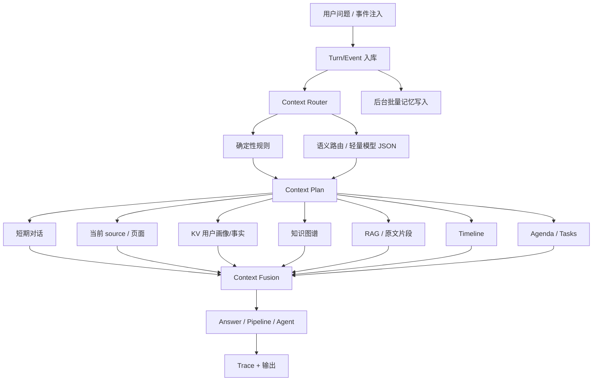

# Nomi 记忆召回路由升级设计

**日期**：2026-06-28

**目标**：把当前以关键词为主的记忆召回判断，升级为“规则 + 语义路由 + 结构化上下文规划 + 多层并行召回”的系统，让 Nomi 能在不把所有私有记忆都塞给模型的前提下，更稳定地判断什么时候需要调用短期对话、当前页面、长期记忆、知识图谱、日程、任务和外部执行上下文。

**结论先行**：现有实现不是完全错误，但太脆。它适合早期验证，却不适合 Nomi 这种依赖私有上下文的产品。下一版应该保留确定性规则作为高速路径，同时引入轻量 semantic/context router，把“是否召回”和“召回什么”变成结构化决策，而不是靠几组中文关键词赌用户表达方式。

---

## 1. 当前实现状态

当前 `/api/chat` 的上下文路由核心在：

- `/Users/wrf/Documents/background/runtime_api/app/chat_router.py`
- `/Users/wrf/Documents/background/runtime_api/app/main.py`
- `/Users/wrf/Documents/background/runtime_api/app/context_parallel.py`

当前流程简化如下：

1. 用户发送消息。
2. 服务端先保存用户 turn。
3. `route_chat_context(message, ui_state)` 用正则判断 intent：
   - `simple_chat`
   - `memory_query`
   - `agenda_query`
   - `task_request`
4. `context_fetch_limits(route)` 决定各类上下文数量。
5. `retrieve_chat_context_parallel(...)` 并行拉取需要的上下文。
6. `build_context_pack(...)` 拼出给模型的输入。
7. 模型流式回复。
8. 回复和对话被保存，对话记忆默认按 15 轮批量落长期记忆。

### 1.1 当前判断依据

当前长期记忆召回主要靠这些正则：

- `MEMORY_RE`：例如“之前、上次、谁说、聊天记录、邮件、报价、客户、同事、朋友、记得、历史”
- `TASK_RE`：例如“帮我、替我、跟进、起草、发送、回复、投递、申请、打车、导航、购买、下单、处理”
- `AGENDA_RE`：例如“今天、明天、会议、会面、见面、截止、提醒、几点、什么时候”

因此现在的真实行为是：

- 所有用户问题都会带短期对话上下文，但数量不同。
- 不是所有用户问题都会召回长期记忆。
- 长期记忆大多只有命中 `MEMORY_RE` 或 `TASK_RE` 才会召回。
- 日程召回大多只有命中 `AGENDA_RE` 才会召回。
- 如果 `ui_state` 带当前 source，则简单问题也可能带 source context。

### 1.2 主要问题

1. **漏召回**

   用户说“那件事后来怎么样了？”、“她后来回了吗？”、“这个还要继续吗？”时，语义上明显需要上下文，但不一定命中关键词。

2. **误召回**

   用户说“帮我解释一下冒泡排序”命中“帮我”，可能被当成任务并拉取长期记忆、日程、任务，增加延迟和隐私暴露面。

3. **上下文类型不够细**

   现在基本是 `needs_memory=true/false`，但真实问题可能只需要：

   - 最近对话
   - 当前 LinkedIn/JD 页面
   - 某个联系人图谱
   - 某个日程
   - 某条邮件原文
   - 某个任务执行状态

4. **缺少可解释的路由 trace**

   现在能解释 reason，但 reason 主要是 `memory_keyword/task_keyword/default_simple`，不足以定位“为什么这次没召回 Gmail 会议邮件”这类问题。

5. **不适合 256K 上下文策略**

   虽然项目已经按 256K 规划上下文预算，但召回决策仍然偏粗。长上下文不是把更多东西都塞进去，而是更有能力装下“正确的东西”。

---

## 2. 成熟项目参考

调研结论：成熟方向基本都不是单纯关键词过滤，而是把“记忆写入、记忆检索、上下文路由、状态管理”分层处理。

### 2.1 Mem0

[Mem0](https://github.com/mem0ai/mem0) 把记忆作为独立层，支持跨应用长期记忆、向量检索、元数据过滤和图记忆。对 Nomi 的启发是：记忆不应该直接等同于聊天上下文，而应该是可查询、可过滤、可解释的个人事实/事件层。

### 2.2 Zep / Graphiti

[Graphiti](https://github.com/getzep/graphiti) 强调 temporal knowledge graph，把事件、实体、关系随时间建模，并支持 hybrid search。对 Nomi 的启发是：关系、时间、事件版本非常重要，尤其是“某人说过什么”“后来改期了吗”“关系是否变冷”这些问题，不能只靠纯向量 RAG。

### 2.3 LangMem / LangGraph

[LangMem](https://langchain-ai.github.io/langmem/concepts/conceptual_guide/) 把记忆分为 semantic、episodic、procedural，并区分热路径写入和后台写入。对 Nomi 的启发是：用户对话、邮件、WhatsApp 注入都应该可以先进入事件队列，再按批处理形成长期记忆，但回答用户问题时要能用最新事件。

### 2.4 Letta / MemGPT

[Letta](https://github.com/letta-ai/letta) 的核心价值是 stateful agent：把核心记忆保持在上下文中，归档记忆通过工具按需检索。对 Nomi 的启发是：应该有一小段“用户核心画像 / 当前目标 / 活跃关系 / 近期任务”常驻上下文，而不是每次都完全重新检索。

### 2.5 Semantic Router

[Semantic Router](https://github.com/aurelio-labs/semantic-router) 用 embedding route 替代关键词 route。对 Nomi 的启发是：意图判断应该支持“语义相似但无关键词”的表达，比如“她有消息吗”和“上次那个 HR 回了吗”都应该能路由到对应上下文。

### 2.6 LlamaIndex Router

[LlamaIndex RouterQueryEngine](https://docs.llamaindex.ai/en/stable/module_guides/querying/router/) 通过 selector 决定使用哪个 query engine。对 Nomi 的启发是：不是所有问题都走同一个检索器，应该先选择检索工具，再执行检索。

---

## 3. 设计原则

1. **先判断需要什么，再召回什么**

   不让最终回答模型直接面对全部记忆，也不让关键词决定全部上下文。

2. **规则保底，语义补全**

   高确定性场景继续走规则，模糊场景交给轻量 router。这样既保留速度，也补掉关键词漏召回。

3. **召回层并行，但融合必须有秩序**

   KV、知识图谱、RAG、timeline、agenda、tasks、source context 可以并行取；融合时按意图、时间、实体、作用域、风险和 token 预算排序。

4. **默认最小必要上下文**

   Nomi 处理的是用户私有数据。召回不是越多越好，而是“够回答且不串上下文”。

5. **任何主动动作必须可解释**

   如果因为某条 WhatsApp、某封 Gmail、某个 LinkedIn JD 触发建议或任务，trace 必须能说明引用了哪些证据。

6. **不牺牲最近对话连续性**

   近 15 轮对话应作为默认短期上下文基础，不等同于长期记忆。短期对话解决“需要是什么意思”这类上下文承接问题。

---

## 4. 目标架构



### 4.1 新增核心模块

建议新增或重构为以下边界：

1. `context_router`

   输入：用户消息、ui_state、最近对话摘要、活跃任务、当前页面元信息。

   输出：结构化 `ContextRouteDecision`。

2. `context_plan`

   输入：`ContextRouteDecision`。

   输出：结构化 `ContextFetchPlan`，包含各层召回开关、limit、时间范围、实体范围、source 范围、token 预算。

3. `context_retrievers`

   独立封装：

   - dialogue retriever
   - source retriever
   - memory KV retriever
   - graph retriever
   - RAG retriever
   - timeline retriever
   - agenda retriever
   - task retriever

4. `context_fusion`

   对召回结果去重、排序、裁剪、证据标注，生成最终 context pack。

5. `context_trace`

   存储 router 决策、召回计划、实际召回条目、被裁剪条目、耗时、风险等级。

---

## 5. 路由决策模型

### 5.1 路由输出结构

`ContextRouteDecision` 建议包含：

```json
{
  "intent": "simple_chat | memory_query | agenda_query | task_request | relationship_query | job_query | source_question | action_confirmation",
  "confidence": 0.0,
  "needs": {
    "dialogue": true,
    "source": false,
    "memory_kv": false,
    "memory_graph": false,
    "memory_rag": false,
    "timeline": false,
    "agenda": false,
    "tasks": false,
    "external_tool_state": false
  },
  "entities": [
    {
      "type": "person | company | job | place | product | channel | event | unknown",
      "text": "Alice",
      "confidence": 0.91
    }
  ],
  "time_range": {
    "kind": "recent | absolute | relative | open",
    "start": "2026-06-01T00:00:00+08:00",
    "end": "2026-06-28T23:59:59+08:00",
    "raw": "最近"
  },
  "scope": {
    "channels": ["gmail", "whatsapp"],
    "conversation_ids": [],
    "source_ids": [],
    "relationship_scope": "same_contact | same_thread | user_global"
  },
  "risk": {
    "may_trigger_action": false,
    "requires_user_confirmation": false,
    "privacy_level": "low | medium | high"
  },
  "reason": "用户问到上次报价，需要长期记忆和相关原文证据。"
}
```

### 5.2 三段式路由策略

#### 第一段：确定性快速路径

直接由规则决定，不调用模型：

- 用户明确说“不要参考历史/只回答这个问题”：关闭长期记忆。
- 用户明确问“之前/上次/谁说/哪封邮件/哪条消息”：打开长期记忆。
- 用户明确问“今天/明天/会议/日程/几点”：打开日程。
- 用户明确请求执行动作“发邮件/投递/打车/下单”：进入 task/action route。
- 用户是超短确认“需要/可以/继续/好的”：保留短期对话，必要时继承上一轮 pending action 的上下文。

#### 第二段：语义路由

当规则没有高置信命中，或命中了但存在歧义时，调用轻量 router。

router 不是回答用户问题，只做 JSON 决策。它的输入应很小：

- 当前用户消息
- 最近 3-5 条对话的极简摘要
- 当前 UI/source 元信息
- 活跃 pending action/task 的 title
- 可用上下文层说明

router 输出必须是 JSON，服务端用 schema 校验。失败时降级到规则路径。

#### 第三段：召回后自检

如果 route 说需要记忆，但实际召回为空，不能静默回答“没有”。要根据场景区分：

- 查询型：明确说“我没有找到相关记录”，并说明查了哪些范围。
- 任务型：要求用户补充必要信息。
- 日程型：展示最近相关事件和缺口。

如果 route 说不需要记忆，但回答模型发现用户用了强指代词，例如“那个、她、上次、继续、刚刚”，可以触发一次低成本 fallback：只补最近对话和当前 source，不直接全量长期记忆。

---

## 6. 如何判断 KV / 图谱 / RAG / Timeline

### 6.1 KV 适用判断

KV 用于稳定、可直接引用的事实。

召回条件：

- 用户问个人偏好、身份、长期目标、常用信息。
- 问题需要“事实性答案”，例如“我的默认简历是哪版？”“我常用邮箱是什么？”
- 任务需要用户配置，例如 Nomi 自有邮箱、每日自动化上限、授权等级。

示例：

- “我之前设置的求职目标是什么？” -> KV + tasks
- “我常用的简历是哪一版？” -> KV + source/resume metadata

### 6.2 知识图谱适用判断

图谱用于实体关系、联系人、公司、岗位、人际关系、关系变化。

召回条件：

- 问题包含人名、公司名、客户、HR、朋友、同事、联系人。
- 问题关心关系状态、最近互动、谁认识谁、下一步跟进谁。
- 需要避免跨联系人串话。

示例：

- “Alice 最近有回复吗？” -> graph + timeline + RAG
- “这个公司我有没有认识的人？” -> graph + source/JD + LinkedIn context

### 6.3 RAG 适用判断

RAG 用于原文证据、长文本、邮件正文、聊天片段、JD、简历、PDF、网页内容。

召回条件：

- 用户问“具体怎么说的”“哪封邮件”“聊天里提到什么”。
- 任务输出必须基于原文，例如 cover letter、回复邮件、岗位匹配。
- 需要避免编造，需要引用证据。

示例：

- “根据这份 JD 和我的简历写自我介绍” -> source/JD + resume RAG + KV profile
- “上次客户报价邮件里截止时间是什么？” -> Gmail RAG + timeline + agenda

### 6.4 Timeline 适用判断

Timeline 用于时间顺序、改期、取消、最新状态。

召回条件：

- 用户问“后来/最近/最新/上一次/什么时候/改了吗”。
- 同一事件可能被多次更新。
- 需要解析相对时间为绝对日期。

示例：

- “人民广场会面是几点？” -> agenda + timeline + source evidence
- “HR 后来有没有回？” -> timeline + graph + source

### 6.5 Agenda / Tasks 适用判断

Agenda 用于日程、会议、截止时间；Tasks 用于待办、自动化、pipeline 执行状态。

召回条件：

- 用户问会议、会面、提醒、deadline、安排。
- 用户问某件事是否完成、下一步是什么、是否已经发出。

示例：

- “最近有要开的会吗？” -> agenda + source evidence
- “上次让你投的岗位投了吗？” -> tasks + action trace

---

## 7. 请求处理完整流程

### 7.1 用户主动聊天

1. 用户发送消息。
2. 保存原始 turn 到 `assistant_turns`。
3. 执行 deterministic route。
4. 若规则置信不足，执行 semantic router。
5. 生成 `ContextFetchPlan`。
6. 并行召回：
   - recent dialogue
   - source context
   - KV facts
   - graph entities/relations
   - RAG snippets
   - timeline
   - agenda
   - tasks
7. fusion 去重、排序、裁剪。
8. 生成可解释 context pack。
9. 调用模型流式回答。
10. 保存 assistant turn。
11. 对话落长期记忆进入 batch queue，每 15 轮或重要信号触发写入。

### 7.2 Gmail / WhatsApp / Telegram / LinkedIn 事件注入

1. 原始事件先入库，不阻塞用户交互。
2. 并行做两类处理：
   - 记忆写入计划：KV/graph/RAG/timeline
   - 事件语义解析：普通消息、待办、约定、改期、取消、截止日期、付款、出行、购物、关系信号、求职机会
3. 如果产生日程/任务/主动建议，写入 agenda/tasks/suggestions。
4. 主动建议只推送摘要和操作选项，不直接执行高风险动作。
5. 用户点击建议后，进入对应 pipeline 或 long-tail agent。

### 7.3 Pipeline / Agent 调用

1. 先由 route 判断是核心 pipeline 还是 long-tail agent。
2. 核心 pipeline 直接构造 pipeline-specific context plan。
3. long-tail agent 先由 planner 生成子任务，再逐步请求上下文。
4. 每一步只取当前步骤需要的上下文，不把所有记忆长期放入 agent 上下文。
5. 高风险动作必须进入 confirmation card。

---

## 8. Context Plan 示例

### 8.1 普通问题

用户：“什么是 BM25？”

```json
{
  "intent": "simple_chat",
  "needs": {
    "dialogue": true,
    "source": false,
    "memory_kv": false,
    "memory_graph": false,
    "memory_rag": false,
    "timeline": false,
    "agenda": false,
    "tasks": false
  },
  "limits": {
    "dialogue_turns": 15,
    "input_target_tokens": 8000
  }
}
```

预期：不召回长期私有记忆。

### 8.2 强指代承接

用户上一轮：“RG_Alice 的 PHONE_1 报价什么时候截止？”

Nomi：“截止时间是 2026-06-19 18:00，需要我帮你核对成本与利润率吗？”

用户：“需要。”

```json
{
  "intent": "action_confirmation",
  "needs": {
    "dialogue": true,
    "source": true,
    "memory_kv": true,
    "memory_graph": true,
    "memory_rag": true,
    "timeline": true,
    "agenda": false,
    "tasks": true
  },
  "scope": {
    "conversation_ids": ["current"],
    "entities": ["RG_Alice", "PHONE_1"]
  }
}
```

预期：不能回答“不知道需要指什么”。必须从最近对话继承 pending action。

### 8.3 日程查询

用户：“人民广场会面的时间是几点？”

```json
{
  "intent": "agenda_query",
  "needs": {
    "dialogue": true,
    "agenda": true,
    "timeline": true,
    "memory_rag": true
  },
  "entities": [
    {"type": "place", "text": "人民广场", "confidence": 0.95}
  ]
}
```

预期：返回绝对时间，例如“2026-06-29 16:00”，不能只说“明天下午 4 点”。

### 8.4 求职任务

用户：“帮我看看这个 LinkedIn 后端岗位适不适合我，并写一段给 HR 的自我介绍。”

```json
{
  "intent": "job_query",
  "needs": {
    "dialogue": true,
    "source": true,
    "memory_kv": true,
    "memory_graph": true,
    "memory_rag": true,
    "timeline": false,
    "agenda": false,
    "tasks": true
  },
  "scope": {
    "channels": ["linkedin"],
    "source_types": ["job_description", "resume"]
  },
  "risk": {
    "may_trigger_action": true,
    "requires_user_confirmation": true,
    "privacy_level": "high"
  }
}
```

预期：输出必须结合 JD + 简历，不允许泛泛建议或编造经历；发送私信前必须确认。

---

## 9. Context Fusion 规则

### 9.1 排序优先级

1. 当前用户消息和最近对话。
2. 当前 source 页面或用户显式指定文件。
3. 与实体和时间强匹配的 agenda/tasks。
4. 与实体强匹配的 graph 关系。
5. 与查询语义强匹配的 RAG 原文片段。
6. 用户稳定 KV 事实。
7. 低置信或宽泛历史记录。

### 9.2 防串话规则

必须引入 scope guard：

- 如果查询中有明确联系人，只召回该联系人、同线程、同 source 的高置信内容。
- 如果要跨联系人召回，必须有明确问题，例如“谁对这个客户评价不好？”
- WhatsApp A 对话不能默认召回 WhatsApp B 对话。
- 求职 JD 不能默认召回其他公司 JD，除非用于比较。

### 9.3 超级节点处理

图谱里“我、Gmail、WhatsApp、LinkedIn、客户、HR、朋友”等可能成为超级节点。处理方式：

- 超级节点不作为单独扩展依据。
- 图谱扩展必须同时满足实体、时间、channel、thread/source 中至少两个约束。
- 对高 degree 节点设置 expansion cap，例如每层最多 20 条边。
- 优先 recent + strong relation + explicit entity。

### 9.4 Token 预算

总策略沿用 256K 模型窗口规划：

- 普通问题：8K-16K 输入预算。
- 记忆查询：32K-64K 输入预算。
- 任务/pipeline：64K-128K 输入预算。
- 大型求职/JD/简历任务：最多 208K 输入目标预算，但必须保留输出空间。

Context fusion 必须记录被裁剪内容的摘要和原因，便于排查“为什么没引用那封邮件”。

---

## 10. 后台记忆写入策略

### 10.1 对话记忆

保持“最近 15 轮对话”作为短期上下文默认基线。

长期写入策略：

- 普通对话：每 15 轮批量写入一次。
- 明确记忆信号：立即写入。
- 日程/任务/关系/求职/授权变更：立即写入相关结构化层。
- 写入失败不阻塞用户回答，但必须有 worker error trace。

### 10.2 外部事件记忆

Gmail / WhatsApp / Telegram / LinkedIn 注入后：

- 原文事件立即持久化。
- 结构化解析可以异步，但重要事件进入高优先级队列。
- 同一联系人/线程短时间多条消息可以 batch 解析。
- batch 结果必须保留每条 source event id，不能只保留摘要。

### 10.3 写入层选择

同一条事件可同时写多层：

- KV：稳定事实。
- Graph：实体关系。
- RAG：原文片段。
- Timeline：时间线事件。
- Agenda：可执行日程。
- Tasks：待办/执行状态。

写入和召回是两个独立问题：所有私有数据应先被可靠存储，但回答时只召回必要部分。

---

## 11. 可观测性与验收

### 11.1 每次 `/api/chat` 必须记录

- route 决策 JSON。
- deterministic rule 命中情况。
- semantic router 是否调用。
- context fetch plan。
- 每层召回耗时。
- 每层召回数量。
- fusion 后保留/裁剪数量。
- 最终 context token 估算。
- 首 token latency。
- 总响应耗时。
- trace id。

### 11.2 验收用例

#### 用例 A：普通知识问答不召回长期记忆

输入：“什么是 BM25？”

预期：

- intent=`simple_chat`
- `needs.memory_kv=false`
- `needs.memory_graph=false`
- `needs.memory_rag=false`
- 回答不引用用户私有数据。

#### 用例 B：隐式承接能继承上下文

输入序列：

1. “RG_Alice 的 PHONE_1 报价什么时候截止？”
2. “需要。”

预期：

- 第二轮不能问“需要指什么”。
- 第二轮能继承上一轮 pending action。
- trace 中能看到从 recent dialogue 解析出 `RG_Alice` 和 `PHONE_1`。

#### 用例 C：日程相对时间转绝对时间

注入 WhatsApp：“明天下午 4 点人民广场见，带合同。”

用户问：“人民广场会面的时间是几点？”

预期：

- agenda 中存储绝对日期时间。
- 回答展示绝对时间。
- trace 指向原始 WhatsApp event id。

#### 用例 D：联系人作用域隔离

注入：

- A 说：“B 的报价太高。”
- B 问：“报价怎么样？”

用户问：“B 的报价是谁评价过？”

预期：

- 只有在用户明确问“谁评价过”时才允许跨联系人召回。
- 普通和 B 对话时不能自动泄露 A 的负面评价。

#### 用例 E：求职 JD + 简历匹配

用户打开真实 LinkedIn JD 并上传简历后问：“这个岗位适合我吗？”

预期：

- route=`job_query`
- source/JD 与 resume RAG 都被召回。
- 输出必须列出匹配点、不匹配点、证据来源。
- 不允许编造用户没有的经历。

#### 用例 F：召回为空时可解释

用户问：“最近 Gmail 有会议吗？”

预期：

- 如果 Gmail 采集异常，不能只回答“没有”。
- 必须说明“我没有查到 Gmail 新邮件，当前 Gmail 采集状态为异常/未同步”，并建议重新检测。

---

## 12. 分阶段落地

### Phase 1：结构化路由，不引入模型

目标：先把现有正则结果升级为结构化 decision/plan/trace。

内容：

- 扩展 `ChatContextRoute` 为 `ContextRouteDecision`。
- 增加 `ContextFetchPlan`。
- 把 `needs_memory` 拆成 `memory_kv / memory_graph / memory_rag / timeline`。
- 增加 trace API 或 debug 字段。
- 保持旧行为兼容。

收益：先让系统可观测，降低重构风险。

### Phase 2：轻量 semantic router

目标：补齐关键词漏召回。

内容：

- 新增 JSON schema router。
- 支持 qwen 非 thinking 模式。
- 设置超时，例如 800ms-1500ms。
- 失败时降级规则路由。
- 对短回复、强指代、求职、关系、日程等场景优先启用。

收益：解决“需要”“那件事”“她回了吗”这类真实对话问题。

### Phase 3：多层召回和融合

目标：让 route 能精确控制 KV/图谱/RAG/timeline/agenda/tasks。

内容：

- 拆分 retriever。
- 加入 scope guard。
- 加入超级节点限制。
- fusion 输出 evidence + token 裁剪 trace。

收益：降低串话、泄露、过召回。

### Phase 4：真实链路回归

目标：用真机和真实账号验证，不使用 fake 数据替代真实验收。

内容：

- Gmail 真实会议邮件。
- WhatsApp 真实聊天事件。
- Telegram 真实消息。
- LinkedIn 真实 JD 和联系人页。
- Android 悬浮窗对话连续承接。
- Web 工作台 trace 查看。

收益：验证产品真实可用，而不是只验证接口返回 success。

---

## 13. 风险与约束

1. **路由模型增加延迟**

   解决：规则高置信直接跳过 router；router 使用非 thinking 模式；超时降级。

2. **模型路由可能误判**

   解决：JSON schema 校验；规则 override；召回后自检；trace 可回放。

3. **上下文召回过多**

   解决：按 intent 设置预算；fusion 强制排序和裁剪；默认最小必要上下文。

4. **隐私串话**

   解决：作用域隔离；联系人/线程/source 约束；高风险跨域召回需要显式问题。

5. **后台记忆延迟**

   解决：原始事件先落库；重要事件高优先级解析；回答可查 raw event/latest event，不能只依赖已沉淀长期记忆。

---

## 14. 方案自检

### 14.1 是否解决“只有关键词才召回”的问题

可以。方案保留关键词规则，但把它降级为快速路径和保底路径；真正的模糊语义由 semantic router 处理。

### 14.2 是否会让所有问题都召回全部记忆

不会。方案明确按 `needs` 拆分上下文层，并要求默认最小必要上下文。

### 14.3 是否支持 KV + 知识图谱 + RAG

支持，而且明确了何时使用：

- KV：稳定事实和配置。
- 图谱：人、公司、关系、实体连接。
- RAG：原文证据和长文本。
- Timeline：时间变化和最新状态。

### 14.4 是否支持当前 256K 上下文规划

支持。256K 被作为最大窗口，不作为默认塞满上下文的理由。不同 intent 使用不同输入预算。

### 14.5 是否支持后续 pipeline / agent

支持。pipeline 和 long-tail agent 都应先生成 context plan，再按步骤取必要上下文。

### 14.6 是否存在未决策内容

不存在必须阻塞设计落地的未决策内容。具体实现时需要测量 router latency，并根据真实 trace 决定是否使用本地轻量 embedding route、qwen JSON route，或两者混合。
