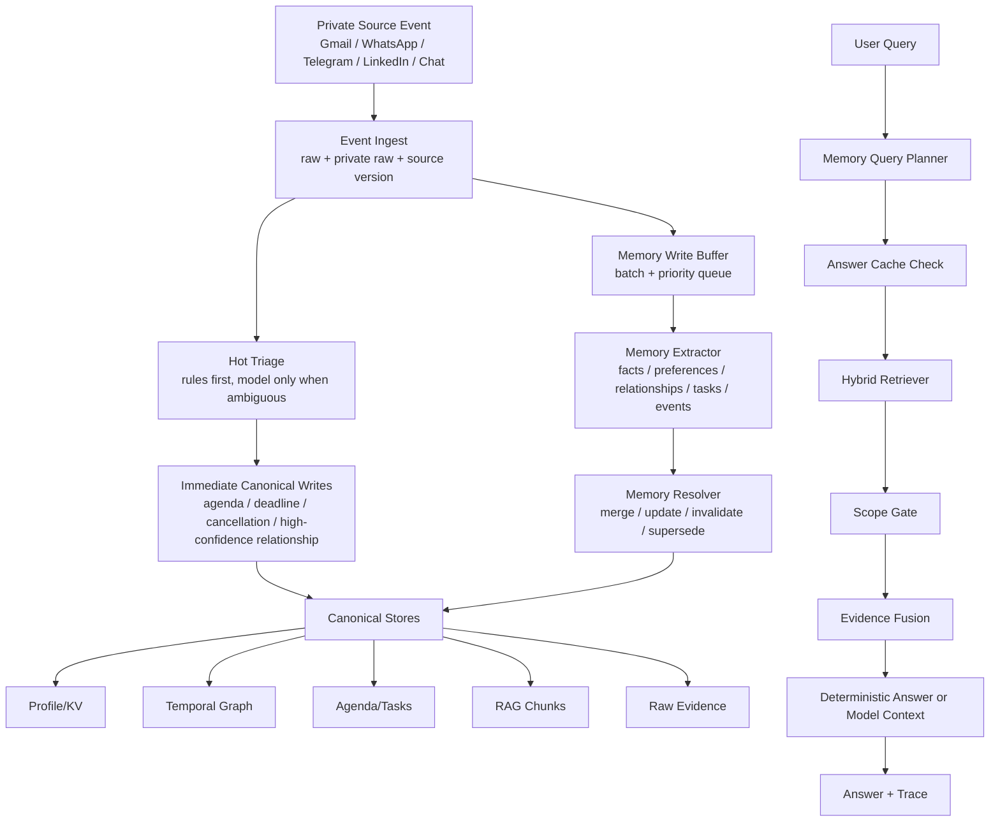

# Nomi Memory Runtime v2 Design

**日期**：2026-07-03

**目标**：把 Nomi 当前分散的 KV、知识图谱、RAG、日程、短期对话和原文证据，重构为一个统一、可追踪、可解释、可控延迟的 Memory Runtime。它必须解决当前真实问题：WhatsApp/Gmail/Telegram 事件能稳定写入记忆，家庭/关系事实能正确归属到发消息的人，日程中的相对时间必须变成绝对日期，取消/改期必须覆盖旧状态，用户提问时能按需召回正确上下文，同时避免跨联系人泄露。

**结论**：第一版不直接 fork 或魔改 Graphiti、mem0、LangMem。Nomi 先实现自己的 Postgres-backed Memory Runtime v2；Graphiti、mem0/LangMem、Qdrant Alloy、GPTCache、GraphRAG 都只通过 adapter 或小规模 spike 验证后再决定是否引入。

---

## 1. 背景和当前问题

当前 Nomi 已经具备一些基础：

- 原始事件表：`events`
- 语义事件：`semantic_events`
- 长期事实和状态：`facts`、`memory_states`
- 向量召回：`memory_vectors`
- 关系图雏形：`entities`、`relationships`、`knowledge_entities`、`knowledge_edges`
- 日程：`agenda_items`、`agenda_item_versions`、`agenda_reminders`
- 对话：`assistant_conversations`、`assistant_turns`
- 上下文 trace：`context_snapshots`
- 路由：`runtime_api/app/chat_router.py`
- 并行召回：`runtime_api/app/context_parallel.py`
- worker 写入：`worker/app/worker.py`

但现在的系统边界不够清晰：

1. **写入链路不够稳定**
   - 同一条 WhatsApp/Gmail/Telegram 消息可能只进了原始事件，却没有稳定升级成事实、关系、日程或任务。
   - `王超他儿子叫张红` 这类事实必须变成 `王超 -> 儿子 -> 张红`，而不是变成“用户的儿子叫张红”。

2. **记忆生命周期不完整**
   - 当前更像 append-only 记忆。
   - 取消、改期、偏好更新、事实纠正没有统一的 `active/superseded/cancelled/invalidated` 语义。

3. **scope 隔离不够产品化**
   - 虽然 `memory_scope_for_event()` 已经生成 `conversation_label`、`speaker`、`related_entities`、`sensitivity`，但召回和回答阶段没有统一执行 strict scope policy。
   - 联系人 A 对联系人 B 的负面评价，不能在给 B 发消息或与 B 对话时泄露。

4. **召回入口分散**
   - KV、graph、RAG、timeline、agenda、source context 都能查，但缺少一个统一的 `MemoryQueryPlanner + HybridRetriever + EvidenceFusion`。
   - 最近修过重复 retrieval，但整体仍然像多条路径拼接，不像一个内聚的 runtime。

5. **证据和版本不够强**
   - 回答“人民广场会面是几月几号几点”时，必须能指向具体源消息、源时间、解析过程和日程版本。
   - 稳定答案缓存必须按证据版本失效，而不是按 query 字符串长期缓存。

---

## 2. 开源调研结论如何落到 Nomi

参考报告：[2026-07-03-memory-systems-research-report.md](/Users/wrf/Documents/background/docs/superpowers/reports/2026-07-03-memory-systems-research-report.md)

### 2.1 采用什么

| 项目 | 借鉴点 | Nomi 落地方式 |
|---|---|---|
| Graphiti | temporal graph、`valid_at`、`invalid_at`、`group_id`、hybrid graph search | 先在 Postgres 中设计 temporal graph schema；之后做 Graphiti adapter spike |
| mem0 | memory add/search/update/delete lifecycle、scope filter、history | 用于设计 `MemoryWriteManager` 和 `MemoryAssertion` 生命周期 |
| LangMem | semantic/profile/episodic/procedural memory、hot path vs background、namespace | 用于设计后台批量落记忆和 namespace/scope |
| Qdrant Alloy | dense + sparse + late-interaction retrieve/rerank | 用于设计统一 `HybridRetriever`，不直接替换现有 pgvector |
| GPTCache | semantic answer cache、cache latency metric | 用于 `AnswerCache`，但必须按 evidence version 失效 |
| GraphRAG | 离线文档图谱、局部/全局图查询 | 只用于简历/JD/岗位库离线索引思路，不进聊天热路径 |

### 2.2 不采用什么

- 不直接把 Graphiti 作为所有聊天查询的同步依赖。
- 不把 mem0 的 generic memory schema 当作 Nomi 的唯一事实模型。
- 不把 GraphRAG 放进 WhatsApp/Gmail 每条消息处理链路。
- 不用纯 GPTCache 掩盖记忆写入错误。

---

## 3. 设计选择

### 方案 A：Nomi 自研 Memory Runtime v2，外部项目仅做 adapter spike

这是推荐方案。

优点：

- 最贴合 Nomi 的私有账号、联系人、日程、主动建议、Android 实时交互。
- 可以复用现有 Postgres 表和 worker，不需要一次性引入重型依赖。
- scope、安全、证据、缓存和 trace 都能按产品需要设计。

代价：

- 需要自己实现一层 runtime 契约。
- 需要后续用 Graphiti/mem0/LangMem 做小规模对比，避免闭门造车。

### 方案 B：直接引入 Graphiti + mem0

优点：

- 可以快速拿到成熟图谱/记忆 lifecycle 能力。

问题：

- 运行成本、依赖复杂度、迁移风险不可控。
- Nomi 的 agenda、proactive suggestion、Android realtime、账号隔离仍然要自己做。
- 容易变成两个系统互相同步，调试成本高。

### 方案 C：保留现有系统，只修补关键词和 SQL

优点：

- 短期改动少。

问题：

- 不能从根上解决“为什么重复生成主动建议”“为什么 WhatsApp 事实没进正确记忆”“为什么取消事项还在”“为什么跨联系人可能泄露”。

**最终选择：方案 A。**

### 3.1 Review 后的 P0 修正

这份方案不能只解决“记忆怎么查”，还必须解决“真实账号消息是否稳定进来、是否重复、是否归属正确”。因此进入实施前增加 6 个 P0 约束：

1. **采集可靠性是 Memory Runtime 的上游依赖，不是外部假设**
   - WhatsApp/Gmail/Telegram/LinkedIn 的登录状态、collector 心跳、最后成功事件、异常原因、重连次数必须结构化入库。
   - 用户问“为什么没有记录”时，系统必须能回答是“没采集到”“采集到了但未解析”“解析失败”“被 scope gate 过滤”。

2. **每条源消息必须幂等**
   - 同一平台账号、同一会话、同一消息 id 或同一稳定 fingerprint，只能生成一条 canonical ingest event。
   - 同一 evidence version 不能重复生成相同主动建议、相同日程、相同关系事实。

3. **身份解析必须优先于事实写入**
   - `我儿子叫王刚` 的 subject 是发消息的人，不是 Nomi 用户。
   - `王超他儿子叫张红` 的 subject 是 `王超`。
   - `大刚`、`wang`、手机号、WhatsApp display name、通讯录名必须经过 identity resolver 归一后再写事实。

4. **Answer Cache 不能在不知道证据版本时直接命中**
   - cache check 分两步：先用 query/scope 找候选，再用 dependency evidence version 快速校验。
   - 找不到 dependency 或 evidence changed 时必须走 retrieval。

5. **Phase 1 必须交付最小可用闭环**
   - 不能只做 trace。
   - Phase 1 就要让 `张红是谁？`、`人民广场会面几点？`、`取消的安排不要再提醒` 三类问题在真实/fixture 数据上闭环。

6. **schema 必须包含索引、唯一约束、回滚和死信**
   - 2C/4G 服务器不能靠全表扫。
   - migration 必须可回滚，不破坏旧表。
   - 多次失败的事件进入 dead letter，不允许无限重试拖垮 worker。

---

## 4. Memory Runtime v2 总体架构



核心原则：

- **原始事件必须先落库**，这是唯一不可丢的数据。
- **热路径只处理高置信、低成本、强时效的结构化内容**，例如明确日程、取消、截止、家庭关系。
- **长期记忆抽取可以批量异步**，尤其是普通聊天和低重要度邮件。
- **回答用户问题必须经过 query planner**，不能让每个 endpoint 自己决定查哪些表。
- **所有回答都基于 evidence bundle**，不是裸文本拼接。

---

## 5. 数据模型设计

第一版尽量复用现有表，但新增几个 v2 表来补齐缺口。

### 5.1 事件和证据

新增表：`memory_evidence`

用途：统一记录任何事实、关系、日程、任务、缓存答案背后的证据。

字段：

| 字段 | 类型 | 说明 |
|---|---|---|
| `id` | UUID | 证据 id |
| `source_event_id` | TEXT | 对应 `events.event_id` 或外部消息 id |
| `source` | TEXT | `gmail`、`whatsapp`、`telegram`、`linkedin`、`android_chat` |
| `account_id` | TEXT | 用户登录的账号，例如某个 Gmail/WhatsApp/LinkedIn session |
| `conversation_id` | TEXT | 频道内会话 id |
| `contact_id` | TEXT | 联系人 id 或规范化名称 |
| `speaker_id` | TEXT | 谁说的 |
| `observed_at` | TIMESTAMPTZ | 采集到消息的时间 |
| `source_created_at` | TIMESTAMPTZ | 原平台消息创建时间 |
| `source_version` | TEXT | 源事件内容版本 hash |
| `text_excerpt` | TEXT | 可展示的短摘录 |
| `raw_ref` | JSONB | 指向 raw private data 的引用 |
| `scope` | JSONB | scope policy |
| `created_at` | TIMESTAMPTZ | 入库时间 |

现有 `events.raw_data_private` 继续保存本地私有原文。`memory_evidence.raw_ref` 不复制敏感原文，只保存可追踪引用。

### 5.2 事实断言

新增表：`memory_assertions`

用途：承载 mem0 风格的 memory lifecycle，但保留 Nomi 的 scope/evidence。

字段：

| 字段 | 类型 | 说明 |
|---|---|---|
| `id` | UUID | assertion id |
| `assertion_type` | TEXT | `fact`、`preference`、`profile`、`task_constraint`、`job_signal` |
| `subject` | TEXT | 主体，例如 `王超`、`user`、`PHONE_1 客户报价` |
| `predicate` | TEXT | 关系/属性，例如 `has_son`、`cares_about` |
| `object` | TEXT | 客体，例如 `张红` |
| `value` | JSONB | 结构化值 |
| `confidence` | DOUBLE PRECISION | 置信度 |
| `status` | TEXT | `active`、`superseded`、`retracted`、`conflicting` |
| `valid_from` | TIMESTAMPTZ | 生效时间 |
| `valid_until` | TIMESTAMPTZ | 失效时间 |
| `evidence_ids` | UUID[] | 证据 |
| `supersedes_id` | UUID | 覆盖的旧 assertion |
| `scope` | JSONB | scope policy |
| `created_at` | TIMESTAMPTZ | 创建时间 |
| `updated_at` | TIMESTAMPTZ | 更新时间 |

现有 `facts` 和 `memory_states` 可以作为 v1 兼容层。v2 写入时同时写 `memory_assertions`，再按需要同步到 `facts/memory_states`。

### 5.3 时间关系图

新增表：

- `memory_nodes`
- `memory_edges`

`memory_nodes`：

| 字段 | 类型 | 说明 |
|---|---|---|
| `id` | UUID | node id |
| `node_type` | TEXT | `person`、`organization`、`place`、`event`、`job`、`product` |
| `canonical_name` | TEXT | 规范名 |
| `aliases` | TEXT[] | 别名 |
| `scope` | JSONB | 可见范围 |
| `payload` | JSONB | 额外信息 |
| `created_at` | TIMESTAMPTZ | 创建时间 |
| `updated_at` | TIMESTAMPTZ | 更新时间 |

`memory_edges`：

| 字段 | 类型 | 说明 |
|---|---|---|
| `id` | UUID | edge id |
| `from_node_id` | UUID | 起点 |
| `to_node_id` | UUID | 终点 |
| `relation_type` | TEXT | `has_son`、`works_at`、`met_at`、`said_about` |
| `fact_text` | TEXT | 规范化事实 |
| `confidence` | DOUBLE PRECISION | 置信度 |
| `valid_from` | TIMESTAMPTZ | 生效时间 |
| `valid_until` | TIMESTAMPTZ | 失效时间 |
| `invalidated_by` | UUID | 哪条 edge/assertion 使其失效 |
| `evidence_ids` | UUID[] | 证据 |
| `scope` | JSONB | scope policy |
| `payload` | JSONB | 额外信息 |
| `created_at` | TIMESTAMPTZ | 创建时间 |
| `updated_at` | TIMESTAMPTZ | 更新时间 |

现有 `entities/relationships/knowledge_entities/knowledge_edges` 作为 v1 表保留。v2 可以先双写，后续再迁移读路径。

### 5.4 答案缓存

新增表：`memory_answer_cache`

字段：

| 字段 | 类型 | 说明 |
|---|---|---|
| `id` | UUID | cache id |
| `cache_key` | TEXT UNIQUE | query + scope + evidence version hash |
| `normalized_query` | TEXT | 规范化问题 |
| `scope_hash` | TEXT | scope hash |
| `evidence_version_hash` | TEXT | 被引用证据版本 hash |
| `answer` | TEXT | 答案 |
| `answer_payload` | JSONB | 结构化答案、引用、置信度 |
| `risk_level` | TEXT | `low`、`medium`、`high` |
| `expires_at` | TIMESTAMPTZ | 过期时间 |
| `created_at` | TIMESTAMPTZ | 创建时间 |
| `last_hit_at` | TIMESTAMPTZ | 最近命中 |

缓存只允许用于：

- 低风险事实问答
- 日程查询
- 个人资料/偏好查询
- 已经有强证据版本的 job/profile 查询摘要

不能缓存：

- 外部动作确认
- 支付/下单/发消息
- 高风险隐私输出
- 需要读取最新页面状态的 LinkedIn/WhatsApp 页面问题

### 5.5 检索 trace

新增表：`memory_retrieval_traces`

用途：解释为什么这次回答查了/没查某些记忆。

字段：

| 字段 | 类型 | 说明 |
|---|---|---|
| `id` | UUID | trace id |
| `request_event_id` | TEXT | 用户问题 event |
| `query` | TEXT | 原始问题 |
| `route_decision` | JSONB | planner 输出 |
| `fetch_plan` | JSONB | 召回计划 |
| `retrieved_items` | JSONB | 候选证据 |
| `filtered_items` | JSONB | 被 scope/token/risk 过滤的候选 |
| `final_evidence_ids` | UUID[] | 最终证据 |
| `latency` | JSONB | 每一步耗时 |
| `answer_cache` | JSONB | cache hit/miss |
| `created_at` | TIMESTAMPTZ | 创建时间 |

### 5.6 采集可靠性和幂等表

新增表：`collector_sessions`

用途：记录每个真实账号采集器的运行状态，避免“账号明明登录了但系统说没有记录”这种黑盒问题。

字段：

| 字段 | 类型 | 说明 |
|---|---|---|
| `id` | UUID | session id |
| `source` | TEXT | `gmail`、`whatsapp`、`telegram`、`linkedin` |
| `account_id` | TEXT | 账号标识 |
| `browser_profile_id` | TEXT | 云端浏览器 profile |
| `login_state` | TEXT | `unknown`、`logged_out`、`login_required`、`logged_in`、`collecting`、`degraded`、`blocked` |
| `last_heartbeat_at` | TIMESTAMPTZ | 采集器心跳 |
| `last_success_event_at` | TIMESTAMPTZ | 最后一条成功采集事件时间 |
| `last_error_code` | TEXT | 最近错误 |
| `last_error_message` | TEXT | 最近错误详情 |
| `reconnect_attempts` | INTEGER | 连续重连次数 |
| `session_version` | TEXT | cookie/localStorage/browser profile hash |
| `created_at` | TIMESTAMPTZ | 创建时间 |
| `updated_at` | TIMESTAMPTZ | 更新时间 |

新增表：`memory_ingest_events`

用途：把源平台事件转成 Nomi 内部的幂等事件，所有 memory write 都从这里开始。

字段：

| 字段 | 类型 | 说明 |
|---|---|---|
| `id` | UUID | ingest event id |
| `source_event_uid` | TEXT UNIQUE | 稳定唯一 id，格式为 `source:account:conversation:message`；没有 message id 时用 normalized fingerprint |
| `source_fingerprint` | TEXT | 内容、发送者、时间窗口、会话的 hash |
| `source` | TEXT | 来源 |
| `account_id` | TEXT | 平台账号 |
| `conversation_id` | TEXT | 平台会话 |
| `contact_id` | TEXT | 联系人 |
| `speaker_id` | TEXT | 发消息的人 |
| `message_id` | TEXT | 平台消息 id |
| `source_created_at` | TIMESTAMPTZ | 平台消息时间 |
| `observed_at` | TIMESTAMPTZ | Nomi 采集时间 |
| `payload_hash` | TEXT | 原文 payload hash |
| `raw_event_id` | TEXT | 对应 `events.event_id` |
| `status` | TEXT | `raw_written`、`triaged`、`extracted`、`resolved`、`ignored`、`dead_letter` |
| `attempts` | INTEGER | worker 尝试次数 |
| `last_error` | TEXT | 最近失败原因 |
| `created_at` | TIMESTAMPTZ | 创建时间 |
| `updated_at` | TIMESTAMPTZ | 更新时间 |

新增表：`memory_dead_letters`

用途：保存多次失败或无法解析的事件，不能无限重试。

字段：

| 字段 | 类型 | 说明 |
|---|---|---|
| `id` | UUID | dead letter id |
| `ingest_event_id` | UUID | 对应 `memory_ingest_events.id` |
| `failure_stage` | TEXT | `triage`、`extract`、`resolve`、`write` |
| `error_code` | TEXT | 错误码 |
| `error_message` | TEXT | 错误详情 |
| `payload_ref` | JSONB | 原始事件引用 |
| `created_at` | TIMESTAMPTZ | 创建时间 |

新增表：`suggestion_emissions`

用途：阻止同一证据反复生成同一条主动建议。

字段：

| 字段 | 类型 | 说明 |
|---|---|---|
| `id` | UUID | emission id |
| `suggestion_key` | TEXT UNIQUE | `suggestion_type + primary_evidence_version + target_user + channel` 的 hash |
| `suggestion_type` | TEXT | `agenda_followup`、`deadline_reminder`、`job_recommendation` 等 |
| `primary_evidence_id` | UUID | 主证据 |
| `primary_evidence_version` | TEXT | 证据版本 |
| `target_user_id` | TEXT | 推送给谁 |
| `channel` | TEXT | Android/Web/其他 |
| `status` | TEXT | `queued`、`sent`、`dismissed`、`acted`、`expired` |
| `created_at` | TIMESTAMPTZ | 创建时间 |
| `updated_at` | TIMESTAMPTZ | 更新时间 |

### 5.7 身份解析表

新增表：`identity_profiles`

用途：把平台账号、通讯录名、手机号、display name、LinkedIn profile 等映射成稳定 person identity。

字段：

| 字段 | 类型 | 说明 |
|---|---|---|
| `id` | UUID | identity id |
| `owner_user_id` | TEXT | Nomi 用户 |
| `canonical_name` | TEXT | 规范名，例如 `王超` |
| `display_names` | TEXT[] | 观察到的名字，例如 `大刚`、`wang` |
| `identity_type` | TEXT | `person`、`organization`、`assistant`、`unknown` |
| `confidence` | DOUBLE PRECISION | 归一置信度 |
| `scope` | JSONB | 可见范围 |
| `created_at` | TIMESTAMPTZ | 创建时间 |
| `updated_at` | TIMESTAMPTZ | 更新时间 |

新增表：`identity_links`

用途：记录某个平台上的具体账号/联系人如何链接到 identity。

字段：

| 字段 | 类型 | 说明 |
|---|---|---|
| `id` | UUID | link id |
| `identity_id` | UUID | 对应 `identity_profiles.id` |
| `source` | TEXT | `whatsapp`、`telegram`、`gmail`、`linkedin`、`contacts` |
| `external_id` | TEXT | 平台侧 id、手机号、email、profile url |
| `display_name` | TEXT | 平台显示名 |
| `link_confidence` | DOUBLE PRECISION | 链接置信度 |
| `evidence_ids` | UUID[] | 支撑证据 |
| `status` | TEXT | `active`、`conflicting`、`rejected` |
| `created_at` | TIMESTAMPTZ | 创建时间 |
| `updated_at` | TIMESTAMPTZ | 更新时间 |

身份解析规则：

- 如果句子主语是第三人称实体，例如 `王超他儿子叫张红`，subject=`王超`。
- 如果句子主语是第一人称，例如 `我儿子叫王刚`，subject=`speaker_id` 对应的 identity，而不是 Nomi 用户。
- 如果消息来自用户自己和 Nomi 的对话，第一人称才指向 Nomi 用户。
- 如果联系人 display name 和通讯录名冲突，优先通讯录名，但保留平台名为 alias。
- 低置信 identity link 不参与 deterministic answer，只能作为模型上下文候选。

### 5.8 索引、唯一约束和迁移约束

必须创建的约束：

```sql
CREATE UNIQUE INDEX IF NOT EXISTS memory_ingest_events_source_uid_idx
ON memory_ingest_events(source_event_uid);

CREATE UNIQUE INDEX IF NOT EXISTS suggestion_emissions_key_idx
ON suggestion_emissions(suggestion_key);

CREATE INDEX IF NOT EXISTS memory_evidence_source_scope_idx
ON memory_evidence(source, account_id, conversation_id, source_created_at DESC);

CREATE INDEX IF NOT EXISTS memory_assertions_lookup_idx
ON memory_assertions(subject, predicate, object, status, updated_at DESC);

CREATE INDEX IF NOT EXISTS memory_edges_relation_idx
ON memory_edges(relation_type, valid_until, updated_at DESC);

CREATE INDEX IF NOT EXISTS memory_nodes_name_idx
ON memory_nodes(canonical_name);

CREATE INDEX IF NOT EXISTS memory_retrieval_traces_request_idx
ON memory_retrieval_traces(request_event_id, created_at DESC);

CREATE INDEX IF NOT EXISTS identity_links_external_idx
ON identity_links(source, external_id);
```

JSONB 字段如果进入查询条件，必须加 GIN 索引；否则只能用于 trace 展示，不允许在热路径全表扫。

迁移要求：

- 所有新增表使用 `CREATE TABLE IF NOT EXISTS` 和 `ALTER TABLE ... ADD COLUMN IF NOT EXISTS`。
- 每个 migration 都要有 rollback 文档：第一版 rollback 允许只停用 v2 读路径，不删除新表。
- v2 双写失败不能影响 v1 旧链路，但必须写 trace 和 dead letter。
- 任何回填脚本都必须支持 dry-run、limit、resume cursor。

---

## 6. Scope Policy

每条记忆都必须有 scope，不能只有 source。

### 6.1 Scope 结构

```json
{
  "owner_user_id": "default",
  "account_id": "gmail:xxx",
  "channel": "whatsapp",
  "conversation_id": "wa_chat_x",
  "contact_id": "王超",
  "speaker_id": "王超",
  "related_entities": ["王超", "张红"],
  "visibility": "user_private",
  "sensitivity": "normal",
  "usable_contexts": ["private_answer", "personal_search", "self_reminder"],
  "not_usable_contexts": ["reply_to_contact", "external_message"]
}
```

### 6.2 Visibility 类型

| 类型 | 含义 |
|---|---|
| `user_private` | 只给用户自己看 |
| `account_private` | 某个账号内私有 |
| `conversation_private` | 某个会话内私有 |
| `contact_private` | 与某联系人相关，只能用于用户私下分析 |
| `third_party_private_negative` | 涉及第三方负面评价，不能用于外部消息 |
| `shareable_summary` | 可用于生成对外回复的低敏摘要 |
| `assistant_operational` | Nomi 自己运行状态 |

### 6.3 查询使用场景

每次 query 都带 `usage_context`：

- `private_answer`：用户自己问 Nomi
- `personal_search`：用户搜索自己的资料
- `self_reminder`：主动提醒用户
- `reply_to_contact`：帮用户回复某联系人
- `external_message`：Nomi 代发 WhatsApp/Gmail/SMS
- `external_tool_context`：给 OpenClaw/Composio 等工具使用

`ScopeGate` 必须执行：

- `private_answer` 可以使用大部分用户私有记忆。
- `reply_to_contact` 和 `external_message` 必须过滤 `third_party_private_negative` 和非当前联系人允许共享的记忆。
- `external_tool_context` 只给最小必要上下文。

---

## 7. 写入流程

### 7.1 所有事件都先进入 raw event

输入包括：

- WhatsApp DOM/协议事件
- Telegram Web 事件
- Gmail thread snapshot
- LinkedIn 页面/搜索结果/职位/JD
- Android 用户对话
- 主动建议反馈

写入：

1. `events`
2. `raw_data_private`
3. `memory_ingest_events`
4. `memory_evidence`
5. worker queue

写入顺序要求：

- `events` 写入成功后，才创建 `memory_ingest_events`。
- `memory_ingest_events.source_event_uid` 冲突时，视为重复事件，不重复进入 worker queue。
- `memory_evidence` 必须引用 `raw_event_id` 或 `memory_ingest_events.id`。
- 如果 collector 当前 `login_state != logged_in/collecting`，仍允许用户问题进入聊天，但检索 trace 必须记录对应 source 不可信。

### 7.1.1 Collector 状态和事件回放

Collector 每次启动、心跳、登录状态变化、异常都更新 `collector_sessions`。

状态语义：

| 状态 | 含义 | 对用户回答的影响 |
|---|---|---|
| `unknown` | 未检测 | 回答中不能断言“没有记录” |
| `logged_out` | 明确未登录 | 提示需要重新登录 |
| `login_required` | 平台要求重新认证 | 提示登录状态异常 |
| `logged_in` | 已登录但未采集中 | 可以查询历史，但要提示实时采集未确认 |
| `collecting` | 正常采集 | 可正常回答 |
| `degraded` | 部分页面/会话采集异常 | 回答必须带不完整提示 |
| `blocked` | 平台阻断/验证码/数据库错误 | 停止重试，等待用户处理 |

回放规则：

- collector 恢复后，必须从 `source_event_cursors` 或平台最近消息列表回放缺口。
- 回放事件仍使用同一 `source_event_uid`，保证不会重复写记忆。
- 如果平台无法提供稳定 message id，使用 `source + account + conversation + normalized_text + source_created_at_bucket + speaker` 生成 fingerprint。

### 7.2 Hot Triage

Hot Triage 是低延迟规则优先路径，只处理明确场景：

| 场景 | 处理 |
|---|---|
| 明确日程 | 立即写/更新 `agenda_items` |
| 明确取消 | 立即把匹配日程置为 `canceled` 并写 version |
| 明确改期 | 旧日程 `rescheduled/superseded`，新日程 `scheduled` |
| 明确截止任务 | 写 `internal_todos` 或 pipeline task |
| 明确家庭关系 | 写 `memory_edges` 和 `memory_assertions` |
| 明确用户偏好/暗号 | 写 `memory_assertions` |

Hot Triage 的规则必须使用 `observed_at` 解析相对时间：

- `明天` = `source_created_at` 或 `observed_at` 的下一天。
- `周五` = 从事件时间向后寻找最近的周五；如果当天已过并无“本周”限定，也取未来最近周五。
- 所有日程答案禁止只展示“明天”，必须展示具体日期。
- 解析出的绝对时间必须写入 `value.start_at`、`value.end_at` 或 `agenda_items.start_at/end_at`，原始表达只放在 `raw_text/raw_time_text`。

Hot Triage 必须先运行 identity resolver：

- 第一人称来自用户与 Nomi 对话：subject=`owner_user_id`。
- 第一人称来自 WhatsApp/Telegram/Gmail/LinkedIn 联系人：subject=`speaker_identity_id`。
- 第三人称实体优先作为 subject。
- 无法解析 subject 的家庭/关系事实进入 `memory_dead_letters` 或 `memory_write_review`，不允许写成用户事实。

### 7.3 Background Memory Extraction

用于普通聊天、邮件长文本、LinkedIn 页面、低重要度消息。

触发条件：

- 每 15 轮用户/Nomi 对话批量总结一次。
- 每个 channel 的消息缓存达到数量或时间窗口后批量处理。
- 高价值 source，例如 Gmail 会议邮件、LinkedIn JD、简历上传，立即进入高优先级后台处理。

输出候选：

```json
{
  "candidate_type": "fact | preference | relationship | agenda | task | job_signal | profile_update",
  "subject": "王超",
  "predicate": "has_son",
  "object": "张红",
  "value": {},
  "confidence": 0.88,
  "evidence_ids": ["..."],
  "scope": {},
  "write_policy": "insert | update | supersede | cancel | ignore | quarantine"
}
```

### 7.4 Memory Resolver

Resolver 负责把候选写成 canonical memory。

规则：

- 同一 subject/predicate/object/scope 的高置信事实：合并证据。
- 新事实与旧事实冲突：旧事实标记 `superseded` 或 `conflicting`，不直接删除。
- 取消/改期：必须关联旧 agenda 的 dedupe key、地点、参与人、时间窗口。
- 缺字段事件：写入 `needs_clarification=true`，但不能伪造具体时间/地点。
- 低置信候选：进入 `event_quarantine` 或 `memory_write_review`，不参与高置信回答。

---

## 8. 查询流程

### 8.1 Memory Query Planner

输入：

- 用户问题
- 最近 15 轮对话
- 当前 UI state
- active task / suggestion
- channel/account/contact scope

输出：

```json
{
  "intent": "simple_chat | memory_query | agenda_query | relationship_query | job_query | task_request | source_question",
  "needs": {
    "dialogue": true,
    "profile": false,
    "temporal_graph": false,
    "agenda": false,
    "tasks": false,
    "rag": false,
    "raw_evidence": false,
    "career": false
  },
  "entities": [
    {"type": "person", "text": "张红", "confidence": 0.92}
  ],
  "time_range": {
    "kind": "open",
    "start": null,
    "end": null,
    "raw": ""
  },
  "scope_policy": {
    "usage_context": "private_answer",
    "allowed_channels": ["whatsapp", "gmail", "telegram", "linkedin"],
    "contact_id": null
  },
  "risk_level": "low",
  "reason": "用户询问人物身份，需要关系图谱和事实记忆。"
}
```

Planner 策略：

1. 规则高速路径：
   - 明确日程问答走 `agenda_query`
   - 明确人物关系走 `relationship_query`
   - 明确找工作走 `job_query`
   - 外部动作走 `task_request`
2. 语义路由补漏：
   - “她回了吗”“那件事呢”“这个还继续吗”需要结合最近对话和相关记忆。
3. 低置信时保守：
   - 先召回最小上下文。
   - 如果证据不足，回答“不确定，需要你补充”而不是编造。

### 8.2 Answer Cache

查询前先做 cache candidate lookup，但只在 planner 判定为低风险、证据版本未变时命中。

正确顺序：

1. `MemoryQueryPlanner` 输出 normalized query、usage context、scope policy、intent。
2. 用 `normalized_query + usage_context + scope_hash + route_intent` 查 cache candidate。
3. 读取 candidate 中记录的 `dependency_evidence_ids` 和 `evidence_version_hash`。
4. 对这些 evidence 做轻量 version check。
5. version 未变才返回 cache；version 变化、缺少 dependency、source live state required 都走 retrieval。

Cache key：

```text
sha256(normalized_query + usage_context + scope_hash + evidence_version_hash + route_intent)
```

Cache miss 原因必须写 trace：

- `no_cache`
- `evidence_changed`
- `high_risk`
- `source_live_state_required`
- `expired`
- `dependency_missing`
- `dependency_version_changed`

### 8.3 Hybrid Retriever

一个统一入口：

```python
retrieve_memory(query, plan) -> EvidenceBundle
```

内部并行：

- `ProfileRetriever`：用户画像、偏好、暗号、职业 profile
- `TemporalGraphRetriever`：人物/组织/地点/关系/事件
- `AgendaRetriever`：日程和提醒
- `TaskRetriever`：todo、pipeline 状态
- `VectorRetriever`：RAG 原文片段
- `SourceRetriever`：必要时读取 Gmail/WhatsApp/Telegram/LinkedIn 原始证据
- `DialogueRetriever`：最近 15 轮和会话摘要

输出统一为：

```json
{
  "items": [
    {
      "id": "evidence_or_memory_id",
      "kind": "assertion | edge | agenda | raw_event | vector_chunk | dialogue_turn",
      "text": "王超他儿子叫张红",
      "structured": {},
      "score": 0.91,
      "confidence": 0.88,
      "source": "whatsapp",
      "scope": {},
      "evidence_ids": ["..."],
      "version_hash": "..."
    }
  ],
  "latency": {},
  "warnings": []
}
```

### 8.4 Scope Gate

Scope Gate 在 fusion 前执行，不能交给模型自己判断。

规则：

- `third_party_private_negative` 不进入 `reply_to_contact`、`external_message`。
- 当前联系人外的私密对话默认不进入对该联系人的回复上下文。
- 用户自己问 Nomi 时可以使用更广的私有记忆，但答案应说明证据来源，不泄露不必要原文。
- tool context 必须经过最小必要字段过滤。

### 8.5 Evidence Fusion

Fusion 负责：

- 去重
- 按 evidence version 排序
- 优先 canonical memory，必要时补 raw evidence
- 日程以 `agenda_items` 当前状态为准
- 关系以 active edge/assertion 为准
- RAG 片段只能作为补充，不能覆盖 canonical 事实
- 输出 token budget
- 生成 `evidence_version_hash`，供 answer cache 使用
- 输出 `missing_but_required_sources`，例如 Gmail collector 断线导致会议邮件不可信

如果证据足够，可以直接 deterministic answer：

- `张红是谁？`：图谱有 `王超 -> has_son -> 张红`
- `人民广场会面几点？`：agenda 有 exact start
- `周五18点前我要做什么？`：task/deadline 有 exact due

否则进入模型回答，但模型只看到 evidence bundle，不直接看到全部原始私有数据。

---

## 9. 与现有系统的兼容方式

### 9.1 不推倒重来

保留：

- `events`
- `semantic_events`
- `memory_vectors`
- `agenda_items`
- `agenda_item_versions`
- `agenda_reminders`
- `assistant_turns`
- `context_snapshots`

新增 v2 表后，先双写：

- `facts` + `memory_assertions`
- `relationships` + `memory_edges`
- `knowledge_entities/knowledge_edges` + `memory_nodes/memory_edges`

读路径逐步迁移：

1. `MemoryQueryPlanner` 仍兼容 `ChatContextRoute`
2. `HybridRetriever` 先包装现有 SQL/retrieval 函数
3. `EvidenceFusion` 输出兼容现有 `build_context_pack`
4. 稳定后再减少旧路径

### 9.2 现有代码边界建议

新增模块：

- `runtime_api/app/memory_runtime/__init__.py`
- `runtime_api/app/memory_runtime/planner.py`
- `runtime_api/app/memory_runtime/retrievers.py`
- `runtime_api/app/memory_runtime/scope_gate.py`
- `runtime_api/app/memory_runtime/fusion.py`
- `runtime_api/app/memory_runtime/cache.py`
- `runtime_api/app/memory_runtime/traces.py`
- `worker/app/memory_runtime_writer.py`
- `worker/app/memory_extractor.py`
- `worker/app/memory_resolver.py`

现有模块调整：

- `chat_router.py`：保留规则，但输出升级为 planner decision。
- `context_parallel.py`：继续做并行执行，但 fetcher 来源改为 `HybridRetriever`。
- `main.py`：减少大文件内 memory 逻辑，把 `/api/chat` 只保留 orchestration。
- `worker.py`：逐步拆出 memory writer/resolver，避免继续膨胀。

---

## 10. 性能设计

目标：

| 阶段 | 目标耗时 |
|---|---:|
| Query Planner 规则路径 | < 50ms |
| Query Planner 语义路由 | < 800ms |
| Answer Cache 命中 | < 100ms |
| Hybrid Retrieval 常规 | < 1500ms |
| Scope Gate + Fusion | < 150ms |
| 简单 deterministic answer | < 800ms 总耗时 |
| 需要模型的首 token | 尽量 < 3000ms |

策略：

- 记忆写入从回答热路径移出。
- 最近 15 轮短期对话直接查 `assistant_turns`，不走向量。
- 关系/日程类问题优先查结构化表。
- RAG 只有 planner 判定需要时才查。
- 稳定事实和日程答案可以 cache。
- 所有 retriever 并行，但同一底层检索不要重复执行。

---

## 11. 验收标准

使用 fixture：[nomi_memory_cases.json](/Users/wrf/Documents/background/research/memory-systems/fixtures/nomi_memory_cases.json)

### 11.1 必须通过的真实问题

1. **家庭关系**
   - 输入 WhatsApp：`王超他儿子叫张红`
   - 用户问：`张红是谁？`
   - 预期：`张红是王超的儿子`
   - 禁止：`您的儿子叫张红`

2. **保险意图**
   - 输入 WhatsApp：`我想买个你之前说的那个保险`
   - 用户问：`我买保险最关心什么？`
   - 预期：能找到保险购买意图；如果没有偏好细节，应说明“目前只知道你有购买意向，还不知道最关心价格/保障/理赔等具体偏好”
   - 禁止：直接说没有任何记录

3. **相对时间**
   - 输入 WhatsApp：`明天下午3点半在人民广场见，带合同`
   - 用户问：`人民广场会面是几月几号几点？`
   - 预期：返回绝对日期、15:30、人民广场、带合同
   - 禁止：只说“明天下午3点半”

4. **取消**
   - 输入 WhatsApp：`明天人民广场那个见面取消了`
   - 用户问：`明天我有哪些安排？`
   - 预期：不把人民广场作为仍需执行事项；可说明该事项已取消

5. **截止任务**
   - 输入 WhatsApp：`周五18点前把报价单发我，记得核对成本和利润率`
   - 用户问：`周五18点前我要做什么？`
   - 预期：报价单、18:00、核对成本和利润率

6. **找工作**
   - 用户问：`帮我找找看有没有适合我的工作机会`
   - 预期：进入 job pipeline，使用简历/profile/LinkedIn/job source；不能只说没有职业背景

7. **跨联系人隔离**
   - A 说：`Bob这个人不靠谱，别告诉他我这么说`
   - 在给 Bob 起草消息时
   - 预期：不能引用“不靠谱”作为对外消息上下文

8. **采集状态解释**
   - Gmail collector 处于 `login_required`
   - 用户问：`我最近有要开的会吗？`
   - 预期：如果本地没有邮件证据，不能只说“没有”；必须说明 Gmail 采集状态异常或最近同步时间。

9. **主动建议去重**
   - 同一条 LinkedIn/WhatsApp evidence 被 worker 重试 3 次
   - 预期：`suggestion_emissions` 只产生一条 active/sent 建议
   - 禁止：Android 连续收到多条完全一样的“可能值得关注”

10. **第一人称归属**
   - WhatsApp 联系人 `wang` 发：`我儿子叫王刚`
   - 用户问：`王刚是谁？`
   - 预期：`王刚是 wang/对应通讯录联系人 的儿子`
   - 禁止：`王刚是您的儿子`

### 11.2 Trace 验收

每次回答必须能查到：

- planner decision
- fetch plan
- cache hit/miss
- 被召回证据
- 被 scope gate 过滤的证据
- final evidence ids
- 每阶段耗时
- collector session 状态
- ingest event id 和 dedupe 结果
- answer cache dependency version check 结果

### 11.3 UI/产品验收

- Android 悬浮窗和完整 app 的对话历史一致。
- 事实类回答可以展示简短证据来源，例如 `来源：WhatsApp，大刚，2026-07-01 19:29`。
- 主动建议不重复推送同一证据版本。
- 日程展示绝对日期。

---

## 12. 分阶段落地

### Phase 1：契约和 trace

目标：

- 新增 `memory_evidence`
- 新增 `memory_retrieval_traces`
- 新增 `collector_sessions`
- 新增 `memory_ingest_events`
- 新增 `suggestion_emissions`
- Planner 输出结构化 decision
- Retrieval trace 可查
- 完成最小可用闭环：
  - `王超他儿子叫张红` 写入后，`张红是谁？` 可以 deterministic answer。
  - `明天下午3点半在人民广场见` 写入后，查询返回绝对日期和时间。
  - `明天人民广场那个见面取消了` 写入后，旧日程不再作为待执行事项。

Phase 1 允许只覆盖家庭关系、明确日程、取消/改期、deadline 四类高置信事件；普通长文本抽取留到 Phase 2/3。

### Phase 2：关系事实和 scope gate

目标：

- 新增 `memory_assertions`
- 新增 `memory_nodes/memory_edges`
- 新增 `identity_profiles/identity_links`
- 家庭关系、联系人关系写入 graph
- `张红是谁？` 这类问题优先 deterministic answer
- 第三方负面评价不进入外部回复上下文
- 第一人称事实按消息 speaker 归属

### Phase 3：日程 canonical state

目标：

- 相对时间写入绝对日期
- 取消/改期状态机
- `agenda_items` 成为日程问答唯一真源
- reminder 使用 event type 自动提前时间：线上 10 分钟，线下至少 40 分钟，可被用户偏好覆盖
- collector 状态异常时，日程问答必须区分“没有日程”和“相关 source 未同步”

### Phase 4：HybridRetriever 和 AnswerCache

目标：

- 所有记忆查询走统一入口
- 并行召回但统一 fusion
- 稳定事实/日程类答案缓存
- cache 按 evidence version 自动失效
- cache 使用 dependency evidence version check，不允许在没有证据版本时直接命中

### Phase 5：开源项目 runtime spike

目标：

- Graphiti spike：把 `memory_edges` 的一小批数据同步进去，测关系/时间查询。
- mem0 或 LangMem spike：用同一批 WhatsApp/Gmail fixture 测 memory lifecycle。
- Qdrant Alloy spike：只测职位/JD/简历混合检索。

只有 spike 结果优于本地实现，才考虑生产 adapter。

---

## 13. 风险和约束

1. **2C/4G 服务器**
   - 第一版必须能只用 Postgres + worker 跑。
   - Graphiti/Qdrant Alloy 不作为必需依赖。

2. **真实账号采集不稳定**
   - Memory Runtime 不能假设 WhatsApp/Telegram/Gmail 永远在线。
   - Collector health 必须进入 trace，避免用户问“为什么没有记录”时无法解释。

3. **模型误抽取**
   - 高风险事实不能只靠模型。
   - 家庭关系、日程、取消、截止时间优先规则 + 模型校验。

4. **缓存误伤**
   - cache 必须绑定 evidence version。
   - 外部动作、页面状态、敏感回复默认不缓存。

5. **旧数据迁移**
   - 不能破坏现有 `facts/memory_states/agenda_items`。
   - 采用双写和回填脚本逐步迁移。

6. **真实账号页面脆弱**
   - WhatsApp/Telegram/LinkedIn 登录页面和 DOM 可能变化。
   - 采集器失败必须优先变成可解释的 collector 状态，而不是静默表现为“没有记忆”。

7. **重复事件和 worker 重试**
   - 网络抖动、页面重连、worker retry 都可能重复投递事件。
   - 所有外部事件、主动建议、日程版本都必须有业务唯一键。

---

## 14. 明确不做

第一版不做：

- 把所有历史数据一次性迁移到 Graphiti。
- 把 GraphRAG 放入实时消息处理。
- 用缓存掩盖错误记忆。
- 让模型自行决定隐私 scope。
- 为了追求“全自动”而绕过用户确认执行外部副作用。

---

## 15. 下一步实施计划要求

下一份 implementation plan 必须按 TDD 拆成小任务：

1. 新增 schema 和 migration 测试。
2. 实现 `CollectorSessionStore` 和 collector health trace。
3. 实现 `IngestEventWriter`，包含 `source_event_uid` 幂等测试。
4. 实现 `MemoryEvidenceWriter`。
5. 实现 `IdentityResolver`，覆盖第一人称归属和通讯录 alias。
6. 实现 `MemoryQueryPlanner` 契约测试。
7. 实现关系事实 extractor/resolver。
8. 实现 `SuggestionEmissionDeduper`，阻止重复主动建议。
9. 实现 scope gate。
10. 实现 agenda canonical resolver。
11. 实现 hybrid retriever facade。
12. 实现 answer cache dependency version check。
13. 用 `nomi_memory_cases.json` 做端到端回归。
14. 线上云服务器 + Android 真机验证真实 WhatsApp/Gmail/Telegram/LinkedIn 链路。

任何未实现的点必须记录到 gap 文档，不允许在报告中写“完成”。
