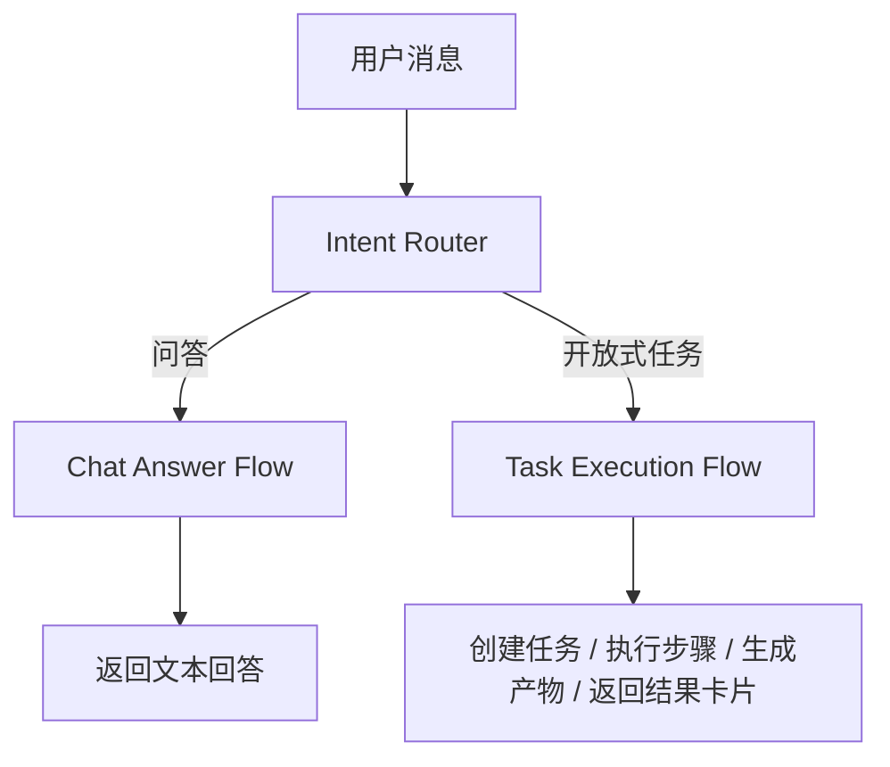
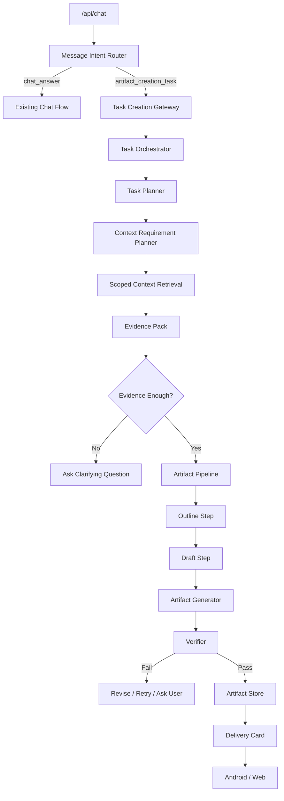

# Nomi Open Task Execution and Artifact Creation Design

## 1. 背景

当前 Nomi 的主链路已经能处理“带私有上下文的问答”：

1. 用户在 Android 悬浮窗或 Web 工作台发消息。
2. `/api/chat` 写入对话 turn。
3. `route_chat_context` 判断是否需要 dialogue、source、memory、agenda、tasks 等上下文。
4. 服务端并行召回上下文，组装 `context_pack`。
5. 日程/求职等少数问题可走确定性回答，否则调用模型返回文本。

这条链路适合回答问题，例如：

- “人民广场会面是几点？”
- “王超他儿子是谁？”
- “我最近有什么安排？”

但它不适合完成开放式任务，例如：

- “帮我依据刚刚王总给的资料写一份 PPT。”
- “根据这份 JD 和我的简历，生成一版针对性简历。”
- “整理这几封邮件，做一份会议纪要。”
- “帮我把最近客户反馈做成表格。”

这些请求不是简单问答，而是产物型任务。正确结果应该是文件、版本、证据、进度、验收报告，而不是一段聊天回复。

## 2. 目标

本设计的目标是把 `/api/chat` 从“回答入口”升级为“回答或任务入口”：



第一期以 PPT 生成为样板任务，打通完整链路：

> 用户说：“帮我依据刚刚王总给的资料，写一份 PPT。”

Nomi 应该能：

1. 判断这是 `artifact_creation_task`，不是普通问答。
2. 创建可追踪的 `task_run`。
3. 解析“刚刚王总给的资料”这个引用。
4. 从 WhatsApp、Telegram、Gmail、LinkedIn、浏览器页面、文件、长期记忆中召回相关资料。
5. 判断资料是否足够。
6. 如果不足，向用户明确询问缺失信息。
7. 如果足够，生成 PPT 大纲、逐页内容和 `.pptx` 文件。
8. 校验是否基于真实资料、是否编造、是否符合用户意图。
9. 在 Android 悬浮窗和 Web 工作台返回任务进度、文件入口、使用证据和修改选项。

## 3. 非目标

第一期不做以下事情：

1. 不让 OpenCode 或 OpenClaw 直接控制整个任务目标。
2. 不允许 agent 直接读取全量私密数据。
3. 不允许产物生成绕过证据校验。
4. 不做多人协作编辑。
5. 不做复杂模板市场。
6. 不做自动对外发送 PPT，除非后续接入独立确认流程。

## 4. 总体架构

开放式任务使用 Nomi 自己的任务控制器作为主控，外部 agent 或工具只作为受限执行器。



关键原则：

- `/api/chat` 只负责判断入口和返回用户可见状态，不直接完成复杂任务。
- `Task Orchestrator` 负责状态机、步骤、checkpoint、重试、中断。
- `Context Requirement Planner` 先判断任务需要什么资料，再按需召回。
- `Artifact Pipeline` 做具体产物生成。
- `Verifier` 必须检查“是否正确且合理”，不能只看是否成功。
- OpenCode、OpenClaw、Playwright、Composio 都是 executor，不是主控。

## 5. 用户体验

### 5.1 悬浮窗

用户发起任务后，悬浮窗不应该卡住等完整文件生成，而是显示任务卡片：

```text
Nomi 正在做：
依据王总资料生成 PPT

进度：
1. 已找到 3 条王总相关资料
2. 正在整理大纲
3. 下一步：生成 PPT 文件

按钮：
[查看进度] [补充资料] [取消]
```

完成后显示：

```text
PPT 已生成：王总项目汇报初稿.pptx

包含：
- 8 页
- 使用 3 条 WhatsApp 资料
- 使用 1 个附件
- 未使用未确认信息

按钮：
[打开文件] [查看依据] [继续修改]
```

### 5.2 Web 工作台

Web 工作台需要有任务详情页：

- 任务状态
- 用户原始请求
- 任务计划
- 每一步输出
- 使用的 evidence
- 生成的 artifact 版本
- 校验结果
- 失败原因
- 用户可操作按钮

### 5.3 失败交互

如果资料不足，不能编造：

```text
我找到了王总最近发来的 2 条消息，但没有看到 PPT 的用途和目标听众。
请补充其中一项：
1. 汇报给客户
2. 内部复盘
3. 投资人/老板汇报
```

如果文件生成失败：

```text
PPT 内容已经整理完成，但文件生成失败。
我保留了大纲和每页文案，可以重试生成文件。
```

## 6. Intent Router

新增一个任务意图层，位于现有 `route_chat_context` 之后或旁路。

### 6.1 输出结构

```json
{
  "message_kind": "chat_answer | task_request",
  "task_type": "artifact_creation | external_action | research | data_transform | unknown",
  "artifact_type": "pptx | docx | xlsx | markdown | none",
  "confidence": 0.91,
  "reason": "用户请求生成一份 PPT 文件",
  "requires_task_run": true,
  "requires_user_confirmation_before_external_effect": false,
  "risk_level": "medium"
}
```

### 6.2 判定规则

进入 `task_request` 的典型表达：

- “帮我写一份 PPT / 文档 / 表格 / 报告”
- “整理成文件”
- “做一个方案”
- “根据刚才资料生成”
- “导出 / 生成 / 制作”
- “改简历 / 生成 cover letter”

仍走普通问答的表达：

- “几点？”
- “谁？”
- “有没有？”
- “总结一下”
- “帮我看看”

边界情况：

- “总结一下王总发的资料”可以先走问答。
- “整理成 PPT 大纲”可以返回文本，但应提示可继续生成 PPT。
- “写一份完整 PPT”必须创建任务。

## 7. Task Run 数据模型

第一期复用现有 long-tail agent 任务表能力；如果字段不足，扩展 artifact 相关表。

### 7.1 task_runs

```json
{
  "task_id": "task_uuid",
  "conversation_id": "conversation_uuid",
  "source_message_event_id": "event_uuid",
  "task_type": "artifact_creation",
  "artifact_type": "pptx",
  "title": "依据王总资料生成 PPT",
  "status": "planning | gathering_context | waiting_user | generating | verifying | completed | failed | cancelled",
  "created_at": "...",
  "updated_at": "...",
  "metadata": {
    "user_request": "...",
    "client_type": "android",
    "risk_level": "medium"
  }
}
```

### 7.2 task_steps

```json
{
  "step_id": "step_uuid",
  "task_id": "task_uuid",
  "step_type": "plan | retrieve_context | outline | draft | generate_artifact | verify | deliver",
  "status": "pending | running | passed | failed | skipped",
  "input": {},
  "output": {},
  "checks": [],
  "started_at": "...",
  "finished_at": "..."
}
```

### 7.3 task_artifacts

```json
{
  "artifact_id": "artifact_uuid",
  "task_id": "task_uuid",
  "artifact_type": "pptx",
  "filename": "王总项目汇报初稿.pptx",
  "mime_type": "application/vnd.openxmlformats-officedocument.presentationml.presentation",
  "storage_path": "artifacts/task_uuid/v1.pptx",
  "version": 1,
  "source_evidence_ids": ["..."],
  "verification_status": "passed",
  "created_at": "..."
}
```

### 7.4 task_evidence_links

```json
{
  "task_id": "task_uuid",
  "evidence_id": "event_or_memory_id",
  "evidence_type": "event | memory | file | source_context",
  "source": "whatsapp",
  "contact_or_actor": "王总",
  "used_for": "slide_2_market_background",
  "confidence": 0.84
}
```

## 8. Context Requirement Planner

产物任务不能简单“召回所有记忆”。必须先生成 context plan。

### 8.1 输入

- 用户原始请求
- 当前 conversation
- 当前 UI source
- 最近对话
- 现有 `route_chat_context` 结果

### 8.2 输出

```json
{
  "needed_context": [
    {
      "type": "recent_messages",
      "source": ["whatsapp", "telegram", "gmail"],
      "entity_hint": "王总",
      "time_window": "recent",
      "purpose": "找到王总刚刚给的资料"
    },
    {
      "type": "attachments",
      "source": ["gmail", "whatsapp"],
      "entity_hint": "王总",
      "purpose": "查找可用于 PPT 的文件"
    },
    {
      "type": "memory",
      "layers": ["kv", "graph", "rag"],
      "entity_hint": "王总",
      "purpose": "补充王总身份、项目背景"
    }
  ],
  "missing_user_inputs": [
    "PPT用途",
    "目标听众",
    "期望页数"
  ],
  "can_start_without_missing_inputs": true
}
```

### 8.3 王总引用解析

“刚刚王总给的资料”必须解析为：

- entity: `王总`
- time: 最近窗口，默认 24 小时，优先最近 2 小时
- source: 当前会话上下文优先，其次 WhatsApp/Telegram/Gmail
- content types: message、file、link、image、PDF、docx、网页

如果有多个王总：

- 优先当前聊天联系人
- 其次最近互动的王总
- 如果仍冲突，询问用户选择

## 9. Evidence Pack

任务执行前必须生成 evidence pack，不允许模型直接基于模糊引用创作。

```json
{
  "evidence_pack_id": "evidence_pack_uuid",
  "task_id": "task_uuid",
  "items": [
    {
      "evidence_id": "event_uuid",
      "source": "whatsapp",
      "source_type": "message",
      "actor": "王总",
      "timestamp": "2026-07-06T10:30:00+08:00",
      "excerpt": "本次汇报重点是...",
      "confidence": 0.89,
      "reason": "最近王总发送且包含项目资料"
    }
  ],
  "coverage": {
    "has_topic": true,
    "has_audience": false,
    "has_data_points": true,
    "has_file_attachments": false
  }
}
```

验收要求：

- 每条 evidence 必须能追溯到事件、文件或记忆。
- 给模型的内容可以脱敏，但本地要保留原文引用。
- 如果 evidence 不足，必须显式标记缺口。

## 10. PPT Creation Pipeline

第一期新增 `ppt_creation_pipeline`。

### 10.1 Step 1: Interpret Request

解析：

- PPT 主题
- 资料来源
- 目标听众
- 使用场景
- 页数偏好
- 语言
- 风格
- 截止时间

如果用户没有指定，则使用默认：

- 页数：6-8 页
- 风格：简洁商务
- 输出语言：跟随用户请求
- 不自动发送给别人

### 10.2 Step 2: Gather Evidence

按 context plan 召回：

- 最近 source events
- scoped memory
- RAG chunks
- attachments
- current source context

输出必须包含：

- 使用了哪些资料
- 为什么认为相关
- 哪些资料被排除

### 10.3 Step 3: Outline

生成 PPT 大纲：

```json
{
  "slides": [
    {
      "slide_no": 1,
      "title": "项目背景",
      "purpose": "说明汇报背景",
      "evidence_ids": ["..."]
    }
  ]
}
```

大纲必须通过检查：

- 每页有明确目的。
- 每页至少有一个 evidence 或明确标记为过渡/封面。
- 不得引入 evidence 中没有的信息作为事实。

### 10.4 Step 4: Draft Slides

生成每页内容：

- 标题
- 3-5 个 bullet
- speaker notes
- 数据/图表建议
- evidence mapping

### 10.5 Step 5: Generate PPTX

使用本地 Python/Node 文档库生成 `.pptx`：

- Python: `python-pptx`
- Node: `pptxgenjs`
- 若项目已有文档/演示依赖，优先沿用现有工具链

文件存入 artifact storage，不直接塞进聊天消息。

### 10.6 Step 6: Verify

校验分三层：

1. 结构校验
   - 文件能打开
   - 页数合理
   - 每页标题和正文非空

2. 内容校验
   - 每页关键事实有 evidence
   - 没有明显编造
   - 没有把待确认信息写成确定事实

3. 用户目标校验
   - 是否回应原始请求
   - 是否使用“王总给的资料”
   - 是否输出 PPT，而不只是大纲文本

### 10.7 Step 7: Deliver

返回：

- artifact card
- 文件链接
- 使用资料摘要
- 可修改选项

## 11. 执行器边界

### 11.1 Nomi 主控

Nomi 主控负责：

- 路由
- 任务状态机
- 资料召回
- 权限判断
- 证据绑定
- 产物验收
- 用户交互

### 11.2 OpenCode

OpenCode 可以作为开发型执行器，但不能作为主控。

适用场景：

- 生成一次性的 Playwright 采样脚本
- 修复网页采集器
- 生成复杂转换脚本
- 调试 artifact 生成失败

不允许：

- 自行决定发消息、投递、付款、点击 submit
- 直接拿全量用户私密数据
- 绕过 Nomi 的 task state 和 verifier

### 11.3 Playwright

Playwright 只作为 browser executor：

- 打开页面
- 读取 DOM
- 截图
- 下载文件
- 在有授权时点击

高风险动作必须经过授权和上限控制：

- Apply / Submit
- 加人
- 私信
- 发送邮件
- 购买/付款

### 11.4 Composio

Composio 适合外部 SaaS 工具：

- Gmail 读取/草稿/发送
- Google Drive/Docs/Calendar
- Notion/Slack/GitHub

对 PPT 任务，第一期可以用于读取 Gmail 附件或写入 Drive，但不是必须。

## 12. API 设计

### 12.1 Chat 分流

`POST /api/chat` 在识别为开放式任务时返回：

```json
{
  "answer": "我开始整理王总资料并生成 PPT。你可以在任务卡里查看进度。",
  "conversation_id": "...",
  "task": {
    "task_id": "...",
    "task_type": "artifact_creation",
    "artifact_type": "pptx",
    "status": "planning"
  },
  "context_pack": {
    "chat_route": {},
    "task_route": {}
  }
}
```

### 12.2 Task APIs

新增或复用：

- `POST /api/tasks`
- `GET /api/tasks/{task_id}`
- `POST /api/tasks/{task_id}/run-next`
- `POST /api/tasks/{task_id}/cancel`
- `POST /api/tasks/{task_id}/confirm`
- `GET /api/tasks/{task_id}/artifacts`
- `GET /api/artifacts/{artifact_id}/download`

如果现有 `/api/agent-tasks/*` 已覆盖，可先在其下扩展 `artifact_creation`。

### 12.3 Realtime Events

任务进度通过实时通道推送：

```json
{
  "type": "task_progress",
  "task_id": "...",
  "title": "正在生成 PPT",
  "phase": "drafting",
  "progress": 0.55,
  "message": "已完成大纲，正在生成第 3 页"
}
```

完成事件：

```json
{
  "type": "artifact_ready",
  "task_id": "...",
  "artifact_id": "...",
  "title": "PPT 已生成",
  "filename": "王总项目汇报初稿.pptx"
}
```

## 13. 存储和文件安全

Artifact 存储要求：

- 文件保存在服务器本地私有目录，例如 `/opt/nomi/data/artifacts`。
- 文件 metadata 进数据库。
- 下载接口需要 `x-par-password`。
- 文件名要清洗，不能直接使用用户输入路径。
- artifact 必须绑定 `task_id` 和 evidence。
- 未来可加本地加密存储。

## 14. 权限和风险

PPT 生成本身是本地副作用，风险中等：

- 可以自动生成文件。
- 不可以自动发送文件。
- 不可以自动上传到外部服务，除非用户确认。

风险门禁：

| 行为 | 是否需要确认 |
| --- | --- |
| 生成本地 PPT | 不需要 |
| 读取本地已授权私有数据 | 不需要，但必须按 scope |
| 使用敏感原文进入模型 | 需要遵守脱敏策略 |
| 上传 Google Drive | 需要确认 |
| 发给王总/客户 | 需要确认 |
| 使用 OpenCode 写脚本 | 不需要用户确认，但必须沙箱 |
| Playwright 点击 Submit | 需要确认 |

## 15. 验收标准

### 15.1 基础任务

输入：

```text
帮我依据刚刚王总给的资料，写一份 PPT
```

期望：

1. 系统创建 `task_run`，不只是返回一段回答。
2. 状态从 `planning` 进入 `gathering_context`。
3. 系统能查找“王总”相关最近资料。
4. evidence pack 中包含真实事件或文件引用。
5. 如果资料不足，明确问缺什么。
6. 如果资料足够，生成 `.pptx`。
7. 返回 artifact card。
8. 文件可下载并打开。
9. 验证报告说明用了哪些资料。
10. 不得编造没有 evidence 的事实。

### 15.2 反例

输入：

```text
王总刚刚说了什么？
```

期望：

- 走普通问答。
- 不创建 PPT task。

输入：

```text
帮我把这份 PPT 发给王总
```

期望：

- 需要确认。
- 只生成发送草稿或确认卡。
- 不直接发送。

## 16. 测试计划

### 16.1 单元测试

- intent router 能区分问答和 artifact task。
- context requirement planner 能解析“刚刚王总给的资料”。
- evidence pack 不足时进入 `waiting_user`。
- PPT outline 每页绑定 evidence。
- verifier 能发现无 evidence 的编造事实。
- artifact metadata 正确保存。

### 16.2 集成测试

- 注入 WhatsApp/Gmail/Telegram 事件。
- 用户发起 PPT 任务。
- 后台生成 task run。
- pipeline 生成 artifact。
- Android 收到任务进度和完成卡片。

### 16.3 真实环境测试

- 真机 Android 悬浮窗发起任务。
- 云端已登录 WhatsApp/Gmail。
- 使用真实联系人“王总”或测试联系人发送资料。
- 确认生成 PPT 里只使用真实资料。
- 下载文件并人工打开检查。

## 17. 与现有系统关系

### 17.1 复用

- 复用 `/api/chat` 作为入口。
- 复用 `route_chat_context` 和语义 router。
- 复用并行上下文召回。
- 复用 long-tail task runtime 的 checkpoint / verifier 概念。
- 复用 `proactive_suggestions` 和实时通道给用户推送任务进度。
- 复用现有 memory KV / graph / RAG / agenda。

### 17.2 新增

- `message_kind` 分流。
- `artifact_creation_task`。
- `ppt_creation_pipeline`。
- `task_artifacts`。
- `task_evidence_links`。
- artifact download API。
- Android artifact card。

### 17.3 不直接复用的部分

OpenClaw/OpenCode 不能直接成为 PPT task 的主控。它们只能作为 executor 被任务控制器调用。

## 18. 已知 Gap

这些是设计落地前明确存在的 gap：

1. `/api/chat` 现在不会自动创建 artifact task。
2. 现有 long-tail agent 有 task 概念，但没有完整 artifact creation 产品闭环。
3. 没有通用 `task_artifacts` 文件产物表。
4. 没有 PPT 生成 pipeline。
5. 没有 evidence pack 到 slide 的强绑定。
6. Android 悬浮窗还没有 artifact card。
7. Web 工作台还没有完整任务详情页。
8. 真实文件生成工具链需要确认使用 Python 还是 Node。

## 19. 分期建议

### Phase 1: 最小闭环

- `/api/chat` 能识别 PPT 任务。
- 创建 task run。
- 从记忆和事件中召回资料。
- 生成大纲和 Markdown 预览。
- 如果资料不足，问用户。

### Phase 2: 真正生成 PPTX

- 增加 PPT 生成器。
- 增加 artifact store。
- 增加下载接口。
- 增加 verifier。

### Phase 3: Android / Web 完整体验

- Android 显示进度卡和文件卡。
- Web 工作台显示任务详情。
- 支持继续修改。

### Phase 4: Executor 增强

- 接入 OpenCode 生成/修复脚本。
- 接入 Playwright 抓取网页资料。
- 接入 Composio 读取 Gmail/Drive 附件。

## 20. Spec Self Review

- Placeholder scan: 没有保留 TBD/TODO。
- Scope check: 本文只覆盖开放式任务执行和 PPT 产物样板，不泛化到所有外部动作。
- Consistency check: 所有高风险外部副作用均要求确认；本地生成文件不需要确认。
- Ambiguity check: 明确了 OpenCode/Playwright/Composio 都是 executor，不是主控。
- Implementation readiness: 可以直接基于本文生成 TDD 开发计划。
