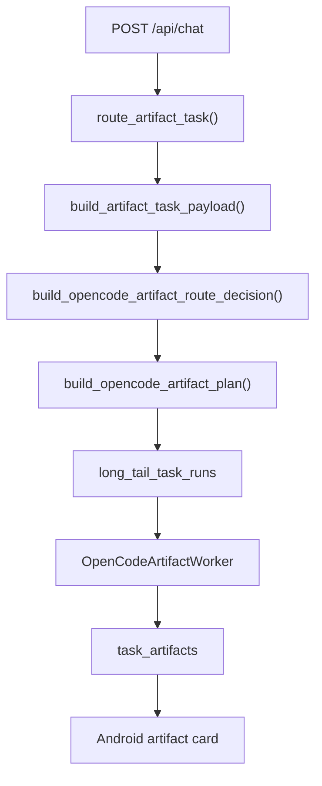
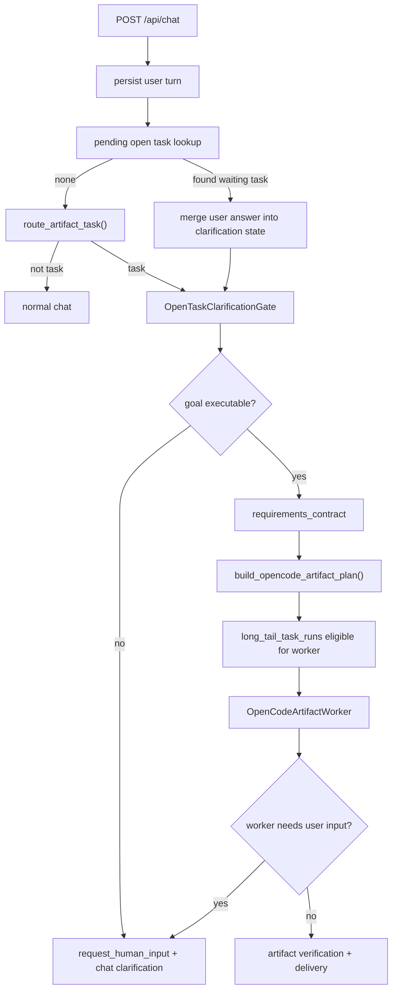

# Nomi Open Task Clarification Gate Design

## 1. Why This Exists

Nomi can already recognize some artifact-style open tasks and hand them to the OpenCode artifact executor. The current behavior is still too brittle for real users:

- A vague request such as `帮我做一个 AI 生成视频原理的 PPT 可以用来讲解` is immediately turned into an OpenCode task.
- The user receives a message like `目前还没有足够的可追溯资料；缺口：未找到最近资料、PPT用途、目标听众`.
- The system treats unclear intent as missing evidence, then starts execution too early.

That is wrong for Nomi's product shape. When the goal is unclear, Nomi should first clarify the goal through conversation. Only after the goal is executable should it hand the task to OpenCode. If OpenCode later discovers that it needs more information, the same task should pause, ask the user, and resume from its checkpoint.

This design is an incremental extension of:

- `docs/superpowers/specs/2026-07-06-open-task-execution-artifact-design.md`
- `runtime_api/app/artifact_tasks.py`
- `runtime_api/app/long_tail_agent.py`
- `runtime_api/app/opencode_artifact_worker.py`
- Android chat handling in `AssistantApiClient` and `FloatingBallService`

## 2. External Patterns Worth Reusing

This design intentionally borrows patterns from mature agent workflows, but maps them onto Nomi's current runtime instead of copying a new framework.

### 2.1 LangGraph Interrupt and Checkpoint

LangGraph's `interrupt` pattern is the closest match: when an agent needs human input, it pauses with a checkpoint and resumes later with the same state. Nomi should implement the same semantic using its existing `long_tail_task_runs`, `long_tail_task_events`, `long_tail_checkpoints`, and `long_tail_human_inputs`.

Reference: [LangGraph Interrupts](https://docs.langchain.com/oss/python/langgraph/interrupts)

### 2.2 Ask-or-Assume

Ask-or-Assume separates the decision to ask a clarifying question from the decision to execute. This is useful because execution agents often over-assume. Nomi should add a small deterministic/model-assisted Clarification Gate before OpenCode.

Reference: [Ask-or-Assume GitHub](https://github.com/nedwards99/ask-or-assume)

### 2.3 AutoGen Human-in-the-Loop

AutoGen supports human input during agent runs. The useful lesson is not the API shape, but the boundary: tasks should not silently continue when a required input is missing. Nomi should persist the waiting state and resume asynchronously rather than blocking a mobile request.

Reference: [AutoGen Human-in-the-Loop](https://microsoft.github.io/autogen/stable//user-guide/agentchat-user-guide/tutorial/human-in-the-loop.html)

### 2.4 OpenHands Ask / Plan Before Execute

OpenHands discussions around Ask/Plan mode reinforce the same point: for software-like tasks, the agent should clarify or plan before modifying state. Nomi's OpenCode integration should receive an executable `requirements_contract`, not a raw vague chat message.

Reference: [OpenHands Ask/Plan issue](https://github.com/OpenHands/software-agent-sdk/issues/557)

## 3. Product Behavior

### 3.1 Vague Open Task

User:

```text
帮我做一个 AI 生成视频原理的 PPT 可以用来讲解
```

Nomi should not immediately start OpenCode. It should reply:

```text
可以。我先确认两点：这个 PPT 是讲给普通人、学生、客户，还是技术团队？你希望偏科普讲解，还是偏技术原理？

如果你不指定，我可以按“普通人听众、10 页、科普风”来做。
```

The response must create or update a pending open task, but the task must remain in `waiting_for_human_input`.

### 3.2 User Completes the Goal

User:

```text
讲给普通人听，10页，偏科普，可以用类比
```

Nomi should merge this into the pending task and then create a clear requirements contract:

```json
{
  "final_goal": "生成一份用于给普通人讲解 AI 生成视频原理的 PPT",
  "deliverable": "pptx",
  "audience": "普通人",
  "page_count": 10,
  "depth": "科普",
  "style": "清晰、有类比、适合讲解",
  "source_policy": "may_use_general_knowledge",
  "must_include": [
    "AI 视频生成的输入与输出",
    "文本到视频的基本流程",
    "扩散模型或 Transformer 的直观解释",
    "为什么视频比图片更难",
    "应用场景与局限"
  ],
  "assumptions": [
    "用户未提供私有资料，允许使用通用知识讲解原理"
  ]
}
```

Only after this contract exists should the task move to `select_step` / `awaiting_executor` and become eligible for the OpenCode artifact worker.

### 3.3 OpenCode Needs More Information Mid-Task

If OpenCode cannot continue safely, it must not fail with a generic error. It should return a structured state:

```json
{
  "status": "awaiting_user_input",
  "input_type": "clarification",
  "question": "你希望这份 PPT 更像课堂讲义，还是商业演示？",
  "missing_fields": ["presentation_style"],
  "options": [
    {"label": "课堂讲义", "value": "teaching"},
    {"label": "商业演示", "value": "business"}
  ],
  "partial_outputs": {
    "outline": "..."
  }
}
```

Nomi records a `human_input.requested` event, shows the question in chat, and pauses the task. The next user answer resumes the same task.

## 4. Existing Project Fit

### 4.1 Current Chain

Current open artifact chain:



The weak point is between B and E. The system builds a payload and plan before deciding whether the task goal is executable.

### 4.2 Target Chain



## 5. New Runtime Component

Add `runtime_api/app/open_task_clarification.py`.

The module owns goal clarity, not artifact generation.

### 5.1 Public Functions

```python
def analyze_open_task_clarity(
    message: str,
    *,
    artifact_payload: dict[str, Any],
    conversation_context: list[dict[str, Any]] | None = None,
    pending_task_state: dict[str, Any] | None = None,
) -> dict[str, Any]:
    ...
```

Output:

```json
{
  "status": "needs_clarification | executable | not_open_task",
  "task_type": "artifact_creation",
  "artifact_type": "pptx",
  "slots": {
    "topic": "AI 生成视频原理",
    "artifact_type": "pptx",
    "purpose": "讲解",
    "audience": null,
    "page_count": null,
    "depth": null,
    "style": null,
    "source_policy": "may_use_general_knowledge"
  },
  "missing_required": ["audience", "depth"],
  "defaultable": ["page_count", "style"],
  "question": "可以。我先确认两点：这个 PPT 是讲给普通人、学生、客户，还是技术团队？你希望偏科普讲解，还是偏技术原理？如果你不指定，我可以按“普通人听众、10 页、科普风”来做。",
  "requirements_contract": null
}
```

When executable:

```json
{
  "status": "executable",
  "slots": {},
  "missing_required": [],
  "defaultable": [],
  "question": "",
  "requirements_contract": {
    "final_goal": "...",
    "deliverable": "pptx",
    "audience": "普通人",
    "page_count": 10,
    "assumptions": []
  }
}
```

### 5.2 Required vs Defaultable Fields

The gate must not ask for everything. It should ask only when the missing field changes the artifact's correctness.

For `pptx`:

| Field | Required? | Default |
| --- | --- | --- |
| `artifact_type` | yes | parsed from user text |
| `topic` | yes | none |
| `purpose` | yes | none, unless text says `讲解/汇报/销售/培训` |
| `audience` | yes for vague educational/business content | none |
| `depth` | yes when topic can be explained at many levels | none |
| `page_count` | defaultable | 8-10 pages |
| `style` | defaultable | concise, presentation-friendly |
| `source_policy` | yes | `must_use_private_evidence` if request references private docs; otherwise `may_use_general_knowledge` |

The example `AI 生成视频原理的 PPT 可以用来讲解` has enough topic and artifact type, but lacks audience and depth. It should ask before OpenCode.

### 5.3 Source Policy

The current `artifact_missing_inputs()` treats no recent material as a hard gap. That is too broad.

New source policy:

- `must_use_private_evidence`: user says `刚刚王总给的资料`, `根据这封邮件`, `用我的简历`, `按这个附件`.
- `may_use_general_knowledge`: user asks for a generic explainer, tutorial, overview, educational deck, or conceptual document.
- `mixed`: user asks for a generic artifact but also references personal/company context.

Only `must_use_private_evidence` should block on missing recent material. Generic explainers should not say `未找到最近资料`.

## 6. Persistence Model

Do not create a parallel pending-task table in V1. Reuse existing long-tail tables.

### 6.1 `long_tail_task_runs`

When clarification is needed, create a long-tail task run with:

- `status = "created"` or `"waiting_user"`
- `current_node = "waiting_for_human_input"`
- `route_decision.executor_adapter = "opencode"`
- `route_decision.task_type = "artifact_creation"`
- `route_decision.artifact_type = "pptx"`
- `route_decision.clarification_gate = { ... }`
- `original_goal = user original message`

The task should not be picked by `PostgresOpenCodeArtifactTaskScanner`, because scanner currently only picks `current_node IN ('select_step', 'awaiting_executor')`.

### 6.2 `long_tail_human_inputs`

Insert one waiting record:

```json
{
  "task_id": "...",
  "step_id": "clarification_gate",
  "input_type": "open_task_clarification",
  "question": "...",
  "options_json": [],
  "status": "waiting"
}
```

This matches existing `LongTailGraphRunner.request_human_input(...)` semantics.

### 6.3 `long_tail_task_memory`

Store structured slots and merge history:

```json
{
  "memory_type": "open_task_clarification_state",
  "payload_json": {
    "slots": {},
    "missing_required": [],
    "defaultable": [],
    "asked_questions": [],
    "user_answers": [],
    "requirements_contract": null
  }
}
```

This state is task memory, not user long-term memory.

### 6.4 Finding Pending Tasks From `/api/chat`

`/api/chat` should check for unresolved open-task clarification before normal artifact routing:

```sql
SELECT r.*
FROM long_tail_task_runs r
JOIN task_route_traces t ON t.id = r.route_trace_id
WHERE t.conversation_id = :conversation_id
  AND r.current_node = 'waiting_for_human_input'
  AND EXISTS (
    SELECT 1
    FROM long_tail_human_inputs h
    WHERE h.task_id = r.id
      AND h.status = 'waiting'
      AND h.input_type IN ('open_task_clarification', 'opencode_clarification')
  )
ORDER BY r.updated_at DESC
LIMIT 1;
```

If found, the next user message is treated as clarification input for that task unless the user explicitly says `取消这个任务` or starts an unrelated task with strong intent.

## 7. `/api/chat` Behavior

### 7.1 No Pending Task

1. Persist user turn.
2. Build normal context route.
3. Call `route_artifact_task(message)`.
4. If not artifact task, continue normal answer flow.
5. If artifact task, call `analyze_open_task_clarity(...)`.
6. If `needs_clarification`:
   - create long-tail task run in waiting state
   - write `human_input.requested`
   - return `answer = clarification.question`
   - return `task.status = "waiting_for_user"`
   - do not enqueue OpenCode
7. If `executable`:
   - attach `requirements_contract` to artifact payload
   - create OpenCode task as today

### 7.2 Pending Task Exists

1. Persist user turn.
2. Load pending task state.
3. Treat message as `human_input.received`.
4. Merge answer into slots.
5. Re-run `analyze_open_task_clarity(...)`.
6. If still missing required fields, ask the next best question.
7. If executable:
   - mark human input resolved
   - write requirements contract into task memory
   - update `current_node = "select_step"`
   - create or update OpenCode artifact plan
   - return an answer like `清楚了，我会按“普通人听众、10页、科普风”开始生成 PPT。`

## 8. OpenCode Worker Protocol

The current `OpenCodeArtifactWorker` expects the executor to produce an artifact manifest or fail. Extend the executor result protocol:

```json
{
  "status": "awaiting_user_input",
  "input_type": "opencode_clarification",
  "question": "你希望这份 PPT 更像课堂讲义，还是商业演示？",
  "missing_fields": ["presentation_style"],
  "options": [],
  "partial_outputs": {
    "outline": "..."
  }
}
```

Worker behavior:

- If result status is `awaiting_user_input`, do not call `_block_task`.
- Persist partial outputs to `long_tail_task_memory`.
- Append `human_input.requested`.
- Set `current_node = "waiting_for_human_input"`.
- Return a worker result with `status = "awaiting_user_input"`.

When `/api/chat` receives the user answer, it resumes the same task. The worker should later receive a step packet that includes:

```json
{
  "requirements_contract": {},
  "human_input_responses": [
    {
      "input_type": "opencode_clarification",
      "answer": "课堂讲义"
    }
  ],
  "partial_outputs": {}
}
```

## 9. Android Behavior

Android does not need a special UI in V1.

It already sends user messages to `/api/chat` and displays the returned answer. The new behavior should work as plain chat bubbles:

1. User asks vague task.
2. Nomi asks a clarifying question in the same chat.
3. User answers.
4. Nomi starts the task and later shows artifact card.

Android should parse two optional response fields later:

```json
{
  "task": {
    "task_id": "...",
    "status": "waiting_for_user",
    "clarification": {
      "question": "...",
      "missing_fields": ["audience", "depth"]
    }
  }
}
```

V1 can ignore this field visually. V2 can render a small clarification card with quick options.

## 10. Web Workbench Behavior

The Web task trace already renders clarification metadata in some route trace views. Extend task detail pages to show:

- pending clarification question
- missing fields
- user response history
- requirements contract once ready
- whether OpenCode is waiting on user

This makes debugging much easier than reading logs.

## 11. Examples

### 11.1 Generic Explainer PPT

Input:

```text
帮我做一个 AI 生成视频原理的 PPT 可以用来讲解
```

Expected first response:

```text
可以。我先确认两点：这个 PPT 是讲给普通人、学生、客户，还是技术团队？你希望偏科普讲解，还是偏技术原理？

如果你不指定，我可以按“普通人听众、10 页、科普风”来做。
```

No OpenCode task should be executable yet.

User:

```text
普通人，10页，偏科普
```

Expected:

```text
清楚了。我会按“普通人听众、10页、科普风”开始生成这份 PPT。完成后给你下载链接。
```

Task becomes eligible for OpenCode.

### 11.2 Private Evidence PPT

Input:

```text
帮我依据刚刚王总给的资料做一份 PPT
```

Expected:

- `source_policy = must_use_private_evidence`
- Must search recent WhatsApp/Gmail/Telegram/source context for 王总 material.
- If not found, ask:

```text
我还没找到“王总刚刚给的资料”。你可以把资料发给我，或者告诉我是在哪个渠道/哪个文件里吗？
```

This should not be treated as a generic PPT using public knowledge.

### 11.3 User Chooses Defaults

User:

```text
按默认做
```

Expected:

- If required fields can safely default, fill defaults.
- If required fields cannot safely default, ask one more constrained question.
- Do not loop forever.

### 11.4 User Cancels

User:

```text
算了，不做了
```

Expected:

- pending task status becomes `cancelled`
- human input status becomes resolved/cancelled
- Nomi replies `好的，这个任务我先取消。`

## 12. Tests Required Before Implementation

### 12.1 Unit Tests

Add tests for `open_task_clarification.py`:

1. Generic explainer PPT needs audience/depth clarification and does not require private evidence.
2. Private evidence PPT requires source material and asks for channel/file if evidence is missing.
3. User follow-up merges slots into pending task.
4. `按默认做` fills defaultable fields but not unsafe required fields.
5. Executable state produces a complete `requirements_contract`.

### 12.2 `/api/chat` Tests

Add tests in `runtime_api/tests/test_context_pack_and_chat.py` or a focused new file:

1. Vague PPT request returns clarification question and no executable OpenCode worker state.
2. Follow-up answer resumes same task and creates/updates OpenCode plan.
3. Pending clarification takes priority over ordinary chat routing.
4. Cancellation cancels pending task.
5. Response persists assistant turn with the clarification question.

### 12.3 Worker Tests

Add tests in `runtime_api/tests/test_opencode_artifact_worker.py`:

1. Executor returning `awaiting_user_input` creates `long_tail_human_inputs`.
2. Worker does not mark task blocked for clarification.
3. Partial outputs are persisted to task memory.
4. Resumed step packet includes human input responses.

### 12.4 Android Tests

Minimal V1 Android tests:

1. `AssistantApiClient.chat()` tolerates `task.status = waiting_for_user` without artifact fields.
2. Floating chat displays the clarification answer as normal assistant text.
3. Follow-up message keeps the same `conversation_id`.

## 13. Verification Plan

### 13.1 Local API

1. POST vague PPT request to `/api/chat`.
2. Verify answer asks a clarifying question.
3. Verify task exists but `current_node = waiting_for_human_input`.
4. Verify scanner does not pick it up for OpenCode.
5. POST follow-up answer.
6. Verify same task moves to `select_step` or `awaiting_executor`.
7. Verify requirements contract includes user-supplied fields.

### 13.2 Real Device

1. On Android real device, send:
   `帮我做一个 AI 生成视频原理的 PPT 可以用来讲解`
2. Nomi must ask a question, not say `未找到最近资料`.
3. Reply:
   `普通人，10页，偏科普`
4. Nomi must start the task and eventually show a downloadable artifact card.
5. The chat history in floating panel and full app must remain consistent.

### 13.3 Negative Check

Ask:

```text
王总刚刚说了什么？
```

Expected: normal chat answer, no artifact task.

## 14. Implementation Notes

### 14.1 Avoid Over-Asking

The gate should ask at most two fields per turn. A good question should include defaults when defaults are safe.

Bad:

```text
请提供用途、听众、页数、风格、语言、资料来源、截止时间。
```

Good:

```text
这个 PPT 是讲给普通人还是技术团队？你希望偏科普还是偏技术？
```

### 14.2 Avoid Confusing Evidence With Goal Clarity

`未找到最近资料` is only valid when the user's task explicitly depends on recent/private material. Generic education tasks can use general knowledge.

### 14.3 No New Full Agent Framework

Do not introduce LangGraph, AutoGen, CrewAI, or OpenHands as dependencies for this change. Reuse Nomi's existing event-sourced long-tail runtime and implement the relevant semantics.

### 14.4 Preserve Current OpenCode Boundary

OpenCode remains an executor. It receives an executable task packet and returns either:

- artifact manifest
- awaiting user input
- structured failure

It does not decide whether to send messages, upload files, or execute external side effects.

## 15. Acceptance Criteria

1. Vague open tasks ask clarifying questions before OpenCode starts.
2. Generic explainer tasks do not fail because no private recent material exists.
3. User follow-up completes the same pending task, not a new task.
4. OpenCode can pause for user input without marking the task blocked.
5. `/api/chat` can resume a paused task through normal conversation.
6. Android real-device chat can complete the clarification loop and then receive an artifact card.
7. Task trace shows the original request, clarification question, user answer, final requirements contract, OpenCode execution, and artifact verification.
8. No high-risk external side effect is introduced.

## 16. Known Gaps This Spec Intentionally Leaves For Implementation

1. The exact SQL helpers for loading pending tasks should be implemented near the current task/route trace helpers in `runtime_api/app/main.py` or extracted into a task repository module.
2. The first implementation can use deterministic extraction plus a small model call for unclear slots; later versions can add a learned classifier.
3. Android V1 can render clarification as plain text; quick-reply buttons can wait.
4. Full semantic fact-level PPT verification remains outside this specific clarification-gate change.

## 17. Spec Self Review

- Placeholder scan: no `TBD` or incomplete placeholder remains.
- Internal consistency: OpenCode remains executor-only; Nomi owns clarification, state, and resume.
- Scope check: this spec only covers open-task clarification and resume, not all artifact generation improvements.
- Ambiguity check: generic knowledge tasks and private-evidence tasks have separate source policies.
- Implementation readiness: the tests in Section 12 can drive the next implementation plan directly.
