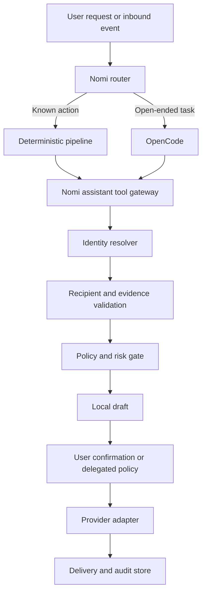

# Nomi Assistant Identity Configuration Design

**Date:** 2026-07-21
**Status:** Approved architecture, implementation pending
**Scope:** Nomi-owned Gmail identity, configuration UI, provider lifecycle, bounded OpenCode tools, outbound verification, inbound routing, and audit
**Related design:** `docs/superpowers/specs/2026-06-04-nomi-owned-communication-identities-design.md`

> **V1 scope decision (2026-07-21):** Nomi-owned WhatsApp is deferred. WhatsApp-related sections below are retained only as future architecture context and are not implementation tasks, acceptance criteria, or gaps for this release. User-owned WhatsApp collection remains unchanged.

## 1. Objective

Nomi needs communication accounts that belong to the assistant rather than to the user. After configuration, Nomi can:

- receive email sent to Nomi's Gmail address;
- prepare email replies on behalf of the user;
- send a user-confirmed message as "Nomi, the user's assistant";
- expose the connection state, failures, pending drafts, and delivery results in the product;
- let deterministic pipelines and OpenCode use the same safe communication capabilities without exposing raw provider credentials or direct send APIs.

This is different from the existing **Account Connections** feature:

| Surface | Owner | Purpose | Example |
| --- | --- | --- | --- |
| User account connection | User | Read and act on the user's private account | User's Gmail, WhatsApp Web, LinkedIn |
| Assistant identity | Nomi | Receive and send as the assistant | `nomi@example.com` |

The two account classes must remain separate in storage, UI, memory scopes, authorization, tool routing, and audit.

## 2. Current State And Confirmed Gaps

The repository already contains an assistant identity foundation:

- `AssistantIdentityRegistry` bootstraps Gmail, WhatsApp, and phone identities;
- `AssistantInboxGateway` normalizes inbound assistant-owned messages;
- `OutboundMessagePipeline` creates confirmation-gated drafts;
- Gmail and WhatsApp provider adapter interfaces exist;
- assistant-owned memory scopes and trigger routing exist;
- Android can render read-only Nomi identity rows.

However, the current implementation is not a usable configuration system:

1. Identity addresses come from environment variables and otherwise use placeholders such as `nomi@example.com` and `+00000000000`.
2. `POST /api/assistant-identities/{kind}/connect` only changes an in-memory status to `connected`; it does not authenticate or verify a provider.
3. `PATCH /api/assistant-identities/{identity_id}` can directly write a status supplied by the client. Provider status is therefore not authoritative.
4. Registry state is in memory and does not survive a server restart.
5. `assistant_identity_credentials` exists in schema but has no complete encrypted secret-vault lifecycle or configuration API.
6. Gmail and WhatsApp adapters still read raw credentials from environment variables.
7. Web has no assistant identity configuration view.
8. Android only displays identity rows and cannot connect, verify, disable, or repair an identity.
9. Live Gmail watch/send and WhatsApp Cloud API webhook/send remain unverified provider gaps.
10. The OpenCode boundary is described in design but is not yet implemented as a complete, independently enforced tool gateway.

## 3. Product Decisions

### 3.1 Independent Product Surface

Add a first-level **Assistant Identity** (`助理身份`) entry to the Web workbench. It must not be nested into user account login cards.

The Android full app receives a matching `助理身份` page inside the full application navigation. The floating conversation panel remains focused on conversation and does not contain provider credential forms.

### 3.2 Provider Strategy

#### Gmail V1

Primary provider: **Composio-managed Gmail OAuth**.

Reasons:

- the project already integrates Composio;
- Connect Links keep OAuth credentials outside Nomi's UI and model context;
- Composio manages token refresh and exposes connection lifecycle state;
- a dedicated connected account can be pinned to the Nomi Gmail identity.

Nomi must use a stable assistant-specific Composio user id and alias, separate from the user's Gmail connection:

```text
user_id: nomi-owned::nomi_gmail_primary
alias: nomi-gmail-primary
toolkit: gmail
```

The connected account id is persisted against `nomi_gmail_primary`. It is never selected by the model.

Advanced provider: direct Gmail OAuth/API may be added later behind the same adapter interface. Direct Gmail inbound should use Gmail `watch` plus Cloud Pub/Sub and renew the watch before expiration. Google documents that Gmail watches expire and must be renewed at least every seven days; a daily renewal job is preferred.

#### WhatsApp (Deferred After V1)

This provider is deliberately excluded from the current implementation and live acceptance because Nomi is a general-purpose assistant and the current WhatsApp Business Platform policy creates material product-fit risk. The following notes are retained for a future, separately approved vertical or transactional use case.

Primary provider: **Meta WhatsApp Cloud API**.

Do not use WhatsApp Web automation as Nomi's own WhatsApp backend. User-owned WhatsApp collection may continue using a browser session, but an assistant-owned identity needs stable inbound webhooks, explicit send APIs, delivery receipts, and business-number ownership.

Required configuration:

- display phone number;
- WhatsApp Business Account id;
- phone number id;
- access token;
- webhook verify token;
- app secret when signature verification is enabled;
- public HTTPS webhook base URL.

WhatsApp Cloud API behavior such as customer-service windows, approved templates, provider quality state, and delivery receipts must be enforced by the provider adapter and policy gateway.

### 3.3 Execution Ownership

OpenCode is a planner and content producer. Nomi is the authority for identity, policy, confirmation, execution, and audit.



Provider adapters are internal Nomi components. They may internally call Composio, Gmail API, Meta Graph API, or a future MCP server, but that implementation detail is not exposed to OpenCode.

## 4. Identity Lifecycle

### 4.1 State Model

Allowed identity states:

| State | Meaning |
| --- | --- |
| `unconfigured` | No usable provider connection exists. |
| `authorization_pending` | OAuth or external setup began but is incomplete. |
| `verifying` | Nomi is validating a newly saved connection. |
| `connected` | Credentials and read-only provider identity checks succeeded. |
| `degraded` | Connection exists but inbound watch, webhook, or a secondary capability is unhealthy. |
| `expired` | Provider credentials are no longer valid and reconnection is required. |
| `failed` | Configuration validation failed. |
| `disabled` | User intentionally disabled the identity without deleting its audit history. |

Clients cannot directly set these states. Only provider lifecycle services and explicit disable/reconnect operations may transition them.

### 4.2 Gmail Connection Flow

1. User opens `助理身份` and selects `连接 Nomi Gmail`.
2. Nomi creates or resumes an assistant-scoped Composio session.
3. Nomi calls the current Connect Link authorization API for the Gmail toolkit with a callback URL pointing back to the assistant identity page.
4. UI opens the returned hosted authorization link.
5. On callback, Nomi validates callback state and asks Composio for the connected account status.
6. Nomi fetches the authenticated Gmail profile using the pinned connected account.
7. The provider-returned email address becomes the identity address. The client cannot type or override it.
8. Nomi configures an inbound trigger when supported. If no reliable trigger is available, a bounded incremental sync worker is enabled.
9. Health becomes `connected` only when account status and Gmail profile checks both pass.
10. The user returns to the assistant identity page and sees the actual address and capabilities.

Reconnecting must replace or explicitly select the pinned connected account; it must not silently reuse the user's private Gmail connection.

### 4.3 WhatsApp Connection Flow

1. User opens the Nomi WhatsApp setup wizard.
2. UI explains that this is a WhatsApp Business/Cloud API number, not the user's WhatsApp Web login.
3. User enters non-secret identifiers and secret fields.
4. Nomi validates format locally, encrypts secrets, and stores only secret references in the identity row.
5. Nomi performs a read-only provider identity check using the phone number id.
6. Nomi displays the exact public webhook URL and verify token state.
7. User configures the callback and subscribed fields in Meta.
8. Meta verification request reaches Nomi; Nomi records successful webhook verification.
9. A signed inbound test webhook is normalized and deduplicated.
10. Identity becomes `connected` only when provider identity and webhook checks pass. If sending works but webhook is missing, state is `degraded`, not `connected`.

## 5. Secret Storage

### 5.1 Local Secret Vault

Add `AssistantIdentitySecretVault` with authenticated encryption.

- Encryption: AES-256-GCM or libsodium secretbox.
- Master key: `NOMI_SECRET_MASTER_KEY`, generated once during installation and mounted as a Docker secret or protected environment file.
- Every encrypted record uses a fresh nonce.
- Additional authenticated data includes identity id, provider, credential name, and schema version.
- Database stores ciphertext/reference, nonce, algorithm version, creation time, and rotation time.
- API never returns ciphertext or secret values.
- Logs redact tokens, authorization headers, callback codes, and provider payload fields known to contain secrets.

Composio OAuth tokens remain in Composio. Nomi stores only the connected account id, session reference, alias, and lifecycle metadata.

### 5.2 API Secret Semantics

- Secret inputs are write-only.
- Existing secrets render as `已保存`, never as masked character counts that reveal length.
- Empty fields mean "leave unchanged" during edit.
- Secret replacement requires an explicit `replace_secret=true` operation.
- Disconnect revokes upstream authorization when supported, then clears the local secret reference.
- Disabling preserves configuration but blocks all execution.

## 6. Data Model

### 6.1 `assistant_identities`

Extend the existing table:

| Column | Type | Purpose |
| --- | --- | --- |
| `identity_id` | TEXT UNIQUE | Stable id such as `nomi_gmail_primary`. |
| `kind` | TEXT | `assistant_gmail`, `assistant_whatsapp`, later `assistant_phone`. |
| `provider` | TEXT | `composio_gmail`, `gmail_api`, `whatsapp_cloud_api`. |
| `display_name` | TEXT | Assistant display name. |
| `address` | TEXT | Provider-verified address or number. |
| `status` | TEXT | Lifecycle state derived by Nomi. |
| `capabilities` | JSONB | Verified capabilities, not assumed capabilities. |
| `metadata` | JSONB | Non-secret provider ids and UI metadata. |
| `version` | BIGINT | Optimistic concurrency version. |
| `last_verified_at` | TIMESTAMPTZ | Last successful provider check. |
| `last_error_code` | TEXT | Stable diagnostic code. |
| `created_at` | TIMESTAMPTZ | Creation time. |
| `updated_at` | TIMESTAMPTZ | Update time. |

### 6.2 `assistant_identity_credentials`

Use one row per provider credential set:

| Column | Type | Purpose |
| --- | --- | --- |
| `identity_id` | TEXT FK | Assistant identity. |
| `provider` | TEXT | Provider adapter. |
| `encrypted_ref` | TEXT | Secret-vault reference or encrypted envelope. |
| `status` | TEXT | `active`, `expired`, `revoked`, `invalid`. |
| `expires_at` | TIMESTAMPTZ | Provider expiry when known. |
| `metadata` | JSONB | Non-secret account and rotation data. |
| `updated_at` | TIMESTAMPTZ | Last update. |

### 6.3 `assistant_identity_health_checks`

Add an append-only health history:

| Column | Type | Purpose |
| --- | --- | --- |
| `identity_id` | TEXT FK | Checked identity. |
| `check_type` | TEXT | `credentials`, `profile`, `inbound`, `outbound`, `webhook`. |
| `status` | TEXT | `passed`, `degraded`, `failed`. |
| `latency_ms` | INTEGER | Provider check latency. |
| `error_code` | TEXT | Redacted stable code. |
| `details` | JSONB | Non-secret diagnostics. |
| `checked_at` | TIMESTAMPTZ | Check time. |

Existing inbox, draft, outbound, receipt, contact binding, and channel policy tables remain the source of truth for communication history.

## 7. Backend Components

### 7.1 Persistent Repository

Replace the in-memory registry with `AssistantIdentityRepository` backed by PostgreSQL.

Responsibilities:

- bootstrap missing default identity rows exactly once;
- read and update identities transactionally;
- enforce lifecycle transitions;
- pin provider account ids;
- survive process and container restarts;
- expose deterministic read models for Web, Android, pipelines, and tools.

Existing environment variables may be imported once as a migration aid, but they must not overwrite a UI-configured identity on restart.

### 7.2 Provider Adapters

Required adapter contract:

```python
class AssistantIdentityProvider(Protocol):
    def begin_connect(self, identity, callback_url) -> ConnectResult: ...
    def finish_connect(self, identity, callback_payload) -> VerifyResult: ...
    def verify(self, identity) -> HealthResult: ...
    def send(self, confirmed_draft) -> SendResult: ...
    def disconnect(self, identity) -> DisconnectResult: ...
```

Channel-specific optional contracts:

- Gmail: configure trigger/watch, renew watch, incremental sync, fetch thread, reply in thread.
- WhatsApp: verify webhook, verify signature, normalize inbound, send text/template, parse receipt.

### 7.3 Health Service

`AssistantIdentityHealthService` performs:

- immediate check after configuration;
- scheduled lightweight checks;
- token-expiry and webhook-staleness checks;
- Gmail inbound trigger/watch renewal;
- WhatsApp webhook heartbeat visibility;
- capability derivation from actual checks;
- proactive reconnect suggestion when state becomes `expired` or repeatedly `failed`.

A health endpoint must not report `healthy=true` merely because status text is `configured`.

## 8. Nomi Tool Gateway And OpenCode Boundary

### 8.1 Tools Visible To OpenCode

OpenCode receives only high-level, schema-constrained Nomi tools:

| Tool | Effect |
| --- | --- |
| `assistant.identity.get_status` | Returns redacted identity availability and capabilities. |
| `assistant.contacts.resolve` | Resolves a scoped recipient candidate; no secrets. |
| `assistant.email.create_draft` | Creates a local email draft requiring policy evaluation. |
| `assistant.whatsapp.create_draft` | Creates a local WhatsApp draft requiring policy evaluation. |
| `assistant.outbound.get_status` | Reads draft/delivery state for the current task. |
| `assistant.outbound.cancel_draft` | Cancels an unsent draft. |

OpenCode never receives:

- provider tokens or connected-account credentials;
- raw Gmail/Meta/Composio provider send tools;
- `send_confirmed_draft`;
- user confirmation tokens;
- unrestricted recipient search;
- delete, archive, block, settings, payment, or bulk-send effects.

### 8.2 Tool Contract

Example draft request:

```json
{
  "identity_id": "nomi_gmail_primary",
  "recipient": {
    "contact_id": "contact_alice",
    "address_hint": "alice@example.com"
  },
  "subject": "明天会议资料",
  "body_text": "Alice 你好，我是 Nomi……",
  "source_evidence_ids": ["evt_123", "job_456"],
  "task_id": "lta_789",
  "idempotency_key": "lta_789:contact_alice:draft:1"
}
```

Tool result:

```json
{
  "status": "confirmation_required",
  "draft_id": "draft_123",
  "identity": "Nomi <nomi@example.com>",
  "recipient": "Alice <alice@example.com>",
  "policy_checks": ["identity_connected", "recipient_resolved", "dedupe_passed"],
  "confirmation_card_id": "card_123"
}
```

Tool execution is task-scoped and idempotent. Repeating the same OpenCode step must return the same draft rather than create duplicate drafts.

### 8.3 Pipeline Versus OpenCode

| Request | Route |
| --- | --- |
| "用 Nomi 邮箱告诉 Alice 我晚十分钟" | Deterministic email pipeline. |
| "用 Nomi WhatsApp 回复 Maya 收到" | Deterministic WhatsApp reply pipeline. |
| "整理王总刚发的资料，判断该回复什么并起草邮件" | OpenCode may research and plan, then call `assistant.email.create_draft`. |
| "帮我跟进所有候选 HR" | OpenCode may propose a bounded plan, but each recipient/draft is individually policy-checked and subject to quotas and confirmation policy. |
| Inbound third-party message to Nomi | Inbox normalization and suggestion; no automatic outbound by default. |

## 9. Outbound Verification And Confirmation

Every outbound attempt passes the same Nomi-owned gateway, regardless of whether it originated from a pipeline, OpenCode, a proactive suggestion, Web UI, or Android UI.

Required checks:

1. Identity exists, is enabled, and has the requested verified capability.
2. Provider health is acceptable; expired/failed identities are blocked.
3. Recipient resolves to one unambiguous address or number.
4. Recipient is not blocked and belongs to the permitted task/contact scope.
5. Draft content is non-empty and within provider limits.
6. Evidence ids exist and are visible to the current task.
7. No sensitive information is introduced without evidence or explicit user instruction.
8. Duplicate and near-duplicate drafts/sends are detected by idempotency key, recipient, normalized body hash, task, and time window.
9. Per-channel, per-contact, and daily quotas pass.
10. WhatsApp service-window/template constraints pass.
11. Confirmation or a valid delegated policy decision exists.

Default policy:

- third-party email/WhatsApp sends require explicit user confirmation;
- an external message to Nomi never causes an automatic reply;
- low-risk auto-ack remains disabled until the user explicitly enables a channel policy;
- confirmation is bound to draft id, body hash, recipient, identity, and expiry;
- editing any protected field invalidates the prior confirmation;
- provider retries reuse the same idempotency key and never silently create a second logical send.

## 10. Inbound Processing

### 10.1 Normalization

Inbound Nomi-owned messages use existing `AssistantInboxGateway` and then enter the normal private event system with:

- assistant identity id;
- provider and external message id;
- channel/thread/contact scope;
- sender classification;
- normalized text and attachments;
- visibility and sensitivity scope;
- provider timestamp;
- dedupe fingerprint.

### 10.2 Routing

| Classification | Behavior |
| --- | --- |
| User direct command | Continue through normal Nomi chat/task routing. |
| Known external contact | Store, summarize, and create a relevant suggestion; do not auto-reply. |
| Unknown sender | Low-trust inbox; no proactive interruption unless urgent and evidence-backed. |
| Provider receipt/status | Update delivery/health state only. |
| Duplicate/noise/spam | Store low priority or suppress after dedupe; no suggestion. |

Nomi-owned inbox memory remains separated from user-owned Gmail/WhatsApp collector memory and from unrelated contact threads.

## 11. API Design

### 11.1 Read APIs

- `GET /api/assistant-identities`
- `GET /api/assistant-identities/{identity_id}`
- `GET /api/assistant-identities/{identity_id}/health`
- `GET /api/assistant-identities/{identity_id}/health-history`
- `GET /api/assistant-inbox`
- `GET /api/assistant-outbound/drafts?status=pending_confirmation`
- `GET /api/assistant-outbound/messages`

All responses are redacted and return derived lifecycle state.

### 11.2 Configuration APIs

- `POST /api/assistant-identities/nomi_gmail_primary/connect-link`
- `GET /api/assistant-identities/oauth/callback`
- `POST /api/assistant-identities/nomi_whatsapp_primary/configure`
- `POST /api/assistant-identities/{identity_id}/verify`
- `POST /api/assistant-identities/{identity_id}/disable`
- `POST /api/assistant-identities/{identity_id}/enable`
- `POST /api/assistant-identities/{identity_id}/disconnect`
- `PATCH /api/assistant-identities/{identity_id}/profile`
- `PATCH /api/assistant-identities/{identity_id}/policy`

The existing generic `connect` endpoint must be deprecated or changed to return a real provider flow. The generic identity patch must no longer accept arbitrary status changes.

### 11.3 Draft And Send APIs

- `POST /api/assistant-outbound/drafts`
- `PATCH /api/assistant-outbound/drafts/{draft_id}`
- `POST /api/assistant-outbound/drafts/{draft_id}/confirm`
- `POST /api/assistant-outbound/drafts/{draft_id}/send-confirmed`
- `POST /api/assistant-outbound/drafts/{draft_id}/cancel`

The public client should normally call a single `confirm` continuation. The server validates and executes the confirmed draft. `send-confirmed` is an internal service operation and is not an OpenCode tool.

Mutating requests require an idempotency key and append an audit event.

## 12. Web UI

Add `助理身份` as a first-level sidebar item near `账号`.

### 12.1 Page Layout

Use a quiet operational layout, not a marketing page:

1. Header: `助理身份`, short ownership explanation, overall health indicator.
2. Gmail identity row showing the actual verified address, provider, capabilities, lifecycle status, and last verification time.
3. Action area: connect/reconnect, verify, disable/enable, disconnect.
4. Secondary tabs:
   - `身份`
   - `待确认`
   - `Nomi 收件箱`
   - `发送记录`
   - `策略`

Do not nest cards inside cards. Identity rows should remain compact and scannable.

### 12.2 Gmail UI

Unconfigured state:

```text
Nomi Gmail
尚未连接
[连接 Gmail]
```

Connected state:

```text
Nomi Gmail
nomi@example.com · 已连接
收件 / 起草 / 发件 / 线程回复
上次验证：2026-07-21 15:30
[检查连接] [重新授权] [停用] [断开]
```

OAuth opens in a controlled browser surface and returns to `助理身份`, never to the user-account list.

### 12.3 WhatsApp UI (Deferred)

This surface is not built or shown in V1. The notes below are future design reference only.

Use a setup wizard with these stages:

1. Provider explanation and prerequisites.
2. Business/phone identifiers.
3. Write-only access token and webhook secrets.
4. Provider identity verification.
5. Webhook URL, callback verification, and signed inbound test.
6. Connected/degraded result with repair guidance.

The page must distinguish:

- credentials verified;
- webhook verified;
- inbound last seen;
- outbound capability;
- delivery receipt capability.

### 12.4 Confirmation Cards

Draft cards appear in Web and Android chat with the same draft id and state:

```text
将使用：Nomi Gmail <nomi@example.com>
收件人：Alice <alice@example.com>
主题：明天会议资料
正文：……
依据：2 条
[发送] [修改] [取消]
```

After confirmation, the same card updates to `发送中`, `已发送`, `已送达`, `已读`, or a clear failure with retry guidance.

## 13. Android UI

The full app gets an `助理身份` destination with the same read model and actions as Web.

- OAuth/provider setup may open the external browser but must return to the identity page.
- Secret fields use Android secure input semantics and are never retained in local chat history.
- Android stores no provider token; it sends configuration only over the authenticated Nomi API connection.
- The floating panel can display outbound confirmation cards and inbound suggestions, but it does not expose credential configuration.
- Web and Android use the same server-side identity, draft, and audit records.

## 14. Error And Recovery Design

| Failure | Product behavior |
| --- | --- |
| Gmail OAuth cancelled | Return to identity page with `未完成授权`; keep previous valid connection if reconnecting. |
| Gmail token expired | Mark `expired`, block sends, show reconnect action. |
| Gmail inbound trigger stale | Mark `degraded`, run bounded fallback sync, attempt renewal. |
| WhatsApp token invalid | Mark `failed` or `expired`; do not claim connected. |
| WhatsApp webhook unverified | Keep identity `degraded`; show exact repair step. |
| WhatsApp template required | Block free-form send and explain the template requirement. |
| Provider timeout | Keep draft unsent; retry only with the same idempotency key. |
| Duplicate confirmation | Return the existing outbound result. |
| Server restart | Restore identities, pending drafts, and provider state from PostgreSQL. |
| Secret master key unavailable | Start identity services in blocked state; never erase or overwrite encrypted secrets. |

## 15. Observability And Audit

Every lifecycle and outbound event records:

- trace id;
- identity id and provider;
- actor: user, pipeline, OpenCode task, scheduler, or webhook;
- operation and lifecycle transition;
- task id and evidence ids;
- confirmation decision;
- recipient hash and body hash for outbound actions;
- provider latency and redacted result;
- final status and stable error code.

Metrics:

- identity connection success rate;
- connection/verification latency;
- OAuth expiration and reconnect rate;
- inbound event lag;
- webhook dedupe rate;
- draft-to-confirm rate;
- send success, delivery, read, and failure rate;
- blocked direct-provider calls;
- duplicate draft/send prevention count.

## 16. TDD And Verification Strategy

### 16.1 Unit Tests

- lifecycle transition rules;
- persistent identity repository and restart restoration;
- secret-vault encrypt/decrypt, tamper detection, rotation, and API redaction;
- provider adapter request and response semantics;
- health capability derivation;
- tool schema allowlist and forbidden raw tools;
- recipient/evidence checks;
- confirmation binding and invalidation after edit;
- idempotent draft and send behavior;
- memory scope isolation.

### 16.2 Integration Tests

- mocked Composio Connect Link and callback lifecycle;
- Gmail profile-derived address, never client-entered address;
- Composio connected account pinning separate from the user's Gmail account;
- OpenCode can create a draft but direct provider send is rejected;
- pipeline and OpenCode drafts pass through the same policy gateway;
- server restart preserves configured identities and pending drafts;
- Web and Android consume the same identity and draft records.

### 16.3 Live Acceptance

Live tests require user participation and real provider accounts:

1. Connect a dedicated Nomi Gmail account through the new page.
2. Send an email from an external account to Nomi and verify inbound normalization, memory scope, suggestion, and reply draft.
3. Confirm one draft and verify the real Gmail message, provider id, and audit trail.
4. Ask OpenCode to perform a multi-step task requiring an email; verify it can only return a draft confirmation card.
5. Restart the server and verify the Gmail identity remains connected or shows the provider's true reconnect state.

No fake or synthetic provider event can close a live-acceptance item.

## 17. Migration And Delivery Phases

### Phase 1: Source Of Truth And Security

- persistent identity repository;
- lifecycle state machine;
- secret vault;
- remove client-controlled status;
- migrate environment configuration once;
- real health semantics.

### Phase 2: Configuration UI And Provider Connection

- Web `助理身份` page;
- Composio Gmail Connect Link with assistant-scoped account pinning;
- Android full-app identity destination;
- connection, verify, disable, reconnect, disconnect flows.

### Phase 3: Tool Gateway And Sending

- Nomi assistant tool gateway;
- OpenCode high-level tool allowlist;
- deterministic pipelines use the same gateway;
- confirmation continuation;
- idempotency, quotas, and audit.

### Phase 4: Inbound And Live Regression

- Gmail trigger/watch or bounded sync;
- inbox and suggestion UI;
- real Gmail end-to-end acceptance;
- restart and expiry recovery tests.

## 18. Acceptance Criteria

1. Web exposes a first-level `助理身份` page clearly separated from user account connections.
2. Android full app exposes the same assistant identities without placing credential forms in the floating panel.
3. Nomi Gmail OAuth connects a dedicated assistant account and displays the provider-verified address.
4. Identity state persists across process/container restarts.
5. No client can set an identity to `connected` or `healthy` without provider verification.
6. Secrets are encrypted locally or retained by Composio, never returned by API, logged, or placed in model context.
7. User-owned and assistant-owned Gmail accounts remain separate in provider account selection and memory scopes.
8. Known send requests use deterministic pipelines.
9. OpenCode can create and inspect drafts but cannot call a provider send operation.
10. Every outbound action passes identity, recipient, evidence, dedupe, quota, provider, and confirmation checks.
11. Editing recipient, identity, subject, or body invalidates prior confirmation.
12. Duplicate tool calls and confirmations do not cause duplicate messages.
13. Real inbound Gmail messages are normalized, deduplicated, scoped, and surfaced without automatic third-party replies.
14. Confirmed real sends record provider message ids and delivery/audit state.
15. Misconfiguration, expiry, trigger failure, and provider timeout produce truthful actionable UI states.
16. Live acceptance is not marked complete until a dedicated Gmail account passes real end-to-end tests.

## 19. Explicit Non-Goals

- Exposing raw Gmail, Composio, or MCP send tools to OpenCode.
- Storing provider secrets on Android or in browser local storage.
- Implementing a Nomi-owned WhatsApp identity in V1.
- Automatically replying to third parties without an explicit policy and audit trail.
- Bulk marketing or unrestricted broadcast in this feature.
- Replacing the user-account collector architecture.
- Implementing full-duplex phone calling in this scope.

## 20. Design Review Conclusion

The existing assistant identity foundation is worth retaining, but its in-memory registry and status-only connect endpoint must not be extended as if they were real configuration. The correct implementation is a persistent Nomi-owned identity subsystem with provider-derived status and a single server-side safety gateway.

OpenCode should receive capabilities, not credentials or authority. This preserves the usefulness of an open-ended agent while keeping provider identity, recipient resolution, confirmation, idempotency, quotas, and audit deterministic and enforceable.
